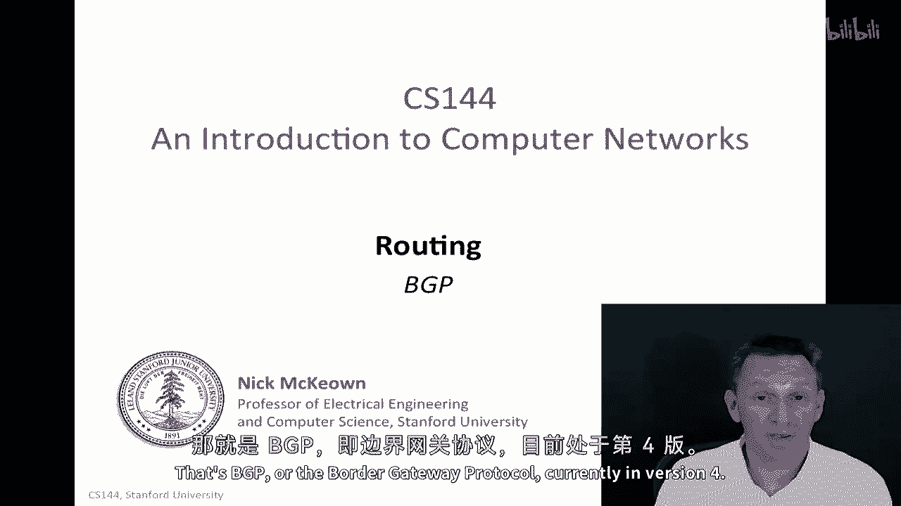
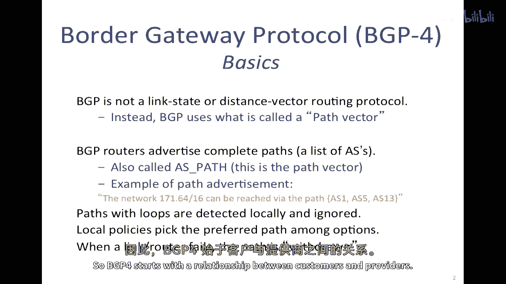
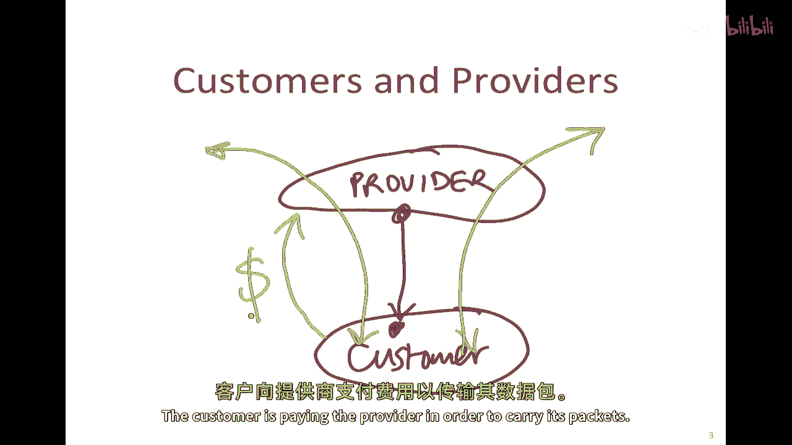
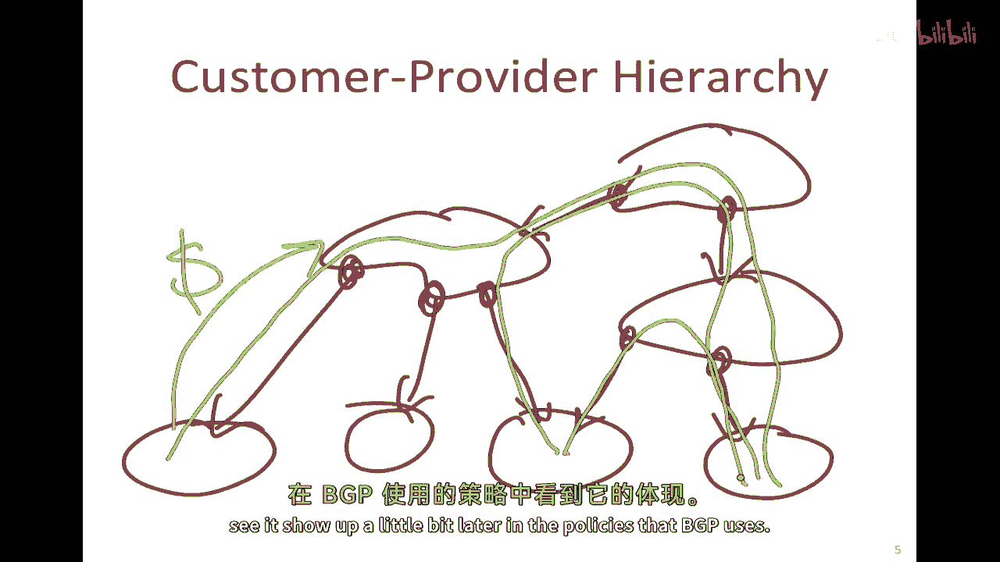
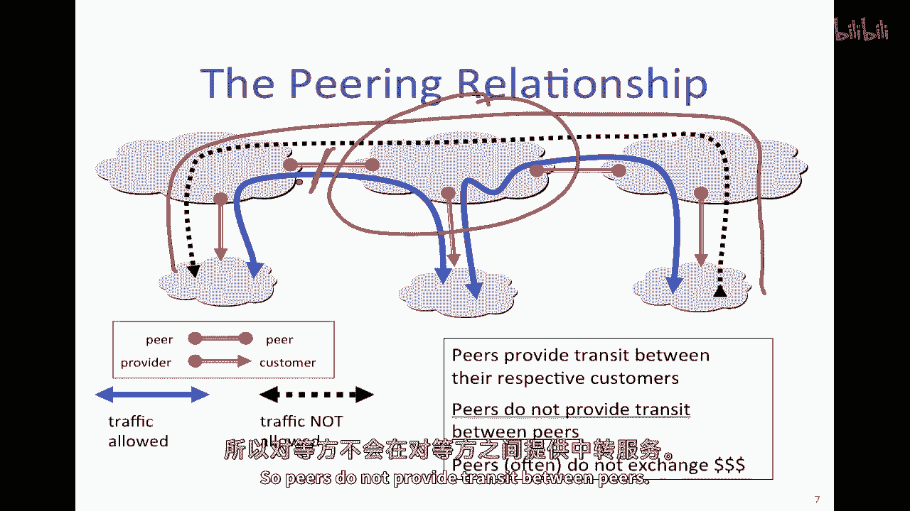
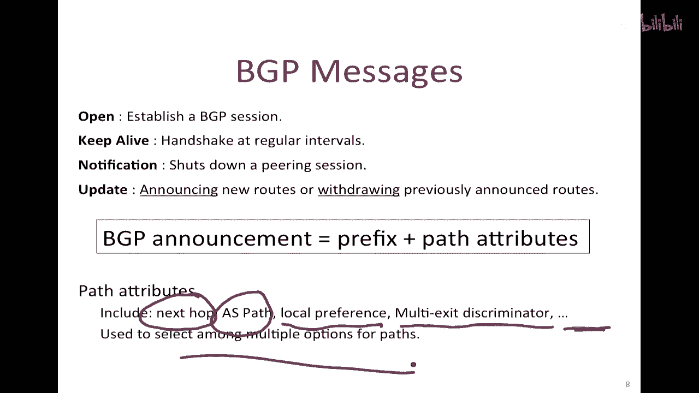
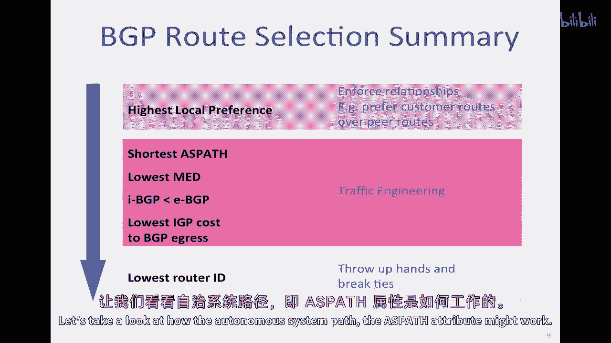
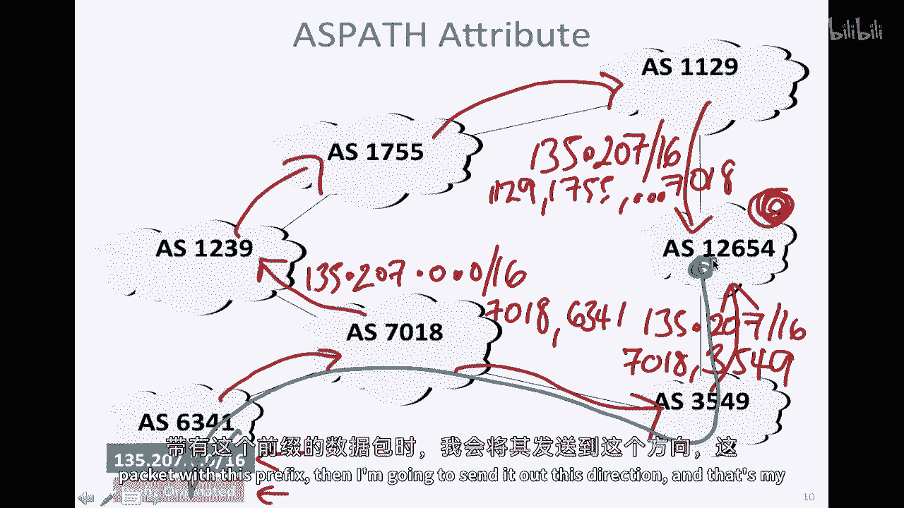
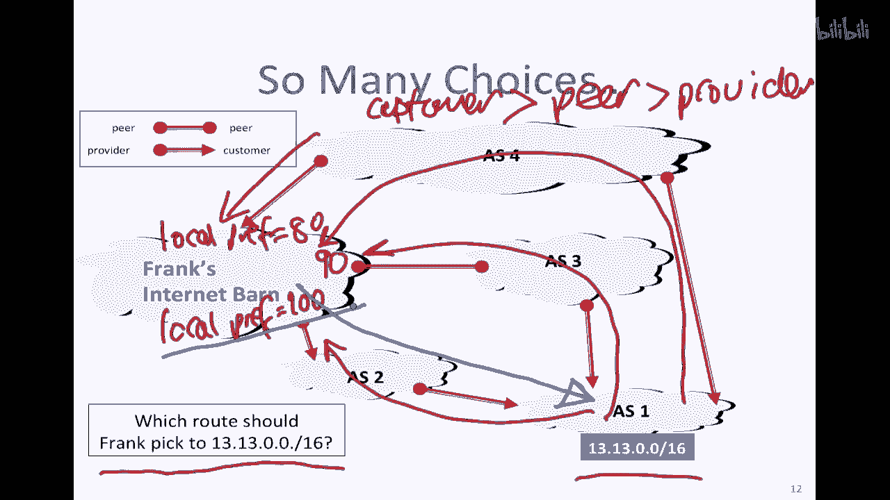
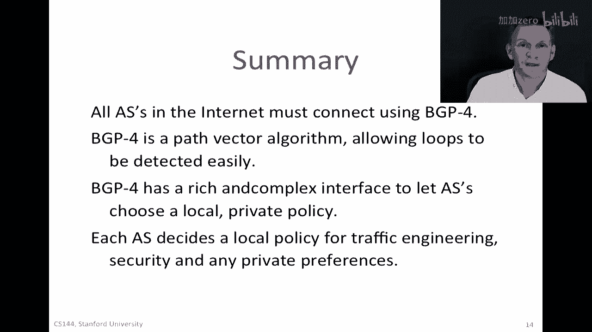

# P89：p88 6-5 Routing - BGP - 加加zero - BV1qotgeXE8D

现在，我们将继续讨论路由的主题，你已经学习了路由的基本知识，距离，向量和链接状态算法，以及互联网中路由的工作方式，互联网自治系统的结构，那些自治系统的层次结构，外部路由协议，内部路由协议，所以。

在这个视频中，我要告诉你所有自治系统必须使用的特定外部路由协议，当他们连接到邻居时，那就是bgp或当前版本的边界网关协议。

好的，让我们从bgp四的基本知识开始，bgp不是链路状态或距离向量路由协议，相反，它被使用，它使用被称为路径向量的东西，这种方式是，每个自治系统的边界bgp路由器，会广告一个完整的路径。

并且那条路径是你通过的ais列表，为了到达特定的目的地前缀，这也被称为as路径，那就是路径向量，所以路径广告的示例可能看起来像这样，网络前缀171说，616可以通过通过这些三个ais的路径到达。

as's115和13，所以这可能是一个广告的例子，那是bgp可能向其邻居广告的内容，发送路径的结果是，具有循环的路径在本地很容易检测到，你只需要寻找'as'的重复，然后，你可以简单地删除那些。

或者完全忽略那些广告，而且，这使得找到和消除循环非常容易，但是，bgp最重要的特性可能是，一个特定的自治系统可以从广告给它的路径中选择首选路径，所以，如果多个邻近的自治系统广告到达同一前缀的不同路径。

然后，本地政策可以选择它选择的任何一条路径，它想要哪一条，它不会对任何人负责，它不是对其他人负责的，当选择那个时，最后，当链接或路由器失败时，路径被撤回，就像广告附带的，嗯，嗯，嗯。

就像上面的撤回看起来非常相似，在其中它将说这个特定的前缀通过这个路径无法达到了，所以BGP四开始与客户和供应商之间的关系。

嗯，让我们来看看这个，所以让我们从，嗯，画成这样的图将是，供应商作为那个，就是那个坐在层次结构上面的，在层次结构中，然后客户作为坐在供应商和他们之间的关系下面的是嗯。

尽管交通可以通过提供商流向或从客户处流出，无论是哪个方向，并且可能会因为两者之间的特定关系而通过多个出口点离开，并且这种关系是提供商的客户到客户的关系，它具有特定的含义，嗯。

其中一项是客户将始终向提供商支付携带其包的费用，所以如果我们在思考，关于金钱如何流动，金钱在这里的方向向上流动，客户正在祈祷，为了携带其包，向提供商付款。

因此，这个客户到提供商的层级关系继续下去，因此，如果我们有多个ais，所以让我们在这里画一些ais，在这里画一些，这些可能是访问，就像我们之前看到的那样，然后，提供商对客户的这种关系可能像这样。

而且那告诉我们的是，那，嗯，因此，与他们之间的结算费用相反，实际上资金正在流向其他方向，IP流量可以按照以下方式流动，所以IP流量可以从一个，嗯，从客户流向其提供商，流向其提供商，通过其客户向下流。

通过其客户向下流到这里，同样一个嗯，从这里的东西，从这里的交通可以通过这种方式流动，如果还有一个，还有一个关系，例如，这个特定的，这个特定的一个通过这里向下的访问与位于其上方的提供商建立了两个关系。

交通允许通过任何这些，嗯，任何这些路径，所以它可以通过这种方式流动或者这种方式流动，一般来说，它们不会通过，嗯，在同一级别的中间人，稍后我们将看到一个例子，所以告诉我们关于客户提供者层级的原因是。

因为我们稍后将看到它出现，在bgp使用的政策中。

基本上，peering关系如下，所以，看这个例子，我们这里有，像以前一样，我们有三个as在这里，这些是提供者，然后，这里有三个在下面的，这些是提供者的客户，这里的关键在于告诉我们提供者客户关系。

并且这些上面的是彼此的peers，一般来说，一个peers不能为其其他peers提供传输，换句话说，这里显示的特定路径，黑色虚线是不允许的，因为它通过这个一个，因为这个peers。

因为通常在这里两个peers之间的关系是无费用的，没有美元在这里流动，因此，peers不之间提供传输。

现在，让我们看看bgp消息，然后，我们将看看bgp实现的政策，所以，基本上有四种类型的bgp消息，有打开消息以建立bgp会话，有保持活力以在定期间隔内提供握手，这只是一种偶尔的消息。

只是为了能够检查两个相互连接的路由器之间的bgp会话是否仍然活着，还有通知以关闭会话，出现的会话，所以，这里打开、保持活力和通知是基本保持会话活跃的，实际宣布和撤回路由的是更新消息。

这些三个是打开、保持活力和通知，基本保持会话活跃，实际宣布和撤回路由的是更新消息，这些是嗯，最重要的，它们宣布新的路由，或撤回之前宣布的路由，这些是，嗯，这些是，这些是，我们之前看到了一个例子。

与特定前缀的路径的宣布，宣布基本上包括前缀和路径属性，所以，它将是ais的路径，然后与其相关的属性，我们现在将看到一个例子，路径属性是下一个顶级信息，你去，以便能够使用此，换句话说，这是谁。

在推广这个的，通往我们的特定路径，特定的路径，所以这就是您将通过的ais序列，然后还有其他各种事情，本地偏好和多出口判别器，还有其他各种参数也会被传递，这些信息告诉我们，允许我们选择最佳路径。

当我们从不同的邻居接收到多个广告时，特定的路径是什么样子的，因此，这些用于从多个选项中选择路径，因为我们可能听到多个邻居关于如何到达特定目的地前缀的方法，基本上当我们有选择时。

路径的选择顺序大致是这样的，所以我们从，嗯，最高的本地偏好开始，这是最高的本地偏好，我们将在下一刻看到一个例子，这是一种地方偏好，告诉我们，嗯，我们如何执行关系，嗯，我们可能更喜欢客户路由过对等路由。

而且我们在一会儿会看到一个例子，如果地方偏好，实际上是我们的地方政策，如果那里没有告诉我们应该选择哪条特定的路径，当我们有一些选择，下一个是，我们将简单地选择最短的自主系统路径，换句话说。

到目的地的最短路径，然后，我们还可能会选择各种其他参数，这些都是帮助我们做好交通工程的，这意味着我们将倾向于将流量发送过负载较轻的路径，并导致网络中的拥堵减少，但我们最感兴趣的是当地偏好最高的。

和最短的一天路径，如果所有这些都无法区分或识别我们应该选择的特定路径，然后我们简单地选择路由器ID最小的那个，换句话说，那是我们邻居中的一个路由器的最小ID，这基本上意味着我们举手投降，以解除联系。

如果没有其他方法选择广告的路由，让我们看看自治系统路径如何工作。

as path属性可能如何工作，所以，我们将看一个例子，说明我们如何可能选择最短的，最短的路径，最短的路径，那么让我们假设我们坐在这里，特定的自主系统这里，我们正在听到起源于这里的前缀。

前缀是一三五二零七点零点零一六，嗯，它起源于这里，所以它将首先在这里广告，然后它会在这里广告，当它被广告在这里时，它将说您可以达到特定的前缀一三五二零七点零点零一六，斜杠十六，你可以通过七零一八到达它。

接着是6341，然后它会在这里流动，然后他们在路径上添加了一个一，然后我们会在这里得到广告，所以当它到这里时，我们将发现前缀一三五点，二零七/十六可以通过一一二九到达，一七五五等等。

直到我们到达七零一八，同样，这条路径上会有一条广告，它会说嘿，我可以将你带到一三五二零七斜杠十六，通过序列七零一八三五四九，所以它是一条更短的路径，在这种情况下，如果我没有更高的本地偏好。

然后路由器会说这是一条更短的路径，所以我会选择把这条路径作为我最喜欢的来发送数据包，以便到达这个特定的前缀，因此，我们将在本地安装这个决定，在它的路由器中写着，当我看到带有这个前缀的包时。

那么我会将这个包发送到这个方向。

这就是我的选择，可能会有很多很多选择，所以让我们来看看一个例子在这里，所以，在这个特定的网络中，弗兰克的互联网谷仓正在试图决定它应该选择哪个路线，以便能够达到前缀131316，"这就在这里。

就像一个人"，这里的关系性质是，Frank直接与供应商相连接，作为四个。"它连接到一个三号码头"，"并且它与一个客户相连接，就像两个一样"，这反过来又与楼下的另一位客户相连接。

"所以我们可以有许多不同的地方偏好"，"嗯，而且"，这可能会说我将倾向于本地选择，假设我有一百个客户，我将向他们提供客户关系管理服务，换句话说，我将优先考虑一百，"向我的客户们宣传的路线"。

"也许我只是说，我会偏向本地产品"，"从我的供应商那里收到的八十到一份"，"并且，我从豌豆那里收到的有九十个"，"这基本上意味着"，"如果我听到一条来自我客户的路线"，"我将非常严肃地对待这个问题"。

"因为那是一种有报酬的关系"，"我更愿意将此发送给我的客户，而不是发送给供应商。"，我必须在哪里支付，所以我将从，嗯，如果他们是从，嗯，来自客户的，我的第二个首选项来自同事，因为我在那里也不支付。

因为它可能是无息结算的，但我实际上必须在哪里为提供者支付给贩运者，所以如果我在这里听到一条被广告的路线，我可能不会选那条，除非那是我唯一的，那是我唯一的选择，所以基本上我在说，嗯，从我的选择来看。

客户广告的路线，嗯，更，嗯，比同行广告的路线更好，优于提供商宣传的路由，对于它的这种情况来说，这是很常见的，它不是内置的，Bgp，你可以只是设置偏好值来做到这一点，你也可以设置偏好值成为相反的。

尽管那将非常 unlikely，所以当这些，这些嗯广告正在到达这个特定的，随着它们从这里通过到这里的弗兰克，他们打算从这里来见弗兰克，他们打算从这个方向来见弗兰克，弗兰克会选择走客户那边的路线。

所以当他发送流量时，他会将流量发送到这条路线以见一个，因为这是他的最喜欢的路径，因为这是有最低地方偏好的路线，所以地方偏好是我先使用的，如果那并不能告诉我我的选择，那么我会选择最短的路径，然后。

我会走下一个在前一个幻灯片上列出的列表。

所以，总的来说，嗯，互联网上的所有自主系统都必须使用bgp四进行连接，这是他们必须使用的外部协议，以便与他们的同行或邻居通信，他们的邻居自治系统的路由器，bgp四是一种路径向量算法。

意味着一个自治系统的列表会被发送，连同每个广告的前缀，这使得循环检测非常容易，对于路由器来说，要检查这条路径并决定是否使用它，取决于其政策，根据其政策，Bgp四有一个丰富而复杂的界面。

让自治系统可以选择本地私有政策，基于你可能考虑的各种事情，你可能花费整个季度来学习除了bgp工作方式和后果之外的任何事情，关于这些政策的后果已经写了许多许多论文，因此，ejs为流量工程决定本地政策。

以及它可能拥有的任何其他私人偏好，以便它可以从不同相邻的自治系统中选择广告的路径。

