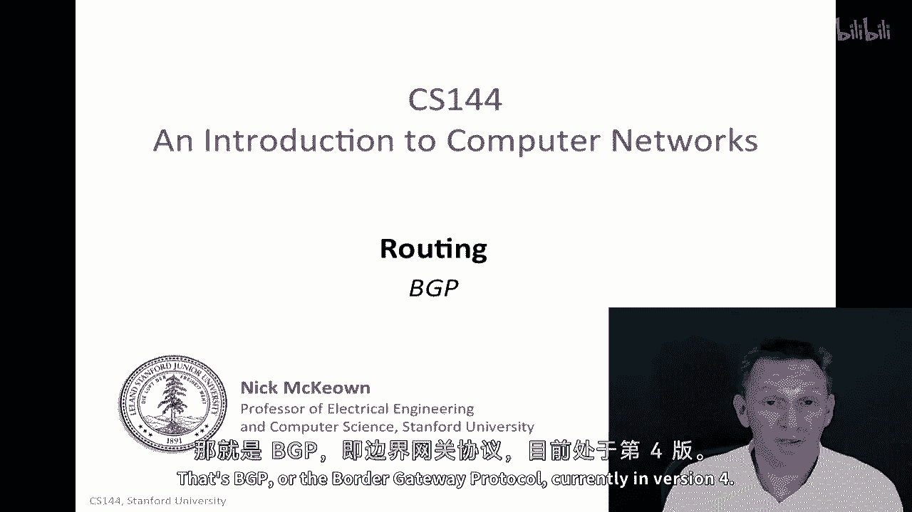
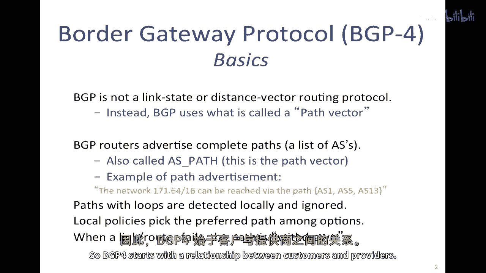
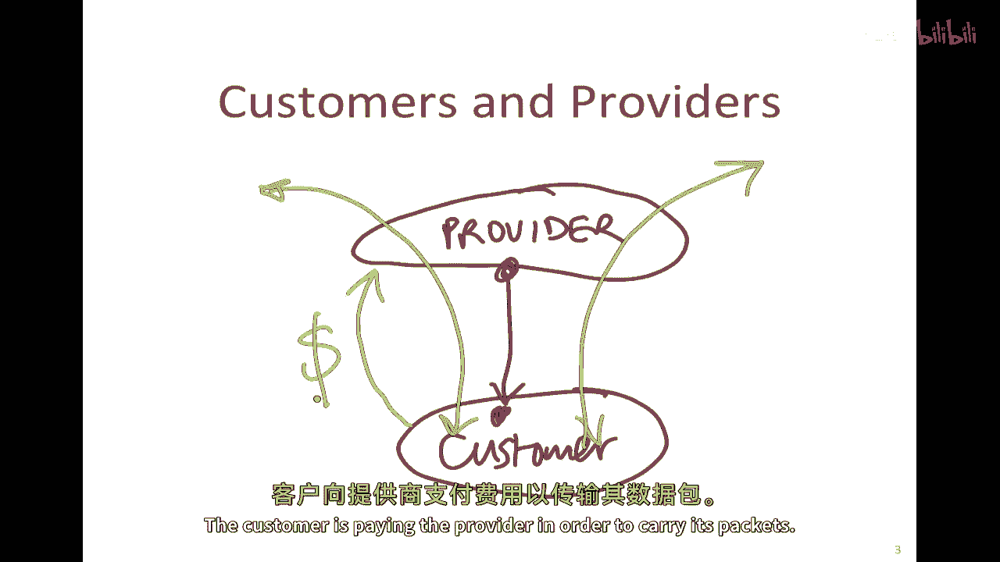
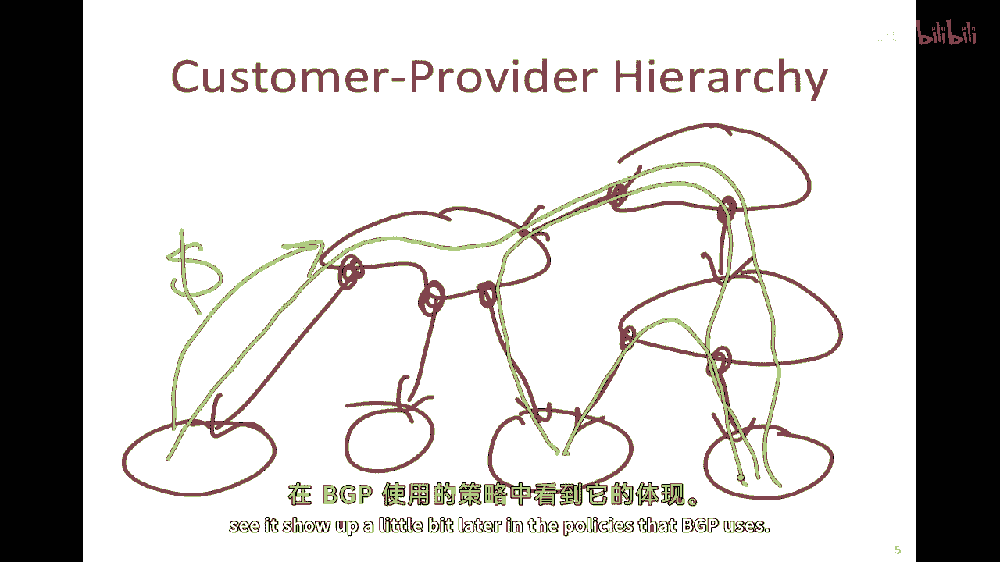
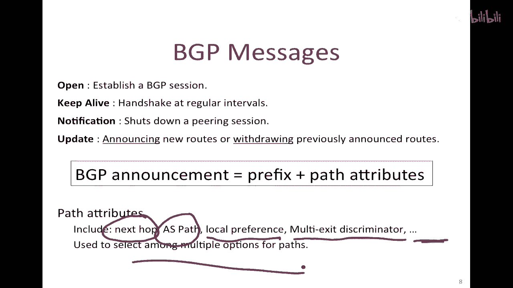
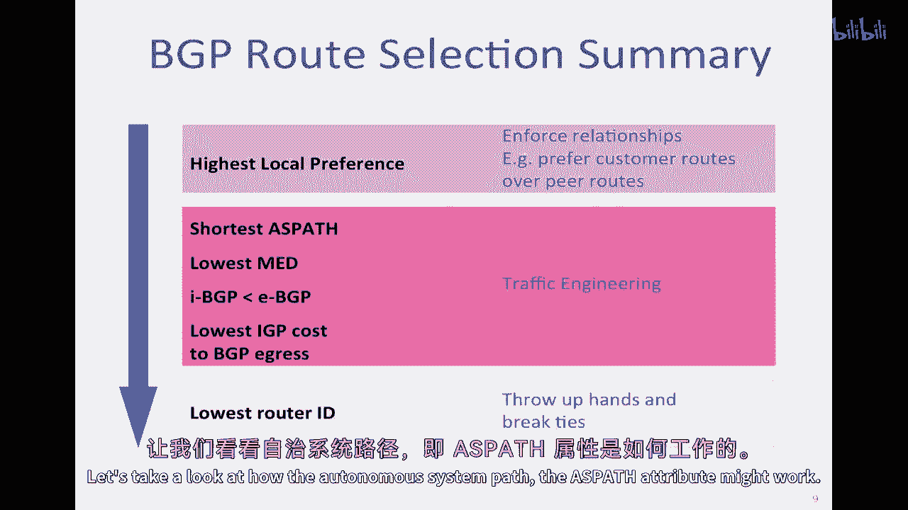
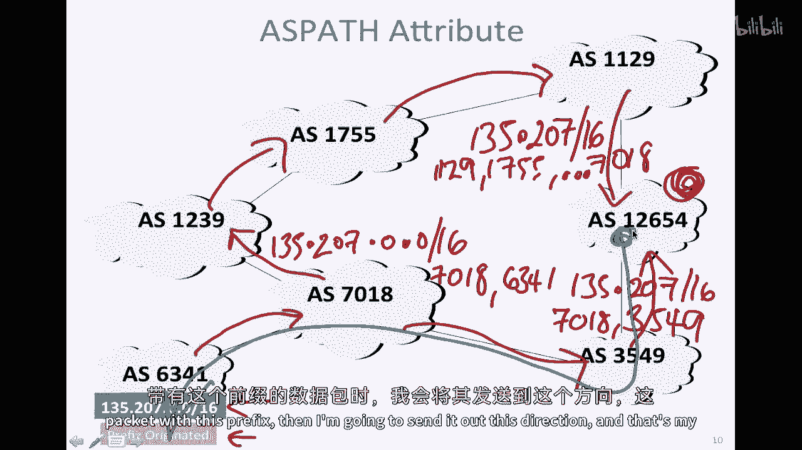
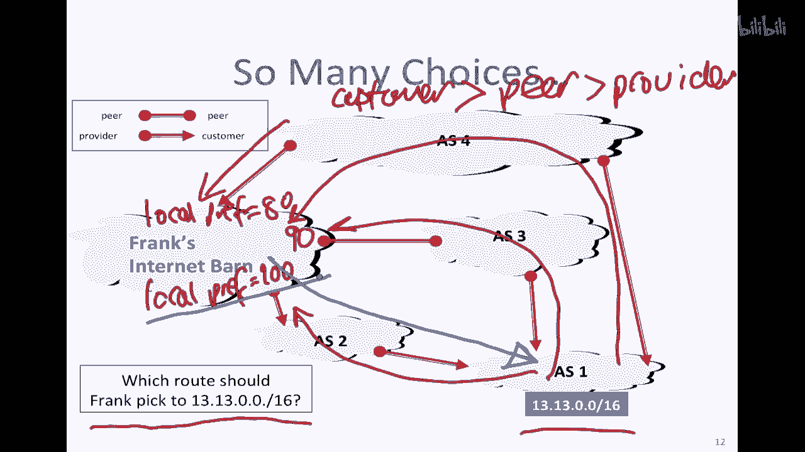
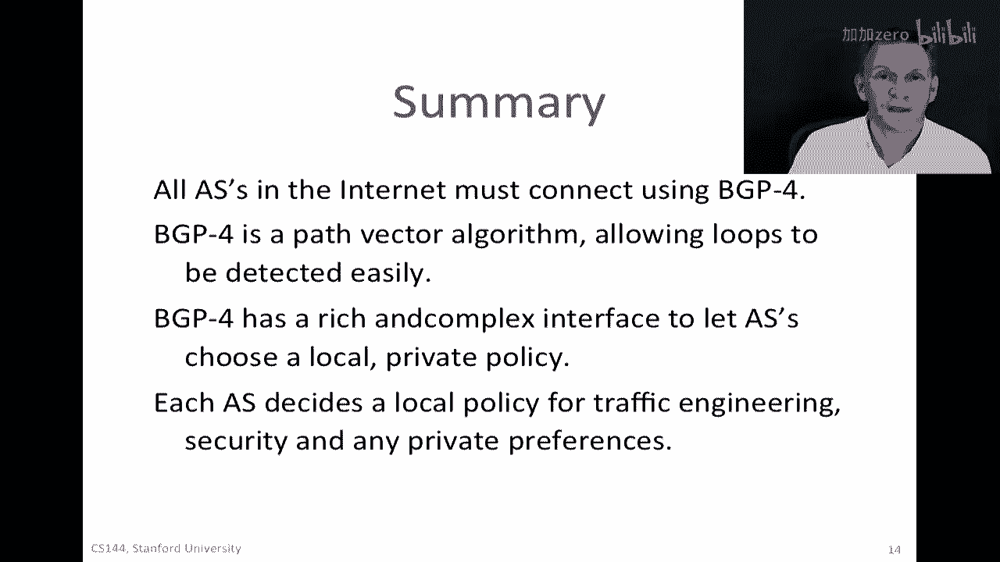

# 课程 P89：BGP边界网关协议详解 🚦



在本节课中，我们将要学习互联网中连接不同自治系统的关键协议——边界网关协议（BGP）。我们将了解BGP如何工作、它使用的路径向量算法，以及自治系统如何根据本地策略选择最佳路由路径。

---

## BGP基础知识

上一节我们介绍了互联网的自治系统结构，本节中我们来看看连接这些自治系统的具体外部路由协议——BGP（边界网关协议）。

BGP不是链路状态或距离向量路由协议。它使用一种称为**路径向量**的机制。每个自治系统的边界BGP路由器会通告一条完整的路径，该路径是到达特定目的地前缀所需经过的自治系统列表，这被称为 **AS路径**。

一个路径通告的示例如下：
```
网络前缀 171.6.1.0/24 可通过路径 [AS115, AS13] 到达。
```
这意味着，为了到达该网络前缀，数据包需要依次经过自治系统115和13。



使用路径向量的结果是，包含循环的路径在本地很容易被检测到。路由器只需检查AS列表中是否有重复的自治系统编号，然后可以简单地忽略或删除那些通告。这使得在网络中发现和消除路由循环变得非常容易。

---

## BGP的关键特性与关系



BGP最重要的特性之一是，一个特定的自治系统可以根据本地策略，从邻居通告给它的多条路径中选择一条首选路径。这意味着，如果多个相邻的自治系统通告了到达同一前缀的不同路径，本地路由器可以选择它想要的任何一条，而不需要对其他方负责。

当链路或路由器发生故障时，路径会被撤回。撤回通告与路径通告类似，但会指明特定前缀通过该路径已无法到达。

BGP的运行基于两种核心关系：客户-供应商关系和对等关系。

### 客户-供应商关系



在这种层级关系中，供应商位于上层，客户位于下层。流量可以通过提供商流向客户或从客户处流出。这种关系的核心是经济流向：**客户向提供商支付费用以传输其数据包**。资金从客户流向提供商。

以下是一个客户-供应商层级的示意图：
```
         [提供商 AS]
             |
        [客户 AS1] -- [客户 AS2]
```
IP流量可以从客户流向其提供商，也可以从提供商通过其客户向下流动。这种层级关系是BGP策略制定的基础。


### 对等关系

对等关系通常发生在同一层级的提供商之间。关键原则是：**对等体之间通常不提供中转服务**。这意味着，如果两个自治系统是对等关系，其中一个不能使用另一个作为通道，将流量传输给第三个对等体。这种关系通常是免费结算的，因此没有经济激励来提供中转。

一个不允许的路径示例如下（黑色虚线）：
```
[对等体AS1] ---X---> [对等体AS2] ---X---> [其他网络]
```
因为AS1和AS2是对等关系，AS2不会为AS1传输通往其他网络的流量。

---

## BGP消息类型

BGP使用四种主要类型的消息来维持会话和交换路由信息：



以下是BGP的四种消息类型：
1.  **OPEN**：用于建立BGP对等会话。
2.  **KEEPALIVE**：定期发送，用于确认BGP会话仍然活跃。
3.  **NOTIFICATION**：用于在出现错误时关闭BGP会话。
4.  **UPDATE**：最重要的消息类型，用于**通告新的路由**或**撤回之前通告的路由**。

UPDATE消息包含前缀和路径属性。路径属性是关键信息，包括：
*   **AS_PATH**：数据包到达目的地需要经过的自治系统序列。
*   **NEXT_HOP**：指示应该将数据包发送给哪个下一跳路由器。
*   **LOCAL_PREF**：本地优先级，用于在多个路径中进行选择。
*   **MED**：多出口鉴别器，用于影响对等AS的入站流量选择。

这些属性帮助路由器在从不同邻居收到多个通往同一目的地的通告时，选择最佳的路径。

---



## BGP路径选择过程

当路由器从不同邻居收到通往同一目的地的多个BGP路径通告时，它会按照一个确定的顺序来选择最佳路径。这个选择过程确保了决策的一致性和可预测性。

以下是BGP路径选择的标准顺序：
1.  **最高本地偏好**：优先选择`LOCAL_PREF`值最高的路径。这是最重要的策略控制手段。
2.  **最短AS路径**：如果本地偏好相同，则选择AS_PATH最短的路径（经过的自治系统数量最少）。
3.  **最低起源类型**：优先选择通过BGP本身学习到的路径（IGP < EGP < INCOMPLETE）。
4.  **最低MED值**：选择多出口鉴别器值最小的路径。
5.  **偏好eBGP over iBGP**：优先选择通过外部BGP学到的路径，而非内部BGP。
6.  **到达NEXT_HOP的最低IGP成本**：选择到达下一跳路由器内部开销最小的路径。
7.  **最低路由器ID**：如果以上所有条件都无法区分，则选择通告者路由器ID最小的路径。

让我们通过一个例子来看AS_PATH如何影响选择。假设路由器收到两条通往同一前缀的通告：
*   路径A: `AS_PATH: [7018, 6341, 1129]`
*   路径B: `AS_PATH: [7018, 3549]`

如果两条路径的`LOCAL_PREF`相同，路由器将选择路径B，因为它具有更短的AS_PATH（只经过2个AS，而路径A经过3个AS）。



---

## BGP策略实例：本地偏好

本地偏好是BGP策略中最强大的工具。它允许一个自治系统基于商业关系来优先选择某些路径。一个常见的策略是：

**客户路由 > 对等路由 > 提供商路由**

这种策略背后的逻辑是经济性的：
*   **来自客户的通告**：意味着该目的地是付费客户，将流量发送给客户能带来收入。
*   **来自对等体的通告**：通常是无结算关系，发送流量没有直接成本但也没有收入。
*   **来自提供商的通告**：意味着需要向提供商支付流量传输费用，这是成本。

因此，自治系统会设置`LOCAL_PREF`值，例如：客户路由为100，对等路由为90，提供商路由为80。这样，路由器会优先选择来自客户的路径。

例如，在下图所示网络中，“Frank‘s Internet Barn”自治系统从客户、对等体和提供商都收到了通往同一前缀的路由。根据上述策略，它会优先选择来自客户的路径，并将流量发送到那个方向。

```
        [提供商] --- [Frank‘s AS] --- [对等体]
                        |
                    [客户 AS]
```
Frank‘s AS会设置本地偏好，使得来自客户的路径优先级最高。

---



## 总结

本节课中我们一起学习了边界网关协议的核心内容。

互联网上的所有自治系统都必须使用BGP-4进行互联，这是它们与邻居自治系统通信时必须使用的外部路由协议。BGP-4是一种**路径向量**算法，意味着每个路由通告都包含一个自治系统列表，这使得循环检测对路由器来说非常容易。



BGP为自治系统提供了一个丰富而复杂的策略接口，允许它们基于本地私有策略（如商业关系和流量工程目标）来选择路由。自治系统可以根据其需要，从不同邻居通告的路径中做出选择。这些策略的制定和后果是网络工程中一个深入且复杂的领域。