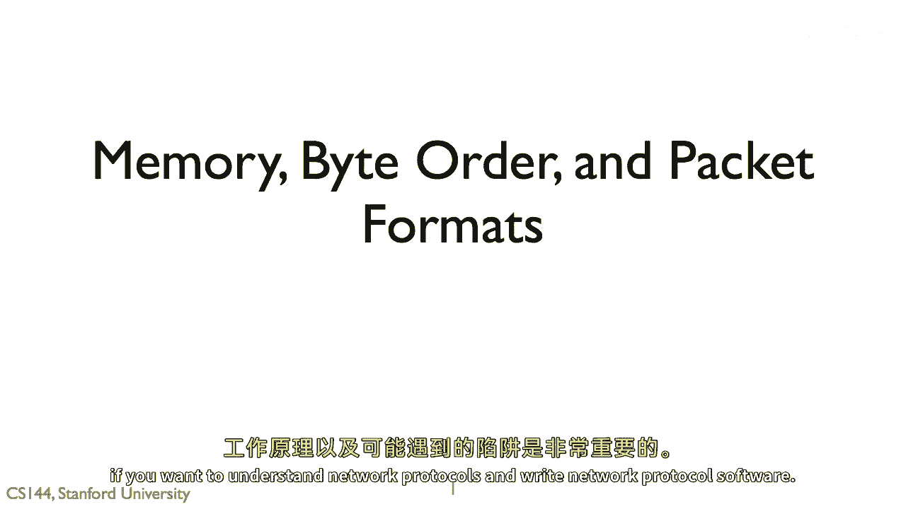
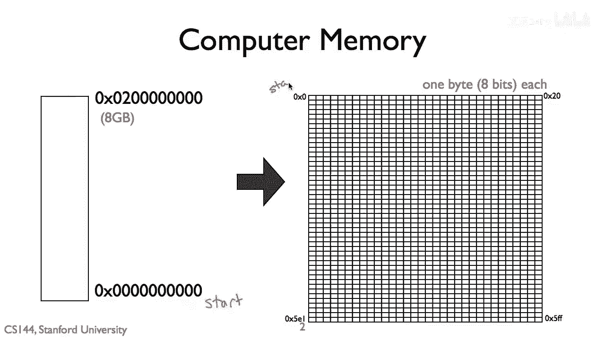
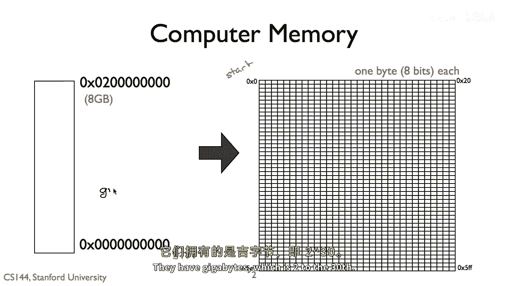
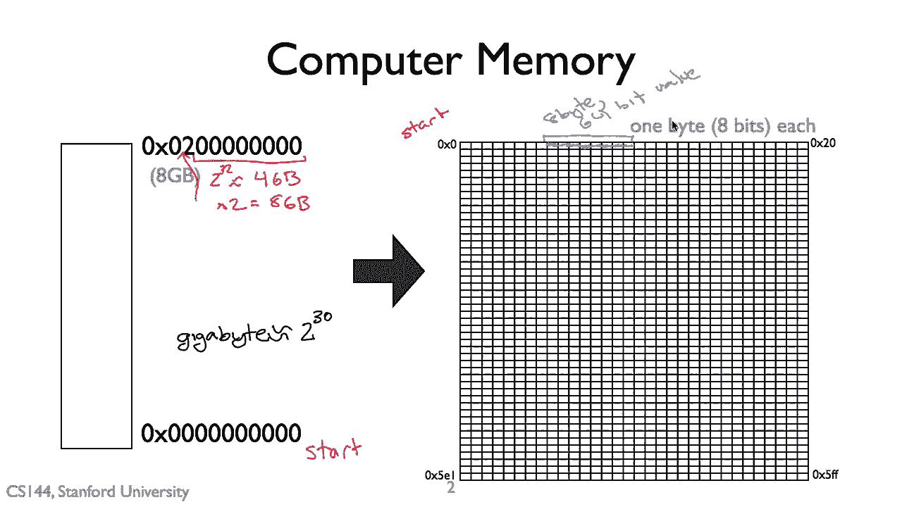

# 课程 P9：字节序详解 🧩

在本节课中，我们将要学习计算机通信中的一个基础但至关重要的概念——字节序。理解字节序对于编写网络协议软件至关重要，因为它决定了多字节数据在内存中的存储和传输方式。

---

## 通信协议的一致性 🤝

对于两个通信方来说，他们需要就交换的消息格式达成一致。如果一方假设消息是西班牙语的，而另一方假设它们是柬埔寨语的，计算机将无法通信。这意味着他们需要就消息的字段、排列方式、格式化方式以及表示方法达成共识，以生成要发送的消息。

软件通常需要在内存中创建消息的副本，然后传递给网卡。同样，当计算机接收消息时，网卡会将消息放入内存，软件随后可以访问它。理解这个过程的工作原理以及可能遇到的陷阱，对于理解网络协议并编写网络协议软件非常重要。

---

## 计算机内存模型 💾

上一节我们介绍了通信一致性的重要性，本节中我们来看看数据在计算机内存中是如何组织的。

让我们从计算机内存的一个简单模型开始。在大多数计算机中，内存以字节为单位组织，即八位内存块。一个程序拥有一个从地址零开始的地址空间。大多数现代计算机是六十四位的，这意味着内存地址是六十四位长。

因此，计算机最多可以处理到 `2^64` 字节，或约18.4万亿字节。在实际中，今天的计算机并不具有如此巨大的内存，它们通常拥有吉字节（GB）级别的内存，即 `2^30` 字节。

在这个例子中，我们的计算机有八个吉字节的内存。在左边显示了八个吉字节的内存，所以它的最大地址是显示的十六进制值 `0x200000000`。

软件可以访问内存中的每一个字节，也可以访问字节组。例如，通过一条指令从内存中连续的八个字节单元加载一个六十四位整数。

---

## 字节序的概念 🔄

上一节我们了解了内存的组织方式，本节中我们来看看计算机如何表示多字节值，以及字节序的概念。

假设我们要表示数字一千二百二十四。这相当于十六进制 `0x0400`，或 `4 * 256`。这个数值需要十六位或两个字节来表示。

那么，哪个字节先来？是 `0x00` 还是 `0x04`？你如何在内存中布局多字节值被称为**字节序**，并且有两种主要选择。

以下是两种字节序的定义：

1.  **小端序**：最不显著的字节位于最低地址。所以最不显著的字节首先出现在内存中。从计算架构的角度来看，这通常是最有意义的。
    *   **公式**：`内存地址增加方向` ← `从低位字节到高位字节`。

2.  **大端序**：最显著的字节位于最低地址。大端模式对从左到右阅读的人类读者来说更有意义，因为它与数字的书写顺序一致。
    *   **公式**：`内存地址增加方向` ← `从高位字节到低位字节`。

---

## 总结 📝

本节课中我们一起学习了字节序。我们首先了解了通信双方对数据格式达成一致的必要性。然后，我们探讨了计算机内存的基本组织方式。最后，我们深入讲解了字节序的核心概念，即多字节数据（如整数）在内存中存储的两种顺序：小端序和大端序。理解字节序是处理网络数据、进行跨平台编程以及分析内存布局的基础。