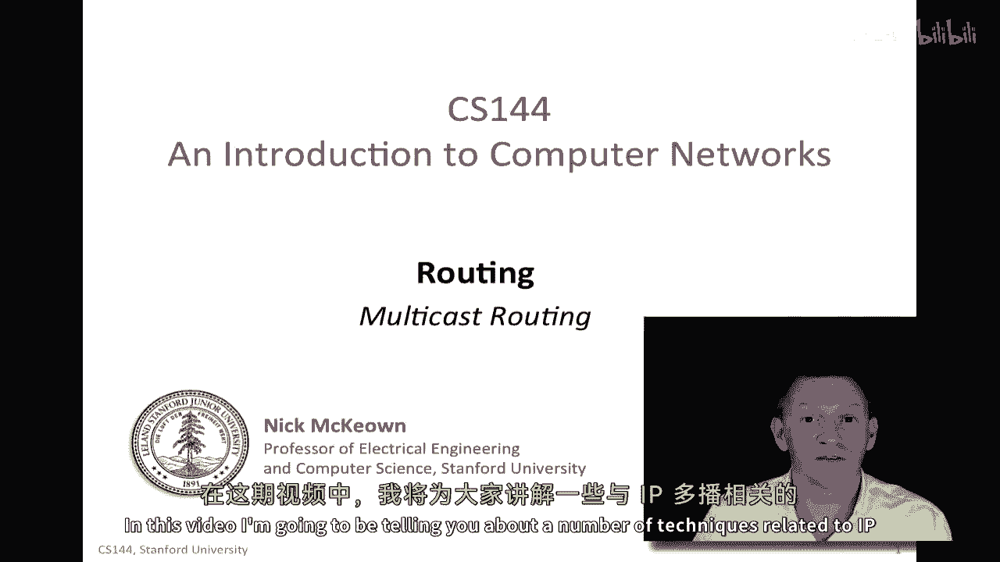

# 课程P90：多播路由技术详解 🚀

在本节课中，我们将学习IP多播路由的核心技术与实现原理。多播允许数据包从一个源点高效地发送到一组特定的目的地，这在视频会议、广播电视等场景中至关重要。我们将从基本概念入手，逐步探讨其工作机制、协议实现以及在实际互联网中的应用与挑战。

## 概述与基本原理 📡

在之前关于路由基础的视频中，我们解释了IP多播路由的基本原理。本节将介绍与IP多播相关的一系列具体技术。

到目前为止，我们假设所有数据包都发送到单个目的地，即单播。但在某些应用中，我们希望数据包能被复制并发送到多个主机，即一组主机。例如，主机A可能希望发送数据包给B、C、X和E，而不发送给D。这可以是广播电视的场景，其中B、C、X和E都在观看同一电视或广播电台；也可以是视频会议，参与者的数量可能自动更新到大量主机。

虽然我们可以简单地将数据包在同一时间分别发送给每个目的地，但我们自然会问：网络能否或应该为我们复制数据包？例如，如果网络在路由器R1处复制数据包，那么它可以更高效地将数据包送达所有终端主机。这样，主机A只需发送一个数据包，但该数据包能正确送达所有目标目的地。因此，在本节中，我们将探讨实现这一目标的技术。

## 广播与泛洪技术 🌊

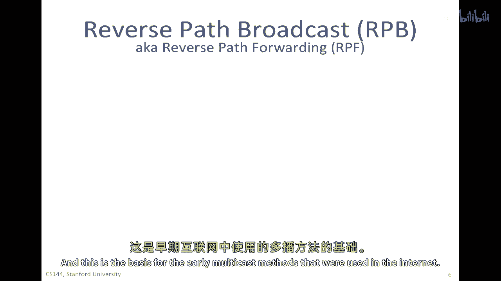

我们首先来看一种简单但基础的方法：泛洪。通过泛洪，数据包可以被送达大量主机。

在泛洪中，假设有一个源点A，它通过网络发送数据包到B。如果网络使用泛洪作为送达B的方法，那么来自A的数据包可以在路径上的每个路由器处被复制，并通过除数据包到达接口外的所有接口发送出去。

因此，来自A的数据包可以到达第一个路由器，然后从这里发送出去。当它到达下一个路由器时，它也可以从这里发送出去。最终，数据包将送达B。实际上，它将送达网络的每个叶节点。

泛洪的基本问题是：当网络拓扑中存在环路时，数据包可能会无限循环。因为当路由器从一个方向接收到数据包时，它会说：“这个数据包是从这个接口进来的，我将从所有其他接口发送出去。”这样，数据包就会永远循环下去。在生成树协议中，我们看到了这些循环是如何被打破的。接下来，我们将看一种不同的方法，从一开始就避免循环。

## 反向路径广播（RPB）技术 🔄

这种方法被称为反向路径广播，也称为反向路径转发。这是一种非常聪明的技术，被广泛使用，并且是早期互联网多播路由协议的基础。它基于一个非常简单的观察。

甚至在源点A开始发送多播之前，网络已经构建了一个从A可达所有主机的最小成本生成树。我们之前在单播路由协议中已经看到了如何做到这一点。例如，路由器R1已经知道如何计算所有向A发送数据包的最小成本生成树。因此，网络实际上已经有一个最小成本生成树。我们可以在发送多播数据包之前，利用该生成树来确定最佳路径。这就是为什么网络中会存在多播树，它是由所有路由器共同构建的，用于到达某个目的地。

因此，你可以使用这个生成树作为无环路的方法，将数据包发送给其他所有人。首先，让我描述广播的情况，这相当于泛洪，但没有数据包持续存在的环路。

现在想象一下，A正在向其他所有人发送数据包。这个数据包将包含一个地址（我们稍后会讨论地址），即与发送对象对应的组地址。但它也会包含源地址A，因为这个数据包来自A。沿途的每个路由器可以问一个问题：这个数据包到达的接口是否是从我到A的最短路径生成树的一部分？你可以在它的转发表中查找，看它是否正在向A发送单播数据包（而不是从A发送多播数据包）。如果它正在向一个单播地址发送数据包，这是否是它从这个路由器离开时将通过的路径？因此，它查找源地址A在其表中的记录。如果这是它发送单播数据包时将通过的接口，那么它将接受该数据包并从每个其他接口发送出去。

同样，当数据包到达R2时，R2会问同样的问题。如果它正在向A发送单播数据包，这是否是它将发送数据包的接口？答案是肯定的。因此，它将从每个其他接口发送出去。这有点像泛洪，但它问了一个更详细的问题：如果这是一个发送到A的单播数据包，我将通过哪个接口发送？

你可以看到，路由器R3也会问同样的问题，并回答“是”。因此，它将从所有其他端口发送数据包。然而，当这个数据包到达R2时，它将通过一个不在从A返回的绿色最短路径树上的接口到达。因此，R2将丢弃那个数据包，不会发送它。你可以看到，这实际上打破了循环。同样的情况也会发生在R8上，因为它不在绿色最短路径树上，所以那个数据包将被丢弃。你可以确信实际上不会有循环，因为数据包将跟随已经构建的生成树。这是一种聪明的想法，你可以看到为什么它被称为反向路径广播，因为它使用了与原始方向相反的生成树。

## 反向路径广播与修剪（RPB+Prune） ✂️

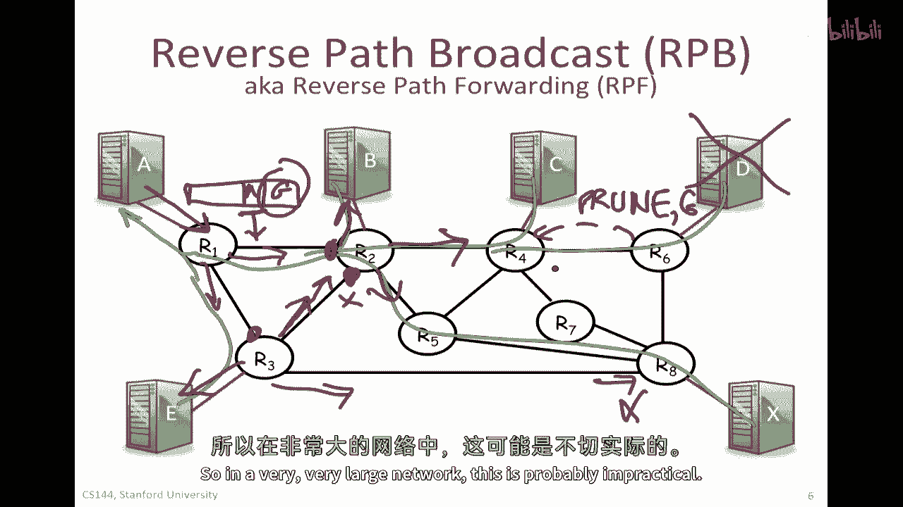

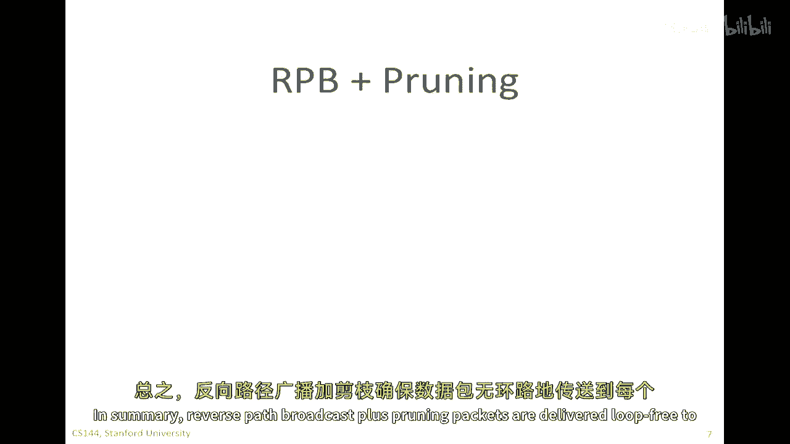

以上所有内容都很好，作为一种广播的手段。但我们在谈论多播。在这个特定情况下，数据包原本应该被送达所有终端主机，但实际上我们只想让它被送达每个终端主机，除了D。D是我们试图送达的主机集合之外的主机。

因此，一个简单的扩展是被称为“修剪”的技术。它通常被称为反向路径广播加修剪（RPB+Prune）。在这种方法中，那些没有连接到对接收该数据包感兴趣的主机的路由器会发送修剪消息。

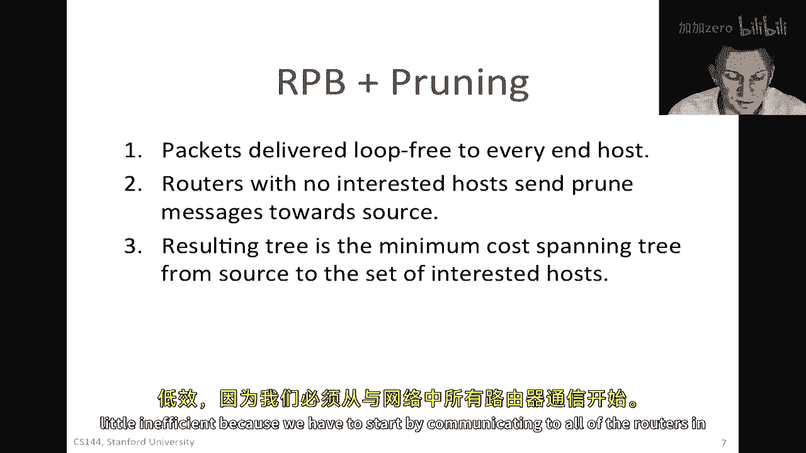

在我们的例子中，D不是多播组的一部分。因此，路由器R6将发送被称为修剪消息的信息（我将其显示为点线）。它会说：“嘿，实际上，我没有任何对这个地址组感兴趣的终端主机。请不要再向我发送这个组地址的多播数据包了。”因此，它将修剪该组，并表示对此不感兴趣。

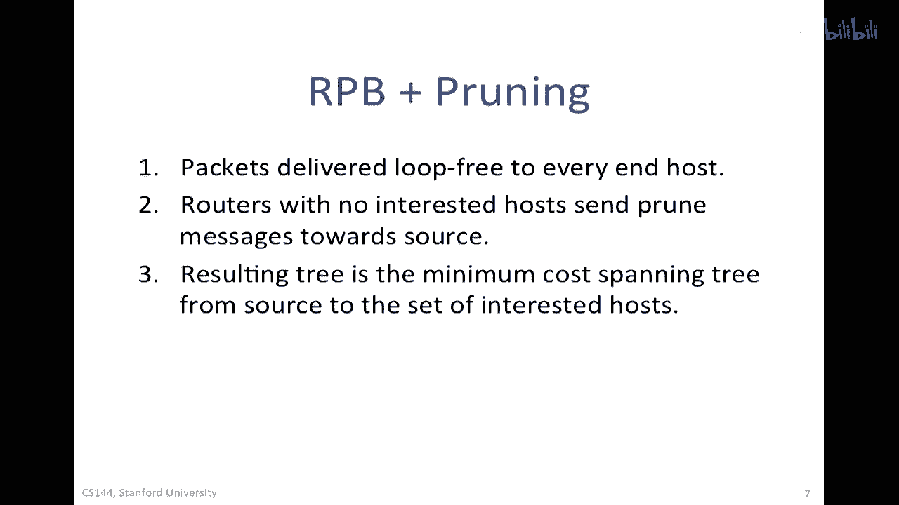

在这种情况下，这将从反向路径广播树中删除D。现在，那棵树只会到达对它感兴趣的终端主机。因此，它是一种减少广播开销的方法。然而，它显然在开始时仍然效率不足，因为在每个路由器开始修剪之前，它都会听到数据包。在一个非常大的网络中，这可能是不现实的。

总的来说，反向路径广播加修剪确保数据包以无环路的方式送达感兴趣的终端主机。没有附着在其上的感兴趣主机的路由器将发送修剪消息回向源。当然，它们可以使用源的**单播地址**来发送那个修剪消息，所以它会跟随树回向源。结果树是从源到感兴趣主机的最小成本生成树。因此，我们最终得到了一个高效的树，尽管到达那里的方法有些低效，因为我们必须首先与网络中的所有路由器进行通信。

## 源特定树与汇聚点 🌳

你可能在问：我们是构建一棵树，还是构建多棵树？在我的例子中，我展示了想要发送到目的地集合（B、C、X和E）的愿望。但如果是视频会议，当A说完话并向所有人发送数据包后，如果轮到B发送，那么B应该遵循的广播树是什么？

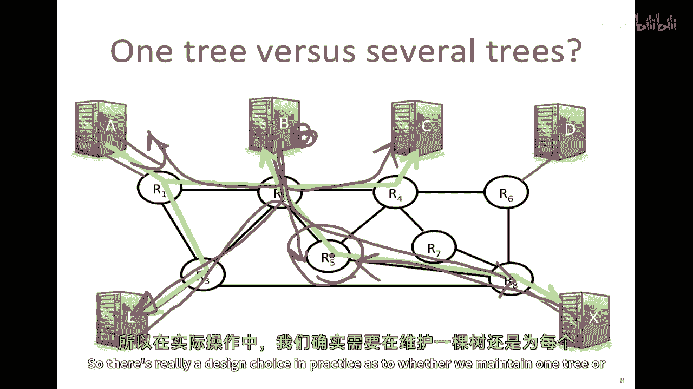

从B回到A，它们将以相同的方式跟随。但从B到C和B到X，以及从B到E，数据包更可能以不同的路径流动。换句话说，这棵树是源特定的最短路径树。从我之前的反向路径广播例子中应该很清楚，数据包将跟随源点对侧的最短路径生成树。因此，给定从每个源到每个目的地都有一个最短路径生成树，数据包走不同的路径并不奇怪。

因此，我们希望为每个发送者构建一棵单独的树，即源特定的树，以便所有数据包都跟随到终端主机的最短成本生成树。但在通信中，如果多播组的成员数量非常少，那么为每个源建立一棵树可能比建立一些汇聚点更容易。我们将在后面看到例子。

例如，我们可能会选举路由器R5作为汇聚点，所有多播数据包都将通过它。当每个人都在发送多播时，他们可以将数据包发送到R5。然后R5将构建到组中其他所有人的最短路径生成树。现在，R5有一个从其他源点到所有人的最短路径生成树（汇聚点到所有人），并且每个人都使用正常的单播路由方法来到达R5。因此，在实践中，存在一个设计选择：我们是保持一棵树，还是为每个源建立一棵树。

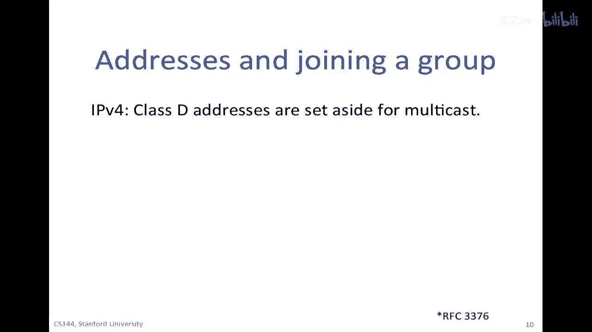

## 多播地址与组管理 📬

我已经告诉了你一些技术和原则，现在让我告诉你一些实践：今天互联网如何使用多播。我还没有提到关于地址的事情。在IPv4中，有一类地址不同于单播地址，它们是多播地址。多播地址有16位，因此有2^16种不同的多播地址。它们不对应于拓扑的特定位置，而是指一个组。所有在组中的接收者都将收到具有相同多播地址的数据包。这有点像一种间接寻址。路由器通常会维护对每个多播地址和源地址对的条目，以便它们可以将数据包发送到源特定的树。

我们还需要一种方式，让主机表示他们对加入一个组的兴趣。多播的一个有趣之处在于，一般来说，源不需要知道数据包被发送给谁。是网络、是树找出了这些信息。因此，树的每一片叶子，即每个主机，都需要表示对接收数据包的兴趣。它使用IGMP（互联网组管理协议，RFC 3376）来实现这一点。这是一种在终端主机与其直接连接的路由器之间运行的协议。主机会定期请求接收属于特定多播组的数据包。实际上，路由器会探测或向它们连接的所有主机发送请求，并问：“你对哪些多播组感兴趣？”然后主机会响应，说明他们想要接收哪些组。如果一段时间后没有收到任何回复，那么会员资格就会过期。换句话说，如果没有人对此感兴趣，路由器将不再发送属于这个多播组的数据包。这是一个被称为“软状态”的例子，状态仅被保持，如果没有重新表达兴趣，它就会过期。

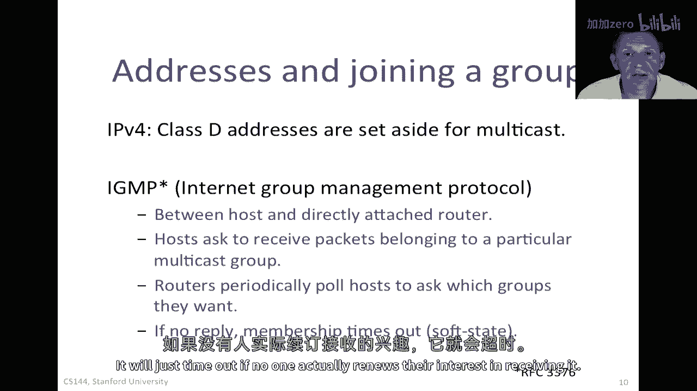

## 互联网多播路由协议 🌐

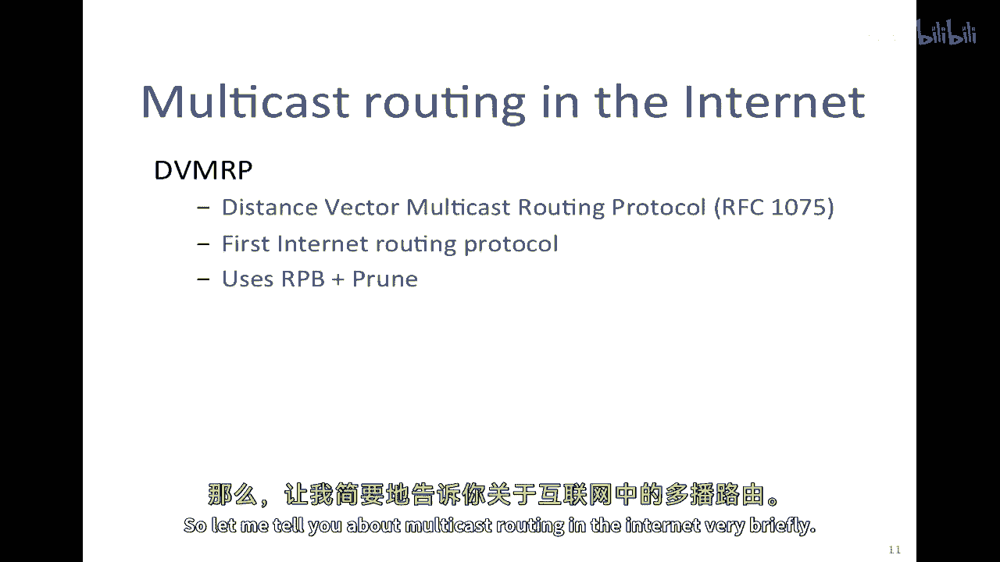

让我来简要地谈谈互联网上的多播路由协议。

第一个多播路由协议被称为DVMRP（距离向量多播路由协议），在RFC 1075中描述。它在1980年代首次被引入，基本上使用了反向路径广播加修剪。因此，它基于单播路由协议已经构建好的树，我们只是打算反向使用它。另一种方法是称为PIM（协议无关的多播），它识别两种不同的多播模式。

一种被称为密集模式，预期将有很大一部分路由器参与多播。在这种情况下，RPB加修剪就足够了，因为大多数路由器都将参与，而且其中很少一部分需要修剪。因此，它使用了DVMRP或类似于DVMRP的方法，并在RFC 3973中进行了描述。

另一种方法被称为稀疏模式PIM，预计只有相对少数的路由器将参与多播。因此，做RPB加修剪将非常低效，因为在网络上将有太多的修剪消息。在这种情况下，它明确构建了汇聚点，发送的数据包将通过这些汇聚点加入一个小的生成树集合，从汇聚点到所有目的地。因此，投入了大量的工作来选择这些汇聚点，这是一个相当微妙的问题。

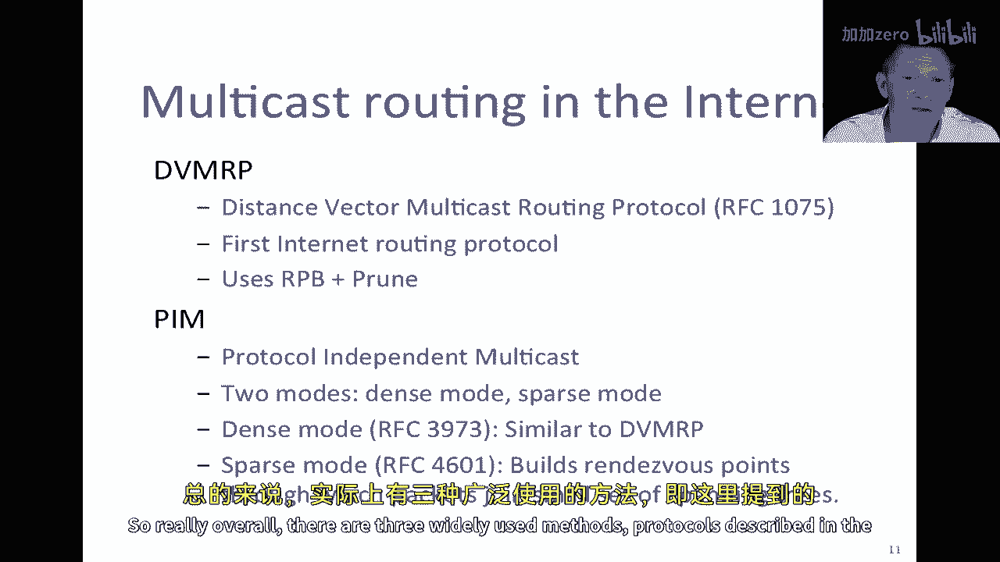

总的来说，DVMRP和PIM是广泛使用的方法。在提到的三个RFCs中描述的协议被实际使用。

## 多播的现状与挑战 🤔

实际上，多播的使用比最初预期的要少一些。最初预计它将用于大量的通信，因为在多播首次被构思时，世界上大多数的通信还是电视和广播，这是广播媒介。因此，人们预计这将成为一种非常常见的通信方式。实际上，在实践中，这并没有像最初所想的那样普遍。而且，过去二十年左右，通信已经变得更加个性化。我们倾向于要求我们特定想要观看的内容在特定时间观看，对广播的兴趣不如以前，除了像体育赛事、大规模的政治集会、火箭发射等事件。因此，这种个性化的时间调整大大降低了网络中对多播的需求。

此外，一些早期的实现（如DVMRP）效率很低，并且被发现存在扩展性问题，因此减少了一些人们对今天引入多播的热情。它被用于一些广播IPTV分发，并且一些应用也进行了一些应用层特定的多播，不使用网络基础设施，而是为它们自己构建了自己的覆盖树。

多播也引发了一些有趣的问题，特别是关于需要维护的状态，以便能够保持可靠的TCP通信。例如，想象一下，一个源正在向数百、数千或数百万的目的地发送数据包。如果你想要这种通信可靠，在其中保持跟踪哪些数据包已经在哪些目的地可靠地接收，这对单个源来说是一个恐怖的任务。实际上，任何需要状态的事情，比如流量控制或支持不同的用户在不同的终端支持不同的速度，如何做到这一点并不清楚，或如何使它安全，所有这些都是相当大的问题。从研究角度来看，人们对此产生了很大的兴趣，但一般来说，人们并不认为对这些问题有良好的解决方案。所以通常，多播主要用于传递主要单向数据的情况，例如电视，在这种数据从源未经修改地被移动到一组终端主机的情况中。

## 总结 📝

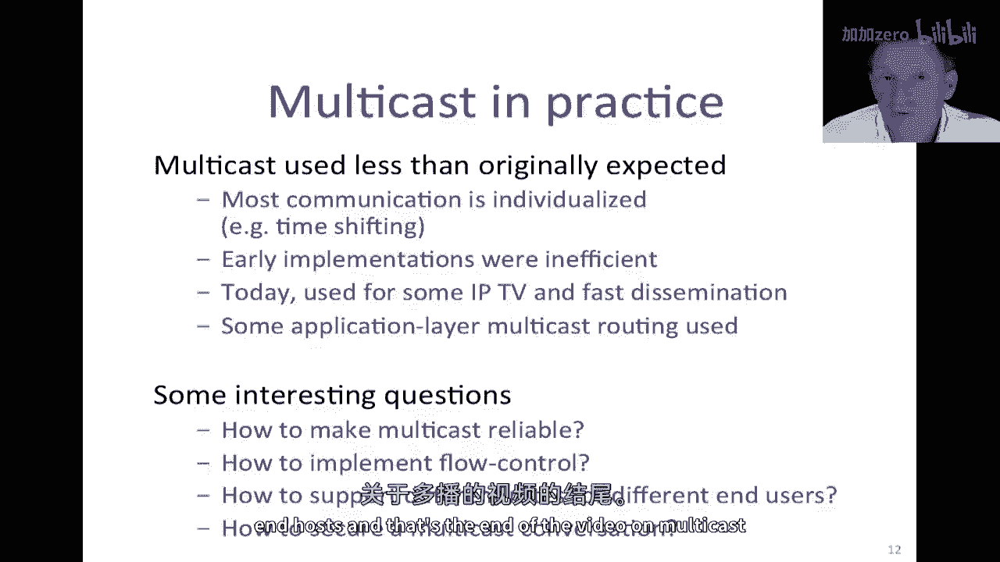

在本节课中，我们一起学习了IP多播路由的核心技术。我们从基本的泛洪方法开始，探讨了其环路问题，进而引入了反向路径广播（RPB）这一无环路解决方案。为了将广播优化为针对特定组的多播，我们学习了RPB加修剪技术。接着，我们讨论了源特定树与汇聚点的设计选择，以适应不同的应用场景。我们还了解了多播地址的格式、IGMP组管理协议的作用，以及互联网上实际使用的多播路由协议，如DVMRP和PIM。最后，我们审视了多播技术的现状、面临的挑战以及其主要的应用领域。多播是一项强大的技术，能够在特定场景下显著提升网络效率，但其实现和广泛应用仍面临诸多复杂问题。