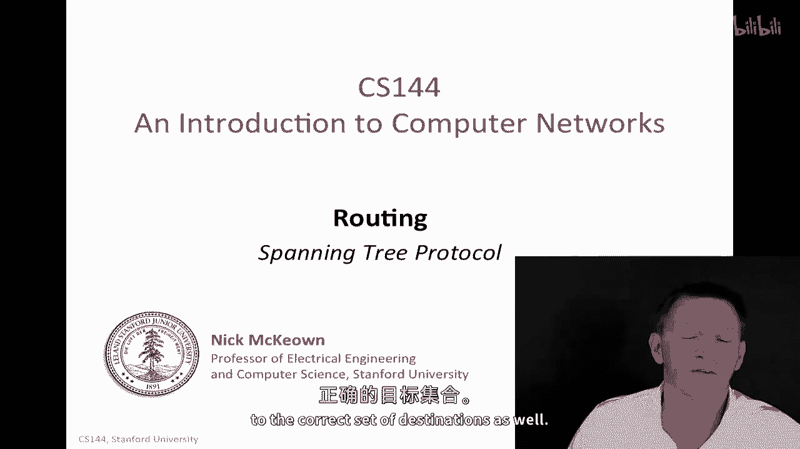
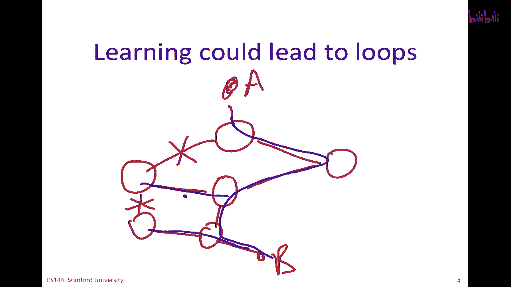
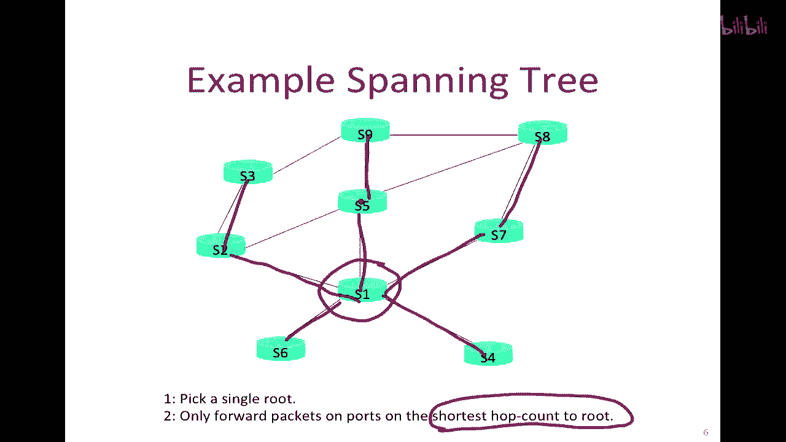

# P91：p90 6-7 Routing - Spanning Tree - 加加zero - BV1qotgeXE8D

本讲座将继续讨论路由的主题，我将向您介绍一种叫做生成树协议的东西，生成树协议实际上用于以太网交换机，嗯，我们通常认为路由在IP层或网络层运行，但在任何情况下。

当我们想要沿着我们精心选择的路径发送数据包时，我们可以认为那是路由，因此，以太网交换机需要决定如何路由，或将数据包转发到正确的目的地集。

"这就是我们在这个视频中要关注的内容"，"所以我们将继续这个话题的路由"，"接下来，我要描述一种东西，一开始可能不会看起来像路由。"，"因为我们通常使用术语路由来指代网络层"，"嗯，嗯，伊普"。

"IP地址"，"但是，路由实际上意味着任何一种在网络中传递数据包的机制。"，"以心觉的方式，从源头到目的地"，因此，从那个意义上说，"以太网将数据包路由得太远"，它正在将数据包从源发送至目的地。

它只是恰巧根据以太网地址来做这件事，所以在这个视频中，我要谈谈以太网如何转发数据包，嗯，所以我们知道在以太网中如何学习地址，但是，但是它如何防止环路发生，嗯它嗯，我们我们知道它会学习地址。

直到它学习到地址并知道如何正确地将数据包发送，它就会向所有人广播，我们如何确保那些被淹没的消息，那些广播消息不在网络中永远循环，毕竟在以太网中并没有ttl字段，以太网，是通过在网络上构建一个树形结构。

其中数据包被转发，我将立即查看这一点，这与我们之前看到的方式大相径庭，因为相反于在以太网中为每个目的地或每个路由器构建一棵树形结构，我们将为整个网络构建一棵树形结构，换句话说，它将限制整体拓扑结构。

只使用属于单个生成树的端口，所以简要回顾一下以太网交换机如何转发数据包，首先，它检查每个到达的以太网帧的头部，如果它找到以太网目的地地址在其转发表中，它将将帧转发到正确的输出端口。

如果以太网目的地地址不在表中，它将将帧广播到所有输出端口，因为它不知道应该将其发送到哪个端口，它就只会发送给所有人，现在我们已经了解了洪水，我们可以看到它为什么这么做。

因为我们可以确定它会最终到达目的地，然后它学习，嗯，表中的条目是通过检查以太网学习的，到达的包的以太网源地址，换句话说，当它看到来源地址时，它会学习到为了到达那个特定的源地址。

它通过到达该包的端口发送包，因此，必须处于从源向该地址的方向，但这一切都假设包不会在网络中永远循环，而且实际上，的，特别是在学习过程中，那以太网源地址实际上确实在最短路径上。

或者是一个合理的路径返回到那个地址，所以它如何，它如何知道，实际上，整个学习过程可能会导致循环，所以让我们看一个如果我们有一个网络有，嗯，假设这是源，这是目的地，在中间我们有一系列交换机，像这样的。

它们都连接在一起，嗯，像这样，所以b在这里直接相连，然后a在这里连接到一个开关，在学习过程中，像我们第一次描述的那样，当a发送到b时，假设它要发送，嗯，它将在这里发送其包。

目的地为第一个开关的包并不清楚应该发送到哪里，因为它从未从a和b那里听说过a和b，所以它将传播其消息，所有这些即将下来的端口，它将从这里出去，它将从这里下来，但是因为这个。

这个开关这里要做的就是将所有端口都发送出去，除了它学到的它从哪个端口听到的信息，这也将从这里来，再下来这里，永远在这个循环中走，这个也将永远在这个循环中走，这里有另一个循环，因此你可以快速地了解情况。

这些数据包将永远循环，它们将被送达，B b将响应并学习地址，但在此期间我们已经创建了一个巨大的循环，充满了地址，因此我们需要确保这种情况不会发生，我现在要描述的生成树协议是为了解决这个问题而发明的。

因此，而不是为每个地址决定我们如何沿着生成树路由，或者到达每个目的地，它将为整个网络构建一个生成树，所以，我就给你举个例子，我要重新绘制我的，嗯，或者一个开关，嗯，在这里有一个有很多环路的网络。

它不是以前的那个完全一样，但它大致相同，所以，这里是a和b，它要做什么，是，它将遍历并禁用网络中的一些端口，以防止这种情况发生，所以，一个它可能做的事情的例子是基本上关闭这里链接，以防止顶部的循环。

并且它可能关闭循环，这里链接，并且防止这里下方的循环，所以我们最终在这个情况下得到一个生成树，就像这样，嗯，所有的交换机都在这个生成树中打开，所以它是一个树，这样就没有环路。

并且a和b可以通过这个生成树互相通信，通过这个生成树，所以它给我们提供了一个关于我们接下来将要看到的大致想法。

所以防止环路，生成树协议，嗯，它是嗯，它将从识别开始，那交换机的拓扑结构是一个图，我们已经见过许多这种例子，并生成树协议将找到连接所有顶点的子图，在所有交换机中不创建任何环路，这是一个生成树。

分布式协议将在所有这些交换机上运行，它将从决定开始，哪个交换机是它要创建的单生成树的根，然后哪些端口被允许在树中转发数据包。

我们来看一个例子，嗯，这只是一个跨越树的示例，所以第一步是，它将选择一个单一的，一个根节点，它这样做的方式是，这只是交换ID号码并选择ID最小的一个，所以我在这里假设，嗯。

已经交换足够信息来确定一个节点是根节点，然后它将在端口上转发数据包，通过到目的地最短跳数路径，因此，就像六在这里发送数据包，像二在这里发送数据包，像四在这里发送数据包一样。

我们已经看到了许多如何创建这种s八的例子了，这里有一个跳数，为二，这里有一个跳数，为二，这里有一个跳数，这是由某种方式任意决定的，它将这样发送，然后跳三个，这样数二，这样数一、二、三，所以它会这样发送。

九会这样发送，所以有一个覆盖他们所有人的生成树。

这里是一个可能创建的例子，它与之前的几乎相同，因为我有几条我可以断开的联系，所以这是逻辑上创建的生成树，当然，里面没有循环，它覆盖了所有的开关，所以剩下的事情是找出它如何做到这一点。

我们知道它最终会达到的结果，所以它是如何到达那里的，所以让我们来看看生成树协议是如何工作的，所以这里有一些细节，我将一步一步地通过这个，所以首先发生的事情是所有开关都广播一种特殊的包。

被称为桥协议数据单位，协议数据单元只是包（packet）的一个稍微有些过时的术语，交换机是开关的旧称，在九十年代九十年代以前，它们被称为桥，所以桥协议数据单元通常缩写为bpdu。

这是唯一使用bpdu这个术语的语境，所以不要对此过于担心，它本质上是发送在网络中以构建生成树所需的特殊控制消息，bpdu包含三个部分，它的ID是谁，那就是发送它，那就是交换机的ID。

所以在我之前的例子中，一、二、三，它通常实际上来自MAC地址，只是为了使它唯一，并且可能由管理员手动配置，但我们将在PowerPoint图片上使用交换机ID，目前它包含它目前认为的根的想法。

我们将在下一刻看看这个如何演变，并且它是从发送者到根的距离，换句话说，它认为从自身到根的距离，这就是最好的，它目前最好的估计，所以首先每个开关都会去，会去启动并认为它是根，它将声称自己是根，换句话说。

它将把自己的发送者想法放上去，与路线的概念相同，因为它们是相同的，它将说距离字段设置为零，因为这是发送者到根的距离，并且每个开关都将广播这个值，直到它听到更好的值，换句话说。

具有较小ID的路线是最可能的情况，所以如果我目前正在广告，我认为我是根，然后有人向我发送消息说，嗯，我是根节点，它的ID比我低，那么我会开始说，好的，我相信你是根节点而不是我。

如果恰好有一个ID相同的根节点，它会选择距离更近的一个，嗯，ID较小的发送者的ID将打破平局，所以如果一个开关听到更好的消息，它将不仅采用该值作为根，它将重传该消息，并且它将距离增加1。

并且说我将将我的id作为发送者，新学到的根，我将添加一个值，对告诉我的值增加1，因为跳数现在增加了1，并且我将说那就是发送者到根的距离，所以最终跳到这里，最终只有一个路由将起源这个消息。

而其他所有人都会重新转发它们，因为每个人都会唯一地选择相同的，与根相同的交换机ID，好的，现在我们知道谁是根，我们需要找出如何构建生成树，以便从那个根发送和接收包，所以根端口在每个交换机上都会被选择。

它是交换机上离路由最近的端口，换句话说，它是通过哪个端口听到bpdu的，使得它具有到根的最短距离，所以这是一件很容易理解的事情，并且它将通过它发送消息，将消息转发给根，或从根接收它们，不仅bpdu使用。

而且还使用转发的包，第二种类型的端口被称为指定端口，这是邻居们同意使用的端口，以到达端口，它本质上是通过哪个端口，最终包将目的地为根的，根将在这个交换机上接收，来自路由的包将被转发到这个端口。

在其他方面，为了到达其他交换机，所有其他端口都被阻止转发，换句话说，只有那些是根端口或指定端口的端口将继续转发常规包，所有其他端口都被阻止转发，然而，它们仍然会发送和接收bpdu。

所以控制消息仍然会被发送和接收，以便我们可以继续构建生成树，这样，如果发生任何事情，一个交换机崩溃或链路崩溃，每个人都会收敛到一个新的短距离作为另一个生成树，好的，所以最终。

只有交换机只会在路由端口和指定端口上转发，嗯。

嗯，让我在这个视频的最后谈谈生成树协议的历史，生成树协议最初在1985年由无线电普尔曼发明，在那个时候，以太网交换机被称为桥，并且网络开始被构建为大量的桥，这真的很早，在此之前，路由并不很流行，因此。

他们真的很需要一个快速的方法来可靠地构建生成树，以便所有的包都能跟随，以避免网络广播的升级，这就是生成树的起源，这是由1990年的利比亚国际电信公司（I Tripoli）标准化的，我们相对缓慢地收敛。

随着网络的扩大，这个问题变得越来越严重，我们使用的定时器相当长，而且，这种方法需要一段时间才能收敛，因此，2004年还引入了一种更快的版本，称为快速生成树协议，这为整个网络构建了一棵树，而且。

数据包的路径往往会是一条有些曲折的路径，这并不是源点和目的地之间最短的路径，因为这些数据包总是必须通过这条路线，所以最近，在二零一二年，仅引入了最短路径桥接协议，并且这使用了我们的老朋友链路状态算法。

有点像在ospf中使用的迪杰斯特拉的算法，以便从每个源到每个目的地构建最短路径树，嗯，所以在，最终，我们最终得到了一种方法，它与使用的方法非常相似，在第三层，这可能在接下来的几年内会被推出并更广泛采用。

