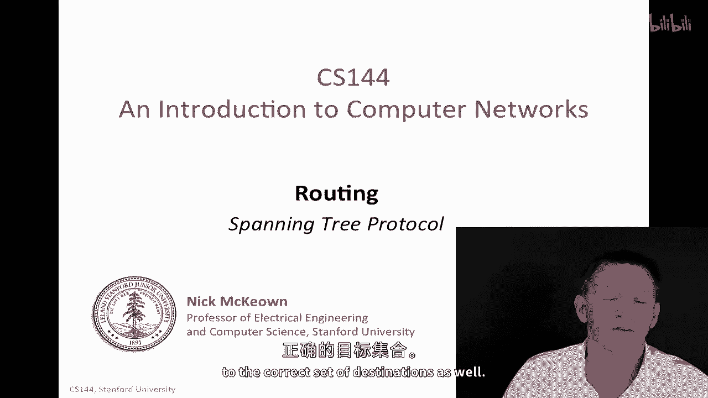
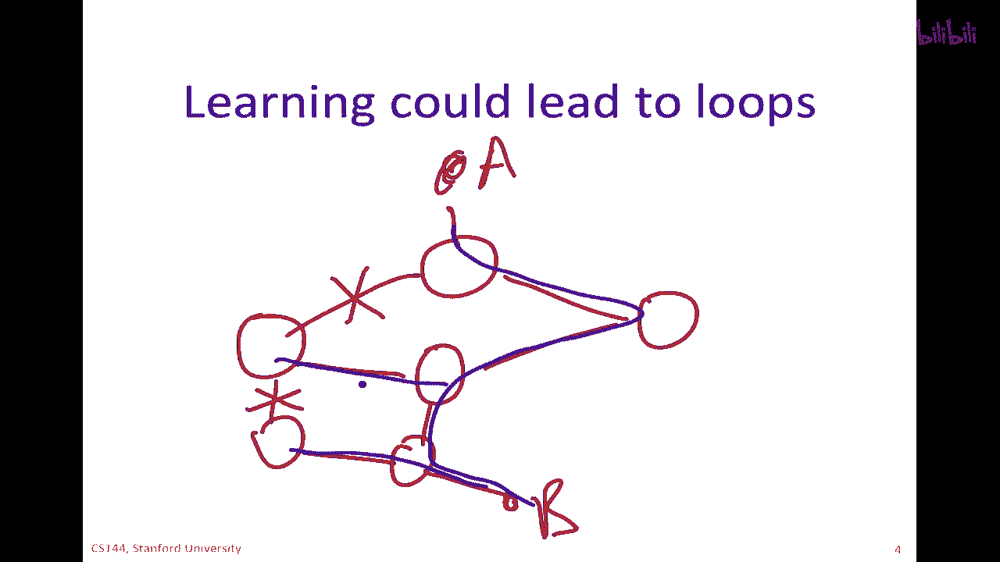
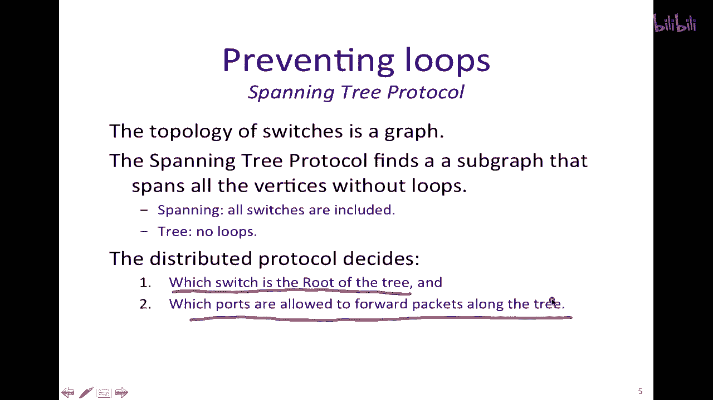
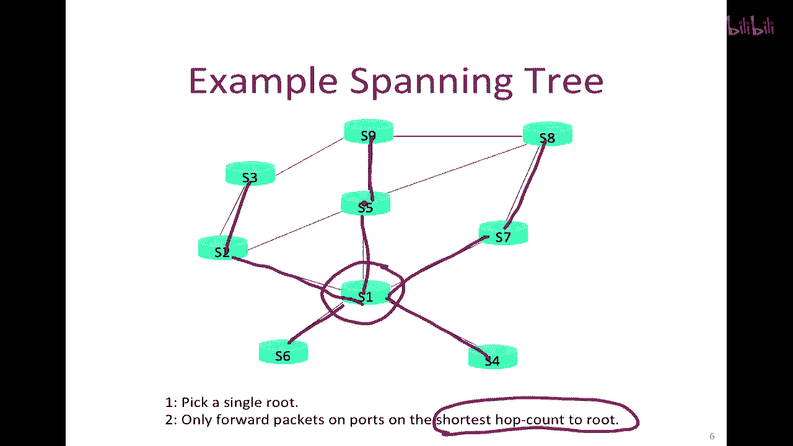
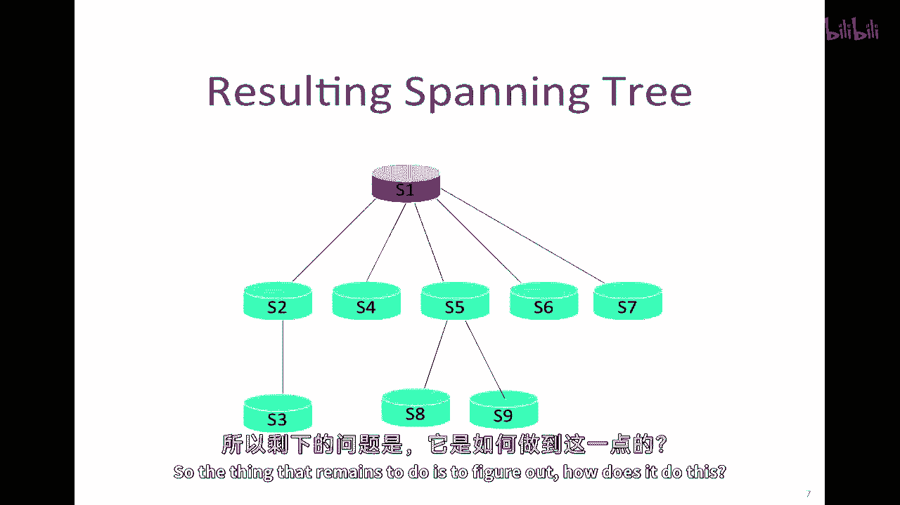
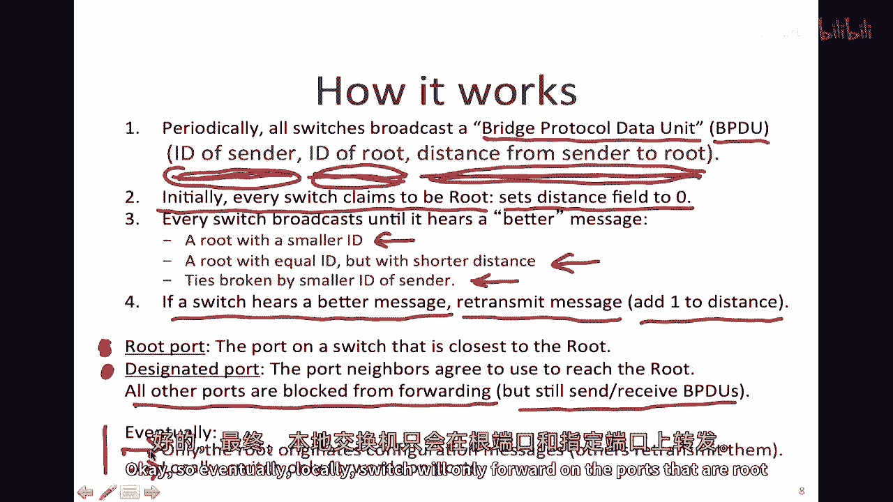
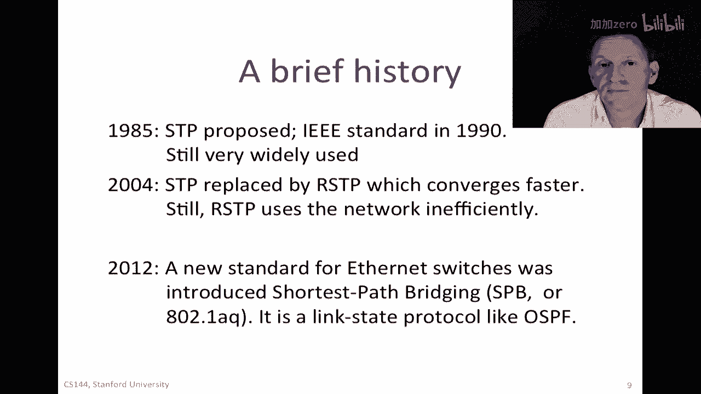

# 课程P91：生成树协议（STP）详解 🌳

在本节课中，我们将继续学习路由的相关知识，并深入探讨一种用于以太网交换机的关键技术——生成树协议。我们将了解它如何防止网络环路，以及其工作原理和历史发展。

上一节我们讨论了路由的基本概念，本节中我们来看看在以太网环境中，交换机是如何通过生成树协议来实现无环路的网络通信的。

## 生成树协议概述

我们通常认为路由在网络层（如IP层）运行。然而，从更广义的角度看，任何将数据包从源点沿着选定路径发送到目的地的机制都可以视为路由。因此，以太网交换机也需要决定如何将数据包转发到正确的目的地。

以太网交换机根据以太网地址转发数据包。它通过“学习”地址来知道如何转发，但在学习过程中，广播消息可能导致网络环路。由于以太网帧没有TTL字段，这些广播包可能会在网络中无限循环。生成树协议就是为了解决这个问题而发明的。

## 生成树协议的核心思想

生成树协议的核心思想是为整个网络构建一个树形拓扑结构，并只使用属于这个单一生成树的端口来转发数据包，从而消除所有环路。

以下是生成树协议工作的基本步骤：
1.  所有交换机通过交换特殊的控制消息（BPDU）来识别网络拓扑。
2.  协议会选举出一个唯一的根交换机。
3.  每个非根交换机确定其到达根交换机的最短路径端口（根端口）。
4.  在每个网段上，选举出一个负责向根方向转发数据的端口（指定端口）。
5.  所有既不是根端口也不是指定端口的端口将被阻塞，不转发用户数据，但依然可以收发BPDU以监控网络状态。

最终，整个网络形成一个无环的树状结构，所有数据都沿着这棵树进行转发。

## 生成树协议如何工作

让我们详细了解生成树协议的工作机制。

### 第一步：选举根交换机

协议开始时，每个交换机都认为自己是根交换机。它们会向外广播一种称为**桥协议数据单元**的控制消息。BPDU主要包含三个信息：
*   **发送者ID**：发送该BPDU的交换机的标识。
*   **根ID**：发送者当前认为的根交换机的标识。
*   **到根的距离**：发送者认为自己到根交换机的跳数。

初始时，每个交换机发出的BPDU中，根ID就是自己的ID，到根的距离为0。当交换机收到其他交换机发来的BPDU时，它会进行比较：
*   如果收到的BPDU中根ID更小，则采纳这个更优的根，并更新自己的信息。
*   如果根ID相同，但到根的距离更短，也会采纳更优的路径。

采纳更优信息后，交换机会将到根的距离加1，并用自己的ID作为发送者，重新广播这个BPDU。这个过程会持续进行，直到网络中所有交换机都认同同一个ID最小的交换机为根交换机。

### 第二步：确定端口角色

确定了根交换机后，每个交换机需要确定自己各个端口在生成树中的角色。

*   **根端口**：在每个非根交换机上，到达根交换机路径最短（成本最低）的那个端口被选为根端口。数据通过这个端口流向根交换机。
*   **指定端口**：在每个物理网段（链路）上，需要选出一个负责向根方向转发数据的端口。通常，离根交换机更近的那个交换机上的端口会成为该网段的指定端口。
*   **阻塞端口**：既不是根端口也不是指定端口的端口将被设置为阻塞状态。这些端口不转发用户数据帧，以防止环路，但它们仍然可以接收和发送BPDU，以便在网络拓扑变化时重新计算生成树。

最终，只有根端口和指定端口会转发数据流量，阻塞端口则处于闲置状态，从而打破了网络中所有可能的环路。

## 生成树协议的历史与发展

生成树协议最初由Radia Perlman于1985年发明。当时，以太网交换机被称为“网桥”，网络开始由大量网桥互联。为了避免广播风暴，需要一种快速可靠的方法构建无环路径，生成树协议应运而生。

1990年，IEEE将其标准化为**802.1D**协议。然而，传统的生成树协议收敛速度较慢，随着网络规模扩大，这个问题愈发突出。

因此，在2004年，IEEE引入了**快速生成树协议**（RSTP， 802.1w），显著提高了网络的收敛速度。

传统的STP和RSTP都为整个网络构建一棵树，数据包的路径可能并非源与目的地之间的最短路径，因为它们必须经过根交换机。

为了解决这个问题，IEEE在2012年引入了**最短路径桥接**协议（SPB， 802.1aq）。SPB使用了类似于OSPF等网络层路由协议中的链路状态算法（如Dijkstra算法），能够为每个源到每个目的地计算最短路径树，其理念更接近第三层的路由方式，并可能在将来得到更广泛的应用。

## 总结

本节课中，我们一起学习了生成树协议。我们了解到，STP通过在以太网二层构建一个无环的树状拓扑，有效防止了广播风暴和数据包无限循环的问题。其核心步骤包括选举根交换机、确定根端口和指定端口，并阻塞其他冗余端口。我们还回顾了STP从传统协议到快速生成树协议，再到最短路径桥接协议的发展历程，看到了网络技术如何不断演进以满足更高的效率和性能需求。理解生成树协议是掌握现代交换网络基础的重要一环。