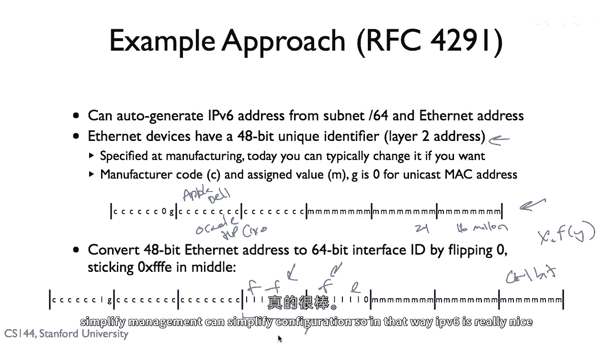

# 课程 P92：IPv6 详解 🚀

在本节课中，我们将学习互联网协议版本六，即 IPv6。我们将了解它为何被提出、其地址格式、分配方式以及如何自动生成地址。通过对比 IPv4，我们将理解 IPv6 如何解决地址枯竭问题，并简化网络配置。

---

## IPv6 的起源与必要性

上一节我们介绍了 IPv4 的基本概念。本节中我们来看看它的继任者——IPv6。

最初的 IPv4 地址设计是为了将多个不同的网络连接在一起，为私有网络提供全球唯一的标识符。然而，IPv4 的地址空间只有 32 位，大约能提供 2^32 个（约 43 亿）地址。在互联网早期只有几十个节点时，这看起来足够巨大，但现在已成为一个限制因素。

在任何编号方案中，实际使用率永远不会达到 100%。IPv4 地址的利用率大约只有 35%。挑战在于，如果没有 IP 地址，设备就无法在互联网上进行通信。发送 IP 数据包需要源地址和目的地址。

意识到 IPv4 地址可能耗尽，加上市场需求的推动，在 1994 年，一项针对新一代互联网协议的改进工作开始了，这就是 IPv6。IPv6 的基本协议在 1998 年以 RFC 2460 发布。此后经历了一段停滞期，但在 2003 年至 2006 年间，随着人们对 IPv4 网络挑战的理解加深，对 IPv6 的兴趣重新增加。

今天，IETF 内部以及多个政府（尤其是在连接性增长显著的国家和地区，如中国）都在大力推动 IPv6 的部署。IPv6 已在全球互联网上广泛使用。

---

## IPv6 地址格式

了解了 IPv6 的必要性后，本节我们来看看它的地址具体是什么样子。

IPv6 地址不再局限于 32 位，而是拥有 **128 位** 的巨大地址空间。地址数量约为 **2^128** 个，这是一个天文数字（约 3.4 × 10^38）。理论上，这足以给地球表面每平方英寸分配超过 6.5 × 10^23 个地址。

一个 IPv6 地址被分为两部分：
*   **子网前缀**：长度为 `n` 位，用于标识网络。
*   **接口 ID**：长度为 `128 - n` 位，用于标识该子网中的特定设备。

这类似于 CIDR 表示法，其中子网掩码描述了网络标识符。

由于 128 位地址很长，且常包含大段的零，因此其书写方式与 IPv4 的“点分十进制”不同。IPv6 地址采用**十六进制**书写，形式为八个由冒号分隔的 16 位块（即四个十六进制数字）。

例如，一个完整的 IPv6 地址可能写作：`2001:0db8:85a3:0000:0000:8a2e:0370:7334`。

为了简化，可以省略每个块中前导的零，并且**一段连续的零块可以用双冒号 `::` 表示一次**。因此，上述地址可以简写为：`2001:db8:85a3::8a2e:370:7334`。

地址后面通常会跟一个斜杠和数字，表示前缀长度，例如 `/64`，说明前 64 位是子网前缀。

如果你想在 Web 浏览器的 URL 中使用 IPv6 地址，需要将其放在**方括号 `[]`** 内，例如：`http://[2001:db8::1]:80`。

此外，有一种特殊的 IPv6 地址格式用于兼容 IPv4，其前 96 位是固定的，后 32 位嵌入一个 IPv4 地址，例如：`::ffff:192.0.2.1`。

---

## IPv6 地址的分配

我们已经知道了 IPv6 地址的格式，那么这些地址是如何分配给组织或个人的呢？

回顾 IPv4，IANA 可以将包含 1600 万个地址的 `/8` 地址块分配给公司或组织。IPv6 的分配机制经历了多次迭代，基于经验得到了优化。

最初的建议（如 RFC 3177）指出，通常给终端站点分配 `/48` 的前缀，有时给 `/64`，极少情况下给单个设备分配 `/128`。经过多年实践，RFC 6177 更新了建议：分配的最小单位应该是 `/64`，而不是 `/128`。通常分配 `/56` 或 `/48` 前缀，这为绝大多数组织提供了远超实际需要的地址空间。

当向区域互联网注册机构（RIR）申请地址块时，机构会根据申请者的实际需求决定分配的大小（例如 `/56`， `/48` 等）。

---

## 自动配置 IPv6 地址

IPv6 庞大的地址空间不仅解决了数量问题，还极大地简化了网络配置。本节我们看看设备如何自动获取 IPv6 地址。

在 IPv4 中，我们通常依赖 DHCP 来请求一个地址。而在 IPv6 中，如果已知一个 64 位的子网前缀，设备可以**自动生成**一个全球唯一的 IPv6 地址，而无需中央服务器协调。

这主要利用了设备的**以太网 MAC 地址**。以太网 MAC 地址是 48 位的全球唯一硬件标识符，格式通常如：`00:1A:2B:3C:4D:5E`。

IPv6 使用一种称为 **EUI-64** 的转换方法，将 48 位的 MAC 地址转换为 64 位的接口 ID。转换过程如下：
1.  将 MAC 地址从中间分开，插入固定的 `FF-FE`。
2.  将首字节的第 7 位（全局/本地位）取反（即如果是 0 则置 1，如果是 1 则置 0）。

**转换公式（伪代码）示例：**
```python
# 假设 MAC 地址为 00:1A:2B:3C:4D:5E
mac = “00:1A:2B:3C:4D:5E”
# 1. 插入 FF-FE
modified = mac[:6] + “FF-FE” + mac[6:]
# 结果：00:1A:2B:FF-FE:3C:4D:5E
# 2. 将第一个字节的二进制第二位取反 (00 -> 02)
# 最终接口ID：021A:2BFF:FE3C:4D5E
```

然后，将这个 64 位的接口 ID 与已知的 64 位子网前缀组合，就构成了一个完整的 128 位 IPv6 地址：`[子网前缀]:[接口ID]`。

这种方法在 **RFC 4291** 中定义。它赋予了地址分配极大的灵活性，并简化了网络管理，因为设备可以“即插即用”，无需手动配置或运行 DHCP 即可获得一个可路由的地址。

---

## 总结

本节课中，我们一起学习了 IPv6 的核心知识。

我们首先了解了 IPv6 诞生的背景，即为了解决 IPv4 地址枯竭的问题。接着，我们深入探讨了 IPv6 的 **128 位地址格式**、其十六进制加冒号的书写规范以及简写规则。然后，我们学习了 IPv6 地址的分配策略，通常以 `/48` 或 `/56` 为单位分配给组织。最后，我们掌握了 IPv6 的一大优势——**无状态地址自动配置（SLAAC）**，它利用 EUI-64 算法将设备的 MAC 地址转换为接口 ID，从而自动生成全局唯一的 IPv6 地址，极大地简化了网络部署和管理。

总而言之，IPv6 凭借其近乎无限的地址空间和更简化的配置机制，正在成为支撑未来互联网发展的基石。

---




