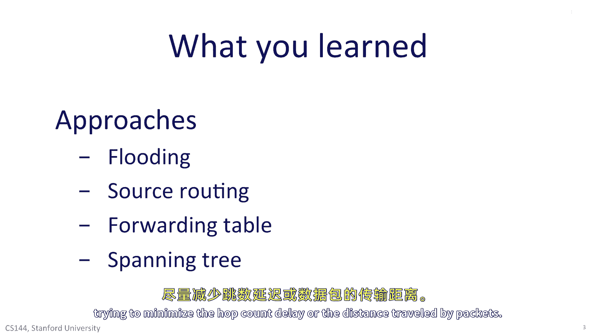

# 计算机网络课程 P93：路由基础 🧭

在本节课中，我们将学习数据包在网络中如何被路由到目的地。我们将探讨单播数据包路由的四种基本方法，并深入了解构建路由表的核心算法。

---

## 单播数据包路由的四种方法

上一节我们介绍了课程目标，本节中我们来看看路由器将数据包从源主机发送到目的主机的四种基本策略。

### 1. 广播

路由器可以将数据包广播到网络的所有链路。数据包到达路由器时，会被复制到除接收接口外的所有接口。这确保了广播数据包最终会遍历网络的所有链路，从而能够到达网络中的任何主机。

这种方法显然非常低效且成本高昂，并且需要结合防止数据包无限循环的机制。广播通常在不确定时使用，例如当网络拓扑发生变化，且没有其他方法确定能到达所有主机时。一个实例是OSPF路由器在交换链路状态信息时，会在OSPF域内广播链路状态数据包，从而使每个路由器都能知晓拓扑变化。

### 2. 源路由

我们可以在源路由中使用源路由。源主机将包含一系列跳点（即路径）的目的地列表放入每个数据包的头部，数据包将按照这个列表在网络中传输。

这要求源主机知道整个网络拓扑。源路由意味着我们不需要在网络中交换路由表信息，路由器也不需要维护转发表。可以说，源路由非常符合“端到端原则”，即不应让网络承担知晓所有路径的责任。

但在实践中，源路由很少使用，主要原因在于安全性。网络管理员不喜欢源路由，因为它要求他们暴露自己网络的完整拓扑，以便源主机能向任何地方发送数据包。互联网设计者认为，在路由器中维护转发表是一项值得的优化，可以避免需要将整个最新拓扑信息分发给所有终端主机。

### 3. 使用转发表

路由器可以包含转发表，这正是当今普遍的做法。路由器不依赖源提供路由信息，而是自行维护转发表。转发表包含目的地址，并指示数据包应从路由器的哪个接口转发出去，以便更接近目的地一步。

当今所有的以太网交换机和互联网路由器都使用转发表。路由算法的核心任务就是填充这些转发表。

### 4. 生成树路由

最后，你学习了无源路由算法通常如何构建一棵以目的地为根的生成树。它是一棵树（避免环路），并且是生成树（为所有源主机提供到达给定目的地的方法）。

互联网上使用的路由算法（如OSPF和RIP）通过填充转发表，在网络中创建生成树。我们通常构建的是**最小成本生成树**，试图最小化跳数、延迟或数据包传输距离。

---

## 构建转发表的核心算法

上一节我们了解了路由的基本方法，本节中我们来看看两种广泛用于在路由器中构建转发表的核心算法。

以下是两种核心的路由算法：

1.  **贝尔曼-福特算法（距离向量算法）**
    *   每个路由器构建一个从自身到网络中所有其他路由器的**距离向量**。
    *   在连续的步骤中，路由器交换它们的向量，以找到每个目的地的最近邻居。
    *   经过有限次迭代后，算法收敛，每个路由器都得到一组转发表，指明如何通过最短路径将数据包路由到每个目的地。
    *   该算法是**RIP（路由信息协议）** 的基础。RIP的好处是算法是分布式的，路由器共同构建完整的转发表，这在互联网早期路由器计算能力有限时很重要。但RIP存在“计数到无穷”等问题，导致坏消息传播缓慢，现已大部分被OSPF取代。

2.  **最短路径优先算法**
    *   该算法假设每个路由器都有计算能力，在获得完整网络拓扑后，可以自行构建转发表。
    *   路由器通过交换**链路状态**信息（描述哪些链路存在）来学习拓扑。
    *   一旦获得拓扑，每个路由器便开始计算自己的转发表，以便能到达网络中的其他主机。
    *   该算法因其简单和快速而具有优势，是**OSPF**协议的基础。OSPF在今天的企业和校园网中广泛使用。

---

## 路由的其他重要方面

除了RIP和OSPF，我们还需要了解路由的其他四个关键方面。

### 分层路由

互联网使用**分层路由**将路由问题分解为更易管理的部分。在自治系统内部，使用域内路由算法（如OSPF）路由数据包。自治系统之间则使用**BGP（边界网关协议）** 交换路由信息。

例如，斯坦福大学在校园内使用OSPF，同时使用BGP与互联网上的其他自治系统交换信息。BGP是当今互联网上自治系统间交换路由信息的唯一标准方式。每个AS向其邻居通告其可达的前缀，数据包便能通过一系列AS路径到达互联网上的任何目的地。

### 多播路由

**多播路由**是网络中的一种优化，旨在避免源主机需要向一组目的地多次发送相同的数据包。在90年代，多播非常流行，被认为将用于互联网电视等应用。尽管存在许多多播路由协议，但它们今天并未被广泛使用。这是因为大多数应用（如视频流）更倾向于按需提供单播连接，而且观看同一内容的人数通常不足以证明在网络层进行优化的价值。

### 生成树协议

最后，你学习了**生成树协议**。它并非真正的互联网路由协议，而是以太网网络用于创建无环路拓扑的机制。生成树协议允许一组交换机构建一个单一的生成树，从而避免广播风暴。

---

## 总结

本节课中，我们一起学习了数据包路由的基础知识。我们探讨了单播路由的四种方法：广播、源路由、使用转发表和生成树路由。我们深入研究了两种构建转发表的核心算法：贝尔曼-福特算法和最短路径优先算法，并了解了它们如何应用于RIP和OSPF协议。此外，我们还简要介绍了分层路由（BGP）、多播路由以及生成树协议，从而对网络路由有了一个全面的初步认识。