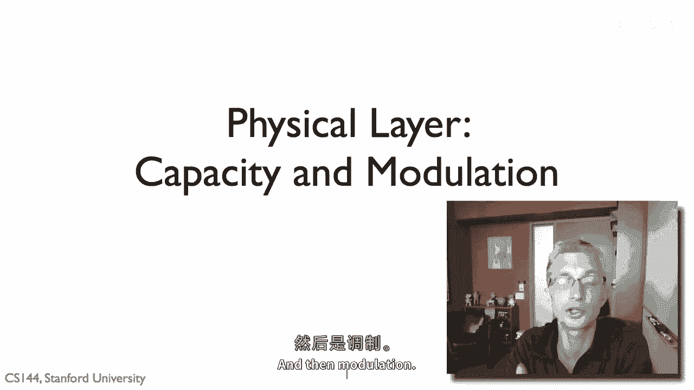
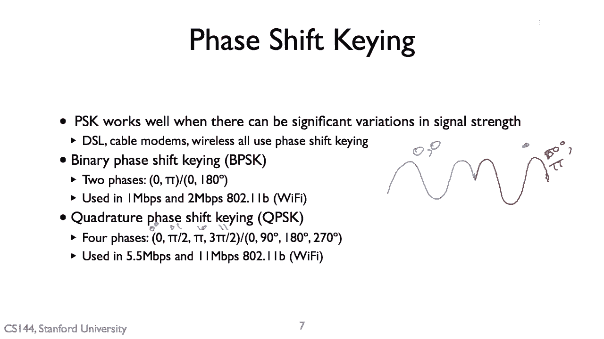
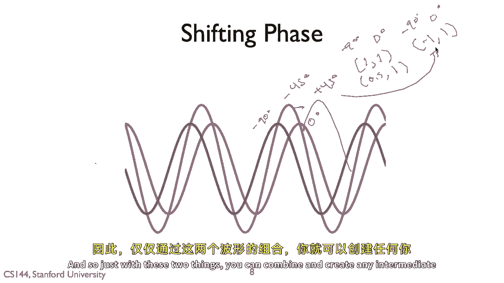
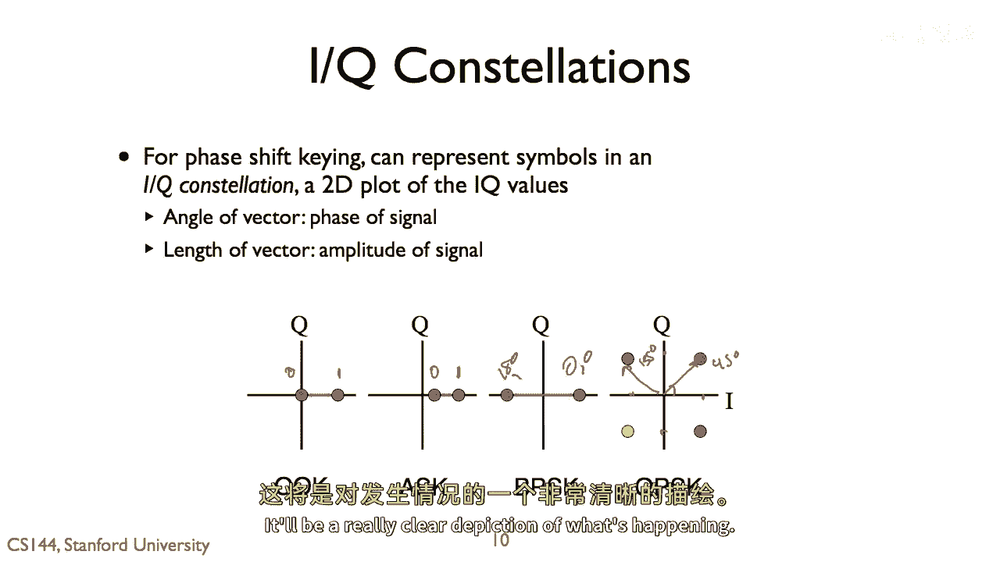
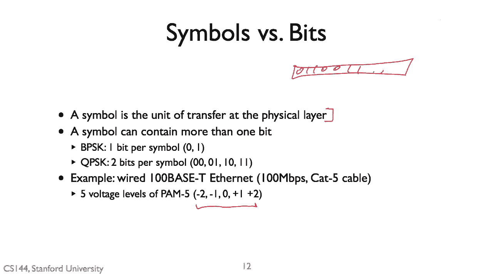
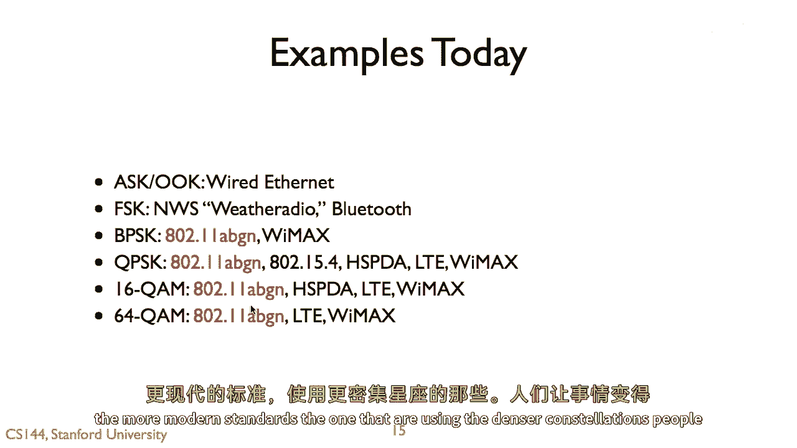
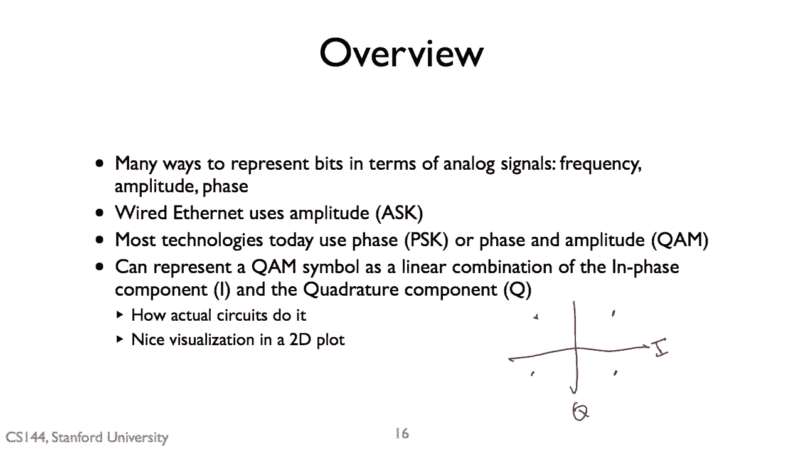

# 计算机网络课程 P95：物理层与链路层原理 - 香农容量与调制 📡

在本节课中，我们将学习物理层的两个核心概念：**信道容量**和**调制技术**。我们将了解如何计算一个物理介质能传输数据的理论极限，以及如何将数字比特转换为可以在介质上传输的模拟信号。

---

## 信道容量与香农极限 📈

上一节我们介绍了物理层的基本角色。本节中，我们来看看一个通信信道传输数据能力的理论极限。

一个给定的通信信道在信息传输上存在一个理论极限。这个“信道”可以指任何传输介质，例如电线、无线电磁波或声波。这个极限被称为**香农极限**，由克劳德·香农确立。

对于一个通信信道，在特定（通常成立的）假设下，其**信道容量**（即每秒可以发送的比特数）可以通过一个公式很好地近似计算：

**C = B * log₂(1 + S/N)**

其中：
*   **C** 代表信道容量，单位是比特每秒 (bps)。
*   **B** 代表通信的**带宽**，即可用频率范围的大小。
*   **S/N** 代表**信噪比**，即信号强度 (S) 与噪声强度 (N) 的比值。

这个公式表明，我们能发送的数据量与带宽成正比，并受信噪比影响。提高信噪比（增强信号或降低噪声）可以提升容量，但这在工程上可能代价高昂。同样，构建极高带宽的硬件也非常困难，这就是为什么我们无法轻易实现任意高速通信系统的原因。

---

## 模拟信号的基本属性 🌊

理解了信道容量的概念后，我们来看看信息在物理层是如何被表示的。这通常通过模拟信号（如正弦波）来完成。

当我们谈论正弦波时，有几个关键属性需要关心：
*   **振幅**：表示信号的强度或“音量”。
*   **波长**：一个完整波的周期长度。波长 (λ) 和频率 (f) 通过波速 (c，如光速) 关联：**c = λ * f**。
*   **频率**：每秒完成的波周期数，单位是赫兹 (Hz)。我们通常使用一个频率范围，这个范围的大小就是**带宽**。
*   **相位**：波形在特定时间点的位置。

在通信中，我们通过改变波的振幅、频率或相位来编码信息。

---

## 调制技术：将比特转换为信号 🔄

我们已经知道信号的基本属性，本节中我们来看看如何通过**调制**技术，利用这些属性来表示数据比特。

调制是将数据比特转换为适合在信道中传输的波形信号的过程。以下是几种基本的调制方式：

以下是几种基本的数字调制技术：

1.  **幅移键控 (ASK)**：通过改变信号的振幅来表示比特。
    *   例如：小振幅代表比特 `0`，大振幅代表比特 `1`。
    *   代码示例（概念）：`if bit == 0: send(signal_low_amplitude); else: send(signal_high_amplitude)`

2.  **频移键控 (FSK)**：通过改变信号的频率来表示比特。
    *   例如：一个频率代表比特 `0`，另一个频率代表比特 `1`。

3.  **相移键控 (PSK)**：通过改变信号的相位来表示比特。
    *   例如：0度相位代表比特 `0`，180度相位代表比特 `1`（这称为二进制PSK，BPSK）。

ASK 因其简单性在有线网络（如以太网）中广泛使用。PSK 则在信号强度可能不稳定的环境中（如无线网络、DSL）更具优势，因为相位变化比幅度变化更易于检测。

---

## 正交调制与IQ表示法 📐

单一的调制方式有其局限。为了在单个符号中传输更多比特，现代通信系统常结合使用相位和幅度调制，这引出了**正交调制**的概念。

任何中间相位的信号，都可以由两个相位相差90度（即正交）的基准信号（称为I路和Q路）的线性组合来生成。

**信号 = I * cos(ωt) + Q * sin(ωt)**

其中，I 和 Q 是系数。通过调整 I 和 Q 的值，我们可以合成出具有任意幅度和相位的信号。这种**IQ调制**方法在硬件上非常容易实现。

这种表示法的巨大价值在于，它可以用一个二维图形——**IQ星座图**——来直观地表示信号。
*   图中一个点的**角度**代表信号的相位。
*   点到原点的**距离**代表信号的幅度。

例如，BPSK在图上就是水平轴上的两个点（+1,0）和（-1,0）。QPSK（四相PSK，每符号2比特）则是四个点，通常位于坐标轴上。

---

## 符号与比特：物理层的传输单位 ⚙️

了解了信号如何表示后，我们需要明确物理层实际传输的数据单元。

在链路层，我们处理由比特组成的帧。但在物理层，传输的基本单位是**符号**。一个符号可以对应一个或多个比特，这取决于调制方式的复杂程度。
*   BPSK：1 比特/符号
*   QPSK：2 比特/符号
*   16-QAM（16点正交幅度调制）：4 比特/符号
*   256-QAM：8 比特/符号

因此，物理层的工作是将来自上层的比特流，转换（映射）为一系列的符号进行发送。使用更密集的星座图（如256-QAM对比QPSK），可以在同样的带宽和时间内传输更多数据，但对信噪比的要求也更高。

---

## 现代通信中的调制技术应用 📶

最后，我们来看看这些调制技术在现实系统中的应用。

当今主要的通信系统广泛使用基于PSK的调制，尤其是结合了幅度和相位调制的**正交幅度调制 (QAM)**。
*   **BPSK/QPSK**：用于Wi-Fi（802.11 a/b/g/n）、蓝牙低功耗等。
*   **16-QAM / 64-QAM / 256-QAM**：用于高速Wi-Fi（802.11n/ac/ax）、4G LTE、5G等移动通信标准，以实现更高的数据速率。

有线系统（如以太网）则倾向于使用多电平的幅度调制（如PAM-5，PAM-16）。

---

## 总结 🎯

本节课中我们一起学习了物理层的核心原理：
1.  **香农容量公式** `C = B log₂(1+S/N)` 定义了信道传输数据的理论极限。
2.  信息通过改变模拟信号的**振幅、频率或相位**来进行编码，这个过程称为**调制**。
3.  **ASK、FSK、PSK** 是基本的数字调制方式。
4.  现代系统普遍采用**正交调制 (QAM)**，它可以用 **IQ星座图** 直观表示，并能高效地在硬件中实现。
5.  物理层以**符号**为单位传输数据，一个符号可承载多个比特，更高的调制阶数能提升速率，但也需要更优质的信道条件。

理解这些基础原理，是学习后续更具体网络技术（如以太网、Wi-Fi）的重要基石。