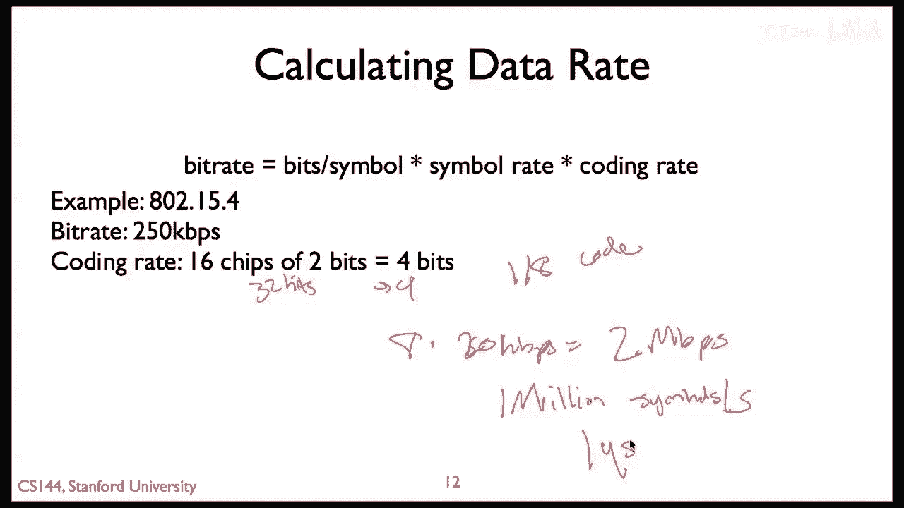

# 📡 课程 P96：物理层与链路层原理 - 位错误

在本节课中，我们将要学习物理层通信中的核心概念——位错误。我们将探讨噪声如何影响数据传输，以及如何通过编码技术引入冗余来对抗位错误，从而更有效地利用信道容量。

## 📊 香农极限与信道容量

通信信道的理论容量由香农公式决定：

**C = B * log₂(1 + S/N)**

其中：
*   **C** 代表信道容量（比特/秒）
*   **B** 代表信道带宽（赫兹）
*   **S/N** 代表信噪比

这个公式表明，在实际应用中，可用的数据率受限于信噪比。信号越强或电路噪声越低，就能实现更快的数据传输。这是一个理论极限，它告诉我们无法做得更好，但并未指明如何达到这个极限。如今，一些系统正在接近这个极限。

通常，系统带宽是固定的（例如，Wi-Fi使用的未授权频谱受法规限制）。因此，系统通常致力于提高信噪比。信噪比提高后，可以通过缩短符号传输时间，或在每个符号中承载更多比特（即使用更密集的调制星座图）来提升数据率。

## 🎯 噪声如何导致位错误

上一节我们介绍了信道容量的理论，本节中我们来看看噪声在实际中如何干扰信号。

在理想的无噪声系统中，接收到的信号会精确地落在调制星座图的某个点上。然而，现实中的硬件电路和环境总会引入噪声。

*   在**低噪声环境**（高信噪比）下，接收到的信号点会在理想点周围轻微波动，但仍能清晰识别。
*   在**高噪声环境**（低信噪比）下，噪声可能导致接收到的信号具有完全不同的相位和幅度，从而可能被误判为星座图中的另一个点。

例如，本应被解读为比特序列 `0000` 的符号，可能因为噪声被误判为 `0011` 或 `1010`。这就是**位错误**的引入过程：当信噪比低到一定程度，某些符号就会被错误地记录或解读。

可以想象，如果一个星座图中只有两个距离很远的点（如BPSK），那么较大的噪声也可能不会导致误判。但对于一个拥有16个密集点的星座图（如16-QAM），同样的噪声水平就足以引入位错误。

因此，根据给定的调制方案和信噪比，可以通过理论分析计算出预期的**位错误率**。位错误率可以变得非常低，但由于噪声的随机性，它永远不会为零。

## 🔄 编码：对抗位错误的策略

由于存在非零的位错误概率，直接将数据包中的比特映射到调制符号往往不是最高效的方式。为了应对罕见的噪声峰值，系统会过度保守地选择调制方案，导致实际运行速率远低于香农极限。

因此，在实际的物理层处理中，我们会在发送数据前引入**冗余**，这个过程称为**信道编码**。

以下是其工作流程：
1.  原始数据（例如“Hello”的ASCII码）组成数据包。
2.  通过**错误纠正码**对数据包进行编码，生成一个更长的比特序列。例如，48位的原始数据可能被编码为60位，增加了12位冗余。
3.  编码后的比特序列再被映射到物理层的调制符号进行发送。
4.  在接收端，即使传输过程中发生了几个比特的错误，利用编码引入的冗余，接收器也能恢复出原始的48位数据。

编码不是物理层特有的想法，但它是在物理层提升链路可靠性和有效吞吐量的关键方法。尽管编码使发送的比特变长了，但由于它允许我们使用更高阶、更高效的调制方案来对抗错误，系统的整体吞吐量在理论和实践中都得到了提升。

衡量编码效率的一个常用术语是**编码增益**（或码率），它是**链路层比特数**与**物理层比特数**的比率。
*   一个“1/2码率”的编码意味着：链路层长度为 `n` 的数据包，在物理层被转换为长度为 `2n` 的序列。
*   一个“3/4码率”的编码则意味着每3个链路层比特，对应4个物理层比特。

## 📶 实例分析：802.15.4与802.11n

让我们通过两个具体标准来看看编码和调制是如何应用的。

**IEEE 802.15.4 (ZigBee) 示例**
802.15.4使用一种非常简单的编码：它将每**4个**链路层比特，映射到**32个**物理层“码片”。这些码片再通过QPSK（每个符号2比特）调制发送出去。
*   这相当于一个 **1/8 的码率**（4 / 32）。
*   如果链路层数据率是250 kbps，那么物理层的符号率计算如下：由于每个QPSK符号承载2比特，物理层需要支持 `250 kbps * 8 = 2 Mbps` 的速率，即每秒传输100万个符号。

**IEEE 802.11n (Wi-Fi) 示例**
更现代的802.11n标准提供了丰富的调制与编码方案组合，以适应不同的信噪比环境。

以下是其部分方案：
*   **调制方式**：从抗噪性强的BPSK（每符号1比特），到高效的64-QAM（每符号6比特）。
*   **编码码率**：从冗余度高的1/2码率，到效率更高的5/6码率。
*   **数据率**：不同的组合产生不同的实际数据率。例如，使用64-QAM调制和5/6码率，在40MHz信道下，速率可达150Mbps。使用更宽的信道（40MHz vs 20MHz）能大致实现吞吐量翻倍。

## 🎓 课程总结

本节课中我们一起学习了物理层通信中的位错误及其应对策略。

我们了解到：
1.  信道容量受**香农公式**限制，信噪比是关键因素。
2.  **噪声**会导致接收端误判调制符号，从而产生**位错误**。位错误率可计算，但永不为零。
3.  直接进行比特到符号的一对一映射效率低下。通过**信道编码**引入冗余，虽然增加了发送的比特数，但能纠正错误，从而允许使用更高阶的调制，最终提升**整体吞吐量**和**编码增益**。
4.  实际标准（如802.15.4和802.11n）会根据信道条件，动态选择**调制方式**（如QPSK， 16-QAM）和**编码码率**的最佳组合，以在可靠性和效率之间取得平衡。

核心在于，物理层通过将链路层的“比特”转换为物理“码片”或“符号”来对抗真实世界的噪声。更密集的调制能带来更高吞吐量，但也更易受噪声影响；而编码则提供了对抗噪声、逼近信道容量的有力工具。