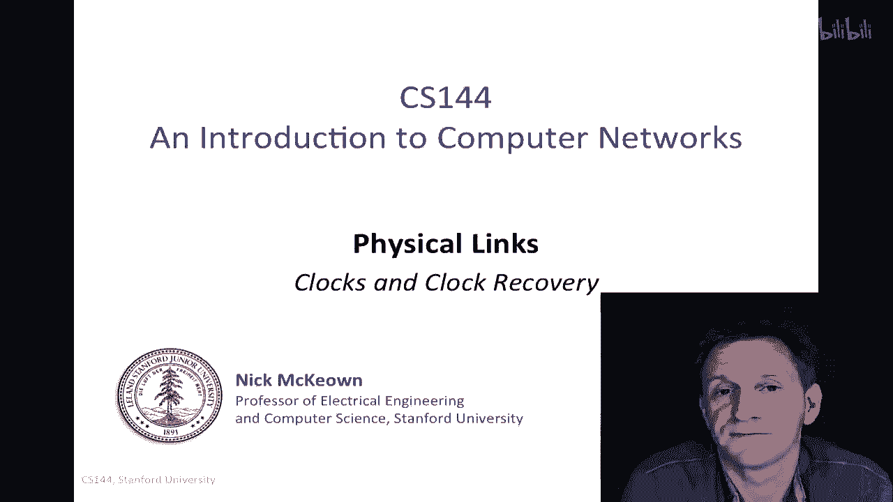
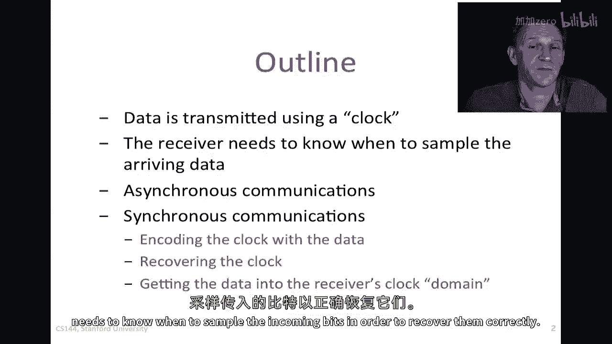
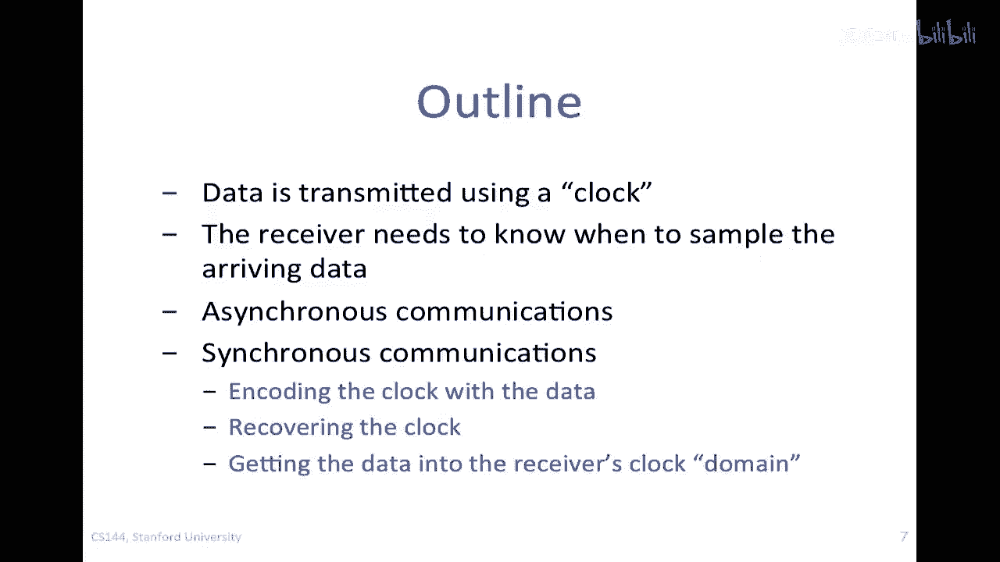
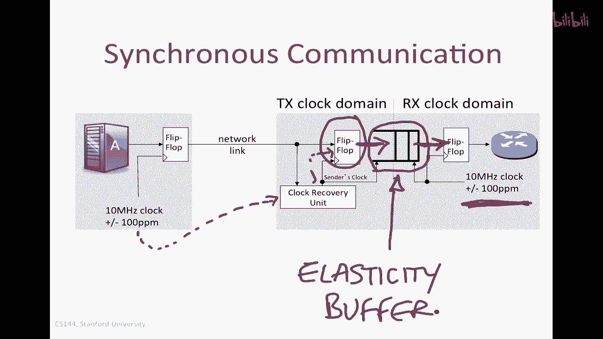
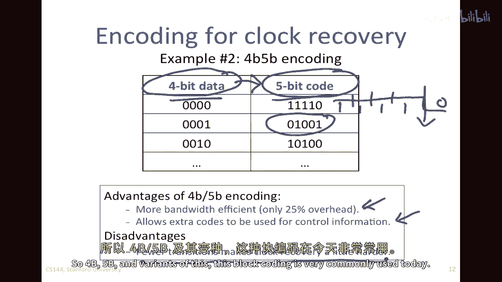
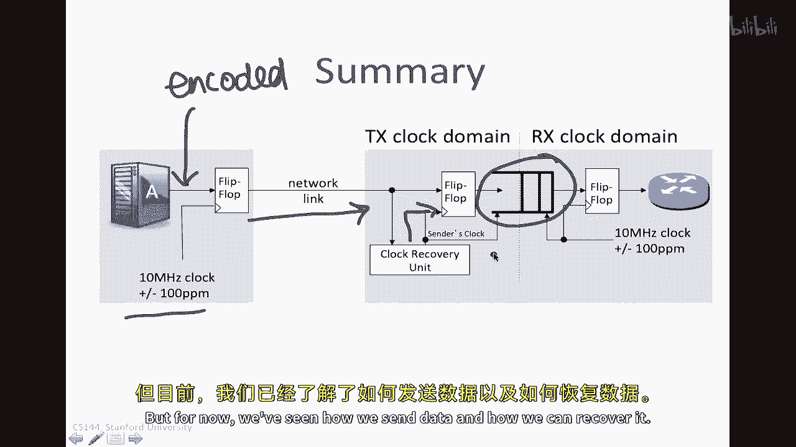

# P97：p96 7-3 Physical and Link - Principles clocks - 加加zero - BV1qotgeXE8D

在下两个视频中，我将向您介绍时钟和时钟恢复，每当我们在链路上发送数据时，例如，以太网链路，我们通常假设数据速率像十兆比特每秒，或吉比特每秒，当我们以十兆比特每秒发送时，我们假设每个比特持续一百纳秒。

或每秒十百万个它们，在吉比特每秒时，我们假设每个比特持续纳秒，因此，必须有一个时钟的概念，在某个地方，发送者使用的时钟，用于在第一次发送那些比特时，接收者也需要知道这个时钟，以便能够正确地解码它们。

问题是，没有通用的时钟参考，这在两个地方是相同的，所以使用的时钟，或发送者使用的频率，并不是精确地知道给接收者，它必须找出来，以便它可以找出一个比特的结束和另一个比特的开始，所以在这个视频中。

我将描述一般问题，我们如何用数据编码时钟信息，使接收者的生活更容易，使接收者的生活更容易，然后，接收者如何提取时钟，并将其转换为自己的时钟域，自己的时钟频率，然后使用它并操纵它，如接收者所希望的。

所以，我们即将看到的概要，我将描述如何使用时钟传输数据，接收者需要了解何时采样输入位。

以便正确地恢复它们，我们将在称为异步通信的上下文中看到它，对于短消息，但更常见的情况是同步通信，那是在以太网和类似的系统中使用的，其中，数据与时钟一起编码，使接收者在远端更容易恢复时钟。

然后将其转换为自己的时钟域，当我们发送数据时，我们总是使用时钟发送，因为这是因为我们想要它有特定的频率，例如，在这里，我显示了一个服务器正在发送数据，我 sort of 放大了处理过程的最后阶段。

就在数据即将发送到电线之前，这是翻转 flop，这就是仅仅根据出站时钟的时间来定时数据，这里为10兆赫兹，换句话说，这个时钟的周期为100纳秒，所以。

这是一个我们可能会用于以10兆比特/秒发送数据的时钟，当我们想在另一端接收那个数据时，理想情况下，从这里应该有一根额外的线，它可以用于在另一端时钟数据，这样，这个数据就会作为输入来，然后。

它会送到另一端的接收器，这需要两根线，我们必须同时发送数据和时钟，在大多数情况下，我们负担不起这样做，这将更有效，如果我们只发送其中一个，在这里，我们将有，如果我们这样做，我们将有数据，它可以是序列。

零一，零一一，然后零零，在这里，只有我们将使用的时钟，以便在一端编码并在另一端解码，我们将考虑许多不同的例子，其中时钟没有发送，没有特定的或分离的时钟线，实际上，这就是在实际中做的，没有单独发送的时钟。

一切都必须从信号本身确定，为了说明问题，让我从一个例子开始，想象我们有一个时钟在这里，这是传输器使用的时钟，以便将数据钟出到线上，好的，所以我在这里放了指南，只是为了帮助我画那个，所以这就是tx时钟。

对吧，那就是tx cl k，被发送的数据，让我们假设在这个例子中，嗯，我们将，嗯，每当时钟向下过渡时，我们将更改在线上放置的数据，例如，嗯，假设它最初处于空闲状态，然后它转向了一。

然后它转向了一个一在这里，然后它继续作为一个一在数据中到这里，然后我们想要发送一个零然后一个和如此，所以被发送的数据是零一零一零，嗯，然后我们在这里再次发送一个一，并在接收器处如此重复。

让我们看看接收器的时钟，让我们假设接收器的时钟名义上以相同的频率运行，尽管我们没有完全准确，因为我们在本地生成它，我们使用了不同的振荡器，例如，为了生成那个，他们被设计成名义上是相同的。

但它们非常轻微地不同，因此在这种情况下，我们将假设这个接收器时钟正在稍微慢一些，所以它可能在开始处有相同的过渡，但由于它运行稍微慢一些，它的第一个过渡比这个稍微晚一些，因此它的下一个过渡又稍微晚一些。

它会越来越晚，然后它会越来越晚，最终，只是因为它运行稍微慢一些，它将开始落后，你可以看到，当我们到达这里时，它的上升过渡大约与传输时钟的下降过渡相同时间，所以它大约落后半相位，我在这里夸大了它。

在实际应用中，它们会比这近得多，但我只是在夸大以显示正在发生的事情，现在当我们发送数据时，数据的更改在向下过渡时进行，而且，对于接收器来说，尝试识别比特的中间部分并采样一个比特在中间部分似乎很有道理。

所以这里，这里是这里，这里是这里，如果它可以，因为离边缘最远，所以数据将最稳定，所以我们正在寻找在中间采样，例如，如果我们从接收器开始在这里采样，我们将相当准确地检测到一个零，所以我们将看到它为一个零。

一切都很好，然后我们将再次采样它，在这里，我们比我们希望的稍晚开始采样，但我们仍然将可靠地看到它是一个一，所以一切都很好，当我们在这里采样它时，我们将在这里采样，我们正在接近那个边缘。

让我们给自己一些好处的怀疑，并说那只在那里被我们抓住了，等到我们过来这里再次采样时，我们实际上在这里采样，并且我们将完全错过这个零，所以当我们在这里采样时，我们将再次看到一个一，所以这是中间发生的零。

这是发送到这里的零，我们没有采样，在那个接收器的时间段里，没有出现向上的箭头，所以我们没有看到它，我们完全错过了它，所以显然我们的检测能力将取决于几件事，一个是这些时钟有多不同，我在这里夸大了差异。

实际上它们，它们非常非常相似，只在千分之一的范围内，实际上我们通常使用，我们通常使用百万分之一的单位，百万分之一的ppm，所以例如，如果我们说一个钟表在正负一百百万分之一的范围内，我们意味着它在正负。

嗯，那就是零点，百分之一，这是因为那是十的负，嗯，十的负四次方，那么这将是一个典型的值，实际上，你可以得到精度达到五十部分百万的钟，但如果我们处理足够的位，所以如果它是一百部分百万。

我们需要处理大约十万位次，实际上，我们将在任一方向偏移一个完整的位，我们并不知道接收器是否比传输器运行得更快或更慢，所以我们不知道我们是否会无意中加倍采样一个位，否则我们可能会完全错过一点，一般来说。

尽管它们以相对恒定的频率出现，换句话说，如果一个更快，它很可能在接下来的一段时间内保持更快，相当一段时间，它们相对于彼此漂移并不很快，它们可能只有一种固定的偏移。

所以这里我们看到的问题就是我们实际上错误地解码了数据，因为我们现在没有钟，在某些情况下我们嗯，我们可以在没有明确理解时钟是什么的情况下进行通信，或者能够恢复它，嗯，在所谓的异步通信中。

尽管我们不用这个在以太网这样的网络上，它被电视红外遥控器这样的东西使用，或者是短消息，它也用在用于连接计算机的串行总线上，尽管这不再被广泛使用，所以对于非常短的消息。

只要我们知道名义上发送和接收的时钟大约是一样的，我们可以，我们可以使这工作，所以，例如，想象一下我们有一个非常短的包在这里，它只包含开始的七个位，它有一个这个大的位开始，看起来它有更大的幅度，嗯。

只是为了告诉我们这是包的开始，在末尾有一个，告诉我们这是包的结束，所以开始位和停止位，然后我们有序列零一零一零一零零，这就是包内部的数据，所以嗯，发送时钟是用于最初编码这个的，那是，嗯。

那是正确地检测到每个位的中间，零一零在中间所有的位上，因为那是最初用于传输的，在这里可能会有接收时钟，接收时钟在这里比发送时钟慢一点，你可以看到这里有一个小间隙，并且这个间隙随着我们接近包的末尾而增长。

只要还没有到达包的末尾，接收器仍然可以正确地解码位，在这里它可以正确地解码那个零，那么我们就安全了，所以这一切是如何成功的，在开始位之后，接收器说，我将在半个位时间后开始采样，所以它看到了开始位。

它看到了这里下降的边，它看到了这个，然后它等待直到采样，然后它正确地采样这里为零，然后它等待另一个时钟周期，然后它再次采样，它会正确地采样那个一个，依此类推，一直到最后，但是，你可以看到。

如果数据包因为接收时钟的漂移而更长，它正在，它正在越来越晚，越来越晚，最终它会稍微错过一点，只要我们能确保包不得太长，换句话说，我们控制p，并且如果我们知道这两个时钟之间的容忍度，它们之间的差异。

然后知道这两个数字，我们就可以确保我们可以可靠地解码包所以对于短包，这在实践中工作得很好，尽管这对于长包并不很好工作，因为我们希望p的值在数千位或数百万位之间，并且我们必须使接收时钟的容差非常紧。

以至于在真实系统中这样做不实际，所以异步通信有时用于短包链接，例如，红外遥控或串行链接，或者，例如，那些直接连接到本地打印机的，好的，所以我们看到了如何使用时钟传输数据，我们已经看到。

接收者需要了解何时采样到达的数据，我们还看到了异步通信的一个例子，现在我们将进入实质性的部分，那就是同步通信，这是我们在实际中使用的。

让我从，嗯，大致是一个系统可能看起来的块图，不要害怕，我将逐一解释这些部分，我们将理解它们正在做什么，所以，问题是不同的宿主，在这里我们有，嗯，服务器a正在向右侧的路由器发送数据。

不同的宿主正在使用本地生成的时钟，名义上频率相同，但略有不同，所以我们有十兆赫兹加减一百万分之一再次，这个例子是一个十兆比特每秒的链接，因为我正在使用这个十兆赫兹的时钟发送数据。

我将数据发送到发送到我第一个路由器的路由器，当然，这可能是另一个主机或以太网交换机，任何是乙网链路的另一端，当数据到达时，因为我只发送一条线，接收器要做什么，将尝试确定发送者使用的时钟。

这在被称为时钟恢复单元或时钟恢复电路的东西中，这些是特殊电路，接收输入信号，并确定发送者使用的时钟，它这样做通过检查到达的比特的频率和相位，所以那些在线上的比特，所以它将看到这些比特并说呀哈。

如果我实际上可以检测到转换，那我可以实际确定频率，并实际上确定一个比特的开始和另一个比特的结束，所以它能够恢复这个，所以无论比特模式是什么，如果发送者的时钟在频谱中有足够的成分，它的频率是什么。

接收器将找到它并使用它来采样比特，有许多类型的电路用于时钟恢复单元，但最常见的一种是叫做相位锁定环或pll的，相位锁定环和延迟锁定环叫做dlls，它们是一种数字等效物，嗯。

或它们实际上可以是一个非常精确的滤波器，有一种叫做锯齿滤波器或表面声波滤波器，嗯，这也是在下一页上用作时钟恢复设备的一种，我将告诉你我们如何使这个时钟恢复单元的生活更容易，通过编码。

包括时钟和数据一起在传输它之前，让我们继续看这里还有其他什么部分，所以有一个翻转器在接收器中用于时钟那个数据，以便将其输入，你可以看到，让我重新绘制一下，这是翻转器，它正在被发送者的时钟时钟，换句话说。

我们已经在时钟恢复单元中找出了这个时钟，我们正在使用它来时钟这里，尽管我们已经使用发送者的时钟来恢复数据，最终我们需要使用本地生成的时钟来处理它，使用路由器内部的振荡器，所以它需要能够时钟这个。

这就是为什么我们说那个曾经，我们移动到接收器的时钟域的时钟，我们称这个为接收时钟域，直到这个点到这里，这个虚线，我们正在使用发送者的时钟域，由于我们已经恢复了发送者的时钟，因此我们正在按照其时钟操作。

但是发送器的时钟在接收器中并不常用，如果我们想要处理数据以计算校验和，并根据我们的本地时钟重新传输数据，所以我们必须从一个领域转移到另一个领域，我们必须非常小心地做这件事，以确保我们在中间不丢失位。

所以一旦数据被翻转翻转器采样，它被放置在一个小的fifo中，这就是这里显示的fifo，并且这个fifo对于整个系统的工作方式至关重要，fifo是另一个特殊电路。

来帮助我们将发送者的时钟领域的位移入接收者的时钟领域，为什么因为我们需要将位移入接收者的时钟领域，以便它可以使用其自己的时钟来处理包，位被写入fifo，所以这里使用发送者的时钟将其写入fifo。

然后使用接收者的时钟从fifo中读取位，这个fifo与以前我们使用的fifo不同，在那里我们假设在两边时钟相同，这个fifo精心设计，使我们能够使用两个时钟来完成这项工作，一旦位出现在另一边。

它现在已经在接收者的时钟领域，我们可以安全地使用其时钟来处理它，这个fifo被称为弹性缓冲器，我们称弹性缓冲器，因为它正在吸收两个时钟之间的空闲，我们将在下一分钟看到它如何上下波动。

根据两个时钟的相对速度，几分钟后我将解释我们如何设计整个系统，我们永远不会溢出或欠流这个弹性缓冲器。

但首先我将描述我们首先如何编码信号，以便这个时钟恢复单位可以恢复时钟，如果时钟单独发送，如我之前描述的示例，如在计算机电路板上，或在芯片上的电路不同部分，生活将非常简单。

我们可以简单地使用时钟来喂入翻转翻转器，并在相同的时钟领域捕获位，但如果时钟没有单独发送，数据流必须包含足够的过渡，我们必须确保它包含足够的过渡，以便接收器能够在另一端确定时钟，你可能在看这个并说。

如果我发送一个包含所有一的流，那么实际上这就是这样，它完全没有过渡，因此接收器无法确定时钟，所以我们需要防止这种情况发生，同样地，如果发送所有的零，就没有转换，或者如果发送一个看起来像这样的信号。

那个改变的频率是时钟的一半，那么我们可能会混淆并相信时钟频率是一半，实际上它是什么，所以我们需要仔细考虑这个问题，并且通常使用的方法是编码数据，当我们发送它以确保有足够的过渡时。

所以我将首先描述原始每秒十百万比特的以太网，它使用了被称为曼彻斯特编码或曼彻斯特编码的东西，曼彻斯特编码是一种非常非常简单的机制，它是，嗯，在这些日子里偶尔使用，不像以前那样多。

并且我们将在下一分钟看到为什么那样，我们将看到，但是嗯，这可能是最简单的一个来理解的，在这里的顶部是我们想要发送的数据，所以这是零一零一，抱歉，零一零一，零一，零一零一，这就是我们想要发送的数据。

并且那样在发送前会被编码，将其放置在线上的方法如下，我们将查看中间，我们将查看位，并确保在每个位时间内都有一个过渡，所以这里这个信号是这个将要穿过线的一个，每当我们看到零，我们将有一个向下的过渡。

每当我们看到一，我们可以有一个向上的过渡，所以这里我们可以看到一被编码为一个向上的过渡，零被解码后由向下的过渡编码，好的，所以这将是应写在线上的内容，然后为了使其成为连续的信号，我们现在这样做。

请注意我必须在这里插入另一个过渡，因为我有一个接着一个，所以因此我需要有一个向下的过渡，在这里我有一个一接着一个零，所以我需要在这里有一个向下的过渡，所以这将是我将在线上发送的序列，然后。

我在远端的时钟，可以通过寻找过渡来恢复，看，我在这里有一个过渡，我在这里有一个过渡，所以每当我看到一个过渡，我可以确定我可以使用它来有一个美好的强大，一种容易恢复时钟的方法，并确保我不困惑。

我不应该看到这个过渡代表另一个，另一个在另一端的时钟上的乐观，但是，我只需要通过在另一端设置一个精细调整的滤波器就能做到，因为我知道，名义上我正在寻找每秒钟10兆比特的时钟，所以嗯。

我不会把它与运行速度是其两倍的混淆，所以，通过信号中间有一个健康的过渡集，我可以确保在另一端很容易恢复它，所以，曼彻斯特编码的优势是，它保证每个位周期有一个过渡，它有第二个优点，那就是，嗯。

稍微有点微妙，它有所作用，这被称为确保dc平衡，如果我将这些作为电线上的电压水平发送，如果这是零，这是正，这是负，哦，这是负，我实际上只是发送同样多的，正如花费一样多，与花费的时间一样多，高于那根线。

在我以下那根线以上的程度，所以我确保在长期内得到直流平衡，这个好处是，为了能够在另一端正确区分一个和一零，我只需要将我的阈值设置为线上的中间或平均值，这样使得在远端恢复位非常可靠和 robust。

曼彻斯特编码有一个明显的缺点，并且我正在插入比实际需要更多的过渡，在最坏的情况下，我正在将带宽加倍，我正在将带宽加倍，因为通过有更多的过渡，如果我要发送一个包含所有一的序列，实际上我将有一个序列。

其中我有比实际需要两倍多的过渡所以，通过将带宽加倍，我将有一个信号的主频分量被增加，如果我们在电缆上运行并试图使其尽可能快，这是一个问题，我们现在已经在线上浪费了一些宝贵的带宽，让我们来看看这个，嗯。

这个频谱看起来像什么，这是每秒十兆比特的频率谱，换句话说，如果我们把它带入频谱分析器，那是一个会告诉我们信号强度的东西，作为频率的函数，如果我们要取原始的比特序列，我们会看到像这样的东西。

在不同的频率上，所以这里这个频率是，嗯，五兆赫兹，这是，当我有一个零和一的序列时，平均值是，但是，一个随机的零和一序列，我会在这里看到一些频率成分，但它不够强，无法找到并锁定它，并知道那是时钟的频率。

但是，如果我用曼彻斯特编码来看它，我突然看到了什么，是这里十兆赫兹的强成分，所有的东西都在频率上都向上移动，在频率带中，因为我已经编码并插入了更多的转换，所以频谱本身从五兆赫兹开始，现在。

大约在这里会有一点空间用于长序列的零和一，但我看到大部分这个频谱现在都在五兆赫兹以上，这使得时钟恢复非常容易，因为我只需要找到这个主导成分，然后使用它作为我在远端的时钟。

所以曼彻斯特编码使它变得既简单又容易，既简单又容易，作为第二个例子，如果我想要使用比曼彻斯特编码更有效的东西，我可以取连续的数字，连续的位块，并编码它们以确保我有一些转换，但可能不是之前的两倍。

在这个例子中，我将描述一种叫做四b五b编码的东西，这个编码的变体有八b十b十五b十六b四b等，意味着我想要发送的原始数据是四b，我将这个编码成五位代码，所以，例如这里，我取了零零零零。

并编码为一一一一零，所以如果我将这个发送到一零一零的线上，我可以保证，那么这将是，嗯，一零一零的线，我可以保证在那个代码期间会有向下的过渡，这个代码中有两个过渡，实际上有三个，从零到一零再到零。

然后零到一又再次，这个有一个从一到零零再到一的过渡，所以我可以始终保证在那五个位中会有一些过渡，如果我知道在远端，那么将有足够的过渡，那么无论原始数据包含什么，我可以确保我有足够的过渡来恢复时钟。

在远端，我为什么可以确信有足够的过渡，因为有二到四或十六的数据代码，并且有二到五或三二代码，我将将它们放在线上，我只是选择那些有足够过渡的代码，所以有双倍的选择，我总能确保找到包含过渡的代码。

所以我可以确信我发出的数据在线上有足够的过渡，它以过载的形式到来，它是嗯，它比曼彻斯特编码更有效地使用带宽，但它有一个二五的过载，但那肯定比有一个双过载好得多，实际上我留下了一些额外的代码。

有些人会使用它们来发送一些带内控制信号，所以我最终得到了我不需要的十六个代码，因为我已经从四个位增加到了五位，较少的过渡肯定使时钟恢复比曼彻斯特编码更难，但这已经存在了很长时间。

人们已经开发了聪明的电路，以便能够做到这一点，所以四b，五b和这种变体的，这种块编码今天被广泛使用，所以总的来说，我有一个系统看起来像这样。

我们看到在这里使用的时钟，我现在有了编码的数据，所以这可能是我要发送的编码数据，可以是四b，五b或曼彻斯特编码，通过链接发送，时钟恢复单元将确定发送端使用的时钟，通过检查过渡，我们将使用它来时钟数据。

然后它将将其放入这里的这个弹性缓冲区，在下一个视频中，我将描述这个，如何这个弹性缓冲区工作，如何这个弹性缓冲区工作，那么我们如何正确地设置它。

