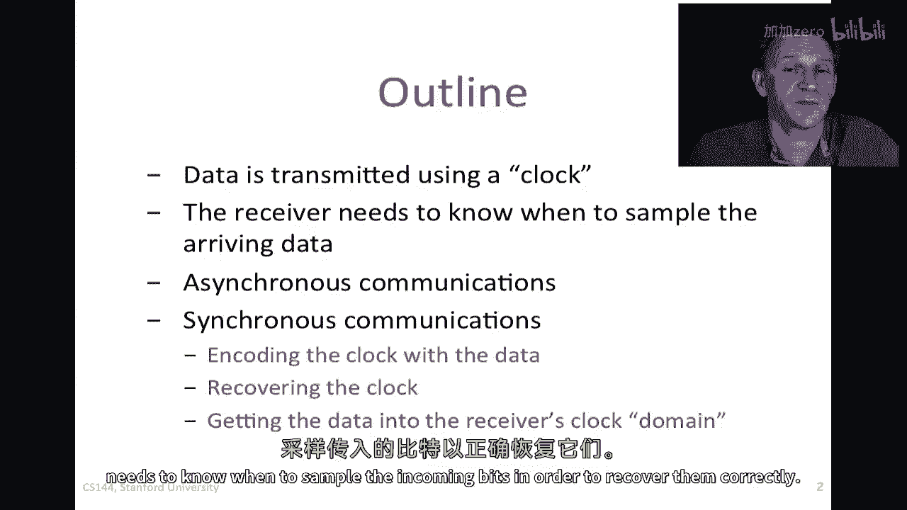
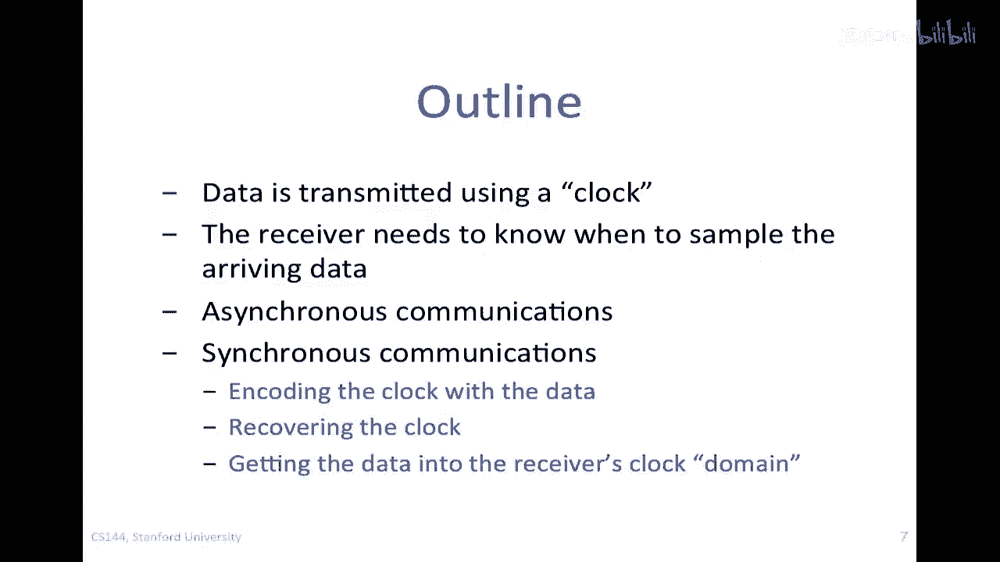

# 课程 P97：物理层与链路层 - 时钟与时钟恢复原理 ⏰

在本节课中，我们将学习数据通信中一个核心概念：时钟。我们将探讨发送方如何利用时钟发送数据，接收方为何需要知道这个时钟才能正确解码，以及当没有独立的时钟线时，如何从数据信号中恢复时钟信息。

---

## 数据传输与时钟的基本问题

在数据通信中，例如在以太网链路上，我们以特定的速率发送数据，如10 Mbps或1 Gbps。这意味着每个比特的持续时间是固定的（例如，10 Mbps时，每个比特持续100纳秒）。因此，发送方必须使用一个本地时钟来精确控制每个比特的发送时刻。

接收方也需要知道这个时钟，才能准确判断一个比特的结束和另一个比特的开始，从而正确解码数据。

**核心问题在于**：发送方和接收方没有完全相同的通用时钟参考。发送方使用的时钟频率，接收方无法精确知晓，必须自行从接收到的信号中找出。

所以，本课程将描述这个一般性问题，并讲解：
1.  如何通过数据编码来嵌入时钟信息，以简化接收方的工作。
2.  接收方如何提取时钟，并将其转换到自己的时钟域中使用。

---

## 异步通信：适用于短消息

上一节我们介绍了时钟同步的基本问题，本节中我们来看看一种简单的解决方案：异步通信。

想象发送方使用自己的时钟（TX CLK）发送数据序列 `0, 1, 0, 1, 0`。接收方也有一个名义上频率相同的本地时钟（RX CLK），但由于是独立生成的，两者存在微小差异。如果接收方时钟稍慢，其采样点会逐渐滞后。

**公式示例**：假设时钟偏差为 ±100 ppm（百万分之一），即 `频率偏差 = 标称频率 × 10^{-4}`。对于10 MHz时钟，最大偏差为 `10,000,000 Hz × 0.0001 = 1000 Hz`。

随着时间推移，滞后的采样点可能错过比特中间的稳定区域，从而在比特边界附近采样，导致解码错误（例如，漏掉一个`0`比特）。

异步通信通过控制数据包长度来规避这个问题。它用于短消息传输，如红外遥控或传统串行总线。

以下是异步数据包的典型结构：
*   **起始位**：一个显著的电平变化，标志数据包开始。
*   **数据位**：有效载荷数据。
*   **停止位**：标志数据包结束。

接收方检测到起始位后，等待半个比特时间开始第一次采样，之后每个比特周期采样一次。只要数据包足够短，在时钟漂移累积到足以导致采样错误之前，传输就已结束。

**总结**：异步通信通过使用起始/停止位和限制包长，在时钟存在微小差异时，能够可靠传输短消息。

---

## 同步通信：实际系统中的标准方案

异步通信不适合长数据包。在实际网络（如以太网）中，我们使用同步通信。本节将深入探讨其工作原理。

同步通信系统的核心挑战是：只通过一根线发送数据，接收方必须从中恢复出发送方的时钟。系统框图包含以下关键部分：

1.  **时钟恢复单元**：接收输入信号，通过检测信号中的跳变（边沿）来确定发送方使用的时钟频率和相位。常用电路包括锁相环（PLL）或延迟锁定环（DLL）。
2.  **弹性缓冲区**：这是一个特殊的FIFO（先进先出）缓冲区。它使用恢复出的发送方时钟写入数据，使用接收方本地时钟读出数据。其作用是吸收两个时钟之间的频率差异，实现从“发送方时钟域”到“接收方本地时钟域”的安全过渡。

整个流程为：编码数据 → 传输 → 时钟恢复单元提取时钟 → 用该时钟采样数据并写入弹性缓冲区 → 用本地时钟从缓冲区读出数据。

---

## 数据编码：为时钟恢复提供“线索”

为了让时钟恢复单元能工作，传输的信号中必须包含足够的电平跳变。如果发送一长串连续的`1`或`0`，接收方将无法确定时钟。因此，我们需要在发送前对数据进行编码。

### 曼彻斯特编码

曼彻斯特编码是一种简单的方法，它保证在每个比特周期内都至少有一次电平跳变。

**编码规则**：
*   比特`0`：表示为从高电平到低电平的跳变（下降沿）。
*   比特`1`：表示为从低电平到高电平的跳变（上升沿）。

**代码示例**：数据 `0 1 0 1` 的曼彻斯特编码波形会在每个比特中间发生跳变。

**优点**：
1.  每个比特都有跳变，使时钟恢复非常容易。
2.  实现了“直流平衡”，即长期来看，高电平和低电平持续时间相等，便于设置接收判决门限。

**缺点**：最坏情况下（如连续`1`），信号跳变频率是数据速率的两倍，相当于**浪费了一倍带宽**。

### 4B/5B 块编码

为了提高带宽效率，可以使用块编码，如4B/5B编码。

**工作原理**：将每4位原始数据映射为一个5位的码字。在所有的32个（2^5）可能的5位码字中，只选用那些包含足够多电平跳变的码字（例如，避免连续超过3个相同比特）。

**优点**：
*   比曼彻斯特编码更高效，过载仅为 `5/4 = 25%`，而非100%。
*   总能保证数据流中有足够的跳变供时钟恢复。
*   多余的未使用码字可用于传输控制信息。

**总结**：通过曼彻斯特或4B/5B等编码，我们在数据流中嵌入了时钟信息，使接收端的时钟恢复成为可能。

---

## 系统总览与下节预告

现在，我们可以勾勒出完整的同步通信系统流程：

1.  发送方使用本地时钟。
2.  数据经过编码（如4B/5B或曼彻斯特编码），确保跳变。
3.  编码后的数据通过链路发送。
4.  接收方的**时钟恢复单元**分析信号跳变，恢复出发送时钟。
5.  使用恢复的时钟对数据进行采样。
6.  采样后的数据写入**弹性缓冲区**。
7.  接收方使用自己的本地时钟，从弹性缓冲区中安全地读出数据。

本节课我们一起学习了时钟在通信中的核心作用、异步与同步通信的区别，以及如何通过数据编码来辅助时钟恢复。

在下一个视频中，我们将深入探讨**弹性缓冲区**如何工作，以及如何设计它以确保永远不会溢出或读空，从而稳定地桥接两个独立的时钟域。