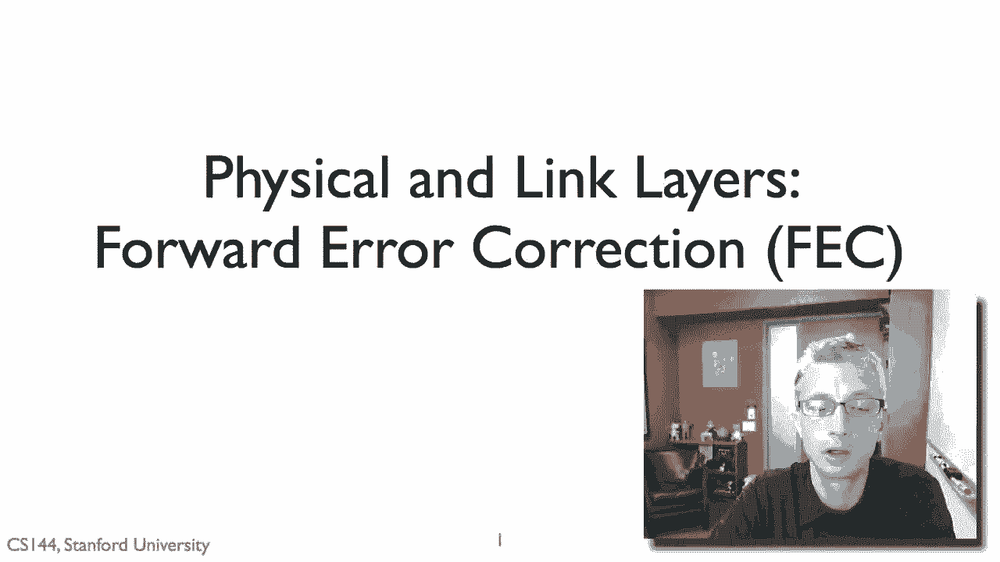
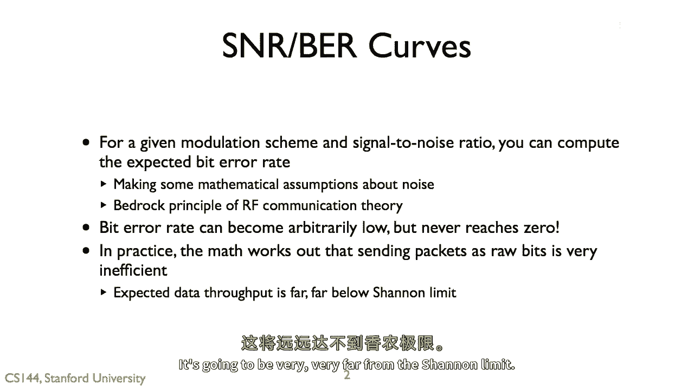
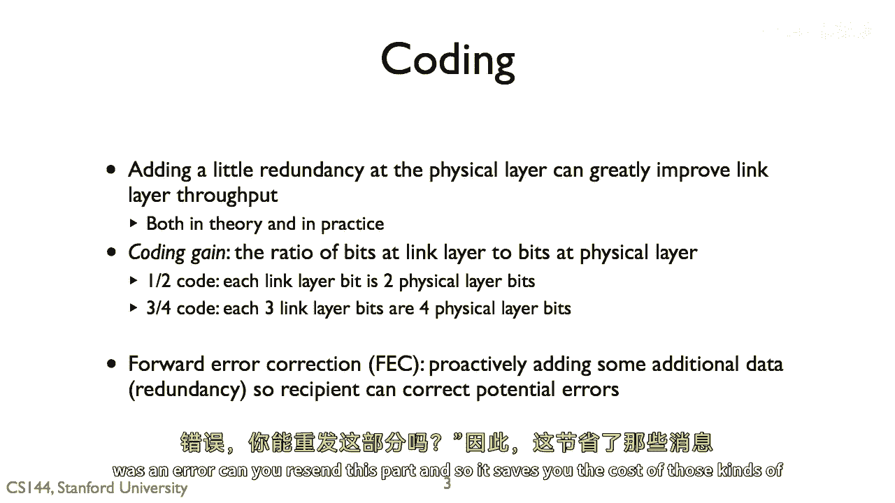
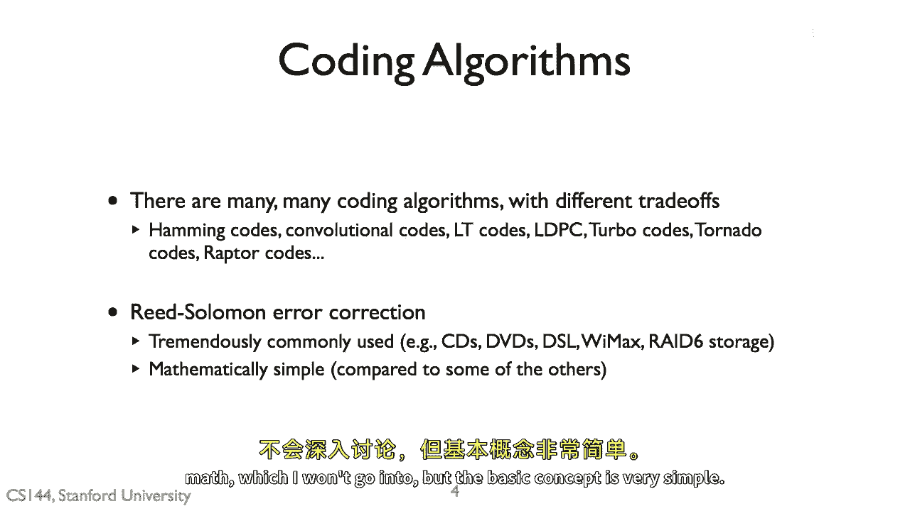
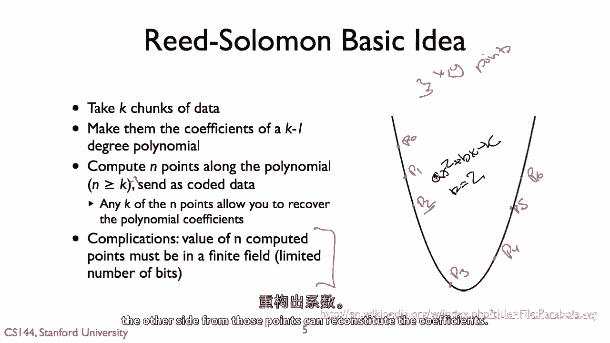
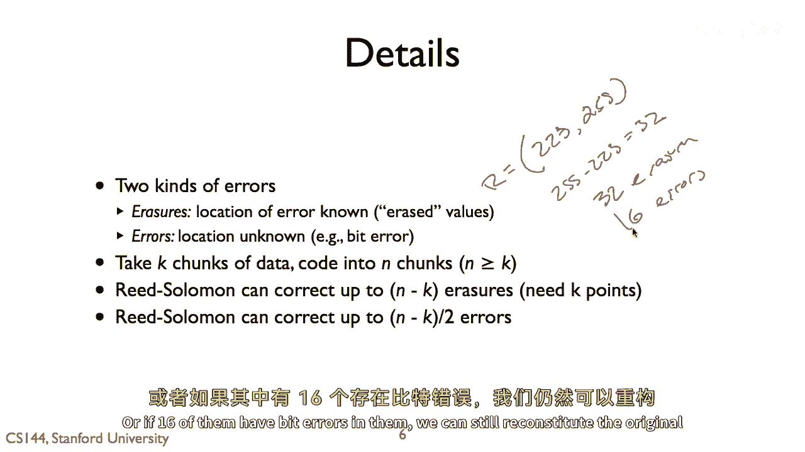
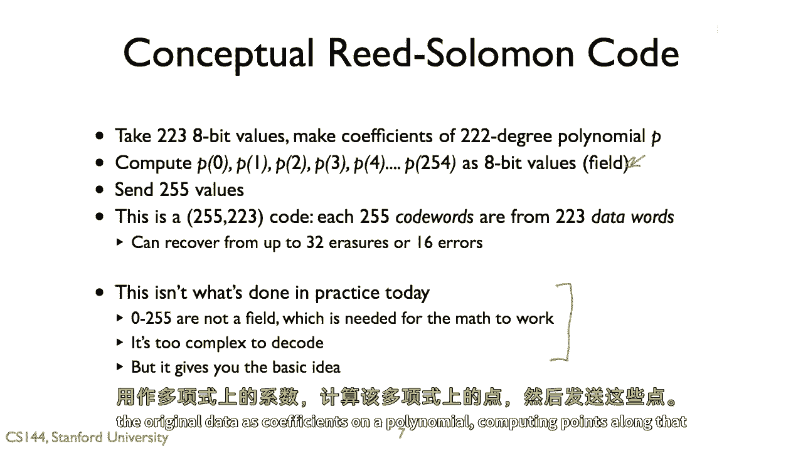
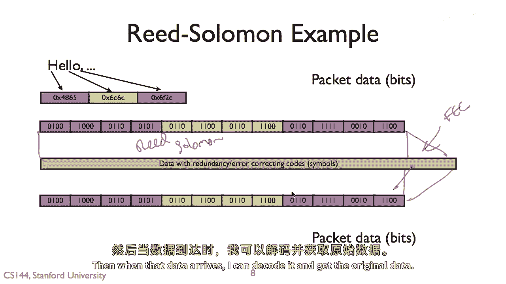
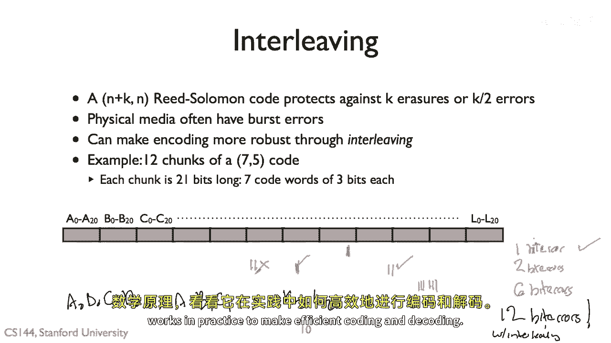

# P98：p97 7-4 Physical and Link Principles - FEC and Reed-Solomon - 加加zero - BV1qotgeXE8D

所以在这个视频中关于物理层和链路层的部分，我将谈论前向错误纠正或fec，以便大家记住，对于给定的信号，信噪比和调制方案，我们可以计算出预期的位错误率，现在这个位错误率，嗯，对于说高的信号强度。

非常强的信号强度，它永远不会达到零，总是存在一定的机会会出现位错误，在实际应用中，这意味着因为这些比特虽然不常见，但你期望它们会发生，直接将链路层的比特转换为物理层的比特是非常非常低效的，因为在那里。

你需要的调制稀疏度，或者你需要的符号速度，以便能有一个非常非常低的比特错误率，比特错误是罕见的，是非常非常低效的，它可以非常非常远离香农极限。

那不是建造高吞吐量系统的好方法，所以，你想要做的是编码，所以编程是一种方法，你在其中添加一些数据的冗余性，在这个情况下，我们正在谈论物理错误，但你可以在各种情况下这样做，嗯。

所以你有一些冗余性来弥补这些预期的不常见位错误，在添加这种冗余性时，它的成本远小于其利益，通过这样做，你可以大大提高你的数据链路吞吐量，因为仅仅通过添加一些冗余性，你所有的数据包都能通过，至于。

与几乎你的所有数据包都无法通过相反，而且在理论和实践中都是如此，所以我们谈论编码，我们还谈论编码增益，这是比特的比率，在这种情况下，链路层到物理层的比特数，编码增益比那更一般。

但在网络中通常我们谈论物理层和链路层，所以，一半的代码意味着我们将一个链路层位转换为两个物理错误位，对于每个位，都有一个冗余位，四分之三的代码，我们在物理层将三个链路层位转换为四个位。

这个过程是前向错误纠正，想法是主动添加一些额外的冗余数据来延长，并能够纠正潜在的错误，它被称为前向错误纠正，因为你是主动做的，你说看，我不知道你是否会有任何错误，但是首先，我只是要添加一些冗余性。

你可以从他们中恢复，这很好，因为你不需要任何交换，接收者可以仅解码数据，它不需要说，哦，出现了错误，你能重新发送这部分吗。

这样它就可以节省你，那些类型的信使更改的成本，那么，你怎么做好这件事呢，外面有很多种编程算法，有很多不同种类的，有很多不同的选择，这里只是其中的几种，嗯，所以在这个视频中，我要谈谈一种特定的算法。

reed solomon，所以我要谈谈reed solomon，因为事实证明，与许多这些其他算法相比，它实际上从数学上相当简单，一，它也被极其广泛地使用，CDs使用再销售和DVDs，DSL线路，嗯。

最大RAID六存储阵列，所有这些系统，所有这些通信存储系统，你所读的，使用reed solomon，此外，与这些其他编码算法相比，结果是实际上相当数学上简单的，我不会深入探讨所有的细节，简单的。

基本概念是简单的，实际上设计得使你能够非常快速地实现它，这涉及到一些更多的数学。

我不会深入探讨，但基本概念是非常简单的，reed solomon的核心思想是如果我有一个像这里的多项式，像这样的多项式，我在哪里有一个正弦函数，所以我有一些ax² + bx + c的形式。

然后任何度数为k的多项式或者这里k等于2，嗯，它由uh，k + 1个点唯一确定，所以这意味着是如果我给你三个uh xy点，所以三个x，Y点将唯一确定一个正弦函数，A，B和c，所以这有用在哪里。

所以我能做什么，如果我有一些数据，我想用reed solomon编码，所以我取k个数据块，这些k个数据块成为一个k-1度的多项式的系数，例如，我拿三个数据块，并且这三个数据块成为一个B和c，这三个系数。

然后我做的就是我在这个多项式上计算n个点，正确，当n大于或等于k减去一时，嗯，所以应该是减一，对吧，所以我计算这些端点，这就是我发送的，我沿着多项式发送那些点，现在，发生的事情是我正在发送n个点。

但由于原始多项式是度为k减去一的，那些k个点中的任何一个，当k小于n时，将允许你唯一且正确地确定这些系数是什么，所以例如我有一个二次多项式，它是从三个数据块a、b和c生成的。

然后我做的是我计算点零点一点，二说点三点，四点五和点六，我上升p零，P一，P two，P three p four，P five p six，现在发现，无论使用这三点中的任意一点，与p one一起。

p five和p six，或者与p four一起，p one和p three，你都可以，如果你知道这个是抛物线，你就可以确定a，b和c的值，这就是基本的数学，我计算沿着系数为原始数据的多项式的点。

然后如果我能恢复足够的多项式点，我就可以重新构建那些系数是什么，这个像有什么复杂性吗，我不能选择，比如p2不能是一百万，因为怎么表示一百万，那么它就会用更多的空间，还有一件事，有些复杂性。

你实际使用的数字，不仅仅是基本的整数，有限域中的数量，意味着某种数学构造，在操作下封闭，基本上意味着嘿，我可以用有限的位来表示这些点，不像突然a是一百万，这就意味着p六是完全无法衡量的。

我无法在有限的空间中代表它，因此，这就是我不打算深入讨论的另一个复杂性，但这是基本概念，是我把数据表示为多项式的系数，我计算沿多项式的点，然后我发送那些点，从那些点，另一方可以重新构建系数。

现在，关于reed solomon能为你做什么的一些详细信息，所以，在这些系统中，我们关心的错误有两种类型，重要的是要区分它们，第一种是擦除，所以这些是我们知道它们发生的错误，嗯，比如那个数据片段缺失。

那是擦除，另一个是通用错误，我们不知道错误发生在哪里，所以这是我们通常在说中认为的，位错误，而擦除的值是说，你知道，哦，天啊，这个盘没反应，哦，我们错过了那个包，所以罗素码的工作原理是，你将k块数据。

并将其编码为n块，其中n大于或等于k，n等于衰减，你实际上并没有进行任何编码，嗯，那么reed solomon会做什么呢？它可以纠正最多n-k个擦除错误，对，因为记住如果我们将数据编码为n块。

如果我们有k个点，并且我们知道这些k个点是正确的，所以它们只是缺少了其他的，我们可以重构数据，但它也可以纠正最多n-k除以2个错误，所以像，让我们假设一个非常常见的reed solomon代码是223。

嗯，255，这意味着我们取223字节的数据，并将其转换为255个编码字节的数据，那么255减去223等于32，我的意思是，这种 Reed-Solomon 代码可以保护对32个擦除的抵抗力，或16个错误。

我们中的32个8位代码词可以缺失，只要我们有223，我们就可以重建原始数据，那就是223个在我们的22度多项式上的点，或如果16个中有位错误。

我们还可以重建原始数据，所以这里是概念上的概念，让我们取223个8位值，所以我们取我们的数据，将其分解为字节，取223字节，我们现在将考虑这些，一个22度多项式的系数，P然后我们计算p的0，p的1。

p的2等，等等等作为二进制值，又有这个，这个使用领域的想法，嗯，而不是任意数字，那是那个数学概念，嗯，所以我们可以 then 将它们表示为二进制值，然后我们发送这些255个255个点沿着多项式。

所以这是一个255223代码，每个这255个代码词都来自223个数据词，32个比率，16个错误，所以我们发送这些255个值，基本的想法是，如果我有最多16个错误，我可以 still 找出哪些是错误的。

我可以重建多项式，我可以重建多项式系数，嗯或者我可以缺失三个二个他们，只要我得到223，嗯，如果我有三个二个擦除，我可以 still 重建原始多项式，我之前说过这不是实践中实际做的，出于许多原因。

这些值必须处于一个被称为领域的概念，原来这个精确的方案实际上解码起来相当昂贵，你需要考虑所有可能的，U参数，并进行插值，但它给你基本的概念，现代的一些更复杂一些。

但基本概念仍然适用于你使用原始数据作为系数，在多项式上，在多项式上计算点。

然后发送这些点，所以这里是一个简单的例子，我取这六个字节，它们说，你好，嗯，我将它们分解为数据块，然后我在这里进行 Reed-Solomon 编码，是基本概念，我正在添加前向错误纠正在这里。

一些冗余数据，然后当那个数据到达时，我可以解码它并获取原始数据。

所以让我们走通过这个作为特定例子，所以在这种情况下让我们假设我们正在使用一个七五代码，这意味着我们使用的初始数据词将是三位长，这是七二到三的减一术语，嗯，所以我们将数据分解成小块的三位。

所以我们将开始使用五个这样的，嗯，数据词，所以十五位，每个十五位都将被转换为七个代码词，所以这里我们有第一个十五位，下一个十五位，下一个十五位，结果我们发现我们有四个八位在这里，四十八不能被十五整除。

所以有四十五加三，所以只需添加一些零，原始数据将从四十八位增长到六十位，然后我们对这些十五位进行 Reed-Solomon 编码，以将它们转换为二一比特，然后发送这些总共八十四位，假设在电线或无线上。

有八十四位或传输，接收，另一边得到这些编码的八十四位，然后运行 Reed-Solomon 解码器，并从那里可以再生成原始数据，因为这个是七五代码，这意味着我们可以从一到两个错误或擦除中恢复。

我们注意到这些错误和擦除是对代码词的，因此，它是可能的，实际上，如果我们有，让我们假设我们有位错误，它们看起来像这样，这是一个位错误，嗯，这是一个苦味这里，两个投标人可以提一个问题。

我们能否从这些位错误中恢复，所以对于这个第一个代码块，答案是是的，有一个位错误，一个位错误最多会破坏一个代码字，我们可以从一个错误中恢复，一个包含错误的代码字，因此，第一个块将能够成功恢复。

与第二个代码块相同，我们有一个位错误，这意味着一个代码字将包含错误，所以我们可以从那里恢复，对于第三个代码块，嗯，这是一个棘手的问题，所以其中一个代码字可能是错误的，我们有两个位错误，因此。

这现在取决于那些位错误落在哪里，假设这里是代码字间隔开的，这里是二、三、四、五、六、七，假设它们看起来像这样，嗯，如果两个位错误，在相同的代码字中，那将会很好，因为我们只有一位错误。

一个包含错误的代码字，所以在这种情况下将会没问题，如果位错误在不同的代码字中，那么我们就不会对，所以我们将有两个错误，我们不能从两个错误中恢复，所以这可能看起来不太好。

但与如果我们在这里没有使用任何编码方案相比，我们已经能够保护 against 至少两个位错误，甚至可能高达四个。

所以有一个，嗯，其他技巧你可以使用，这是非常常见的，例如，在cds中就是这样做的，所以人们经常假设在物理层中的错误，你知道一些是分散和随机的，这些是容易处理的，什么更难，错误爆发，嗯。

所以你可以通过一种叫做交织的方式来使你的编码方案更加 robust，来处理错误爆发是通过一种叫做交织的技术，所以想象一下，例如，我有，这是我的数据，并且有十二个七五代码的片段。

这意味着这些片段都是以编码的数据来表示的，长度为二一比特，记得从之前的展示中，它的七位代码词是，长度为三比特，每个嗯，所以我这里有十二个代码块，从a到l，比特a从零到二十，例如l从零到l二十。

所以让我们思考会发生什么，我们有错误爆发，所以有可能有，让我们说一个错误爆发，嗯，我肯定知道，我能够从那个中恢复过来，因为那最多会腐蚀一个代码词在一个块中，我能够从一个错误中恢复过来。

所以那将会是 okay 的，一，我很好，两个比特错误呢，再次，这取决于它们是否落在同一个代码词中，或者是否落在不同的代码词中，实际上，有可能它们都会落在一个错误爆发中，一个落在一个块的代码词中。

这个块可以被恢复，另一个落在另一个块的代码词中，也可以被恢复，我们将会 okay 的，所以在这种情况下我们将会 okay 的，如果它们都落在一个，嗯，代码词中，我们将会 okay 的。

但如果它们落在同一个块中的不同代码词中，那么我们就无法从那个中恢复过来，会有两个错误在一个块中，实际上，如果我们看看最长的可能从哪个位错误中恢复，这是一个好问题，所以实际上。

我们可以从最长的六位错误中恢复，所以实际上，我们可以从最长的六位错误中恢复，是六比特，我们可以从六个比特的错误爆发中恢复，如果和只有当它恰好是，其中三个落在一个块的最后一个代码词中。

然后三个落在下一个块的第一个代码词中，因为如果我们再加一个，那么它会破坏第二个代码词，所以那是可能的，但是不可能，这是我们从仅使用基本编码就能纠正的最长可能错误字符串，所以我们可以做的事情叫做交错。

所以而不是将我们的数据通过零发送，通过二十，B通过bb二十，然后一个错误爆发集中在一个块上，我们实际上发送的是这些位交错发送，例如，我们发送一个零，B零，C零，D零，等等，等等，等等，嗯，到零，一，一。

一点，点到零一，然后到最后我们将发送k二十，零二十，所以现在，恰巧，物理层的错误爆发被传播到所有不同的字符块中，所以，在这种情况下，如果我们有一个包含十二位错误的字符串。

一个包含十二位错误的字符串将导致每个位错误，代码块的一个将导致一个位和一个位错误，并一个位错误，并一个位错误，并l，因此，用这种方式，我们突然变得比插入更 robust 通过插入所有这些位。

我们可以恢复多达十二位错误，使用交织，即使我们没有使用交织，甚至两个位错误也可能使我们的系统失败，六个位错误是我们能做到的最多，但如果我们只做这些事，我们可以确定地知道恢复一个最长为十二位的爆发。

所以交织是非常常见的，嗯，并且是非常流行的技术，所以这结束了关于编码的视频，如果你想阅读更多，外面有很多种有趣的编码算法，我还建议如果你想深入研究数学。

