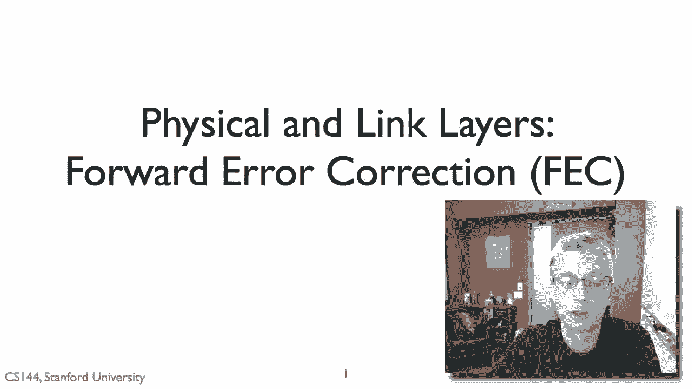
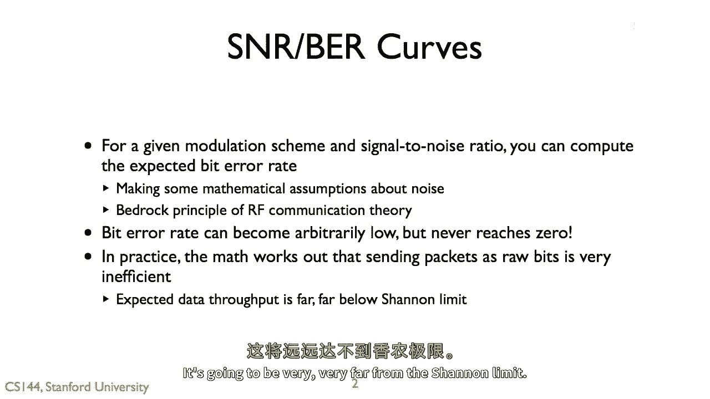
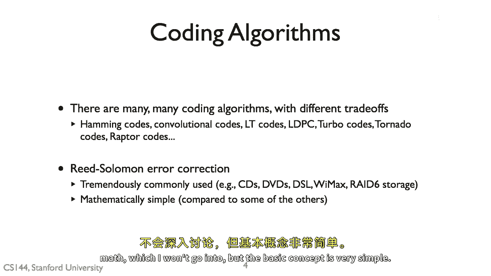
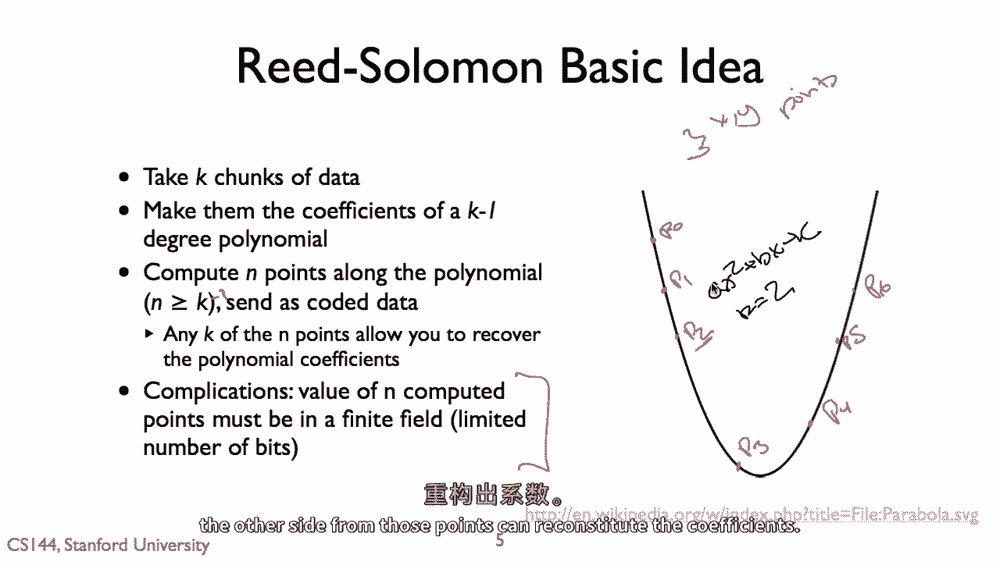
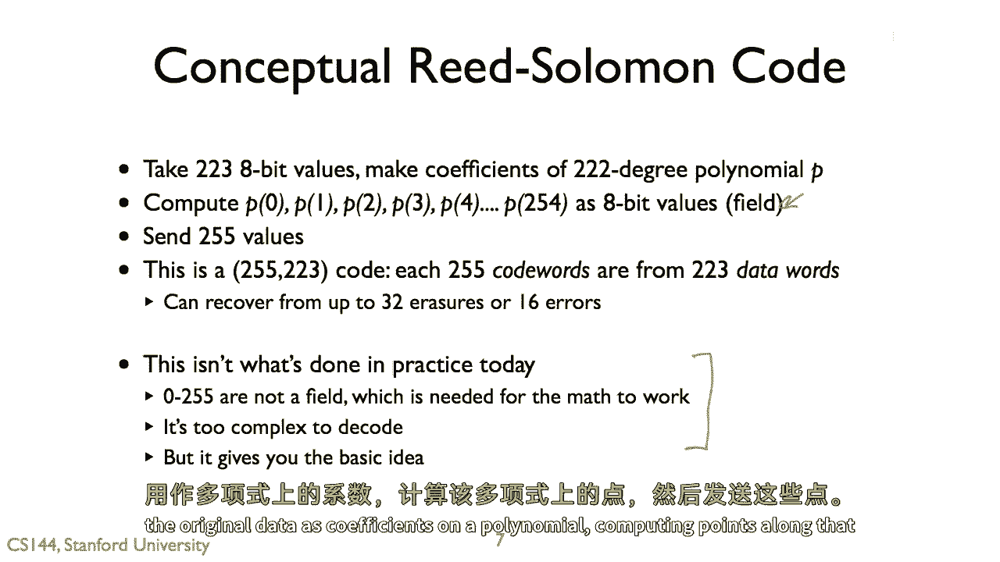
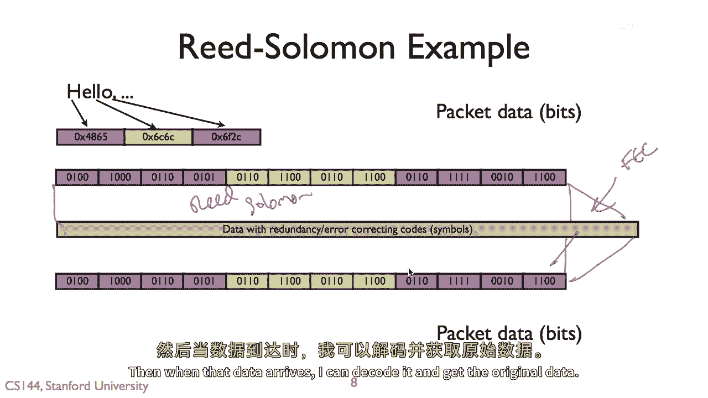
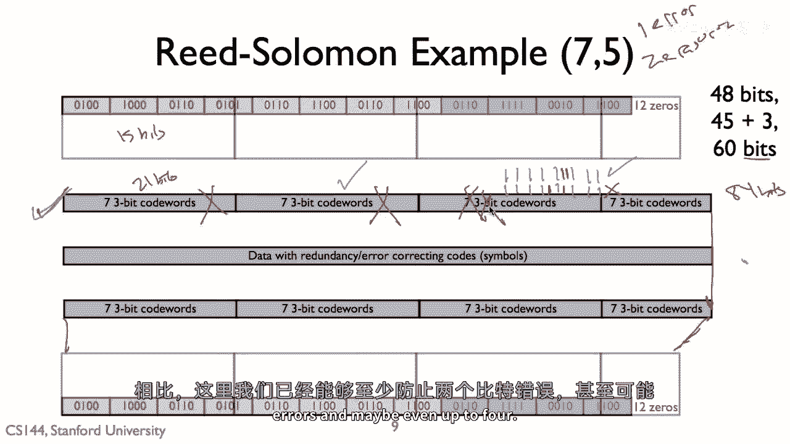

# 📡 课程 P98：前向纠错与里德-所罗门码

在本节课中，我们将学习前向纠错的基本概念，并深入探讨一种广泛应用的纠错算法——里德-所罗门码。我们将了解为何需要纠错码，以及如何通过添加冗余数据来显著提高数据传输的可靠性和效率。

---

## 为何需要前向纠错

上一节我们介绍了物理层和链路层的基本概念。本节中，我们来看看前向纠错。

对于一个给定的信号，其信噪比和调制方案决定了预期的比特错误率。即使信号强度很高，比特错误率也永远不会为零，总存在一定的出错概率。

在实际应用中，这意味着比特错误虽然不常见，但总会发生。如果直接将链路层的比特转换为物理层的比特，会非常低效。因为为了达到极低的比特错误率，所需的调制密度或符号速率会非常高，这将导致效率远低于香农极限。

这不是构建高吞吐量系统的理想方法。

---

## 编码与冗余

因此，我们需要进行编码。编码是一种通过添加数据冗余来弥补预期中不常见比特错误的方法。

以下是编码的核心思想：
*   添加冗余的成本远低于其带来的收益。
*   通过添加冗余，可以大幅提高数据链路的吞吐量。因为几乎所有数据包都能成功传输，而不是几乎都无法通过。
*   这在理论和实践中都得到了验证。

我们谈论编码时，也常提到**编码增益**。它通常指链路层比特数与物理层比特数的比率。例如：
*   **1/2 码率**：将一个链路层比特转换为两个物理层比特，每个比特都有一个冗余比特。
*   **3/4 码率**：将三个链路层比特转换为四个物理层比特。

这个过程就是**前向纠错**。其思想是主动添加额外的冗余数据，以便能够纠正潜在的错误。它被称为“前向”纠错，因为这是发送方主动进行的，接收方无需请求重传即可自行解码和纠错，从而节省了信令交互的开销。

---

## 里德-所罗门码简介

有多种前向纠错算法可供选择。在本视频中，我们将重点介绍**里德-所罗门码**。

选择它有两个主要原因：
1.  **应用极其广泛**：CD、DVD、DSL线路、RAID-6存储阵列等众多通信和存储系统都使用它。
2.  **基本概念相对简单**（尽管深入实现涉及更多数学知识）。

里德-所罗门码的核心数学思想基于多项式。

一个 **k-1** 次多项式（例如二次多项式 `ax² + bx + c`，其中 k=3）可以由 **k** 个点唯一确定。这意味着，给定三个 (x, y) 点，就可以唯一确定系数 a, b 和 c。

---

## 里德-所罗门码的工作原理

那么，这有什么用呢？以下是编码过程：

1.  **数据到系数**：取 **k** 个数据块，将它们视为一个 **k-1** 次多项式的系数。例如，三个数据块成为系数 a, b, c。
2.  **计算点**：在这个多项式上计算 **n** 个点（其中 n > k）。
3.  **发送点**：发送这 n 个点，而不是原始系数。

解码时，由于原始多项式是 k-1 次，所以只需要接收到其中任意 **k** 个正确的点，就可以唯一地重构出多项式，从而得到原始的 k 个数据块（系数）。

这里有一个复杂性：我们不能直接使用任意大的整数作为点的值，否则表示它们会占用过多空间。实际中，这些运算是在一个**有限域**中进行的，这确保了所有值都能用有限的比特位表示。这是实现细节，我们暂不深入。

**基本概念总结**：将数据表示为多项式系数，计算并发送多项式上的多个点，接收方通过足够多的点重构多项式以恢复原始数据。

---

## 纠错能力

在通信系统中，我们关心两种错误：
1.  **擦除**：知道错误发生的位置（例如，数据包丢失、磁盘扇区损坏）。
2.  **错误**：不知道错误发生的位置（即通常意义上的比特错误）。

里德-所罗门码将 **k** 个数据块编码为 **n** 个码块（n > k）。其纠错能力如下：
*   可以纠正最多 **n - k** 个擦除错误。
*   可以纠正最多 **(n - k) / 2** 个错误。

一个常见的例子是 **RS(255, 223)** 码：
*   这意味着取 223 字节的数据，编码为 255 字节。
*   `n - k = 255 - 223 = 32`
*   因此，它可以纠正最多 **32 个字节的擦除**，或最多 **16 个字节的错误**。

**概念性流程**：将数据分成 223 字节的块，视为一个 222 次多项式的系数。计算该多项式在 255 个点上的值（在有限域中计算，表示为字节），并发送这 255 个值。只要接收到至少 223 个正确的值，或错误值不超过 16 个，就能恢复原始数据。

---

## 实例分析

让我们通过一个具体例子来理解。假设我们使用 **RS(7, 5)** 码：
*   每个数据字长 3 比特。
*   取 5 个这样的数据字（共 15 比特），编码为 7 个码字（共 21 比特）。

假设原始数据有 48 比特。编码过程如下：
1.  48 比特数据 + 填充位 = 60 比特（即 20 个 3 比特数据字，可分 4 组，每组 5 字）。
2.  对每组 15 比特（5字）进行 RS(7,5) 编码，得到 21 比特（7字）。
3.  总共发送 `4组 * 21比特/组 = 84` 比特。

由于是 RS(7,5) 码，它可以**从每组（7个码字）中纠正最多 1 个错误或 2 个擦除**。

考虑传输中的比特错误：
*   如果错误分散在不同组的码字中，每组最多只含一个错误，则可以全部纠正。
*   如果两个错误落在同一组的两个不同码字中，则该组无法纠正。

尽管存在无法纠正的极端情况，但与完全不使用编码相比，系统的抗错能力已大大增强。

---

## 交织技术

物理层错误有时会集中爆发，形成连续的错误串，这比分散的随机错误更难处理。

为了提高对突发错误的抵抗能力，可以采用**交织**技术。

**不使用交织时**：数据按编码块顺序发送（A0-A20, B0-B20...）。一个长的突发错误可能损坏同一个编码块中的多个码字，导致超出其纠错能力。

**使用交织时**：发送顺序变为 A0, B0, C0,... A1, B1, C1,... 以此类推。这样，一个物理层的突发错误会被分散到多个不同的编码块中，每个块可能只受到一个错误的影响，从而更容易被纠正。

例如，一个 12 比特的突发错误，在使用交织后，可能会使 12 个不同的编码块各出现 1 比特错误。而 RS(7,5) 码每个块正好能纠正 1 个错误，因此整个突发错误得以纠正。不使用交织，则可能完全无法纠正。

因此，交织是一种非常常见且有效的、与纠错码结合使用的技术。

---

## 总结

本节课中，我们一起学习了：
1.  **前向纠错的目的**：通过添加可控的冗余，高效应对信道中不可避免的错误，提升吞吐量。
2.  **里德-所罗门码的原理**：基于多项式插值，将数据编码为多项式上的点，利用点的冗余来纠错。
3.  **RS码的纠错能力**：可纠正 `n-k` 个擦除或 `(n-k)/2` 个错误。
4.  **交织技术**：通过打乱发送顺序，将突发错误分散化，极大提升纠错码对突发错误的抵抗能力。

里德-所罗门码因其强大的纠错能力和相对简洁的数学基础，成为从光盘存储到现代通信系统中不可或缺的一环。理解其基本原理，是深入理解现代数字通信和存储系统可靠性的关键。