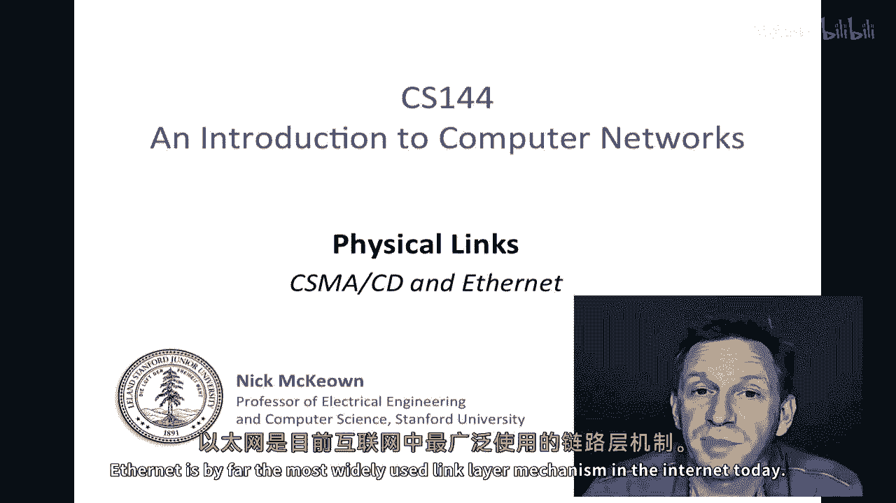
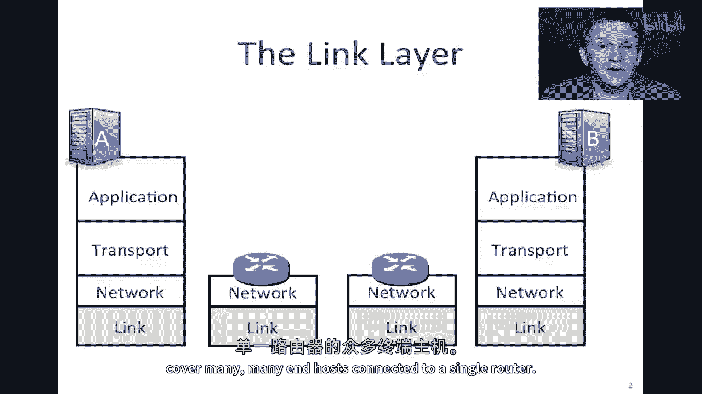
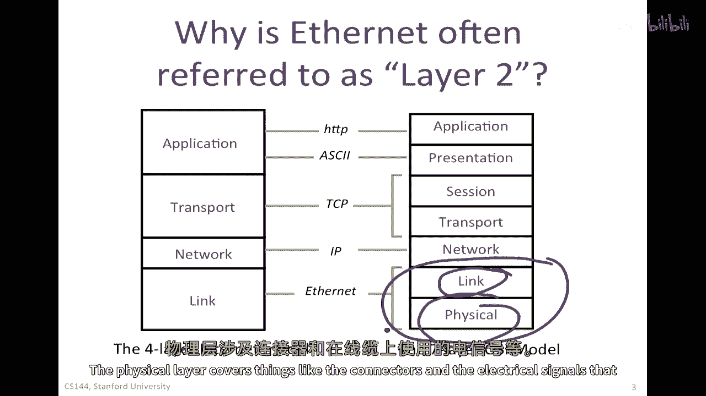
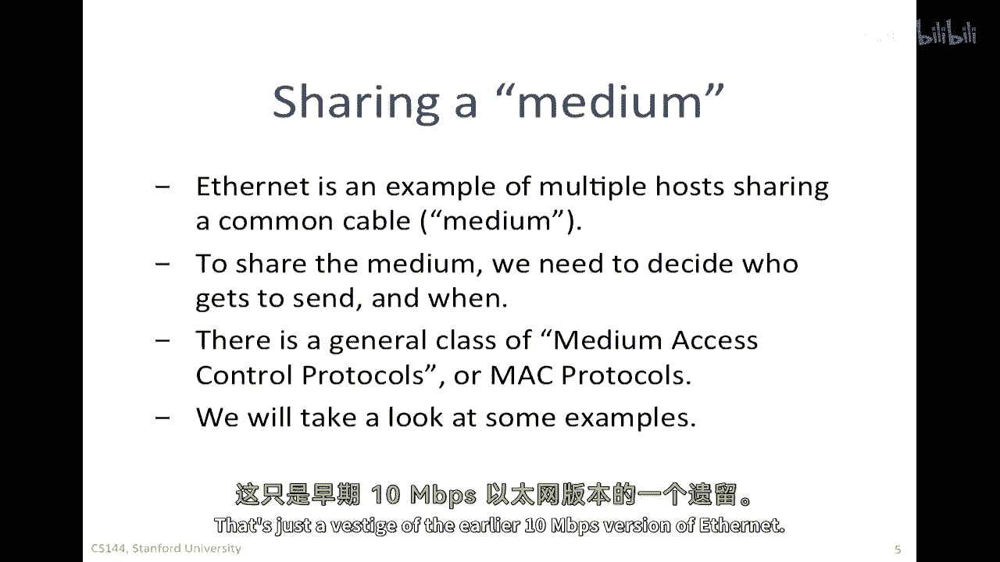
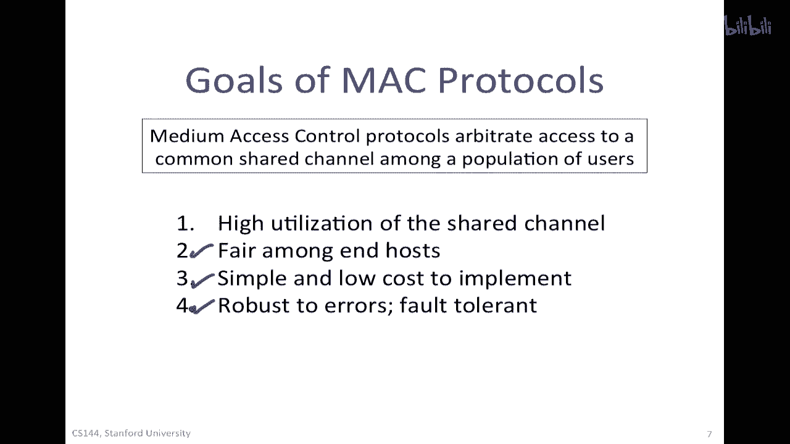
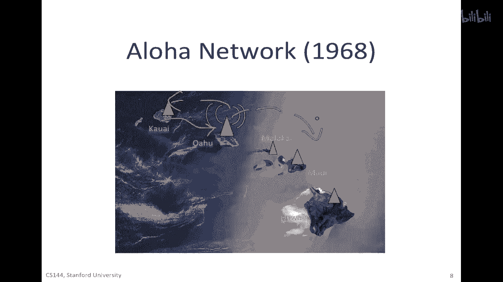
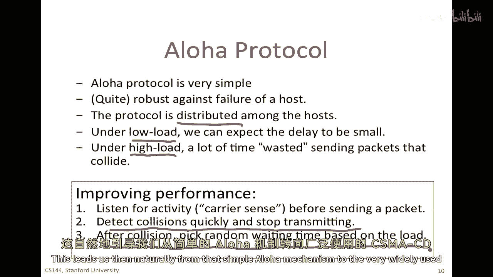
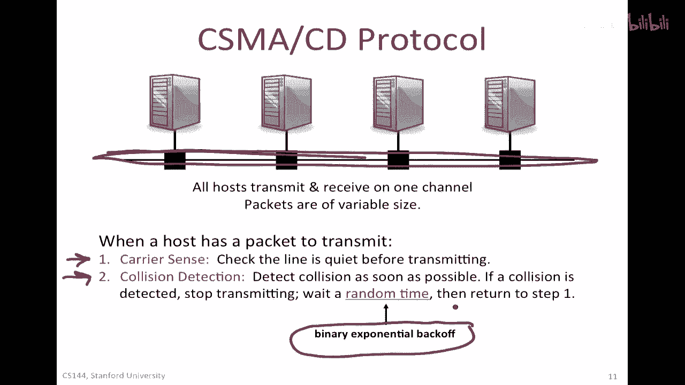
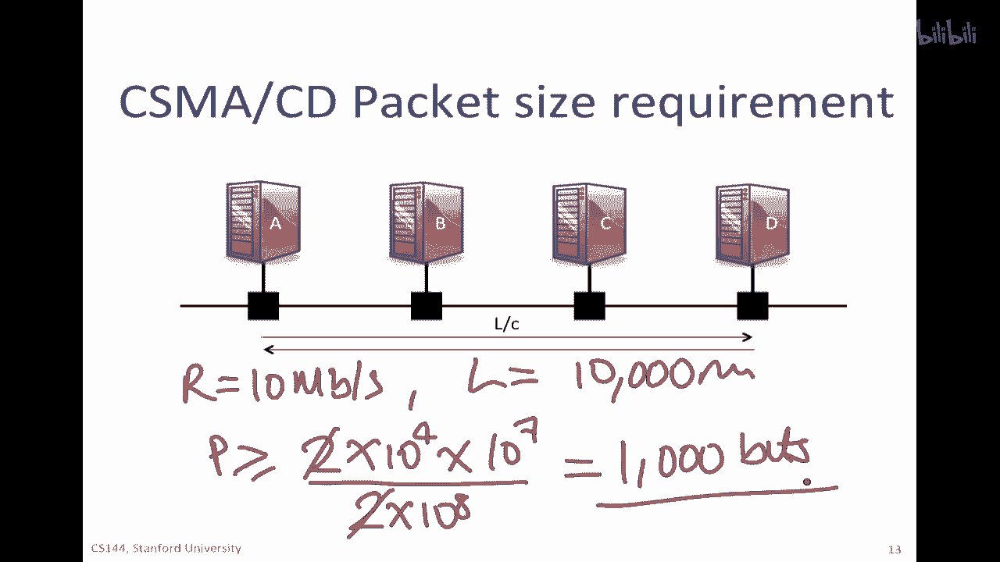
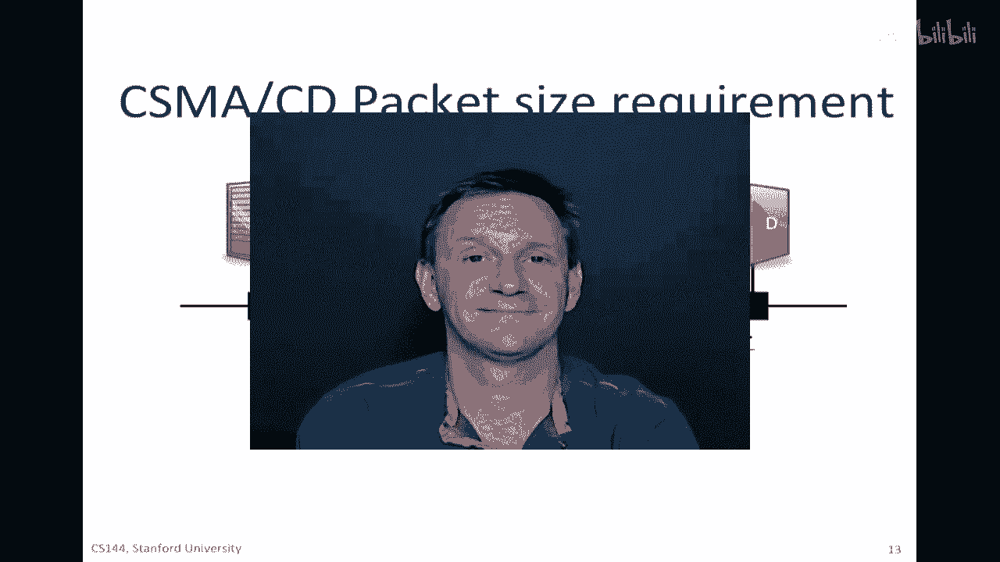

# 计算机网络课程 P99：物理层与链路层 - MAC 与 CSMA/CD 原理 🖧

在本节课中，我们将学习链路层和物理层的基本概念，特别是介质访问控制（MAC）协议。我们将从最简单的随机访问协议 ALOHA 开始，逐步深入到以太网广泛使用的核心机制——载波侦听多路访问/碰撞检测（CSMA/CD）。通过本课，你将理解共享介质上如何协调多个主机发送数据，以及 CSMA/CD 如何工作。

---

## 概述：以太网与链路层

当我们今天将电脑连接到网络时，通常使用 Wi-Fi 进行无线连接，或者以太网进行有线连接。以太网是当今互联网上最广泛使用的链路层机制。

链路层覆盖了终端主机如何连接到路由器，以及路由器如何连接到下一个路由器。一般来说，IP 层的包被封装在一个链路层帧（大多数情况下是以太网帧）中，以便被发送到第一个路由器。

在本视频和下一个视频中，我将描述一种叫做 CSMA/CD 的东西，这是以太网工作的核心，并且深深地融入了原始的以太网设计。接下来，我将描述以太网如何多年来经历了其进化，以及以太网交换如何成为一种非常普遍的方式来扩展链路的范围，以覆盖连接到单个路由器的许多终端主机。

---

## 以太网与 OSI 模型

你经常会听到以太网被称为“第二层”。这可以追溯到我们在早期视频中看到的七层 OSI 模型。在四层互联网模型中，以太网是最低层。在七层 OSI 模型中，以太网涵盖了链路层和物理层这两个底层。因此，以太网经常被称为第二层。

*   **链路层**：实际上只覆盖了帧格式，以及决定包何时可以在电线上发送的算法（即 CSMA/CD 机制）。
*   **物理层**：覆盖了像连接器和电线上使用的电气信号这样的东西。

---

## 共享介质与 MAC 协议

以太网最初作为一种将多个计算机连接到同一根电缆上的手段开始。那根电缆被安排成一条长串或总线。实际上，一条粗大的黄色电缆蜿蜒地缠绕在墙壁上、天花板或地板下面，计算机将被连接到它。所有计算机都可以共享这根相同的公共线缆。

想法是，它们应该共享它，以便能够相互发送数据包。但是，每次只允许一个包通过电缆，否则，它将碰撞或干扰其他数据包。这就是我们所说的**共享介质**。以太网是多个主机共享同一根电缆的示例。

要共享介质，我们需要决定谁有权发送，以及何时发送。因为如果只有一个数据包可以在同一时间通过介质发送，我们需要决定介质何时变空闲，以及谁在下一次有机会使用它。这个机制通常被称为**介质访问控制（MAC）协议**。这些是决定谁有权发送下一个的协议或算法。

这里有一件事需要注意的是，你可能以前听说过以太网地址被称为 MAC 地址。它代表介质访问控制。尽管我们稍后会看到，以太网不再广泛使用早期的 MAC 机制（如 CSMA/CD），但那只是早期十兆比特每秒以太网的情况。

---

## MAC 协议的类型

让我们来看看一些介质访问控制协议的例子。实际上，多年来已经描述、出版和发明了数十或数百种，并且许多都被标准化。但因为许多已经过时，我将专注于以太网使用的**载波侦听多路访问/碰撞检测（CSMA/CD）**。但我想把它放在一个更大的背景下。

总的来说，有两大类 MAC 协议：

1.  **随机访问协议**：任何主机都可以在任何时间尝试发送。它不需要等待中央权威批准或轮到它。它只是试图发送。它可能会倾听并看看是否有其他人在说话，或者它可能直接继续。从随机性的角度来看，它可能随时开始说话。
2.  **确定性协议**：如令牌传递，有一些方法可以明确控制谁下一个发送。最常见的方法是叫做令牌传递。一个特殊的包或令牌从一个主机发送到下一个主机。当您持有令牌时，您被允许发送数据包。当它完成发送后，将令牌传递给邻居，然后邻居有机会发送。

随机访问协议易于实现。当发送者的数量较小且随机发送数据时，它们可以提供很好的性能。但在负载非常重时，它们工作得不太好，因为它们可能会花费大量时间与其他数据包碰撞。确定性协议（如令牌传递）需要生成和维护令牌，并且令牌可能会丢失或被复制，因此这些通常已经过时并被更简单的以太网机制所取代。

当我们设计或选择 MAC 协议时，通常有一些目标：
*   共享通道的高利用率。
*   公平性，确保每个人都有发送机会。
*   简单且低成本实现，以便广泛部署。
*   对错误鲁棒，单个主机失败不会导致整个网络瘫痪。

---

## ALOHA 协议：一个简单的例子

让我从一个例子开始，我将使用的例子是其中一个最早的媒体访问控制协议，叫做 **ALOHA 协议**。它是在夏威夷的 ALOHA 网络中使用的。

ALOHA 网络是基于无线电的。所有终端设备都会在一个频率上进行传输。如果一个终端设备有东西要发送，它会在频率零上发送到中央中继站。然后数据包将被重新传输到频率一上（一个单独的正交频道），广播给所有终端主机。

我们需要一种方法来决定谁可以何时发送。ALOHA MAC 协议非常简单：
1.  如果你有数据要发送，发送它。
2.  如果你的传输与其他传输碰撞，稍后重试。

你怎么知道它碰撞了？你会在频率零上发送，并在频率一上监听。如果回来的不是你发送内容的正确副本，你知道它一定碰撞了，因此你需要再次发送。

ALOHA 协议的好处是非常简单，它对终端主机的失败具有很强的抵抗力（如果主机停止发送，机制不依赖于它）。协议是分布式的，在所有终端主机上都独立运行。

*   **在负载低时**：延迟很小，几乎任何有数据要发的主机都会找到通道空闲，第一次就顺利通过。
*   **在负载高时**：发送碰撞的包可能会浪费很多时间，成功的机会降低。研究表明，在负载高时，只能实现大约 18% 的吞吐量，超过 80% 的时间都被用于碰撞的传输。

显然我们需要提高性能。在 1970 和 80 年代，有很多关于如何改进这种网络的论文。其中，采用最广泛的技术被称为 CSMA/CD。它主要用于有线网络，并且被用于以太网。

提高性能的想法：
1.  **载波侦听**：在发送前先监听活动，检查是否有其他人正在发送。
2.  **碰撞检测**：尝试快速检测碰撞并停止传输，以减少时间浪费。
3.  **随机后退**：在碰撞发生后，选择一个基于负载的随机等待时间再重试。

这自然使我们从简单的 ALOHA 机制过渡到广泛使用的 CSMA/CD 协议。

---

## CSMA/CD 协议详解

CSMA/CD 用于原始 10 兆比特每秒以太网。所有主机都可以在同一通道（共享介质）上发送和接收。数据包的大小是可变的。

以下是 CSMA/CD 的工作流程：

1.  **载波侦听**：当主机有包要发送时，首先检查线路在传输前是否安静（监听）。如果电线安静，则尝试发送。
2.  **发送与碰撞检测**：开始发送数据包，并持续监听线路。
3.  **碰撞处理**：如果检测到碰撞，立即停止传输。
4.  **随机后退**：等待一个随机的时间。
5.  **重试**：回到步骤 1（载波侦听），重新尝试传输。此过程会一直重复，直到成功。

这个随机等待时间被称为**二进制指数后退**。它意味着随着给定包的碰撞次数增加，等待的时间也会指数级增加。如果存在太多的碰撞，意味着有许多其他传输者，因此应该等待更长时间，以便每个人都有机会发送。

---

## CSMA/CD 工作实例与最小包长要求

让我们看看 CSMA/CD 在实际中如何工作。假设主机 A 有一个包要发送给主机 D。A 会先监听线路。如果线路空闲，A 开始发送数据包。数据包的比特会以光速沿着电缆传播。

在此期间，线路正忙，所以其他主机（B、C、D）都会听到线路正忙，不会尝试发送包。

现在考虑导致碰撞的条件。如果 A 在向 D 发送包的同时，D 也恰好开始向 A 发送包（D 在 A 的包第一个比特到达前的一小段时间监听，发现线路空闲），那么两个包的前端会在电缆中某处相遇并发生碰撞。碰撞信号会向两端传播，最终被 A 和 D 检测到。

CSMA/CD 网络有一个**最小包大小要求**。原因是为了确保发送方在**停止传输自己的包之前**，能够**可靠地检测到可能发生的碰撞**。

考虑最坏情况：两个相距最远的主机（A 和 D）几乎同时开始发送。A 发送的包需要时间 `L/C`（距离除以传播速度）到达 D。如果 D 在 A 的包到达前的一瞬间开始发送，碰撞几乎立即在 D 附近发生。碰撞信号又需要 `L/C` 的时间传回 A。因此，从 A 开始发送到它可能听到碰撞，最长时间是 `2L/C`。

如果 A 的包太短，在 `2L/C` 时间内就发送完了，那么即使发生了碰撞，A 在发送完成后才听到碰撞信号，它就无法停止自己的传输，也意识不到是自己的包导致了碰撞。

因此，为了保证可靠碰撞检测，要求：
**数据包传输时间 ≥ 信号往返最长时间**

用公式表示：
`P/R ≥ 2L/C`
其中：
*   `P` = 数据包长度（比特）
*   `R` = 网络传输速率（比特/秒）
*   `L` = 网络最大长度（米）
*   `C` = 信号在介质中的传播速度（米/秒）

**例子**：假设一个 CSMA/CD 网络运行速率为 10 Mbps（`R = 10^7 bps`），最大长度为 10,000 米（`L = 10^4 m`），传播速度是 `2 × 10^8 m/s`（`C = 2 × 10^8`）。
计算最小包长 `P`：
`P ≥ R × (2L/C) = 10^7 × (2 × 10^4 / 2 × 10^8) = 10^7 × (10^{-4}) = 1000 bits`
所以，最小数据包大小必须为 1000 位，或大约 128 字节。

---

## 总结

本节课中我们一起学习了介质访问控制（MAC）协议的基本原理。

1.  我们首先了解了**共享介质**的概念以及协调访问的必要性。
2.  我们从最简单的随机访问协议 **ALOHA** 开始，理解了其简单性以及在重负载下性能低下的问题。
3.  然后，我们深入学习了以太网的核心机制——**载波侦听多路访问/碰撞检测（CSMA/CD）**。我们详细分析了其“先听后发、边发边听、碰撞停止、延迟重发”的工作流程，以及关键的**二进制指数后退**算法。
4.  最后，我们探讨了 CSMA/CD 网络的一个重要设计约束：**最小包长要求**（`P/R ≥ 2L/C`），以确保发送方能在传输结束前检测到碰撞。

总的来说，我们已经看到了介质访问控制协议是如何从简单的 ALOHA 发展出性能更好的 CSMA/CD。CSMA/CD 是一种简单而有效的随机访问机制，它通过载波侦听和碰撞检测显著提高了共享介质的利用率。在下一个视频中，我们将看到原始以太网如何使用 CSMA/CD，以及以太网如何随时间演变。