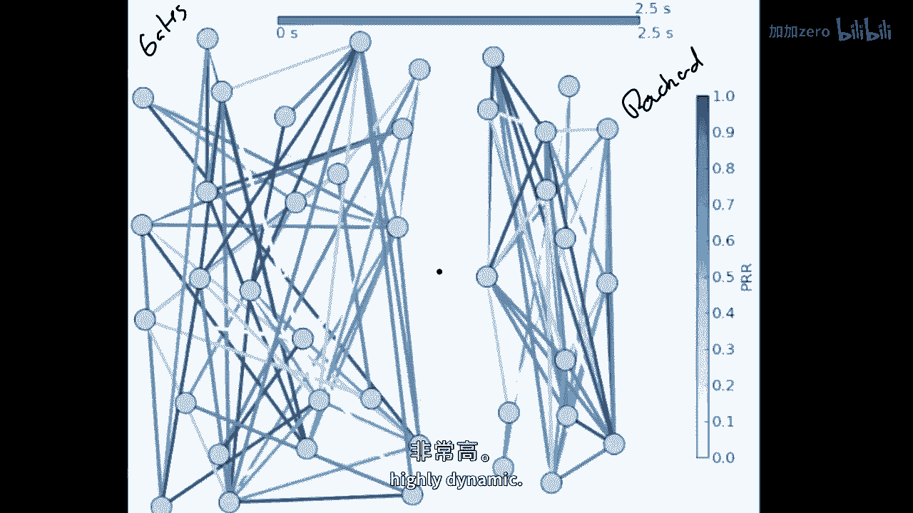
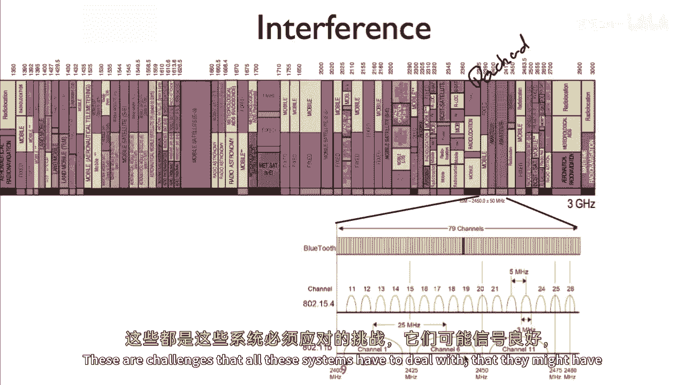
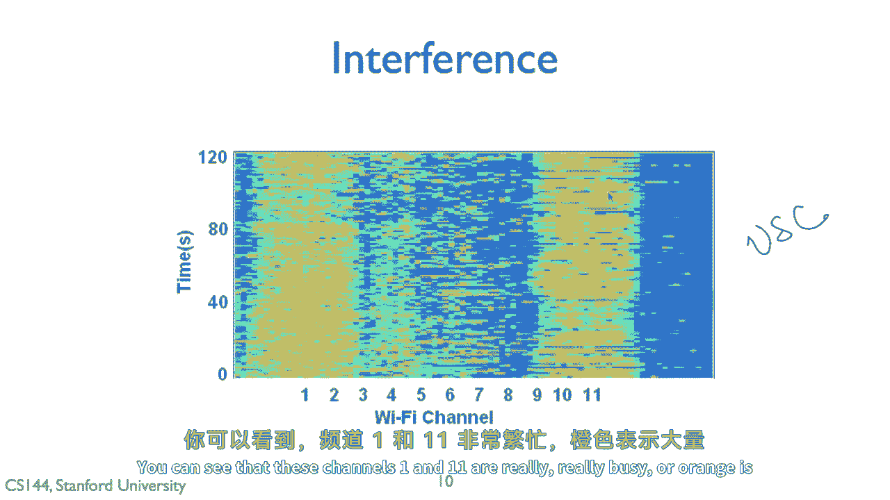
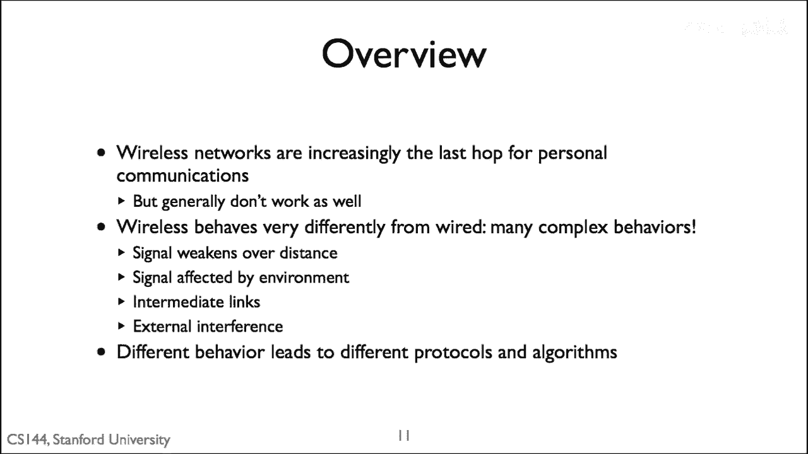

# 【计算机网络 CS144】斯坦福—中英字幕 - P101：p100 7-7 Wireless - How Its Different - 加加zero - BV1qotgeXE8D

所以，这个视频我们将讨论无线网络，并且，为什么在实际应用中无线系统与有线系统有很大的不同，今天互联网上看到的一个大挑战是我们都想无线连接，然而，历史上已经做出了许多假设，那就是网络将像有线系统一样行为。

实际上，将有线系统与无线系统连接往往很困难，这就是为什么你在使用wi fi时看到性能差的原因，所以在这个视频中，我将深入讨论，无线系统为什么与有线系统不同，是什么属性使它如此具有挑战性和困难。

为什么有时候它看起来好像有点不稳定，所以在这个视频的背景下，我将专注于接入点网络，也就是说，我的意思是，无线网络，在哪里，你知道，比如你有一台笔记本电脑，带有一些Wi-Fi卡，并且它连接到一些接入点。

然后，这个接入点有一个有线连接到互联网，嗯，这个接入点经常为多个设备提供服务，嗯，像这里这样的多个设备，比如你的手机，嗯，这与，说一个移动电话网络或3G或4G，被管理得非常不同，控制得更加紧密。

在那些系统中会出现各种各样的问题，我只会专注于开放标准，接入点网络，你知道，你家里插上就能用的设备，将有线连接连接到桥接器，然后连接到更广泛的互联网，关于无线的第一个要认识到的是，与有线网络不同。

在那里的介质，电线完全在你的控制之下，没有人与你争夺那条线的容量，在无线环境中，它是为你和你一个人准备的，你正在利用空间，利用围绕你周围的电磁频谱，这可能是其他人也想要使用的，它不是一个受控制的介质。

它是一个共享的介质，因此在实际操作中，这意味着它被严格地监管，所以这是美国无线电频谱分配的地图，在这里，无线电频谱被分配，所以无线电频谱在这里是大致的概述，我们不是离线，但电磁谱，来自非常低频的东西。

一直到宇宙射线，这就是底部这个大东西，这是一个免费的政府文件，所以一般来说，数据通信在这个地区进行，在这里有不同的种类的通信，要么是数据通信，语音通信，等，在上面，这张图片里有什么。

这个黄色区域是红外线，然后这里是可见光，所以这里是可见光嗯，这里是紫外线X射线，伽马射线，等等，但是rf在下面所以下面，可见光，更低的频率，这就是频谱的样子，所以你可以看到有大片的频谱。

它延伸到三千赫兹，所以当你每秒有三千个波，直到三百吉赫兹或三百亿个波每秒，嗯，如果你记得，如果给定那个，嗯，Rf，或者是在3千赫兹下，电磁关系以每秒一英尺的速度移动，嗯，你看到的是约三百万英尺长的波。

嗯，抱歉，是的，三百万，英尺长，而在到三百吉赫兹的范围内，你看到的是长度仅为英尺的三分之一的波，所以，对于各种事物来说，频率的范围非常巨大，你知道，有电视，有广播，有数据通信，有海事系统，有军事系统。

有卫星，等等，但是当我们谈论接入点网络时，当我们谈论现代数据通信系统时，我们正在谈论这些三个，这些四个狭窄的部分，所以这些绿色的部分是电信，嗯，所以它处于八百九十九兆赫兹的范围内，七百，这是一点。

九电信，马克斯和其他东西开始向上移动，但基本上3G标准在这里，而且这里这两块是这两块红色的部分，这是Wi-Fi，所以当你考虑我们今天所使用的所有数据通信，电话和笔记本电脑，它们都在挤压。

这两块是为微小的切片设计的，现在，关于无线的重要一点要理解是，正如你可以想象，无线传输不是线，无线介质不是线，这意味着与在线上传播的东西不同，那里有一些衰减，或者在铜中一些电阻，嗯。

无线信号是辐射在空间中的，以最简单的方式说，如果你有一个完美的全方向天线，在这种情况下，它在辐射，所以如果你认为它在球体之外，这意味着信号强度随着距离的增加而衰减，至少以r的平方或更快的速度。

当你离发送器两倍远时，信号至少被衰减了75%，它只有原来的四分之一强，因为想象一下球体的表面，这意味着与有线系统不同，我们可以知道，哦，电缆只要它好，并且比一百米长。

我们在无线系统中将拥有强大的信号强度，你往往有非常弱的信号强度，事实上，人们会试图走到边缘，因为他们想要坐在户外，你知道，在他们的Wi-Fi接入点上，此外，与线不同，它被严格控制，没有人在做事情。

无线在你周围的世界中，所以如果有人站在你和你的接入点之间，现在，所有这些无线信号都必须通过这个人，他们是一个大袋子的水，无线会变得非常弱，因此，信号强度随时间将显著变化，当人们打开门时，当你移动时。

人们也会移动，当湿度变化时，此外，那里，其他人也在使用该介质，有很多干扰，这不像你有这条线自己使用一样，你知道邻居可能正在使用他们的无线网络，这是哪个频率的，那么让我们来看看这些信号强度的第一个。

所以这里的问题是在现实世界中有障碍物，并且它们可以移动，并且它们削弱了信号，如果你站在金属板后面，你的无线信号会比如果你站在它前面要弱得多，此外，无线信号反射，所以可能是，我正在站，你知道。

在这里的某个走廊里，我用我的笔记本电脑，这里有一个接入点，并且可能我收到的信号是一些奇怪的反射，来自不同介质，来自不同，嗯墙壁，这里的技巧是在实际中这意味着，例如我在这里得到了这个反射。

但我也收到了一个直接信号，说通过这些墙壁是，与在电线中的线缆在无线环境中不同，你可以有一个叫做多径的东西，你在那里接收到信号，但是你在不同的路径和延迟下得到了多个副本，想象一下，这是一个峡谷的回声。

在那里，你可以听到直接的声音，然后，这些回声沿着不同的路径走，在峡谷的墙壁上反射，所以，没有完美的天线，如果你稍微向左移动，那可能那个天线不好，实际上，那要弱得多，你在那里，突然信号下降，连接中断。

此外，所有这些事情都在不断变化，你可以想象你稍微移动一下，突然多径改变，反射改变，你可以想象我稍微移动一下，天线有点不同，它指向的方向不同，因此，事情在动态变化，你周围的环境，这不是受控的。

可能是有人关闭了他们的办公室门，突然无线信号消失了，只是为了让你感受到这看起来什么样子，所以这是我一个现在在俄亥俄州立大学的学生收集的数据，来吧，它显示给你的是信号强度，嗯，在这里的底部。

随着时间的推移，被称为接收信号强度，指示信号强度，然后顶部，观察到的包接收率，所以这是为一个八零二点一五点四长度的包，他所测量的，所以发射器是静止的，接收器是静止的，对于他所收到的每个包。

他记录了接收信号强度是多少，然后他在观察时间上包接收率的百分比是多少，这条红线显示了通信的长期平均值，实际上，九十三个百分点左右还是挺好的，但我们可以看到的是，仅仅过了几秒钟，信号强度相当稳定。

达到了八十四dbm，这是单位，你知道，它稍微下降了一点，情况稍微恶化，下降了，然后突然下降，仅仅下降了大约六或八dbm，大约是八分贝，所以，大约是十倍左右，或者五倍，五到十倍，嗯，然后发生的是。

那个信号强度低于，这个设备可以接收的包，所以，包接收率在短时间内下降到零百分比，然后它恢复过来，开始接收包，所以，就在这里大约十秒钟的时间内，看起来，一个链接正从，你知道。

从99%下降到80%下降到80%，然后，从5%回升到90%下降到0%下降到70%，你，可以看到这些随时间的显著变化，因此，你的网络在某种程度上考虑tcp，考虑所有这些重传方案都必须处理这种行为，所以。

我将展示给你，实际上，我们部署在这里的斯坦福网络的实时视频，被称为swan，斯坦福无线访问网络是一个从800到1101MHz的BG测试床，所以Wi-Fi，它大约有25个节点左右，基本上我要向你展示的是。

这个网络将在2。5秒内收集的数据，所以这是每2秒的一个时间步，5毫秒，有100个时间步，每个这些是一个节点门，是计算机科学系，帕卡德是E部门，这里有这个嗯，萨拉之间有一条街，所有。

我要向你展示这个网络随时间的样子，所以对于每个节点，节点之间有连线，这些连线显示你的数据包接收率，这些长度的其中一些，一条暗线意味着所有数据包都被接收，嗯。

没有或非常轻的线条意味着没有收到或只收到很少的包。

所以看这些链接发生了什么，它们变化的速度如何，记住这是2。5秒，所以我们可以看到链接的来回，它们在2。5毫秒或更少的空间内改变，看，看看这个链接在这里如何振荡在80%和10%之间，来回看链接之间的链接。

所以这里的要点是，像Wi-Fi网络这样的无线网络中，他们非常高度动态。

因此，除了信号强度随时间变化的问题外，还有干扰的问题，所以，今天的许多无线通信都在未经许可的Wi-Fi接入点上进行，网络在未经许可的频带上进行，那些不需要政府许可的频带，任何人都可以使用这个频带。

这就是为什么他们，他们如此受欢迎，因为他们是免费的，嗯，但是，然后，许多不同的技术共享频带，所以，这里有一张地图，例如，仅在两点四GHz上正在发生的事情，基本上，两点五GHz的范围，这是Wi-Fi。

Wi-Fi的低频，所以，你可以在这里看到Wi-Fi 8。0到11。0b，在这些不同的范围中，你可以看到其带宽为22MHz，这里是通道1、6和11，但在相同的频率范围内，有80，两，十五，四。

低功耗的Zigby，使用相同频率范围的无线系统，蓝牙也使用相同频率范围，所以这意味着在八零二一一的东西可能会受到二五四的东西的干扰，反之亦然，这些都是所有这些系统都必须面对的挑战。

他们可能会有良好的信号。

他们可能噪音较低，但是然后有人干扰他们，所以例如，如果你只是看看随着时间的无线活动是什么样子，这是一张非常漂亮的图表，嗯在，Prakash，Kka wali现在是在uh，休斯顿大学的教授生成的。

这是一张来自usc um的数据票，这是他以前是学生的地方，博士生，你可以看到，看看所有这些Wi-Fi活动，所以这里是从零开始的时间和秒数，两分钟和不同的Wi-Fi频道，一至十一，你可以看到。

这些频道一和十一真的很忙，或者橙色显示大量的Wi-Fi活动。

所以这里的课程总结是，无线网络正在变得越来越重要，我们宁愿无线连接到互联网，而不是将电线插入我们的笔记本电脑，但一般来说，它们不工作那么好，他们并不可靠，他们更不稳定。

这是因为他们处于这个共享媒体中的事实，这是无法控制的，许多不同设备都在使用它，周围的环境正在变化，并且有很多干扰，因此，从实践中这意味着要试图使无线网络，你知道，足够好啊，就像可以被使用一样，一。

这些不同的特性和行为，无线实际上使用非常不同的算法和协议，所以无线链路层看起来不同于有线链路层，无线媒体访问控制系统看起来不同于有线的，因此，接下来的一系列视频将进入一些这些差异。

