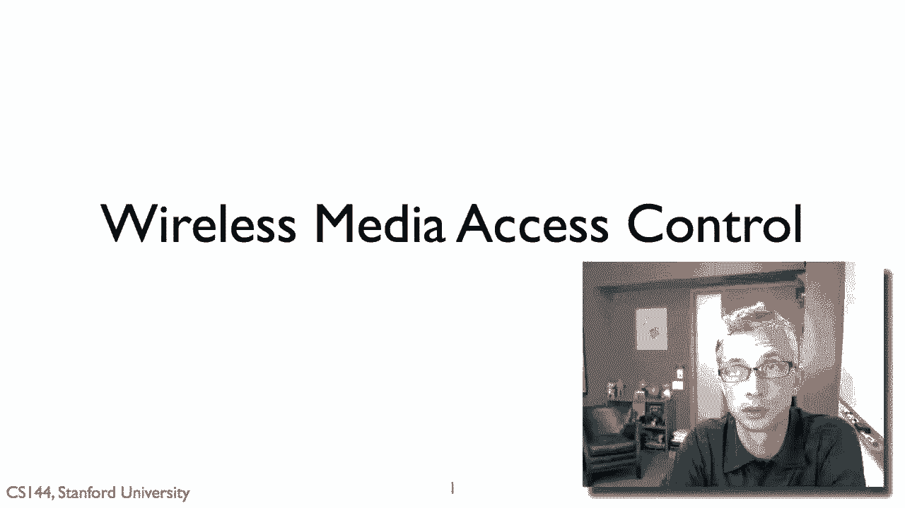
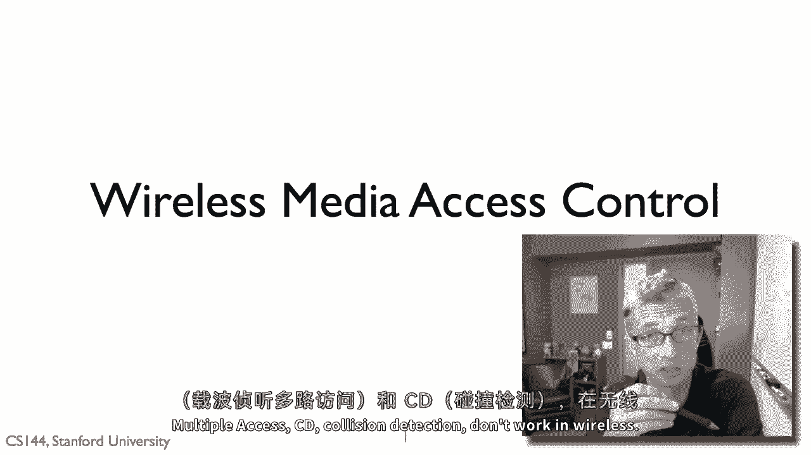
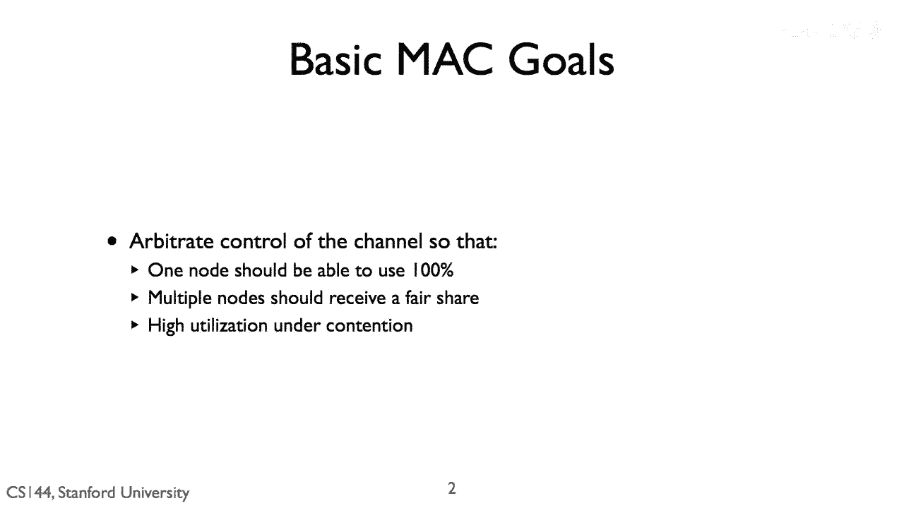
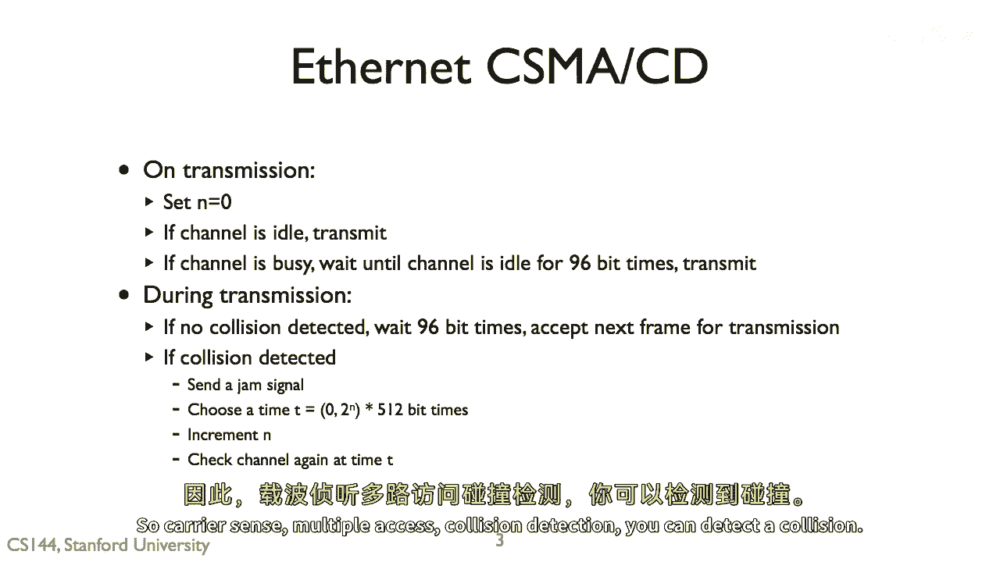
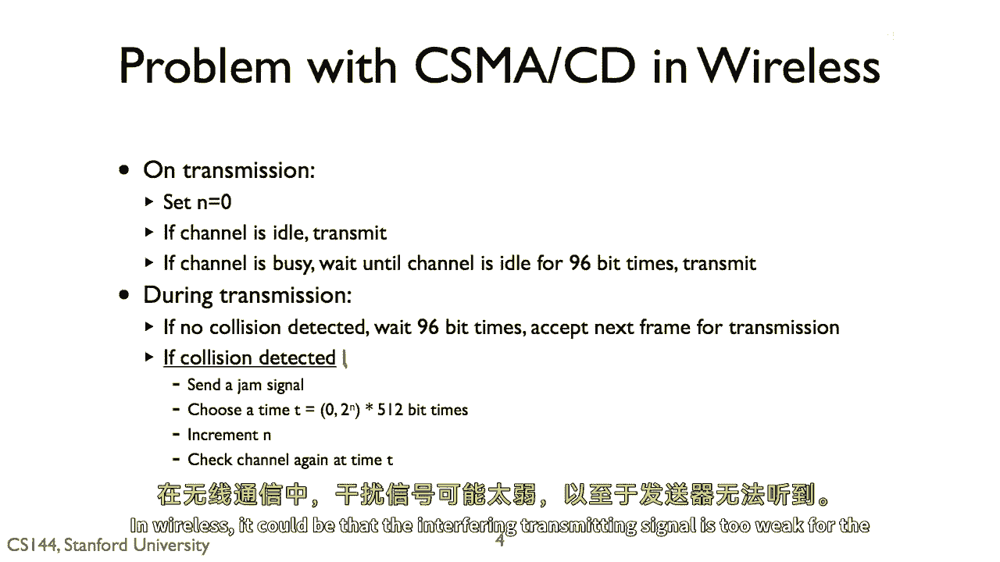
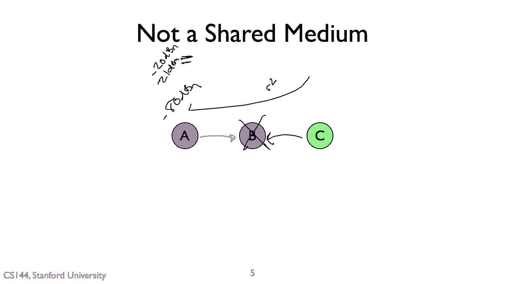

# 【计算机网络 CS144】斯坦福—中英字幕 - P102：p101 7-8 Wireless - Principles MAC - 加加zero - BV1qotgeXE8D

所以在这个视频中，我要谈论无线媒体访问控制，以及为什么我们在有线系统中看到的媒体访问控制算法，如cma，在这些算法中不工作，载波感知，多路访问。

CD碰撞检测，在无线中不工作，以回顾媒体访问控制协议的基本目标，嗯，实际上有三种，那就是你想要仲裁控制通道的控制权，谁在适当的时候可以传输，同时试图实现三个一般目标，你不能同时实现所有这些。

所以你需要在它们之间做出权衡，第一个是，如果只有一个节点想要传输，它应该能够获取到媒体的百分之百，第二个目标是，如果你有多个节点试图传输，它们应该各自得到媒体的公平份额，所以假设一个，最后。

如果有很多节点在争夺，你喜欢它，那么媒体被广泛使用，所以如果这个一个，第n个只是介质的千分之一，这并不很有用，这是我们在媒体访问控制协议中的三个目标。

所以以太网CACD载波感知，多路访问碰撞检测，Um在传输上有一个简单的方法，嗯，你设置一个计数器，N um，如果通道空闲，你只是感觉到电线上电压的传输，如果它忙，嗯，你等到它空闲九十六位时。

这是乙网中的定时器吗，然后你在传输期间传输，你可以检测到碰撞，那就是，你听到正在传输一些零和一，但你听到的你听到的和你听到的其他一些不同，你以为你在传输零，所以如果你检测到碰撞，电压与你期待的不同。

你等待九十六位时间，嗯然后如果很抱歉，如果没有碰撞，那么你只需要等待九十六位时间，它们被传输得很好，然后你将再次传输，如果你这样做来收集，检测碰撞，然后您发送阻塞信号，所以每个人都知道有碰撞。

只是为了确保，然后您后退并后退的幅度是指数增加的，嗯，您再次检查频道，所以有想法您开始传输，如果频道空闲，如果您听到碰撞的频道，然后您发送阻塞信号，您后退并等待，所以载波感知，多址碰撞检测。

您可以检测碰撞，结果发现这种方法在无线上不工作，基本原因是这个步骤，如果检测到碰撞，问题是发送器正在传输一个被接收器接收的信号，发送器将听到其自己的信号以非常高的信号强度，你知道它正在自己旁边。

但它不一定能听到接收器在有线网络中发生的事情，因为距离上的衰减很小，发送器和接收器共享他们对环境的观察，你知道，如果，如果接收器听到信号，那么发送器也将听到那个信号，因为它将沿着线以很小的衰减传播。

但这不是真的，在无线中。

可能干扰的传输信号对发送器来说太弱了无法听到，所以这里有一个，让我来给你展示一个例子，所以这里我们有一个，B和C，并且A是我们的发送器，它正在向B发送一个包，B接收这个包是正常的。

然后同时C开始向B发送，现在见B能够听到C的信号，B能够听到A的信号，当他们都到达时，它只是听到垃圾，有干扰，但结果是C信号因为它至少与距离的平方成反比在衰减，所以对A来说太弱了无法听到，特别是。

因为A自己的信号是如此强大，它正在喊叫，并且C来自很远的地方，即使C信号足够强大让A听到，A无法听到C信号过自己的信号，因为A的信号说在这里，因为它的信号说在这里，你知道在某种程度上。

假设是减去二十分贝，而C信号到达的减去八十分贝，A听不到它，它正在努力听到低语，尽管它在大喊，做不到，存在冷漠，与电线相比，C信号将到达，你知道我会说减去二十一分贝，它不会衰减得很多。

因此A仍然能够听到它，因此这里的问题是A在B处无法检测到碰撞，所以CMACD不工作，这意味着在实际中，无线网络为了能够响应碰撞，为了能够充分利用通道。

