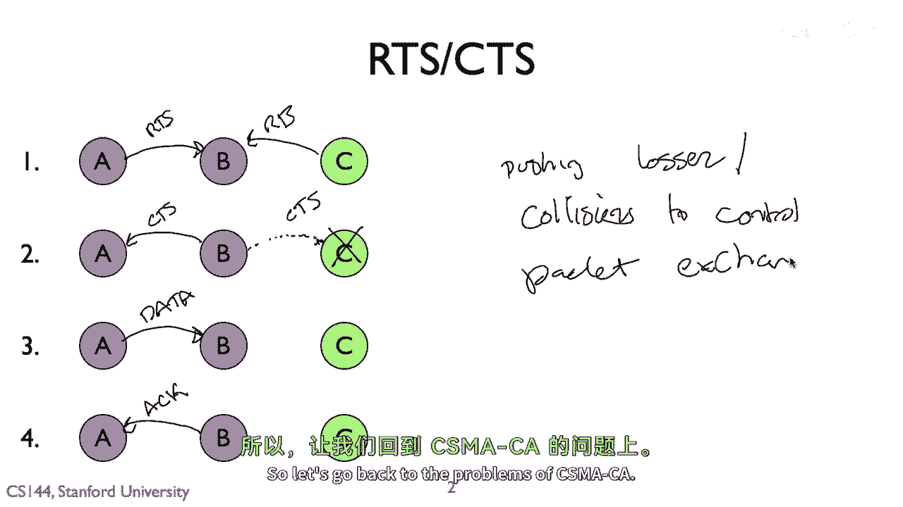
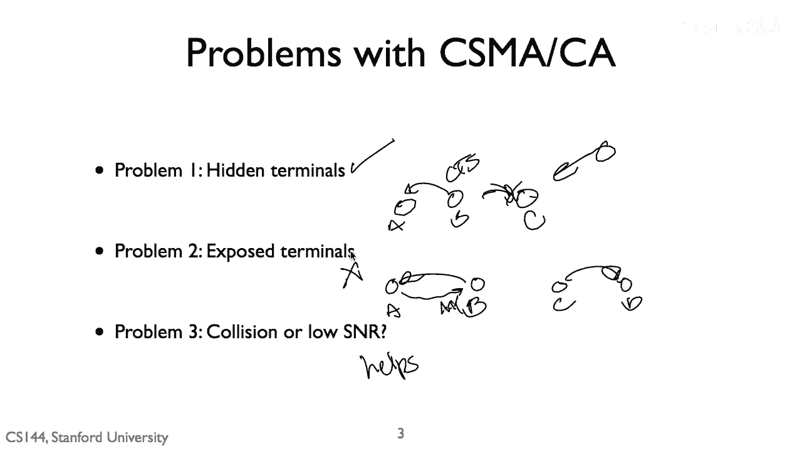
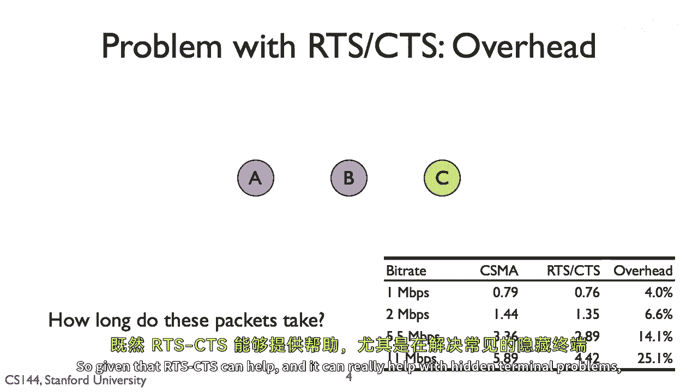
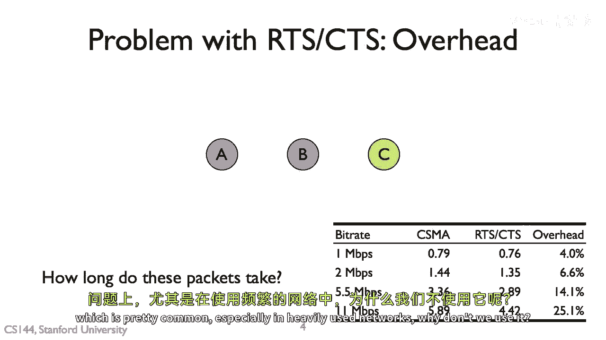
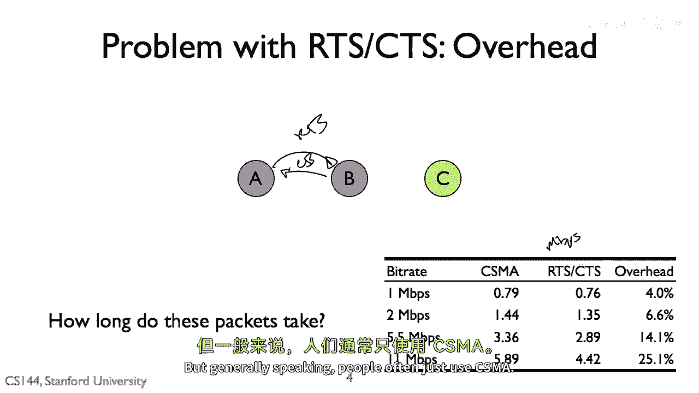

# 【计算机网络 CS144】斯坦福—中英字幕 - P104：p103 7-10 Wireless - Principles RTSCTS - 加加zero - BV1qotgeXE8D

所以，在这个视频中，我将谈论发送无线媒体访问控制算法的请求。

所以，发送请求或rts的请求，ts，使用一组短的控制包，来确定这里是否安全传输数据，我展示了三个节点，a，b和c，嗯，a可以在听到b的同时，b也可以听到c等，但是a和c无法听到彼此，因此。

在rtts交换中，而不是立即发送一个数据包，就像你在，说csm a可以只是传输，第一步是a发送被称为请求发送包的消息，或者rts有一个短的控制包，它问b我可以发送一个持续时间为这个的包吗。

如果b成功接收到rts，它相信它可能接收，例如，它认为附近没有人在传输，然后它可以以清晰的下降方式回应，TS，并且它可以告诉你在这个时间段内你是清晰的可以发送，这里的关键点是c可以听到清晰的可以发送包。

并知道b将要接收数据，因为b知道b将要接收数据，它知道应该在那个时间传输，因此，这个清晰的可以发送可以阻止c传输，因此，理论上可以预防我们在csm网络中看到的隐藏终端问题，所以，接下来a发送数据。

然后是b发送确认回传，这是基本的rts/ts交换，rts后跟着ts后跟着数据，然后是一个动作，当然，如果a向b发送rts，它没有听到清晰的发送许可，他们可以总是后来再试，这就是你看到的标准后退步方法。

例如，"你在CSM MA CA数据传输中看到的指数备份"。"所以，这里的重点是它不是rts"，"CTS有更低的概率说隐藏终端问题"，"但是，它实际上在做的是"，"它将这个问题推给了控制数据包交换"。

例如，"这可能是艺术中的一种"，"A和C试图同时传输RTS，这就导致了碰撞"，"但是，这并不会从a到b显示出数据包丢失的情况"，这将导致额外的rts数据包，所以rts ts在推，损失和碰撞，到控制。

数据包交换。

所以让我们回到csm的问题，隐藏终端，暴露终端和碰撞或低snr，所以您可以一个一个地问是否使用rts，ctx有助于或解决这些问题，所以首先隐藏终端，所以rtts无法解决这个问题，总是可能，例如。

rts未被听到，cs未被听到，嗯，例如，我们有，嗯，B向A发送ts，但是其他节点正在传输，因此c没有听到它，因此隐藏终端可能发生，但rtts大大减少了它们，通过发送清晰的发送包并清除接收器周围的通道。

所以大部分情况下，它没有解决它，但它大大有帮助，那么关于暴露终端，所以记住暴露终端是我们有一个节点在这里，让我们说c，所以b想要向a传输，C想要向d传输，并且c不会传输因为它在这里的b正在传输。

所以理论上非常可能c可以传输到d，所以b将发送rts，然后将有ts，c没有听到rts，没有听到ts，所以它知道它可以传输，但在实践中这并不真正工作，原因是c不想向d传输，因为a将发送确认，嗯，所以通常。

rts实际上不会对暴露终端有很大的帮助，那么关于碰撞或低snr，考虑到rts，cts可以减少碰撞，隐藏终端，它可以帮助解决碰撞或信号到噪声比低的问题，在数据丢失发生的意义上，它们更可能是低的。

S和R是它们碰撞速度较慢的概率，它不能解决这个问题，但它可以提供帮助。

所以给定rts，cts可以帮助，并且它可以防止，你知道。

真的很有助于隐藏终端问题，这是非常常见的，尤其是对于严重依赖网络的用户，我们为什么不使用它。

为什么它是当今Wi-Fi系统的主流，使用CSMA/A，所以原因是开销，所以回忆一下我们有这个数据包交换，我们有rts，然后我们有ts，嗯，所以问题是这些数据包需要多长时间，有一些控制包，嗯。

但仍然只是那样，嗯，Wi-Fi，例如，工作原理是，这些控制包实际上需要花费相当长的时间，嗯，原因是与数据包不同，你可以以非常高的速度发送数据包，仅仅送到目的地，知道它将有一个高的信号到噪声比。

所以您可以使用密集的星座，您可以以非常快的速度发送它，这些控制包需要每个人都能听到，它们总是必须以非常低的速度发送，所以无线，嗯，物理层和许多不同的速度，您总是必须以最低的速度发送这些控制包。

所以如果你看，让我们说这只是一些数据，我的学生收集了只使用八零到十一比特，所以它有四个速度，一、二，五点，五和十一兆比特每秒，嗯，这就是观察到的，嗯，"每秒兆比特吞吐量"，嗯嗯。

"观察到的数据传输速率"，嗯，"网络层"，所以你们正在交换这些框架，"所以你可以看到"，"如果你以每秒百万比特的速度交换数据框数据框"，"这个小的控制交换并不算什么大事"，"这只是因为控制包"。

实际的数据包本身是以百万比特为单位被发送的，这些控制包很小，但是随着数据率的提高，随着数据包在时间上越来越短，它们传输的速度越来越快，开销增大，这些小的控制包在空气中所占的比例越来越大。

如果你以每秒11百万比特的速度传输它，你可以大约得到5。8，8，每秒9兆比特，来自CMA，但4。4，RTTS中的两出二是二，5%的冗余，因此，使用RTTS将降低您网络的吞吐量四分之一，所以。

如果您没有碰撞，如果您没有隐藏终端，网络空闲，您遭受了重大损失，所以人们讨论的一种方法是，如果你看到很少的损失，事情正在顺利进行，你使用cma，但如果你开始看到碰撞，你开始看到损失。

然后切换到rtts以获得更好的仲裁，所以对此进行了一些研究，但一般来说。

