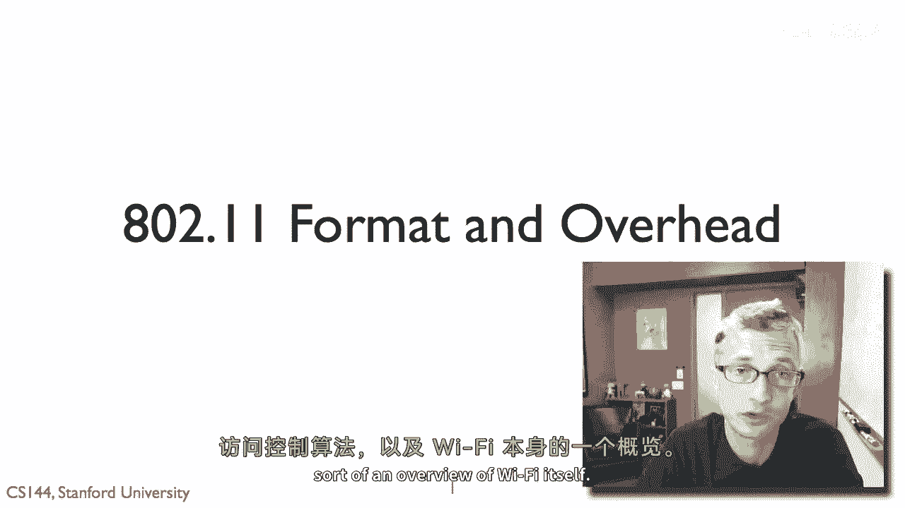
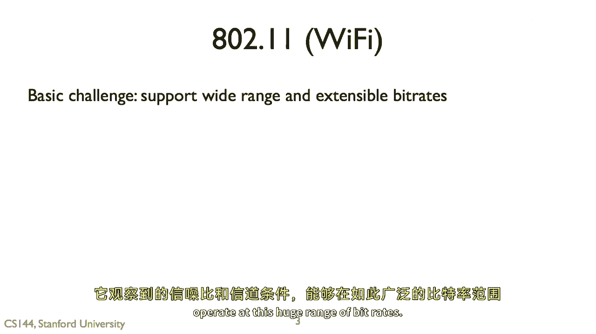
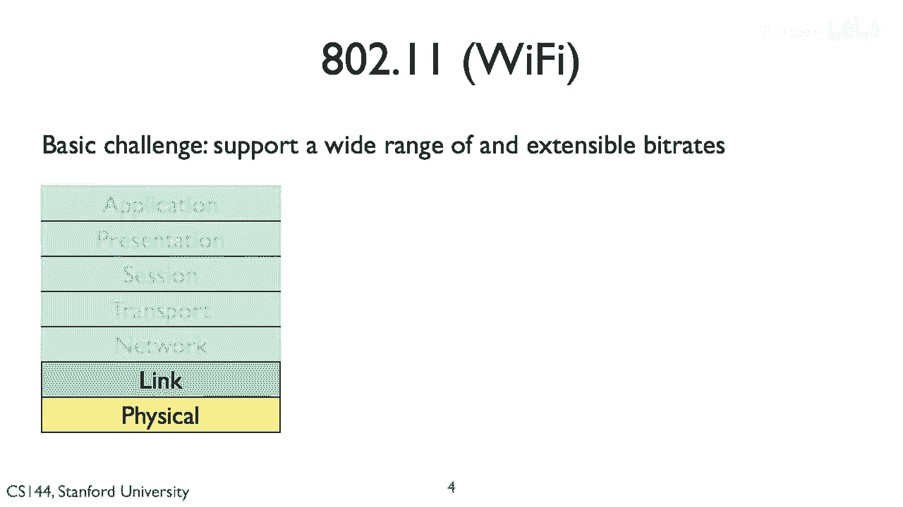
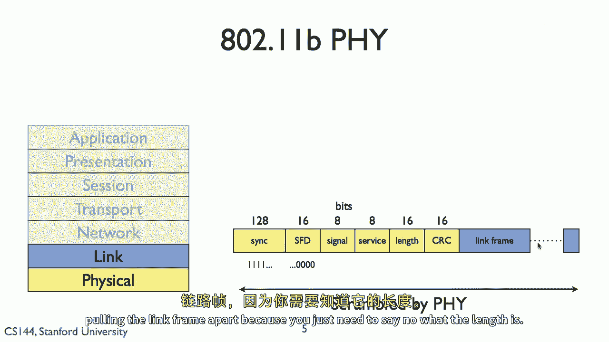
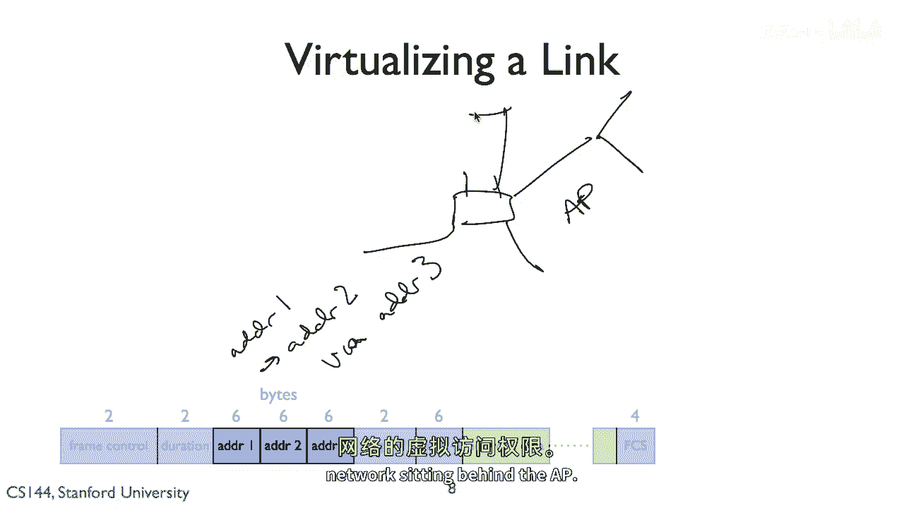

# 【计算机网络 CS144】斯坦福—中英字幕 - P105：p104 7-11 Wireless - Principles WiFi - 加加zero - BV1qotgeXE8D

所以在这个视频中，我将深入探讨802。11或Wi-Fi的细节，但是，它的包格式看起来像它如何使用不同，你如何使用不同的中间访问控制算法，以及Wi-Fi的概述。

所以当我们谈论物理错误和编码在不同调制方案时，像802。11n这样的某种东西可以操作在不同的速度上，所以这只是一个有限的集，嗯，一个非常，实际上，一个相对较小的802。11n链接可以工作的方式子集。

所以，MCCS索引实际上是包中的一个字段，并告诉您数据包的数据部分，嗯，如何数据部分被调制和编码，所以实际上，802。11m被用于从二进制相位移键到64，正交振幅调制，编码方案从一半到五六分之一。

这意味着您在802。11n链接上看到的数据速度范围，将根据观察到的信号到噪声比进行适应，嗯是从，这只是一个子集，实际上，它去得更快，我们将在未来的视频中看到MIMO的，从6。

5兆比特每秒到150兆比特每秒，这是一个因素，你知道，超过20个速度之间的差异，所以Wi-Fi 802。11n，它能够根据频谱的情况，根据时间情况，能够适应一个非常广泛的速度范围。

所以它可以根据通道条件调整其长度，与有线系统相比，因为信号到噪声比是固定的，基于介质，您只能有一个固定的速度来操作。

这是最快的速度，另一方可以做到，你想象这是一个挑战，那就是Wi-Fi，根据服务于通道条件的信号到噪声比，想要能够操作在这个巨大的比特率范围内。

所以这是如何工作的。

这发生在物理和链路层，所以发生了什么，这是802。11b物理层的样子，这里有一个物理层头部，它以一些同步位开始，这允许另一方检测，哦，这实际上是Wi-Fi信号，这不是垃圾，嗯，所以有一系列的同步位。

紧随其后的是十六位，表示，好的，不再同步，这个被称为fd或帧起始分隔符，所以，你有一个特定的比特序列期待，嗯，然后有一个帧起始分隔符，表示同步已经结束，因为可能，你说，在同步的中间。

你不知道它什么时候结束，然后，在那之后有一个由四个八位组成的序列，表示信号，服务，这个物理层的长度和crc，块，所有这些都被物理层使用前向错误纠正进行散列，编码和交织所有这些种技术。

使它们现在能够抵抗两比特错误，当然，你需要得到这个，嗯，完整地，在你开始说之前，从链接中分离。

因为你似乎说，知道长度，这就是物理层，在链路帧中，我们有许多字段，有帧控制字段，这给你关于帧的控制信息，它是什么样子的，有持续时间，这告诉你这个包或它的一些事情将花费多长时间，这真的很重要。

如果说数据率高于你可以解调，比如你没有足够的信号与噪声比，所以发送持续时间，你知道这个包或交换将花费多长时间，这是一种告诉方法的方式，嘿，它将花费多长时间，帧头中可以嵌入最多四个地址。

通常你只有有两种地址模式，哦，有源和目的地，但你还可以做其他事情，比如你说你想跨越网络等，有序列号，嗯，然后有网络数据，来自网络层的数据，最后有一个帧检查序列，所以，想象一下这就是一个crc。

它是四个字节的，嗯，帧检查序列，所以，让我们先看这两个字段，帧控制和持续时间，现在，这些都是用来做什么的，所以我说，持续时间字段告诉听众，其他可以听到包的节点。

并且接收者也知道这个数据包或数据包交换将要花费多长时间，这样，即使他们无法理解这些数据包，因为它们太快，他们知道它将要花费多长时间，并且他们可以使用这个被称为虚拟载波感知的东西。

这里的想法是回忆起在cca算法中，当一个节点在通道繁忙时，它会开始倒计时，现在，它可以直接通过监听来检测通道繁忙，或者它可以通过被告知通道繁忙来虚拟检测通道繁忙，这个持续时间字段，例如。

是CTS包用于告诉周围的节点什么，嘿，准备发送，你知道你的频道在这个时间内忙。

因为我正在接收一些东西，所以你不应该传输，以便另一个东西，O211和头部可以做的实质上是虚拟化一个链接，所以我认为我们有这三个地址，所以我不去第四个，让我们只考虑这些三个，所以这就是这种情况。

如果我想要一个ap，行动，嗯，更像是一个开关，说比一个独立的链路层设备，到哪个包都目的地，更强，所以在这种情况下我可以说嘿，我想发送这个，你知道，我想要从外部发送一个数据包，两个加法器，两个通路。

加法器三，有一种方法可以告诉AP，啊哈，你知道，我想要将这个数据包发送到这个其他链路层地址，通过我们发送，所以你可以虚拟化这个接入点的链路，并因此将无线连接的节点分配给。

"对坐在AP后面的有线网络的虚拟访问"。

"所以，我们在rtts中看到的一件事是"，"取决于你使用的速度"，"Rts"在中文中通常被翻译为"实时战略"或"实时战术"。"CTS"的中文翻译是"城市交通信号系统"。"这些控制包可能产生显著的开销"。

"至多25%的11兆比特到11比特"，"这一切都归结于这样一个事实，因为八个零"，"211有这巨大的比特率范围"，"但它需要向后兼容"，这表示说这物理区域，物理帧头部需要由所有听者理解，所以我不能。

如果我是传输者，我不能以满速传输物理头部，所以如果我在运行一兆比特或六百兆比特，我还是需要以同样的速度传输这个头部，所以每个人都能理解它，就像持续时间字段一样，所以思考这个问题的方式是。

因为最慢的链接是，说一兆比特每秒，我需要传输这个，即使操作速度可能甚至达到每秒一兆比特，每个人都能理解它，那么数据区域可能会节省你，也许也许会节省你，每秒六百兆比特，如此微小，微小，微小，但是。

这个初始控制序列的长度仍然将保持不变，这意味着在实际应用中，随着Wi-Fi速度越来越快，越来越快，越来越快，正确，所以你可以想象，如果我的速度很慢，那么这1兆比特的数据速度就会很慢，这里是控制。

这里是数据，控制相对于数据来说很小，但是当我使数据区域越来越快时，这里是更快的数据，控制或者更快，它可以，实际上，这里控制的是数据，这里的控制可以成为包的主导持续时间，与数据区域相比。

这些位被发送得如此之慢，嗯，你看，在网络层顶部，所有这些空中时间都被这些控制头部消耗，因此，微软研究院的人做了一些，你知道对这种的分析，并表明看，当您在六百兆比特每秒的操作时，以最快的八到十一速为例。

八到十一n，你今天可以做到，嗯，这个控制序列占据了你总飞行时间的92%，那就是，你实际上只花费了8%的时间发送数据，所以你可以想象，即使你加倍你的数据率，你实际上不会加倍你的吞吐量。

"因为你即将从消费中转变"，"从百分之八的时间到百分之四的时间"，"但是那时你的城市仍然有96%的人会被控制交通所占据"。

"因此，存在递减的回报"，"所以，八点到两点十一点是这个基本Mac格式的时间"，"它设计用于在多个物理错误上工作"，"许多调制方式"，"许多速度"，但是，其中的一部分是它需要支持反向，"兼容性"，所以。

我们不如说，谈论这个，以及这个包要持续多久的字节数，它谈论了这个包在何时将持续多久，即使你不知道调制方案是什么，因为它是你设备不讨论的未来Wi-Fi版本，它知道包的长度，嗯，MAC控制事情。

像发送包的控制都是根据持续时间进行的，有这个持续时间字段，我在哪里可以说嗨，为了这个数百万分之一的微秒，我身边的频道需要更清晰，它的水平也允许你通过嵌入额外的地址虚拟化一个链接。

这样你可以实际上在有线和无线以太网之间建立桥梁，所以当我们读到关于越来越快的wi fi的所有事情时，你知道，六百兆比特每秒，在实际应用中，它实际上并没有那么快，而且这是因为这些用于向后兼容的控制头部。

兼容性和互操作性最终会消耗你所有的空闲时间，因此，实际观察到的数据传输率，在六百兆比特每秒的Wi-Fi链接上远低于，六百兆比特每秒，它可能更接近于最多，你知道。

