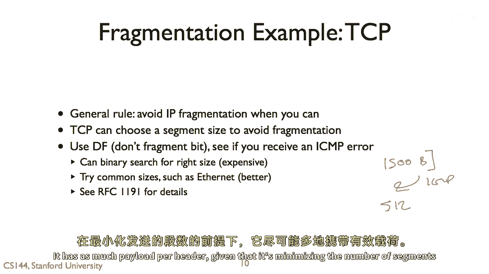

# 【计算机网络 CS144】斯坦福—中英字幕 - P106：p105 7-11a Fragmentation - 加加zero - BV1qotgeXE8D

 So in this video， we'll talk about fragmentation and assembly。

 So here's the basic problem that fragmentation assembly tried to solve。 Let's say that myth。

 I'm using some， she and Stanford， and the myth cluster， and I want。

 to request a web page from Google。 And Google's web page that it sends this HTTP response is 10 kilobytes long。

 Well， 10 kilobyte chunk of data is pretty big。 And the problem is that there might be some hop along the path from Google to myth that。

 they can't support a 10 kilobyte packet。 In fact， ethernet， the maximum transfer unit。

 many speeds of ethernet support is 1，500 bytes。 And so what I need to do is take this 10 kilobyte packet and break it into a series of chunks。

 smaller pieces called fragments， which the network can support。 So imagine like the extreme case。

 if Google， if I'm downloading something really big， I。

 don't want to be sending one gigabyte packets。 They're going to occupy the channel for a huge amount of time。

 So I'm going to break things into smaller chunks。 So in this case。

 if I had say ethernet frame size of 1。5 kilobytes， I'll need to split this。

 10 kilobytes into seven fragments， where these first six could be 1。5 each and the last one。

 say is one， 1 kilobyte。 So that's the process of fragmentation。

 And these fragments arrive at myth and its job is to assemble this assembly。

 So to take these seven fragments， two， three， four， five， six， seven， and reassemble them。

 to the original 10 kilobytes of data。 And so generally speaking。

 fragmentation and assembly occur when a higher layers data unit。

 is larger than what a lower layer can support。 It's a fragmentation of the process of taking a large chunk of data and breaking it into。

 smaller pieces that the lower layer can support。 And assembly is in the process of taking these fragments and reassembling them into the original。

 data。 This occurs in many different places and networks at different layers。 For example。

 it can occur at the transport layer。 So TCP does this when it takes a stream of data。

 it breaks it into segments which are， then transmitted and reassembled at the other side into a reliable stream。

 And this assembly is now occurring end to end between the TCP endpoints， such that given。

 TCP segment， once it's generated by an endpoint， is then indivisible and arrives at the other， end。

 You never see a segment broken into two separate segments。

 Although underneath it might be broken into packets or frames， this will show。

 Contrast the network layer， it's operating on a host to host basis。

 This is unlike TCP where once a segment is sent， that is the segment the endpoint will。

 receive if it arrives。 With IP， at the network layer。

 it's possible that some intermediate node takes the packet， and breaks it up。

 So an RP packet traversing the network at some intermediate point might be broken into。

 multiple IP fragments which then the endpoint has to reassemble into the original IP packet。

 So this is at the network layer and so it can occur within the network。 Finally。

 it can also occur at the link layer。 So one example is there's a link layer called Zigbee or 802。15。

4 that has a very small frame， size of approximately 120 bytes。

 127 but that doesn't yet include the header and that。

 And there are times when you want to send large packets on this frame size like an IPv6。

 packet which can be a hundred and twelve hundred and eighty bytes。

 And so it happens is that the IP layer passes a twelve hundred and eighty byte packet to。

 six low pan called IPv6 low power personal network。 It's to link layer support for IPv6。

 And six low pan， the link layer breaks it up into fragments which are then sent over the。

 link reassembled at the other end of the link into an original packet。 So in this case。

 the fragments are purely on the link and the network layer doesn't see， it and the IP case。

 the network layer sees it， the transport case， transport layer sees。

 it but the other tranactral transport segments are not broken。

 So let's walk through concrete examples。 The most one of the really common cases of a fragmentation or rather it's not common people。

 try to avoid it but it's a very simple mechanism so it's good to explain is how fragmentation。

 works in IP in the internet protocol。 Here let's imagine we have a route between across three hops where the first and third。

 hops use ethernet within maximum transfer unit of 1500 bytes but the middle hop uses。

 a point-to-point link with a maximum transfer unit of 576 bytes。

 This means that at the link layer the frames can only support say 576 bytes of data or 1500。

 bytes of data in their payload。 So what happens now is some application that the host on the left wants to send a 1400。

 byte payload。 And so on the first hop this is fine。

 we can take a 1400 byte payload and IP header is， 20 bytes and so we have 1400 and 20 bytes。

 We can then put that in ethernet frame， 1400 and 20 fits just fine inside ethernet。

 But what happens when we hit the second host？ We can't take this 1400 byte payload and put it into a PPP frame because it won't fit。

 So what IP does is it takes the original packet and splits it into three fragments。

 So this is something which is going to occur here at this node。

 This node is going to receive an IP packet of 1400 with a 1400 byte payload and it's。

 given IP header then realizing it should go over this PPP link will take it and generate。

 three separate IP packets， I'll show how they're formed by the minute， as separate PPP frames。

 with smaller payloads。 In this case say 512， 512 and 376 bytes。

 But so the trick though is that once this packet has been fragmented at this second node。

 those fragments then pass through the network unchanged。

 So the third node here does not reassemble them。 Instead what's going to happen is that it's going to just for them along and put these。

 three IP fragments inside ethernet frames and for them along to the destination。

 And then hopefully the destination will receive all of them and reassemble the original data。

 of 1400 bytes。 So how does this work？ So if we look at an IP header。

 there are a couple fields in it which allow this to happen。

 So basically there's the IDEN field in an IP packet here。

 And the IDEN field is what allows the fragmentation to send the layer in IP or the fragmentation。

 assembly in IP to be able to tell whether or not these are fragments of the same original， packet。

 So before fragmentation we're going to see a packet that looks like this where it's IDEN。

 to say some value x。 And remember here this is the more fragment bit of the IP header。

 This is zero here。 This is the more fragment bit。 And there's the offset field。

 There's this original packet， this is a standard IP packet。 It's just not a identifier。

 There are no fragments。 There's an offset of zero。 And it's just a 1400 byte fragment。

 But then after the packet is fragmented， the more fragment bit is set for all what the last。

 fragment。 The first fragment here and the second fragment both have the more fragment bit set to indicate。

 that more fragments are coming。 The last one does not。

 And then the offset field tells a receiver where this data begins。 And so as we can see here。

 this is a 512 bytes of payload。 And so this goes from offset zero to 511。

 Now this second fragment is going to start at byte 512 and it goes from byte 512 to 1024。

 And so the offset field is what indicates this。 So the offset field is not in terms of bytes but rather in 8 byte chunks。

 And so 64 times 8 is 512。 And so this tells the receiver that this second fragment occurs at offset 512 within the packet。

 that's at offset zero。 And then this is of course at offset 1024。

 The ident field is identical in all three fragments。

 And so this means that now in an endpoint receiving these three fragments can properly。

 reassemble the original IP data gram。 And so the combination of the ident field and the source address is what allows it to。

 cluster these three fragments together。 And now since the offset fields encoded in 8 byte chunks。

 that means that each of these， chunks， these fragments must be a multiple of 8 byte long。

 8 bytes long except for the， last one。 So fragmentation is in the IP case really helpful because it means that an endpoint can generate。

 an IP packet without having to worry about what the intermediate maximum transfer units。

 of the links are。 So it's a great way for an endpoint to be able to generate packets without having to。

 know properties of the entire path， especially if say the path is dynamic。 But being said。

 in practice systems really try to avoid IP fragmentation。

 And the reason is that you've suddenly taken one packet and made it into multiple packets。

 And so now the chances that any one of those packets might be dropped goes up。 If say， let's say。

 you know， 1% of all packets are dropped， suddenly increasing the probability。

 that any that one of those three and therefore will be dropped and therefore the whole original。

 packet will have to be lost。 IP doesn't support any reliability or retransmission of these fragments。

 So one fragment is lost， generally you have to retransmit all of them that's up to a higher， layer。

 So generally you want to avoid IP fragmentation。 So one interesting trick that our approach to TCP sometimes uses is to actually choose。

 a segment size to avoid fragmentation。 Since TCP segments can be of any size that TCP wants。

 what it does is it tries to generate， segments which will fit inside IP packets and not fragment on the path to the destination。

 And the way you can do this is by setting the don't fragment bit。

 And so say TCP connection when it opens up it can say choose well I'm going to try sending。

 let's just say a standard ethernet frame of 1500 bytes。 I'm going to set the don't fragment bit。

 And if it gets an ICMP error saying oh， you know， couldn't， you know， this thing， couldn't。

 I had to fragment it and I couldn't， then it says， oh， I'll try something else。

 There must be some smaller like， oh， I'll see if maybe there's a 512 byte PPP link。

 There's a bunch of ways you can search for this。 One is to do a binary search that's expensive。

 You can also just common try common size is like 1500 bytes。

 There's an RSC that talks about the option。 There's an approach where TCP can actually sense the connection。

 sense the properties of， the path for connection and based on that pick an optimal segment size such that it doesn't。

 have fragmentation but it's also able to minimize header overhead。

 It has as much payload per header given that it's minimizing the number of segments that。

 it sends。 [BLANK_AUDIO]。

