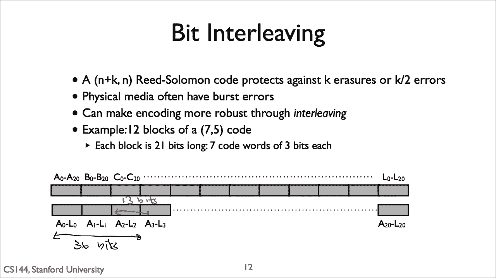

# 【计算机网络 CS144】斯坦福—中英字幕 - P107：p106 7-11b Forward Error Correction - 加加zero - BV1qotgeXE8D

 Noise and interference can lead to significant bit errors at the physical layer。 In this video。

 I'll present Ford Error Correction， or FEC， a technique that allows the network。

 to successfully receive frames that have bit errors in them。

 It's called Ford Error Correction because the approach assumes that some errors will， occur。

 so it includes extra error correcting information by default。 That is。

 rather than reacting to errors and sending some correcting data only as needed。

 Ford Error Correction adds some redundant data to the message so the receiver can recover。

 from a reasonable number of errors without any additional transmission。

 I'll also walk through a technique called interleaving that can make messages even more。

 robust to long bursts of errors。

 If you make some mathematical assumptions about noise， there is a precise relationship。

 between the Lynx signal-to-noise ratio and its bit error rate。

 These assumptions tend to be pretty accurate in practice， so this means there's a strong。

 theoretical basis for bit error rates。 The exact bit error rate for a given signal-to-noise ratio depends on the modulation used。

 For example， at a given signal-to-noise ratio， phase shift keying has a lower bit error rate。

 than amplitude shift keying。 Increasing the signal-to-noise ratio。

 either increasing the signal or reducing the noise， increases the bit error rate。

 but something very important is that the bit error rate never， reaches zero。

 This is because noise isn't uniform。 It follows a Gaussian distribution。

 That's the mathematical assumption。 The chances of having noise greater than any threshold is always non-zero。

 No matter how strong you make your signal， you'll always lose packets。 You might lose very few。

 but there's no such thing as a link with no bit errors。 I won't go into the details wide。

 but it turns out if you work through the math， sending， packets as raw bits is very inefficient。

 If the signal strength is high enough that bit error rates are rare， then a system is。

 operating far below the Shannon limit。 It's important that every word you say is perfectly understood。

 You have to speak very slowly and very loudly。 This means you're wasting a lot of the capacity of the channel。

 For example， suppose we want to transmit a 1，500 byte， so 12，000-bit packets， with a。

 packet loss rate below 1 in 10，000， so 10 to the minus 4。 This means that every one of the 12。

000 bits must be correct， so 1 minus the bit error rate， raised to 12。

000th power must be greater than 0。9999。 So the bit error rate must be approximately 10 to the minus 8th。

 To get this bit error rate， the system needs to transmit at a high power。

 If you calculate what the channel capacity is at this power， that is， what speed you could。

 send data if you use the channel perfectly， it's 5 times higher than your speed when sending， 12。

000-bit packets with packets with a loss rate below 0。01%。 So if you try to send packets this way。

 just cranking the power up to have very few bit， errors， you're wasting 80% of your capacity。

 The theory says you can send data 5 times faster。 Highly engineered wireless systems like LTE operate very close to their theoretical maximums。

 So how does the system do that？ How does it send data in order to not waste that 80%？

 The rest of this video explains the basic technique called for error correction， and。

 the mechanism it uses called coding。 The basic idea behind coding is very simple。

 Rather than just send the raw bits and hope none of them are corrupted， send the data plus。

 a little bit of redundancy。 Mechanisms like CRCs， Macs， and Chexams can detect errors。 With coding。

 we can only detect but also correct errors。 The idea is that adding just a little bit of redundancy one can correct a few bit errors。

 Sending packets that have only a few errors lets you send them either much faster。

 And this greater speed more than makes up for the redundancy added。

 The amount of redundancy you add is described by something called the coding gain。

 The gain is described as a fraction which shows the ratio between the number of bits sent。

 by the link layer and the corresponding number of bits at the physical layer。 For example。

 if a system doubles the length of a packet， so sends one bit of redundant。

 data for every bit of link layer data， two bits for every bit， then coding gain is one， half。

 If three link layer bits are sent as four bits at the physical layer， this is a three-four， code。

 So a gain of one means you're just sending raw bits。

 Adding some redundant data like this to proactively correct errors is called forward error correction。

 or FEC。 It's called forward error correction because the sender doesn't need any feedback from。

 the receiver， so it doesn't need a back channel。 Instead。

 the sender uses a bit of the capacity of the forward channel to correct errors。

 There are many coding algorithms。 It's a rich field of study that's over 70 years old。

 Some of them are very simple， some of them are very complex。 I'm going to present one of them。

 read Solomon codes。 Read Solomon codes have three great qualities。 First。

 they're very effective and they're used a lot。 For example， CDs， DVDs， DSL。

 Y-Max and RAID 6 storage systems all use read Solomon codes。 Second， as that list shows。

 they're very flexible in general。 They're used in storage， CDs， DVDs and RAID。

 as well as communication systems， DSL and Y-Max。 Third， they're mathematically very simple。

 so they are simple to explain and understand。

 Read Solomon codes operate on a block of data。 So you take a block of， say。

 223 bytes and add 30 bytes of redundancy to turn it into a， block of 255 bytes。

 The basic intuition behind Read Solomon is that you take your block and split it into， K chunks。

 For example， a chunk might be a byte。 You take a 223 byte block and break it into 223 chunks。

 Then consider each of these K values as the coefficients of a polynomial whose degree， is K minus 1。

 So in this example， we consider the chunks as the coefficient of a 220 degree polynomial。

 So say our first three chunks are 71， 69 and 84。 This means that the three smallest coefficients of the polynomial are 71。

 69 and 84。 So 71 x squared plus 69 x plus 84， or the could be the largest three， 71 x to the 222nd。

 69， x to the 221st plus 84 x to the 220th。 Doesn't matter。

 The Unisolvance Theorem says that any n degree polynomial is defined by n plus 1 different。

 data points。 So following our example， if we have a 223 to 222 degree polynomial。

 then if we have 223， data points from that polynomial， we can figure out its coefficients。

 Each data point has to have a different x value。 So this means that if we send more than 223 data points and some of those data points。

 are corrupted， as long as we receive 223 correct data points and know which ones are correct。

 then we can recover the polynomials coefficient。 And remember。

 the coefficients of the data we're trying to send。

 So what you can do is rather than send the original data， the coefficients of the polynomial。

 you can send points on the polynomial。 Suppose the polynomial is F。

 You send a message that contains F of 0， F of 1， F of 2， F of， 3。

 The recipient receives these data points and then from them computes the coefficients。

 There's one mathematical complication though。 If you have a polynomial with large positive coefficients。

 the value of each data point， will quickly become much larger than can fit in a single chunk。

 For example， if one of the terms of the polynomials 84 times x to the 220th， then x equals 2 will。

 be 1。4 times 10 to the 68th。 Encoding this in binary would take 226 bits。

 So the points instead are computed on a finite field。 This means it has a limited number of bits。

 For example， since each chunk is a byte， you compute the value over the 8-bit field with。

 value 0 to 255。 When a computation overflows， it just wraps around。

 So the value in this field is 84 times 2 to the 20th modulo 256， which happens to be。

 0。 If we have enough correct data points， we can reconstitute the polynomial coefficients and。

 decode the data。 But there might be bit errors。 How do we know which data points are correct and which are corrupted？

 The prior slide assumed we know。 How do we find out？ Read Solomon distinguishes two kinds of errors。

 The first are called erasures。 See the note errors that the receiver knows are errors。

 They are erased values。 For example， you didn't receive the chunk。 For example， in a rate array。

 you have erasures when a hard drive fails and stops responding。 The second type are errors。

 which you don't know are errors。 This is the more common case in communication systems。

 Some of the chunks have bit errors and you don't know which ones。

 The number of erasures and errors read Solomon can recover from depends on the amount of。

 redundancy。 Let's say that the original number of chunks is K and the encoding adds redundancy so it。

 sends N chunks。 It's adding N minus K chunks of redundancy。 If the problem is erasures。

 then all the receiver needs is K chunks。 So the receiver can recover from up to N minus K erasures。

 Turns out the receiver can recover from N minus K divided by two errors。

 The receiver can recover from fewer errors than erasures because it needs to figure out。

 which chunks of errors。 So why can they handle only half as many errors as erasures？

 One way to think of this is that the receiver is trying to solve for two sets of unknowns。

 Which received chunks are bad and the coefficients of the polynomial。 If there are erasures。

 this tells the receiver which chunks are bad and so it doesn't need， to solve for those unknowns。

 But if there are errors， the receiver needs to solve for an additional unknown and so。

 it needs correct redundant bytes to do so。

 So returning to our example of a 223 byte data block turned into a 220 degree polynomial。

 sent as 255 bytes so 32 bytes of redundancy。 If 16 or fewer of the encoded chunks have bit errors。

 our receiver can successfully decode， the data and reconstitute the original 223 bytes。

 This particular code is described as a 255-223 code。

 An encoded block is 255 code words which are generated from 223 data words。

 For code to support C code words， each word must be at least the ceiling of log 2 of C， bits long。

 So to support 255 code words， each word must be at least 8 bits long。

 Otherwise there isn't enough information in each word to decode the polynomial。

 It turns out what I've just subscribed isn't exactly how Reed-Saulman is used because decoding。

 is extremely expensive。 Instead， slightly different mathematical formulations are used that are more efficient but the basic。

 principles are the same and the idea of points along the polynomial is still used。

 Let's walk through an example。 In this example， we're encoding 6 bytes of data， the word "hello"。

 We're going to encode it with a 7/5 code。 So 5 data chunks are turned into 7 coded chunks。

 Because we have 7 code words per block， each chunk must be at least 3 bits long。 So for a 7/5 code。

 this means we take 5 3-bit data words and encode them as 7 3-bit code words。

 15 bits becomes 21 bits。 The sender sends this longer data。

 the receiver receives it and decodes it to be original data。

 If you look at this example closely， you'll see there's an interesting edge case。

 The input is 48 bits long。 We need to break it up into 15-bit blocks。

 We need to send an integer number of blocks。 So we have to increase the size of the data to be 60 bits or 4 blocks long。

 The edge case is that our data doesn't easily fit into 4 blocks。

 The typical solution to this is just to pad the last block with zeros。 In this example。

 we pad the last block by 12-zero bits。 These 60 data bits are encoded as 4 21-bit code words or 84 bits。

 The sender sends 84 bits to the receiver。 The receiver runs a read song decoder to get the 60 data bits and recover the string hello。

 One way one often thinks about encoding schemes is how long a burst of consecutive errors。

 the approach can recover from。 So let's suppose that there are bit errors in the transmitted data。

 Let's ask a first question。 What's the shortest burst of errors that could cause the 7 5 code to fail？

 Now in Read Solomon， errors are in terms of code words。

 A single bit error in a code word makes the whole word an error。 So with a 7 5 code。

 a receiver can recover from a single code word error per block。

 So let's suppose there's one bit error here。 The decoder can still decode the first block and the data is received correctly。

 Now suppose there are two consecutive bit errors。 Can Read Solomon recover from this？

 Turns out it depends。 If both bit errors fall in the same code word。

 then there's only one code word an error， and Read Solomon can decode correctly。

 If the two bit errors fall in a block boundary， there's one error in the last bit of one block。

 and one error in the first bit of another block， Read Solomon can recover。

 But if the two bit errors fall in adjacent code words in the same block， like this， then。

 there are two code words an error and Read Solomon can't decode the block。

 The shortest burst of consecutive bit errors can cause the 7 5 code to fail is two。

 A second question is what's the longest burst of consecutive bit errors that the encoding。

 might be able to recover from？ Since it's a 7 5 code。

 at most one code word in a block can be corrupted。

 It doesn't matter if one bit or all the bits in a code word are corrupted。 In either case。

 the code word is corrupted。 So a 3 bit burst of errors can corrupt only a single code word which Read Solomon can recover。

 from。 If the string of errors spans two different blocks， then it could corrupt one code word。

 in each of the two different blocks。 Both blocks would be decoded correctly。

 So the longest burst of consecutive bit errors is 6。

 The first three corrupt a single code word in one block and the second three corrupt a。

 single code word in the second block。 If there are 7 bit errors。

 then the burst of errors must corrupt three blocks。

 Two of which must be must cross three code words， two of which must be in one block so。

 Read Solomon cannot recover。 The longest burst of consecutive bit errors that the 7 5 code can recover from is 6。

 These numbers are small， in part because this example is using such a small code with very。

 little redundancy and small code words。 Imagine instead that the system uses a 255223 code with 8 bit words。

 The shortest burst that can corrupt the block that is 122 bits， it corrupts 17 code words。

 The longest burst that it could recover from is 256 bits， 16 code words in one block， 16。

 code words in a second block。

 One technique that can make Read Solomon even more resistant to burst errors is interleaving。

 The basic idea of interleaving is that rather than lay out the code words linearly， spread。

 the amounts the burst of errors crops a small number of code words in many blocks rather。

 than many code words in a small number of blocks。 For example。

 imagine we are using our 7 5 code with 3 bit words。 A coded block is 21 bits long， 7 3 bit words。

 Now suppose we have 12 blocks。 So let's call the blocks 8 through L with the individual bits of each block being a subscript。

 So A0 is the first bit of the first block while C20 is the last bit of the third block。

 and B4 is the fifth bit of the second block。 If we use the format shown here。

 the longest burst error that this data can recover from， is 6 bits long。

 corrupting the last 3 bits of one code word in one block and the first。

 3 bits one code word in the following block。

 Now imagine if instead we organize the bits， the code words from different blocks are interleaved。

 Now instead of A0， A1， A2， A3， the first 4 bits are A0， A1， A2， B0。

 So the sent data starts with the first code word from block A followed by the first code。

 word from block B， then C， etc。 After the first code word from L， so bits L0， L1， L2。

 there's the second code word from， A， so bits A3， A4， A5。 Let's call this code word interleaving。

 In this case， what's the shortest burst error that could cause decoding to fail？

 Let's walk through it。 For the decoding to fail， it's from two different code words from the same block must be corrupted。

 For example， one bit of the first code word of A， at A2， must be corrupted， as well as。

 one bit of the second code word of A， so A3。 These two bits are 34 bits apart because there are 12 chunks。

 That is， we'd have to corrupt A2， B0， B1， E2， C0， C1， C2 all the way up to L3， A3， so， A2， L2， A3。

 or 11 code words plus 2 bits， 35 bits。 The shortest burst error that could cause decoding to fail is 35 bits。

 This is over 16 times longer than if we didn't use interleaving。

 And what's the longest burst error this could recover from？

 This will cover a single code word in every single block， so 36 bits。 For example。

 a burst error that covers the first 36 bits of the interleaved encoded data。

 will corrupt the first code word of A， first code word of B， first code word of C， etc。

 to the first code word of L。 Let's consider another option， bit interleaving。 In bit interleaving。

 we interleaved the bits from individual code words。 So the first bit is A0， the second bit is B0。

 the third bit is C0。 After bit L0 comes bit A1。 At the last 12 bits of the data are bits A20 to L20。

 So we've turned 12 blocks of 21 bits into 21 encoded blocks of 12 bits。

 What's the shortest burst of errors that corrupt the data？

 The burst has to cover two code words in one block。 Suppose there is a burst starting at bit A2。

 If the burst is 13 bits long， you'll reach A3。 A3 is in a different code word。

 so this will cause the decoding of A to fail。 So the shortest burst of errors that could prevent decoding is 13 bits。

 What's the longest burst of errors that this read-salm and code can recover from？

 The answer is 36 bits， covering a single code word from every block。 For example， A0 to L2。

 the first 36 bits。 What's important to note here is that bit level interleaving can recover from the same。

 longest burst of errors as code word level interleaving。

 But the shortest burst that can corrupt the data using bit interleaving is shorter。

 For code interleaving， remember， it was 35 bits。 For bit interleaving， it's 13 bits。 So why is this？

 It's because of the important property of read-salm and that any number of bits corrupted。

 in code word caused it to be invalid。 So if there's a burst of errors。

 you want them to be spread across as many blocks as。

 possible so that there are a few errors in any block。 But if an error corrupts a code word。

 you want it to concentrate on that code word， as， every bit being an error is no worse than a single bit being an error。

 So you want to minimize the number of code words that are corrupted in any block。

 You can do this by spreading errors across blocks and by concentrating errors within， code words。

 With code word interleaving， all the bits of a code word are adjacent。

 So a burst error that corrupts one bit will also usually corrupt the other bits。

 With bit interleaving， all the bits of a code word are spread out。

 So it's easily possible to corrupt only one bit of a code word。 You see this。

 we're corrupting both a2 and a3 and bit interleaving requires also corrupting。

 a single bit from the code words b2， c2， etc。 For code word interleaving in contrast。

 it requires corrupting the entire intervening code words。 So b0， b1， b2， c0， c1， c2， etc。

