# 【计算机网络 CS144】斯坦福—中英字幕 - P110：p109 8-1 Introduction to Network Security - 加加zero - BV1qotgeXE8D

 When we read about computer networks in the newspaper， it's often because they've。

 been attacked or compromised。 Almost every week we read about hackers breaking in。

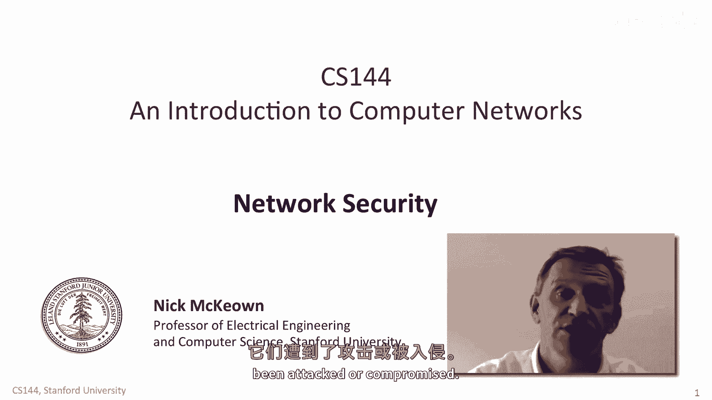

 and walking off with millions of credit card numbers and other private data。

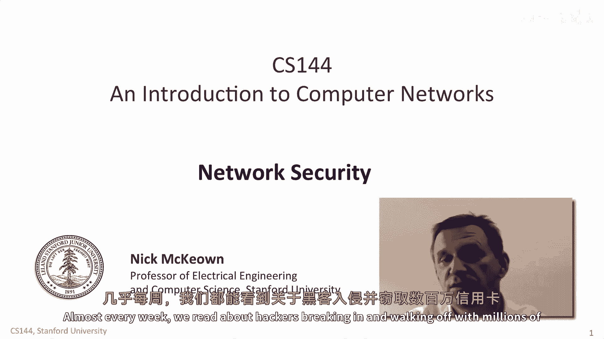

 perhaps following a phishing attack or by exploiting some other vulnerability to。

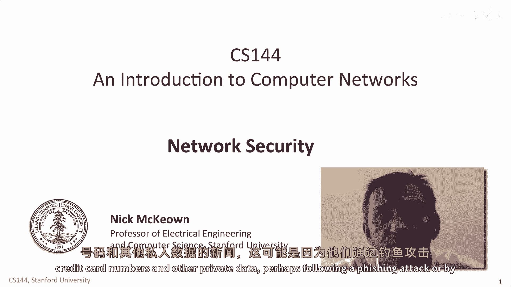

 access a supposedly private network。 Or we might read about a new worm that is。

 designed to take over computers turning them into an army of botnets such as。

 the infamous code "red" and slumber worms of the early 2000s。

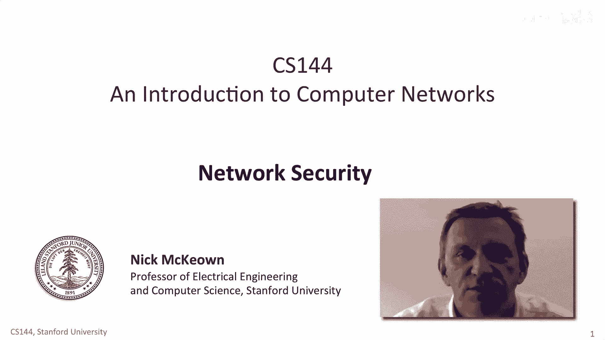

 Botnets are armies of infected computers controlled by a master that are commonly。

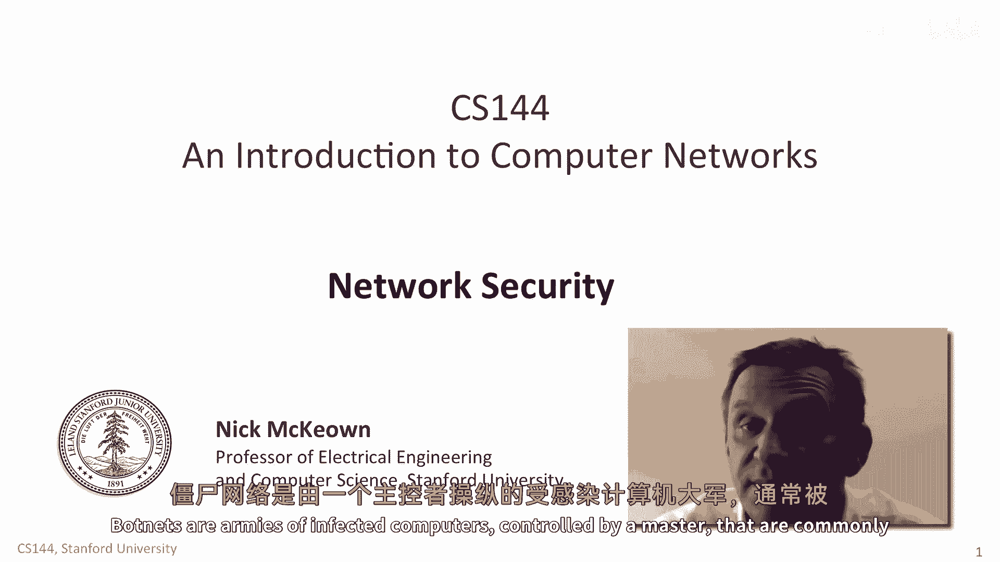

 used to send spam。 While spam levels appear to be dropping slightly， reports。

 suggest that between 75% and 95% of all emails send every day a spam， adding up。

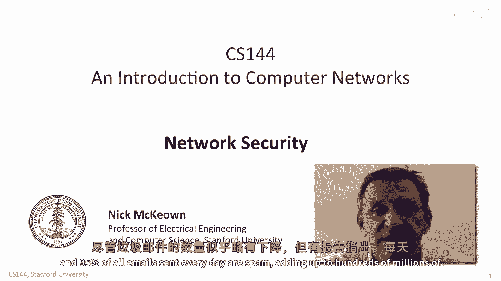

 to hundreds of millions of emails per day。 Worms are also sent by one government。

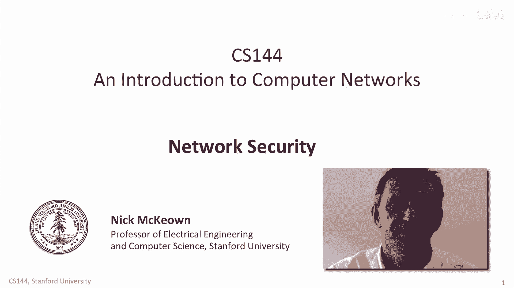

 to another。 For example when the 2010 Stuttnetz worm which is widely believed。

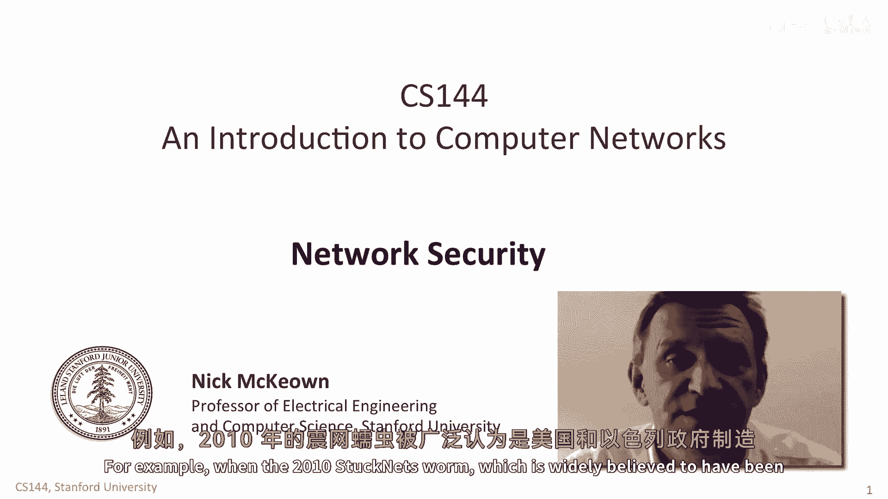

 to have been created by the US and Israeli governments was used to attack。

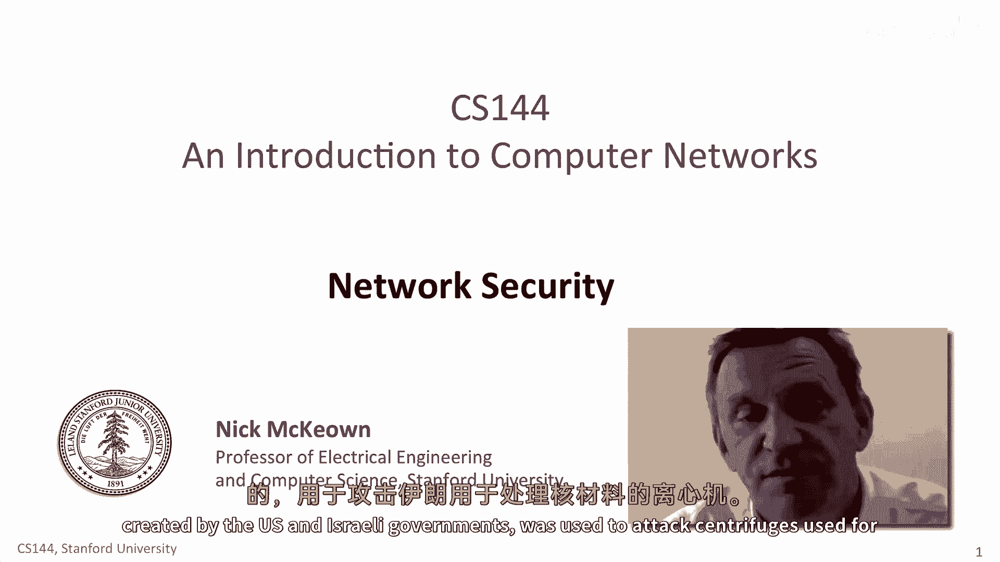

 centrifuges used for processing nuclear material in Iran。 In this video we're。

 going to look at some ways that a network can be compromised by an attacker。

 and I'll explain the security characteristics we want from a network。

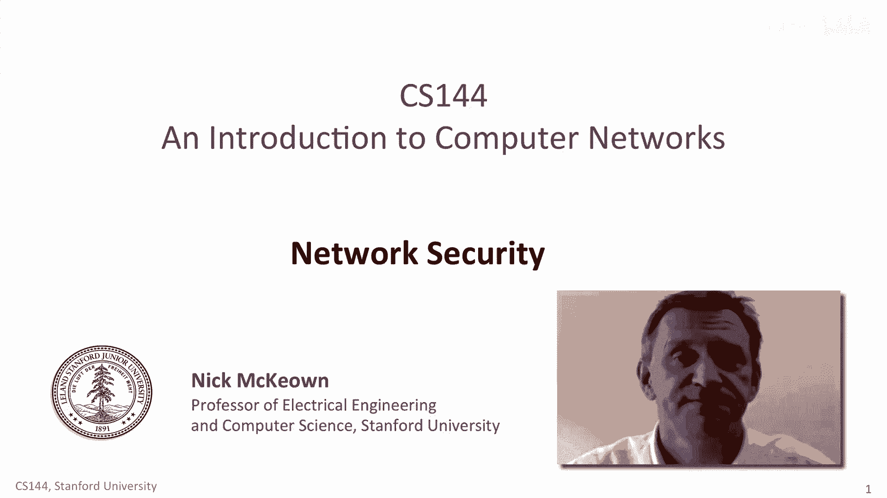

 Let's start by exploring the different ways a communication can be compromised。

 The first and simplest way is for an attacker to eavesdrop on someone else's， private communication。

 This means passively sniffing and recording network。

 data or it could mean listening to the metadata such as noting that a。

 connection has been made without necessarily recording the data inside， the connection。

 Connection metadata was made infamous recently when the NSA。

 acknowledged recording information about calls and connections made without。

 supposedly recording the contents。 There are many ways to tap a network for。

 example at the physical layer an attacker might passively tap an。

 electrical or optical cable or if you've seen before we can listen in to Wi-Fi。

 because the packets are broadcast for everyone to hear。 A third way is for an。

 attacker to persuade a router to duplicate and forward copies of packets。

 In each case the attacker can use standard tools such as wire shark to decode the。

 protocols and understand the user's data。 A second type of compromise is when an。

 attacker modifies deletes or inserts data as it passes through the network。 In other。

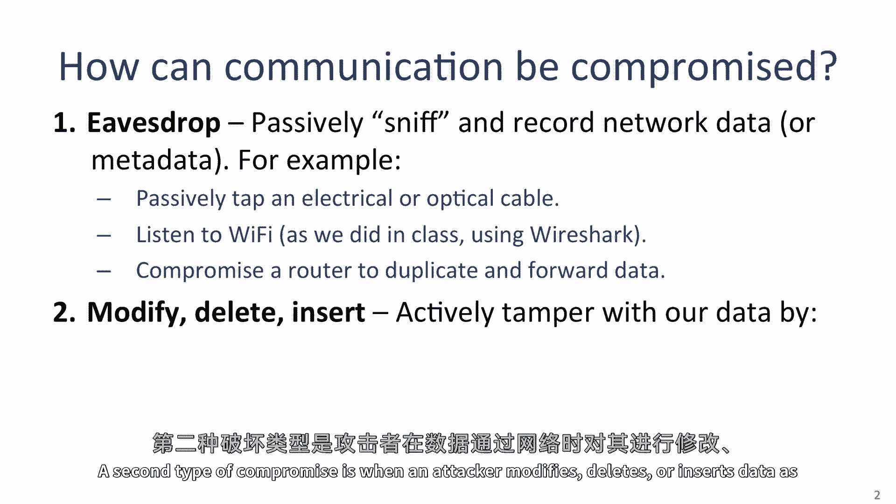

 words they're actively tampering with our data changing the contents of the。

 packets redirecting packets to a different rogue server without us knowing or。

 taking control over our end host。 This might happen by persuading us to。

 download malware based on a phishing attack or by exploiting a vulnerability。

 in our computer or the way that we the communicate。 For example later we'll see。

 how it's possible to hijack an ongoing TCP connection without either。

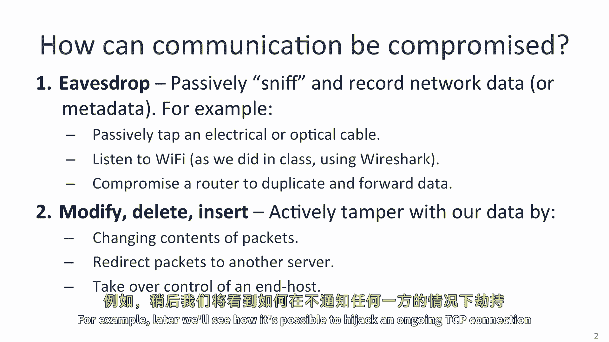

 end-knowing。 Finally an attacker might just want the preventers from， communicating at all。

 This kind of attack is usually called a denial of service， attack。

 Sometimes these attacks are performed by swamping servers or entire。

 networks by generating billions of messages from different botnets spread， around the internet。

 We'll learn more about denial of service attacks in a later。

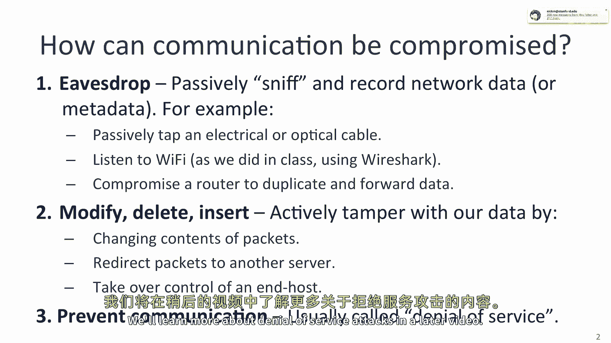

 video。 Let's take a look at an example of eavesdropping。 Imagine that Alice is。

 making a purchase online from an e-commerce site。 She's using a laptop。

 connected to her local Wi-Fi access point then over the internet to Amazon。com。

 She browses the site and makes her credit card purchase using vanilla HTTP。

 Unfortunately what she doesn't know is that the bad guy attacker is listening in。

 to what she's doing。 There are a few ways the attacker can eavesdrop。 For example。

 by listening to or sniffing the Wi-Fi packets broadcast into the air。 Anyone。

 with a laptop and the wire shop tool can listen to packets in the air and if。

 they're not encrypted they code their contents。 Alternatively the attacker can。

 eavesdrop on the physical wire by placing a passive detector that pick up。

 small electromagnetic signals that leak from the cable。 Or the attacker might。

 insert an electrical net connection under the wire itself。 If the attacker is。

 eavesdropping on a long-haul link in the internet backbone they're more likely to。

 be tapping into an optical fiber。 This can be done by placing a device called。

 a optical coupler which diverts a small fraction of the optical signal。

 under a second optical fiber which can then be listened to and decoded。 An attacker。

 without physical access might manage to subvert the switches and routers along。

 the path tricking one of them into duplicating data and forwarding it to， the attacker's computer。

 This can be done by remotely subverting Ethernet IP or DNS， traffic。

 We'll see examples of all three later。 Or the attacker might manage to。

 break into the router console and take over the router completely。 In our example。

 if the attacker successfully eavesdrop on the clear HTTP communication he or。

 she can learn Alice's private data such as her credit card number and a home， address。

 In a later video we'll learn about how HTTPS prevents this from， happening in practice。

 If the attacker is able to insert herself into the middle。

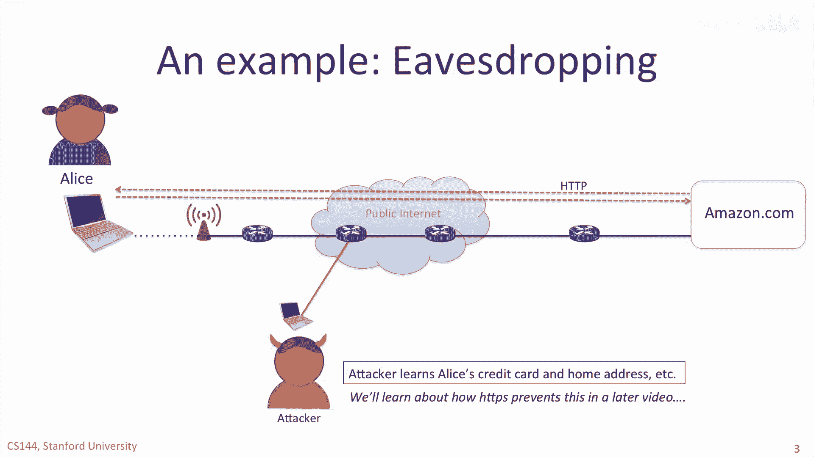

 of the communications between Alice and Amazon。com then the attacker can。

 terminate the HTTP connection in the middle pretending to be Amazon to Alice。

 and pretending to be Alice to Amazon。 The attacker could simply pass through the。

 data recording it without changing it or the attacker could alter the data for。

 example the modify the shipping address causing the purchased items to be。

 delivered to the attacker instead of Alice。 These so-called man-in-the-middle。

 attacks are very hard to detect because both parties can think they're talking。

 to a legitimate end host。

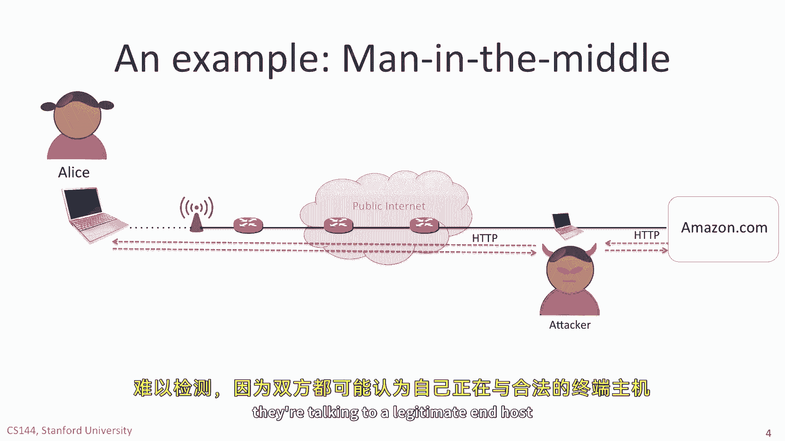

 A third line of attack is to redirect the traffic away from the server without。

 Alice realizing that she's not actually talking to Amazon。 If the attacker is。

 able to fool the router to forward packets destined to Amazon。com to the。

 act attacker instead then the attacker can respond and pretend to be Amazon。 Or the。

 attacker might fool Alice's DNS server into returning the attacker's IP address。

 when Alice is trying to look up Amazon's IP address。 In each case Alice can be。

 forced to browse the attacker's website and be encouraged to enter her credit。

 card information there instead。

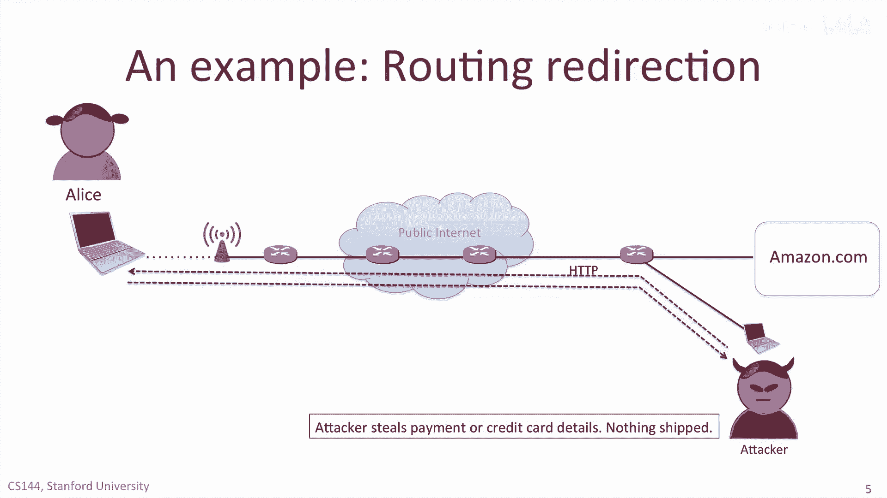

 Clearly Alice is not happy and would like her communication to be more secure。 In。

 general when we say we want secure communications over the internet we're。

 saying that we want secrecy and confidentiality。 We don't want anyone to。

 listen in to our communication。 For this we use encryption and we'll describe how。

 it works in one of the upcoming videos。 We want integrity。 We don't want our。

 messages to be altered in transit。 The most common way to prove that a message。

 has not been tampered with is to attach what is called a message authentication， code or MAC。

 MACs are based on encryption as well coupled with calculating a hash， over the transmitted message。

 We'll study message authentication codes in an， upcoming video。 Third we want authentication。

 We often want to confirm the， identity of the other party we're communicating with。

 In our example Alice， wants to know that she is really talking to Amazon who she trusts before。

 entering her credit card details。 In a later video we'll study digital signatures。

 and certificates that help us ensure that we're really communicating with who we， think we are。

 Finally we want uninterrupted communication。 We don't want。

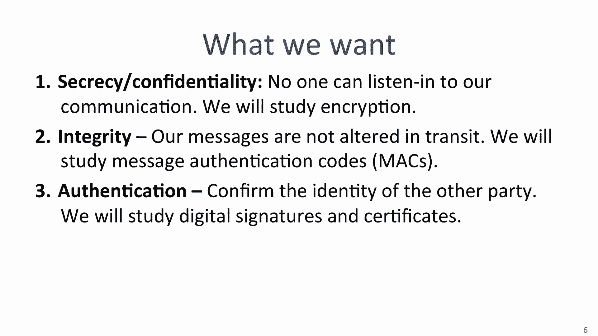

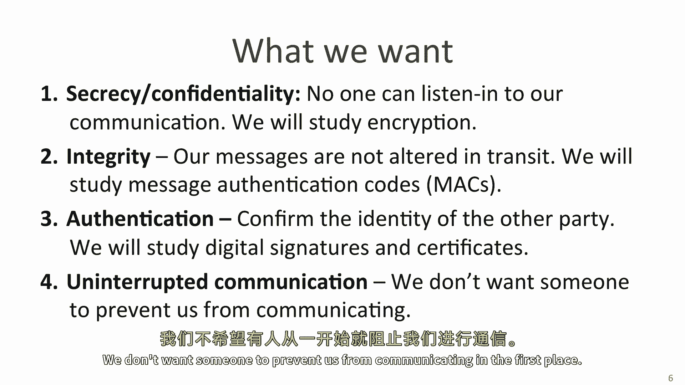

 someone to present it prevent us from communicating in the first place。 You may。

 have heard of denial of service attacks when an attacker floods a network or a。

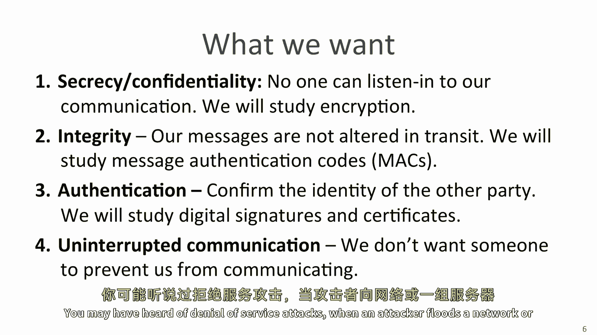

 set of servers that prevent them from working properly。 We'll study denial of。

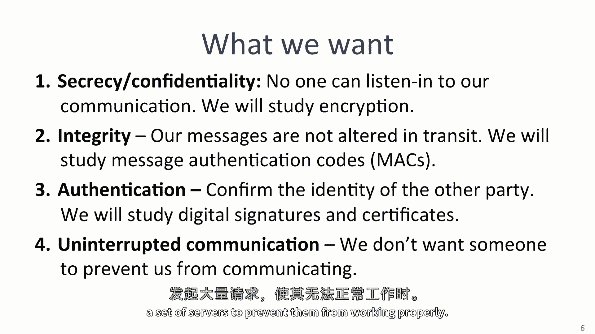

 service attacks shortly。 In the next few videos we're going to study different， types of attack。

 We'll study eavesdropping， redirecting Ethernet， IP and DNS traffic。

 hijacking a running TCP connection and denial of service attacks。

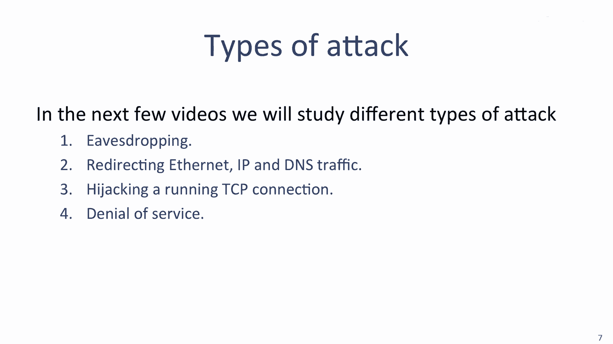