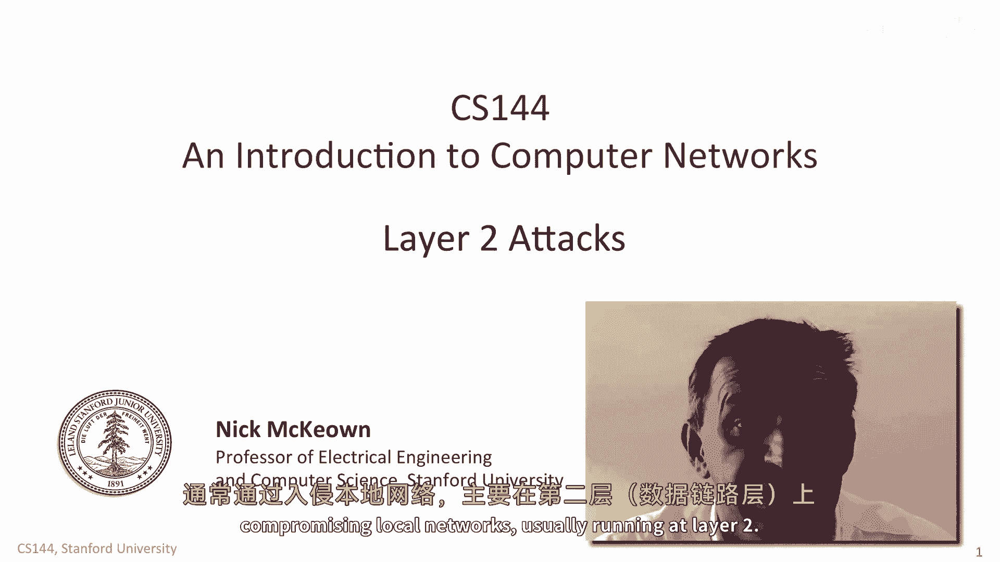
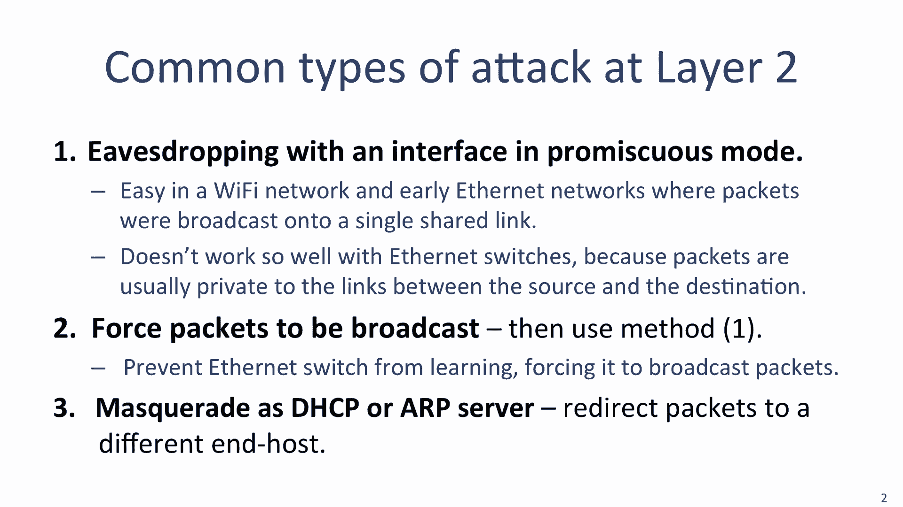
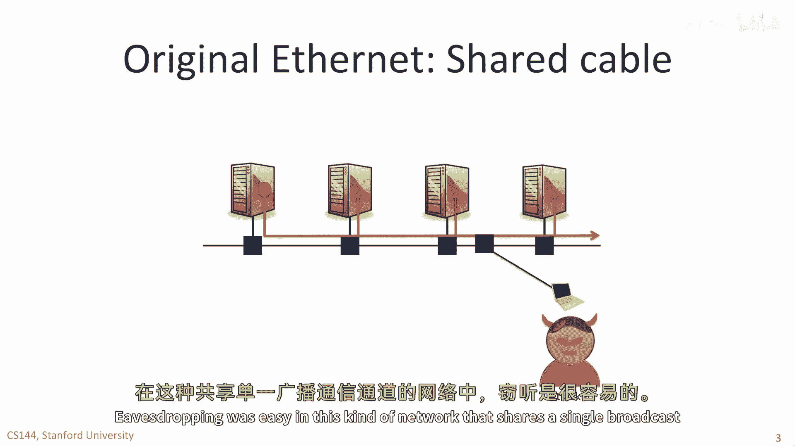
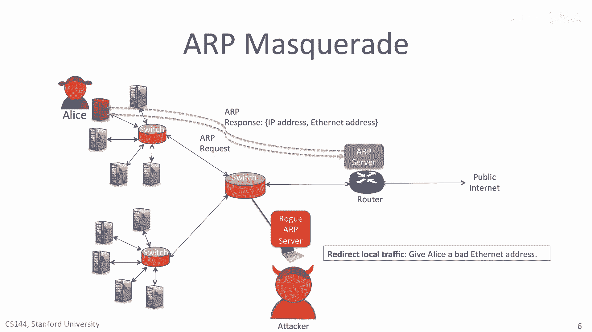

# 【计算机网络 CS144】斯坦福—中英字幕 - P111：p110 8-2 Layer 2 Attacks - 加加zero - BV1qotgeXE8D

 In this video， we're going to look at some common attacks that can be performed by compromising local networks。

 usually running at layer 2。

 Eve's dropping is quite easy if we put our network interface into promiscuous mode。

 In promiscuous mode， your network interface will capture all of the packets passing by。

 not just those addressed to your Ethernet address。

 Computers allow this mode of operation so that they can act as an Ethernet switch。 For example。

 the Linux operating system comes with Ethernet switching code built in。 When wire sharp runs。

 it first puts your interface into promiscuous mode so that it can see all the packets。

 This is particularly easy in a Wi-Fi network and early Ethernet networks where packets were broadcast onto a single shared link。

 It doesn't work so well with modern Ethernet networks that use Ethernet switches because packets are usually private to the links between the source and the destination。

 In this video， I'll show you how we can force packets to be broadcast in any Ethernet network。

 by overflowing the forwarding tables。 We do this by preventing the switch from learning addresses correctly。

 Once we force them to be broadcast， we can then eavesdrop using wire sharp。

 The next approach is for the attacker to set up a computer that masquerades as a DHCP or ARP server。

 redirecting packets from the sender via another server。

 As I said， eavesdropping is very easy when packets are broadcast onto a shared medium。

 Just like Wi-Fi packets are broadcast into the air for everyone to hear。

 the earliest versions of Ethernet broadcast packets on a common cable attached to all the end hosts。

 eavesdropping was easy in this kind of network that shares a single broadcast communication channel。

 But as we saw in Unit 7， Ethernet has changed over the years。 Today。

 Ethernet networks use switches rather than a single shared cable。

 We use switches because they allow many simultaneous communications in the network。

 This is good news for performance。 But it's bad news for the attacker because our packets only pass over the two links between Alice and Bob。

 The attacker can't see our packets。 A common exploit is to attack the tables in the Ethernet switches。

 As you'll recall， an Ethernet switch learns the addresses of end hosts by watching packets in the network。

 For example， the switch between Alice and Bob shown here learns their Ethernet addresses whenever they send packets。

 Here is what the forwarding table might look like in a switch after it's learned some of the addresses。

 In practice， the tables are much bigger than this， usually tens or hundreds of thousands of entries。

 but I show you a few here to keep things simple。 Remember that if a switch receives a packet with an Ethernet destination address that is not already in its forwarding table。

 then it broadcasts the packets。 So， how can the attacker persuade the switch to broadcast all the packets？

 It can keep filling up the forwarding table with other addresses。 So。

 what an attacker can do is keep sending very high rate packets with new Ethernet addresses。

 The switches will learn these addresses， displacing entries already in the switches。 Typically。

 the replacement policy is least recently used。 So， if the attacker sends it a high enough rate。

 the table will keep evicting the entries for Alice and Bob。

 All the packets will then be broadcast and will be seen by the attacker。

 This is called a Mac overflow attack。 [Coughing]， 3， 2， 1。

 Another common type of attack is to set up a rogue DHCP server。 In this attack。

 the attacker is going to try and persuade you to use a rogue DHCP server instead。

 Recall that DHCP is a service offered by the network to help configure your computer when it boots or first attaches to the network。

 Your computer sends out a sequence of broadcast discovery packets to find the DHCP server。

 which is usually hosted on the nearest router。 After your computer has found the DHCP server。

 it sends a request asking to be allocated an IP address on the local network。

 along with the address of the default router and the addresses of the DNS servers it should use。

 If the rogue DHCP server can respond faster than the legitimate server。

 it can respond to Alice first， giving her whatever configuration information it wants。 For example。

 the attacker can give Alice a bad router address， so that she sends traffic to the attacker instead of the router。

 This makes it easy for the attacker to set up a man in the middle attack without Alice knowing。

 A second way is for the attacker to give Alice the IP address of a remote rogue DNS server。

 When Alice looks up IP addresses in future， for example next time she visits Google。com。

 the rogue DNS server can return the IP address of a different server and intercept Alice's traffic。

 Finally， the attacker can set up a rogue ARP server。

 When Alice is sending packets to a local host or via the router。

 she will first send an ARP request to find out the Ethernet address of the next hop。

 First she sends a broadcast ARP request， packet to the ARP server。

 which replies with the legitimate Ethernet address she's looking for。

 But if the attacker sets up a rogue ARP server that responds faster than the legitimate ARP server。

 the attacker can give Alice the wrong information。

 If the attacker replies with the Ethernet address of a rogue server in the local network。

 then all of Alice's traffic will be sent to the rogue server。

 This is an easy way to set up a man in the middle attack by passing all of Alice's traffic through a rogue server without Alice knowing。

 [BLANK_AUDIO]。

