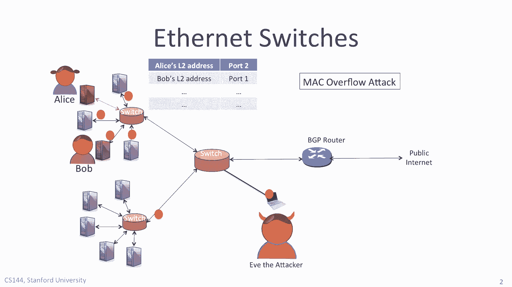
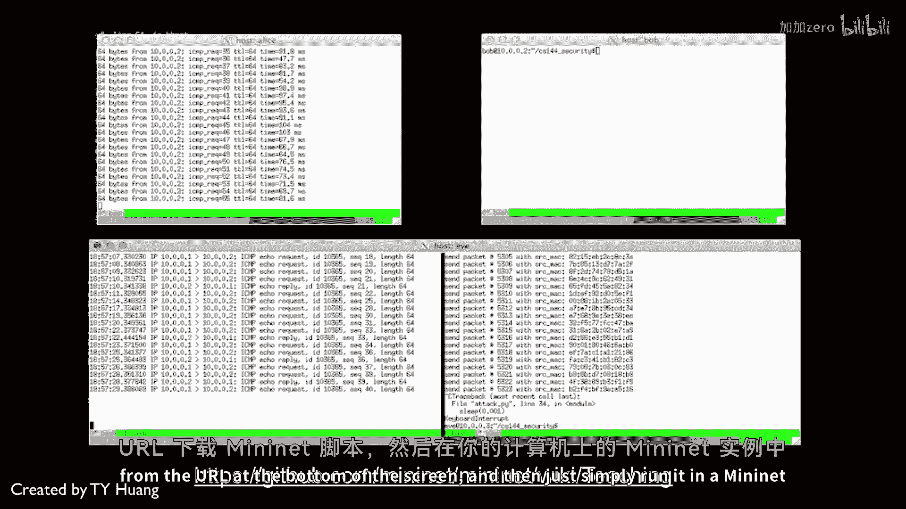

# 【计算机网络 CS144】斯坦福—中英字幕 - P112：p111 8-2a MAC Overflow Attack - 加加zero - BV1qotgeXE8D

 In this video， I'm going to show you a demo of a Mac overflow attack。 In the demo。

 Eve the attacker is going to eavesdrop on Alice's traffic to Bob， even。

 though Alice and Eve are not connected to the same switch。 As you'll remember。

 and just as we saw in the last video， Eve is going to send lots。

 of ethernet packets with new addresses to force the forwarding tables in the switches。

 to overflow so that Alice's traffic to Bob is going to be broadcast。

 Eve will then be able to eavesdrop and listen in on the traffic。

 Let's see how this works。 The demo I'm going to show you next runs on the MiniNet emulation system。

 which means， you can easily and safely run it yourself on your own computer and I'll tell you shortly。

 how you do that。 It also means the same code can easily be replicated into a real network。

 The demo was created by T-Wifi a PhD student here at Stanford。 First。

 let's verify that under normal conditions， Eve can't eavesdrop on Alice。

 There are three windows on the screen representing Alice， Bob and Eve at the bottom。

 Alice is sending pings to Bob while Eve is running TCP-dom on her machine， listening for。

 traffic from Alice's IP address， 10。0。0。1。 As you can see。

 TCP-dom doesn't capture any traffic and Eve doesn't hear anything at all。

 so we know the learning mechanism is working just fine and no traffic is being broadcast。

 Next Eve runs an attack in which she overwhelms the network with new randomly generated ethernet。

 addresses。 The switch dutively learns them all until its forwarding table fills up and overflows。

 evicting， the learned ethernet address of Alice's server。

 Alice is still sending pings to Bob and they're now being broadcast。

 The TCP-dom running on Eve's machine can see the packets and report to them on the screen。

 It doesn't see all of them because occasionally the switch will successfully learn Alice's， address。

 But it's quickly evicted again because of the onslaught of new ethernet packets from Eve。

 When Eve stops generating new ethernet addresses， the switch relearns Alice's ethernet address。

 and it can stop broadcasting the traffic between Alice and Bob。 That way。

 Eve will no longer be able to hear their traffic。 If you'd like。

 you can reproduce this demo yourself by downloading the mini-net script。

 from the URL at the bottom of the screen and then just simply run it in a mini-net instance。

 on your computer。 [BLANK_AUDIO]。