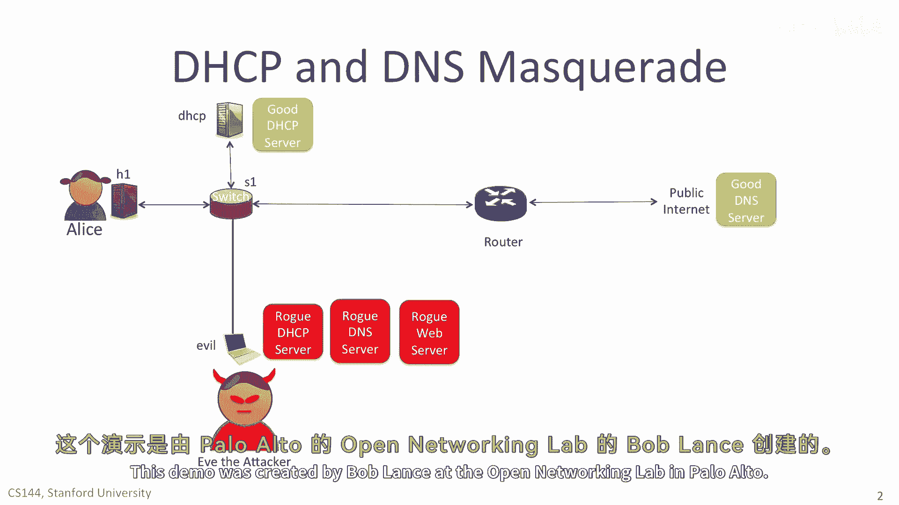
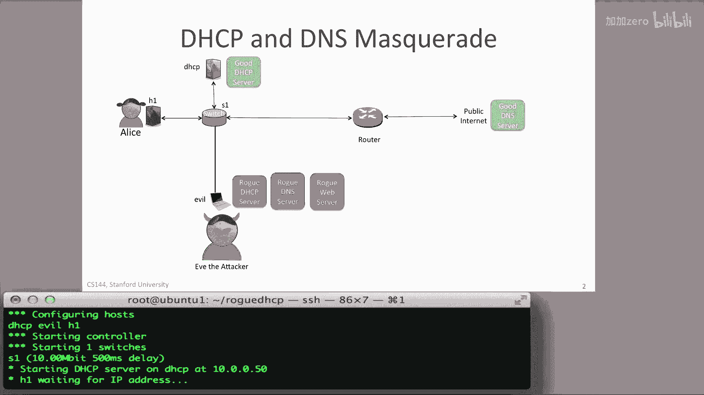
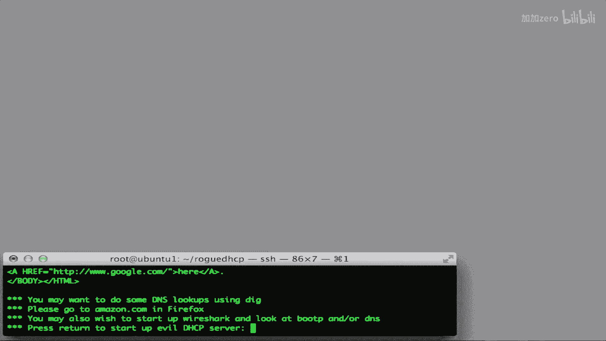
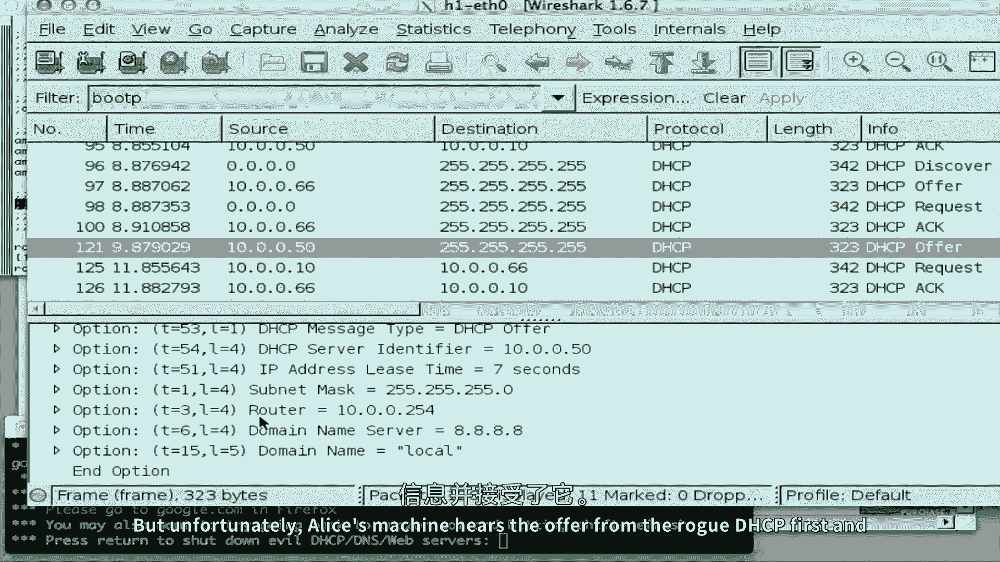
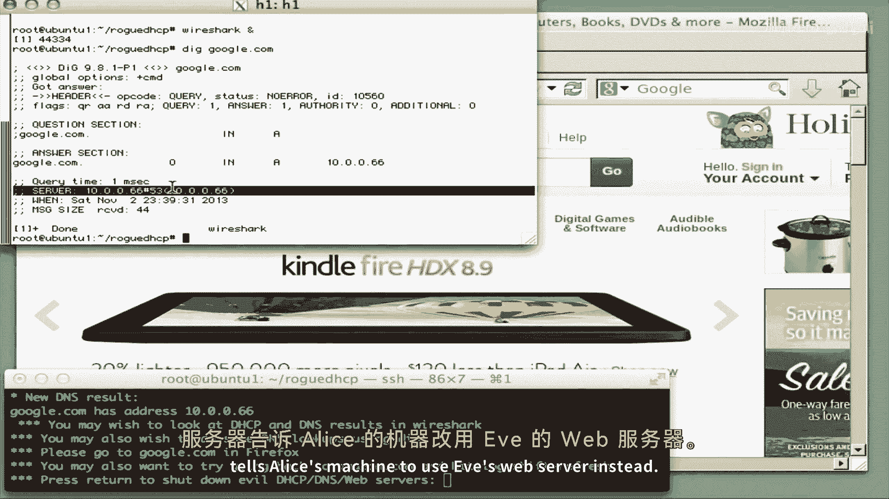
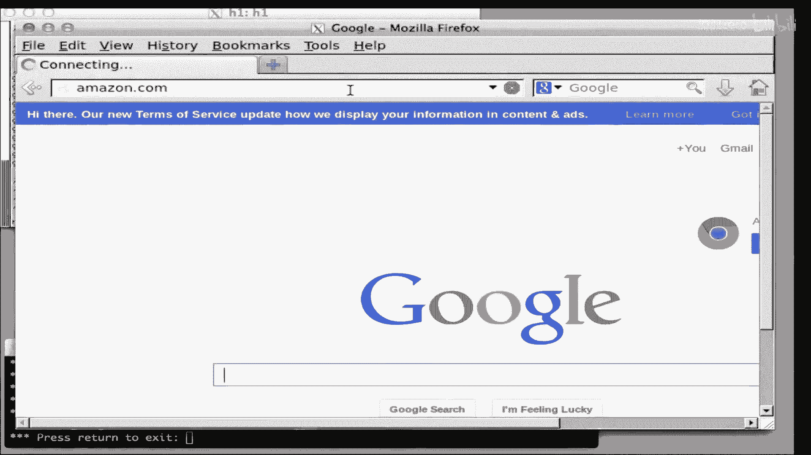
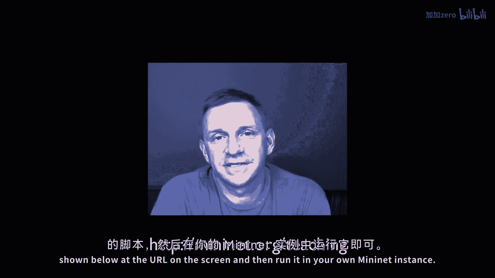

# 【计算机网络 CS144】斯坦福—中英字幕 - P113：p112 8-2b DHCP Attack Demo - 加加zero - BV1qotgeXE8D

 In the following video， I'm going to demo how an attacker can masquerade as a DHCP server。

 forcing Alice's machine to be incorrectly configured。 In the example。

 she's going to be forced to use a rogue DNS server。

 taking her to the wrong IP addresses for web servers she's trying to access。 In our demo。

 three hosts are connected to SWTCH S1。 Host H1 is Alice's machine。

 which is running a good DHCP client。 The host DHCP runs a good DHCP server。

 The DHCP server configures Alice's machine to use a good DNS server out in the internet。

 Host Evil is run by Eve the attacker and runs a rogue DHCP server。

 a rogue DNS server and a rogue web server。 Initially。

 we'll assume that Eve has not started her attack。 And we'll see a mini-net demo of the good 8 DHCP server。

 correctly configuring Alice's machine so that she can access the internet just fine。 Then。

 we'll see what happens if Eve's machine masquerades as the local DHCP server。

 replying faster than the good DHCP server。 Eve will configure Alice's machine to use the rogue DNS server。

 directing Eve's web traffic to Eve's web server as well。 Let's see what happens。

 The demonstration shows how simple a DHCP attack is。

 if the attacker has access to the local network and can install a rogue DHCP client close to the victim。

 The demo I'm going to show you runs in the mini-net emulation system。

 which means you can easily and safely run it yourself on your own computer。

 and I'll tell you shortly how you can do that。 It also means the same code can easily be replicated into a real network。

 This demo was created by Bob Lance at the Open Networking Lab in Palo Alto。

 H1 runs a DHCP client and is initially configured correctly by a nearby host。

 running a good DHCP server for the local network。 Evil is run by Eve the attacker and runs a rogue DHCP server。

 The DHCP server host is connected to S1 via a 500 millisecond link。

 to delay its DHCP responses to Alice。 We need the delay to be sure Alice will hear the evil DHCP responses before the good ones。

 Alice uses host H1 to browse the web using her Firefox browser。

 As you can see， she successfully can reach the Stanford website。

 Her computer H1 runs a DHCP client to configure her IP address。

 the address of her local router and her DNS server。

 If we use the dig command to look up another name like Amazon。com， we can see that the DNS server。

 in this case a public DNS server run by Google at IP address 8。8。8。8。

 It is responding to the query with Amazon's IP addresses and the site loads as expected in Firefox。

 Eve the attacker starts three processes on the evil host， a rogue DHCP server。

 a rogue DNS server and a web server。 Eve is going to force all of Alice's web accesses to go to Eve's web server instead。

 Every so often our DHCP client is required to renew its lease on its IP address。

 In Y# we can see that when H1 issues a DHCP discover， the good DHCP server at 10。0。0。

50 responds with an offer that contains the address of the legitimate DNS server at 8。8。8。

 But unfortunately Alice's machine hears the offer from the rogue DHCP first and accepts it。

 Alice is now in trouble。 Alice's machine now uses Eve's rogue DNS server which is also at 10。0。0。66。

 When Alice's browser asks for the IP address of Google。com。

 the rogue DNS server tells Alice's machine to use Eve's web server instead and this is what happens。

 When she revisits Amazon。com， most of the correct site appears since Firefox has cached the DNS result。

 But as soon as Firefox does a new DNS lookup， which we can force by pressing Shift Refresh。

 she's given the IP address of Eve's rogue web server instead。 If she visits a new site like Yahoo。

com， then she'll also end up at the rogue site。 You can imagine many bad things that Eve could do。

 She could simply deny or block access to particular websites for Alice。

 Or she could copy the look and feel of those websites that Alice visits and masquerade as an e-commerce site。

 forcing Alice to reveal her credit card or other personal information。

 Or she could simply sit as a transparent proxy watching and recording all of Alice's traffic。

 When we switch off the evil DHCP client and the DNS server。

 Alice will eventually go back to using the correct local DHCP server。

 The first time she revisits the same website， her browser， in this case Firefox。

 might have cached the bad DNS lookup and still try and go to the evil web server。

 But eventually Alice's host will start using the correct DNS server and her network will start working correctly again。

 The video shows just how easy it is to attack a network if you have access to the local traffic。

 If you can intercept and beat the DHCP traffic flowing in the network。

 then you can install a DNS server， you can then install and redirect traffic to your own web server or any other type of traffic。

 Very easy if you have access to the local network。 If you want to run this demo for yourself。

 then you can just download the script shown below at the URL on the screen and then run it in your own mini-net instance。

