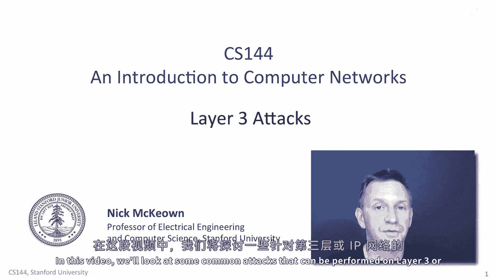
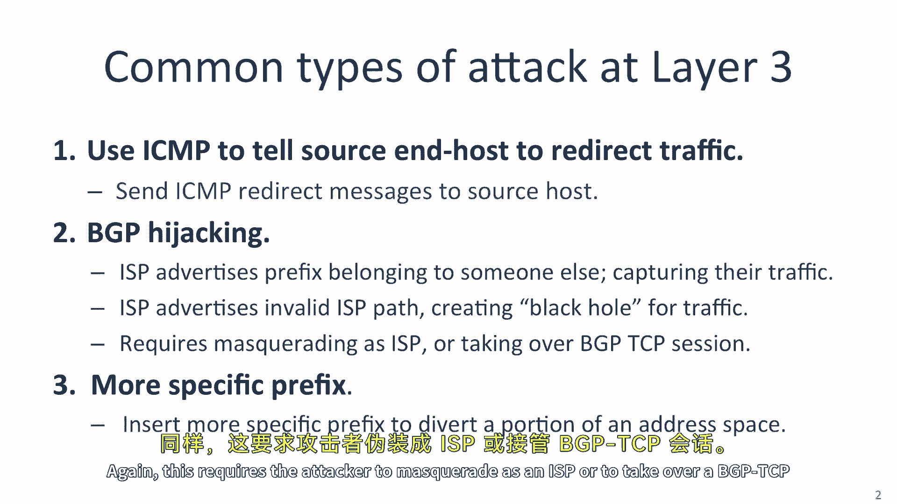
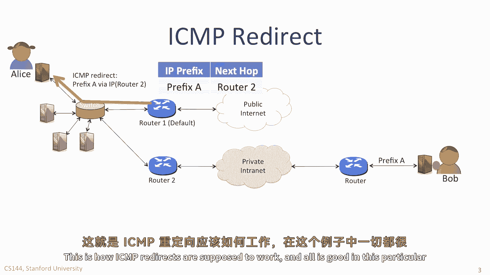
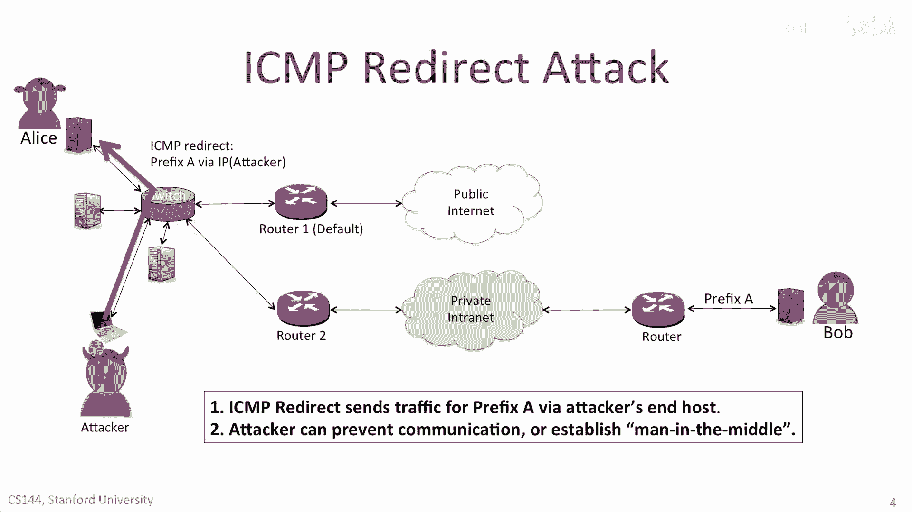
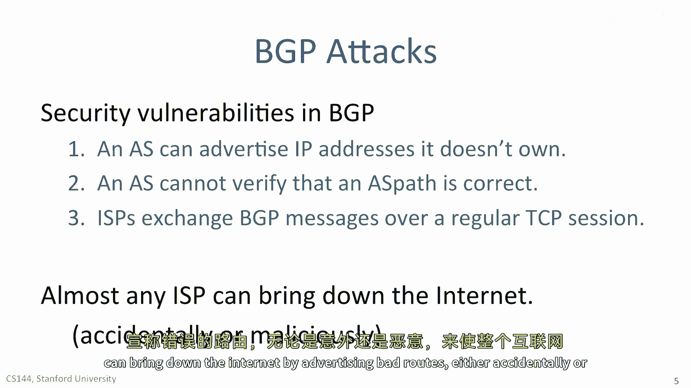
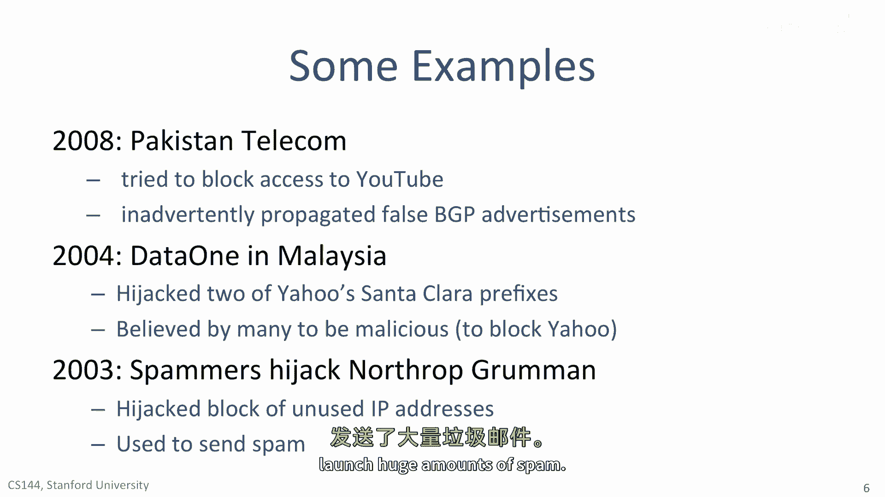
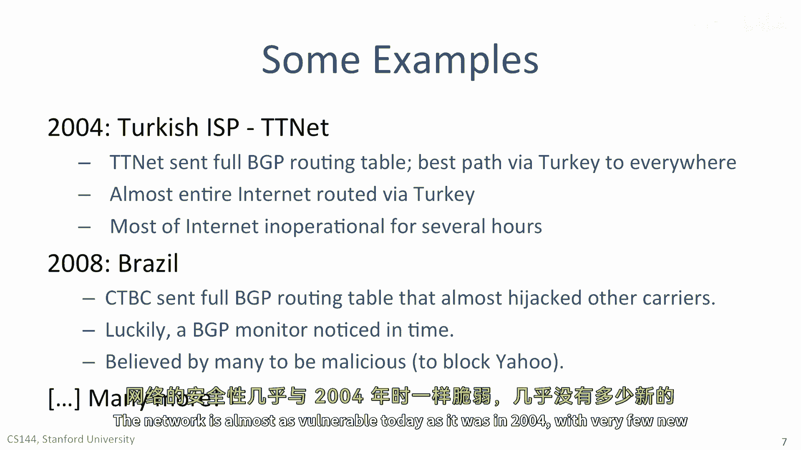
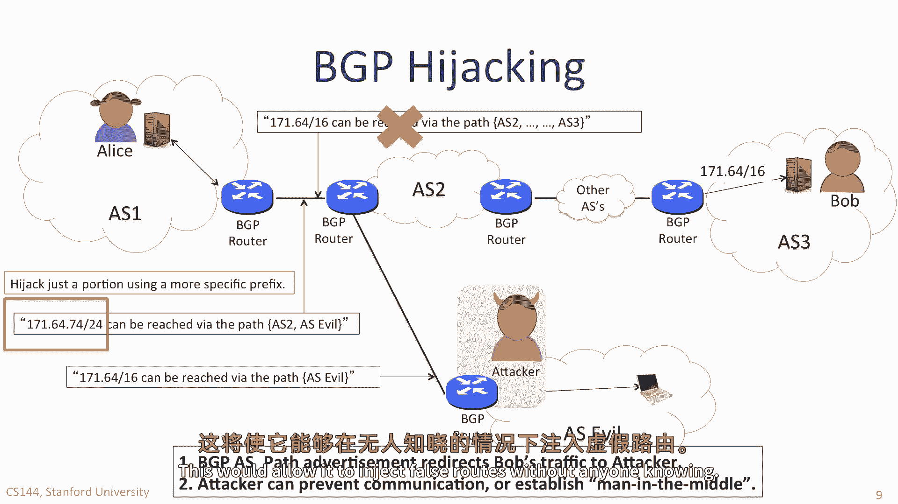

# 【计算机网络 CS144】斯坦福—中英字幕 - P116：p115 8-3 Layer 3 Attacks - 加加zero - BV1qotgeXE8D

 In this video， we'll look at some common attacks that can be performed on layer 3 or IP networks。

 We will look at three common types of layer 3 attack。

 It might surprise you to see how simple these attacks are。

 and you might be left wondering why we don't see even more attacks than we do。

 The first type of attack uses ICMP， the Internet Control Message Protocol。

 Recall that ICMP is used to convey information from the network back to the source。

 telling it how the network is doing。 For example， a router can send a TTL expired message back to the source。

 to tell it that a TTL was decremented to zero。 Or a router might use ICMP to tell the source host that a destination was unreachable。

 which means the router has no entry for the destination in its forwarding table。

 Another type of ICMP message tells the source to send its messages via another router。

 I'll explain how it works in the next slide。 There are lots of types of attack that use BGP。

 and we'll look at a couple of them here。 The first is called BGP hijacking。

 and sometimes it's just called IP hijacking。 BGP attacks take advantage of the fact that neighboring ISPs trust one another。

 to provide accurate information about the AS path to follow in order to reach a destination prefix。

 When two BGP peers start up， they create a TCP session。

 over which they pass route advertisements and withdrawals。 Once the session is initiated。

 they trust each other to provide the true information about paths。 If an ISP is badly behaved。

 or if someone manages to break into the TCP session， and masquerade as a legitimate ISP。

 then it is quite easy to redirect traffic。 For example。

 an ISP can advertise a prefix belonging to someone else， capturing their traffic。

 Or an ISP can advertise an invalid AS path， sending the IP traffic to a non-existent destination。

 where it is dropped， creating what is called a black hole for the traffic。

 And because BGP routers only peer with neighboring BGP routers。

 the most likely way for a BGP attack to happen is when an ISP is badly behaved。

 It's quite hard for an attacker to persuade a BGP router to start a session with it。

 The routers are hard-coded to only talk to particular peers。 However， on occasion。

 an attacker will manage to take over an ongoing TCP session without either party knowing。

 We'll explore how that might work in a later video。

 Another closely related BGP attack is when an ISP inserts a more specific prefix to divert just a portion of an address space。

 Again， this requires the attacker to masquerade as an ISP or to take over a BGP TCP session。

 Let's first see how a legitimate ICMP redirect works。

 Then we'll look at how an attacker can exploit it。 Alice is connected to her company's network。

 which is connected to the public internet via router。

 Alice wants to send a packet to her colleague Bob， who works at the same company。

 They're connected via the company's private network。

 Alice's computer is configured with router 1 as the default router。 In other words。

 packets destined for a different subnet will be sent via router 1。 But actually。

 her packets to Bob should really go via router 2 instead。 When the packet arrives to router 1。

 it notices that the packet is routed back to the interface it arrived on。

 This tells router 1 that Alice sent the packet to the wrong router。

 Router 1 forwards the packet to router 2。 And then sends an ICMP redirect message to Alice。

 to tell her to send packets to Bob via router 2 in future。

 Alice's computer adds a new routing entry in its local routing table。

 Next time Alice has a packet to for Bob， her computer sends it to router 2 instead。

 This is how ICMP redirects are supposed to work， and all is good in this particular example。

 Until an attacker comes along。 The attacker can send an ICMP redirect message to Alice。

 to tell her to route packets to prefix A via the attacker's computer instead。

 And so when Alice sends a packet to Bob， her computer sends it to the attacker instead。

 The attacker might choose to drop the packet， denying Alice from being able to communicate with Bob。

 or the attacker might look at the packet before forwarding it to Bob。

 creating a man in the middle attack。

 BGP attacks exploit one or more security vulnerabilities in BGP。

 The first vulnerability is that an AS can advertise IP addresses that it doesn't own。

 This means it can advertise IP addresses that belong to another AS。

 and therefore creates spurious problems。 As you can imagine， this is a major vulnerability in BGP。

 An AS cannot tell if an advertisement is legitimate or not。 Furthermore。

 an AS cannot verify that an AS path is correct。 There is no way for a BGP router to know if the sequence of AS is leading to an advertised prefix actually leads to the correct destination or not。

 ISPs exchange BGP messages over a regular TCP session。

 If an attacker is able to take over the TCP session or inject packets into the session undetected。

 then it can cause incorrect AS paths to be advertised and can hijack portions of the address space。

 One thing that is very surprising to many people that is even today。

 almost any ISP can bring down the internet by advertising bad routes。

 either accidentally or maliciously。

 Let's look at some famous cases of when BGP problems caused huge problems in the internet。

 Perhaps the most celebrated case happened in 2008。

 when Pakistan Telecom tried to block access to YouTube inside Pakistan。

 Instead of making local changes， the ISP inadvertently propagated false BGP advertisements throughout the internet。

 In fact， many thousands of routing entries were injected into the internet routing system in just a few minutes。

 Almost the entire internet melted down with YouTube being effectively incapacitated for several hours。

 In 2004， an ISP in Malaysia called Data One is believed to have mounted a malicious attack on Yahoo to try and block it。

 All the way from Malaysia， they were able to easily hijack two of Yahoo's Santa Clara prefixes。

 making Yahoo's data centers inoperable。 In 2003， Spammers deliberately hijacked a block of IP addresses allocated northrop ground。

 a large US-based security contractor for the government。

 Once they hijacked a portion of the IP address space。

 they used the addresses to launch huge amounts of spam。

 In 2004， Titinat， a Turkish ISP， sent full BGP routing tables announcing to everyone in the world that Turkey is the best path to everywhere in the internet。

 All of a sudden， almost the entire internet tried to route via Turkey。

 and you can imagine what chaos it created。 Most of the internet didn't work for hours。

 A similar problem almost happened in 2008 when the CTVC in Brazil sent full BGP routing tables that would have hijacked almost every carrier's IP address block。

 Luckily， a BGP monitoring system noticed just in time。

 Many people believed it was a malicious attack aimed at blocking Yahoo。 There are many。

 many more that happen every day， mostly too small to make the headlines， but some are very large。

 The network is almost as vulnerable today as it was in 2004。

 with very few new security improvements。

 One ISP can hijack the address block of another very easily。 Consider Alice in AS1。

 sending her packets to Bob， who is attached to prefix A， somewhere across the internet。

 on the right-hand side， in AS3， many ASs away。 Alice's neighboring AS2 advertises correctly that the best path to Bob in AS3 is via AS2。

 The attacker has a different idea。 The attacker is able to take over and control the BGP router in ASEvil。

 Once the attacker has control of the BGP sessions between ASEvil and AS2。

 it can advertise new false AS paths。 For example， it can advertise a path saying that the 16-bit prefix。

 171。64， can be reached via ASEvil instead。 AS1 has no way of knowing that this is a lie。

 and so might start routing traffic to ASEvil instead。

 The attacker might choose to drop all the packets， making it impossible for Alice to talk to Bob。

 or the attacker might establish a man in the middle attack without Alice or Bob knowing。

 Pretty scary。 If the attacker doesn't want to arouse too much suspicion。

 it doesn't have to take over the whole of that 16-bit prefix。 For example。

 if instead the attacker injects a 24-bit prefix， 171。64。74。

 then only a portion of the traffic will be diverted via the attacker's AS。

 All of the attacks on BGP that I showed you require the attacker to first compromise one AS。

 then use the trust between ASs to inject false advertisements into the other ASs。

 But what if the attacker can insert itself in between the two BGP peers without them knowing？

 This would allow it to inject false routes without anyone knowing。

 That's doubly scary。