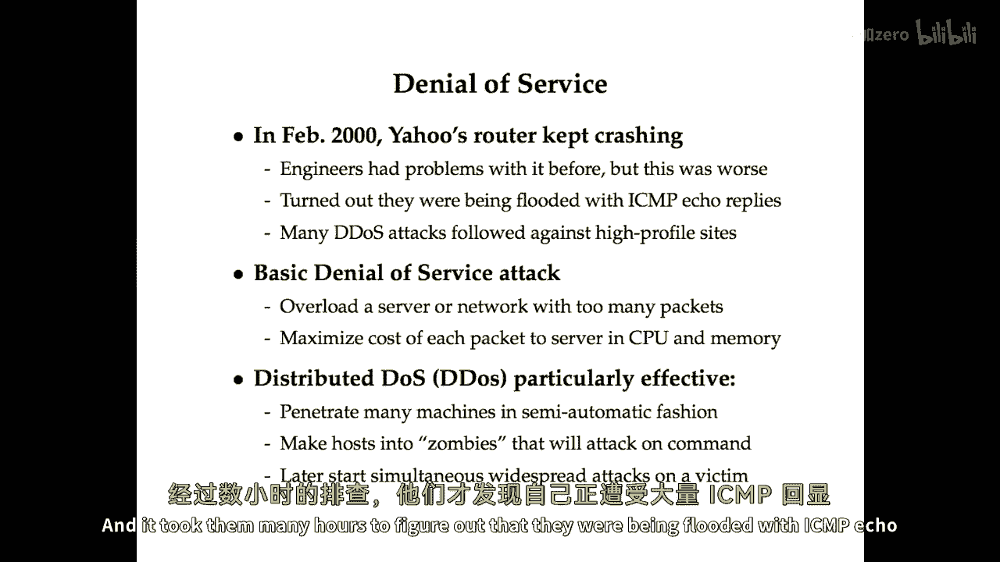

# 【计算机网络 CS144】斯坦福—中英字幕 - P117：p116 8-4 Security V - Denial of Service - 加加zero - BV1qotgeXE8D

 In this final video， as part of the attack series， we're going to talk about denial of service。

 In February of 2000， Yahoo's Rooter one day just started crashing。

 And the engineers that had problems with the Rooter previously， but this time it was worse。

 and they couldn't figure out what was going wrong。 Why every time I brought up the Rooter。

 it kept crashing。

 And it took them many hours to figure out that they were being flooded with ICMP echo reply packets。

 And that was such a high rate that it was causing their Rooter to crash。

 And in the weeks and months that followed， there were many of these so-called distributed denial of service or DDoS attacks against a bunch of high profile sites。

 So basically， what a denial of service attack is is something that prevents a service from being available。

 And the easiest denial of service attack you can do is to overload either a server or a network with too many packets so that it can no longer function properly and serve legitimate clients。

 And of course， as an attacker， you want to maximize the cost of each packet to the server in terms of network resources。

 CPU， and memory。 The reason distributed denial of service or DDoS is so effective is that the attack comes from all over the place。

 So it's hard to just filter out one bad person。 Also， because it's coming from a number of hosts。

 each of those hosts has some of resources。 So you've got a lot of traffic coming in if it's a widely distributed DDoS attack。

 How do attackers do this？ Well， they can penetrate many machines in a semi-automatic fashion with malware and then they turn the hosts into zombies that will basically attack on command。

 And then at some point they later decide， "Hey， I want to attack this victim like Yahoo。com。

 you know， push a button and boom。 All of these compromised machines will start flooding Yahoo with packets。

"。

 Now， in general， DDoS attacks are attacks that just target availability。 And you might wonder。

 "Well， why is that useful？"， It's not like you're breaking into a bank and convincing it to send you money or something。

 But it turns out that a lot of people perform these DDoS attacks for a number of reasons。

 One is extortion。 The attackers will go to some company。

 maybe the company's doing something a little bit fringe。

 like an offshore gambling site or something。 And they'll say， "Hey。

 pay us a small amount of money or we're going to take down your site。"， And at that point。

 the people who were in the site might think， "Well， we don't really want to go to the FBI with this。

 Maybe we should just pay the money。"， But of course， if they do that， probably。

 then a month later the price will double because they've now proven that they're willing to give into the extortion。

 But nonetheless， people are trying to do this。 Another thing is that people use it for revenge。

 For example， spammers mounted a denial of service attack that permanently shut down an anti-spam company called Blue Security once。

 And finally， of course， people do it for bragging rights。

 So denial of service can happen at many different layers of abstraction。

 You can do it at the link layer， at the network layer， transfer layer， or at the application layer。

 So here's a kind of a warm-up， some very simple denial of service attacks。

 One is jam a wireless network at the physical layer， right？

 So you could maybe even just buy some off-the-shelf cordless phone or build a very simple circuit that would make a wireless network inoperable essentially。

 Another thing you could do is exploit properties or features of the link layer。 So for example， 802。

11， there's this feature called the net allocation vector。

 which is used to suggest when the network might be free。

 And what you can do is use that repeatedly to reserve the network for the maximum number of seconds。

 And then essentially at that point， no one will end up transmitting。

 You'll effectively disable that wireless network。 As an example， DOSTAC at the network layer。

 you can flood ping a victim。 So for example， on most machines， you run ping-f victim。com。

 and it will flood the victim with ICMP echo request packets as fast as possible。 Of course。

 what makes a denial of service attack particularly devastating is if you can somehow amplify the resources required to be free。

 So what the attacker really wants is to， you know， expend a small number of resources， you know。

 send some stream of packets， but somehow that costs a lot more to process at the server than it does for the attacker to send。

 Well， turns out that there are many ways to do exactly that。 For example。

 EDNS has some queries that result in responses that are like 40 times the size of a query。

 And there also happen to be a large number of open DNS resolvers around the internet， say， you know。

 half a million or so。 So one of the things you could do is flood the victim with DNS responses。

 What you do is you send a request to a DNS server that's forged to look like the request is coming from the victim。

 And， you know， the request might be like some 60-byte EDNS request。

 but the reply will be 3000 bytes。 And so you're getting kind of a 40 times amplification in bandwidth for these requests and responses。

 And because you can send these requests to many， many different open DNS resolvers。

 it's very easy to amplify this attack， even from a small number of hosts that are originally sending these forged DNS requests。

 Another nice thing from the attacker's point of view is that it's not clear who's actually mounting the attack。

 By the time the request has made it to the server and the server has responded。

 what you get is a packet from the DNS server to the victim。

 but the attacker's identity doesn't figure anywhere in the packet。 It's MAC addresses isn't there。

 It's IP address was never there since it was forging the IP address to begin with。

 And it's not on the path between the DNS server and the target。 So， again。

 it's hard to filter out to kick the bad guy off the network as a way to try to deal with this kind of attack when it's underway。

 Yet another one of these attacks is known as a Smurf attack。

 This is actually the attack that was being used against Yahoo。 And here。

 taking advantage of the fact that ICMP echo the ping protocol supports pinging an IP broadcast address。

 So this is actually useful if you want to know what machines are on your network。

 You ping the broadcast address and you get an echo reply from every machine that's connected to the network。

 Unfortunately， this provides a big amplification opportunity for a flooding attack。

 Imagine that you compromise one machine on a network with， say。

 200 machines and then you stick a bunch of broadcast ping packets that purport to be from the victim's IP address。

 Then all 200 machines on that network are going to reply to that IP address。 And so， again。

 that's what was used to take down Yahoo， the same thing was used against Buy。

com and Amazon back in 2000。 Now， moving up the protocol stack。

 you can also attack at the transport layer。

 So， you remember TCP has this initial handshake， right？ The client sends a server-syn packet。

 then the server sends a synac packet back to the client。 And finally。

 the client sends the server of the third ACK packet。 So， it has us implemented it as a server。 Well。

 when the server receives a syn packet， it allocates some data structure， sticks it in a hash table。

 and sends back the synac packet。

 And then it waits for this third ACK packet here for some amount of time， like a minute。

 And then if after a minute it basically garbage collects it and says， "Okay。

 I guess this connection is not happening。"， So， every time a packet comes in。

 every time an ACK packet comes in， it needs to be compared to all the existing connections to see if this is an ACK for a partially open connection。

 And unfortunately， the operating system can't handle an arbitrary number of partial connections。

 I mean， especially at the time these attacks started getting popularized， I mean。

 there would only be， you know， a small number of partially open connections that the OS would be willing to cache。

 and then it would just drop the syn packets。 So， it would drop future syn packets。 So。

 basically the Synvom attack consists of sending a stream of syn packets all from bogus addresses。

 The synacs go off into wherever， and at that point the servers tables fill up。

 It stops accepting connections， and legitimate clients can't actually connect。

 And the thing that was so devastating about this stack is just a few hundred packets per second could completely disable most servers。

 So， you really didn't need a lot of horsepower to mount this attack against a server you didn't like。

 So， an example of Synvoms in the wild， there was a worm called the MS Blaster Worm that basically flooded port 80 of Windows Update。

com with Synp packets。 And it sent about 50 Synp packets per second。 They're each only 40 bytes each。

 so really not a lot of bandwidth being consumed。

 It randomized the last two bytes to the source IP address。

 making it hard to track down the exact machines that were actually infected。

 And what made this particularly devastating is that clients couldn't connect to Windows Update to actually solve the problem。

 So， eventually what Microsoft had to do was change the Update URL to be Windows Update。Microsoft。

com instead of Windows Update。com。 That still wasn't good enough because there were still old machines that were infected with the Blaster Worm and were actually trying to connect to Windows Update。

com， which at that point they'd given up on。 So， what they eventually had to do was actually use a content distribution network。

 Akama， that had really high capacity to serve Windows Update。com。

 So those machines could get updated and take care of the injection。 Okay。

 other attacks that can happen。 IP fragment flooding。 Well， it's kind of similar to a Synbom attack。

 where when you receive an IP fragment， you have to allocate some space and keep that around until the remaining fragments that are part of that IP packet come in。

 And so you could basically forge a host， send a stream of bogus fragments to a server and never bother to send the remaining fragments。

 So the server will never be able to reconstruct these packets。

 It'll just have to time out the fragments eventually。

 Another attack is that there's a UDP service known as the Echo Service， which is on port 7。

 And if you send a packet to port 7 on a server that's running the Echo Service。

 which a lot of hosts used to by default， it will simply reply。 So， I mean。

 this is kind of a really dumb attack。 You could just forge a packet from port 7 on one machine。

 two port 7 on another machine。 And the two packets。

 the two machines will start sending traffic back and forth until a packet is dropped。

 And so obviously there's a pretty easy fix， which is that a sane Echo server should actually drop the packet on the floor if the source port is port 7。

 right？ The source port should be something higher， like over 1，024 anyway。

 Finally， there's of course application level denial of service。

 So examples of this are what's anything where just something you can do on the client can be much more expensive to the server than it is to the client。

 So for example， DNS supports both TCP and UDP。 And the way the TCP protocol works is that you connect to the server and then you send requests。

 But because TCP is a stream protocol， not a datagram protocol。

 you need to say where the boundaries are between requests and responses。

 And so the protocol works that you just send a 16-bit length followed by that many bytes。

 And it turns out that a lot of DNS implementations blocked while reading the message。

 So if you sent a large length but then didn't actually send that many bytes afterwards。

 you could end up causing a DNS server to hang and just completely take it out。

 So very little effort on the client's part， server becomes completely inoperable。

 Another example is SSL， which requires a fairly expensive public key decryption to happen at the server。

 And again， you can burn a lot of CPU time at the server by sending bogus connection requests a lot more CPU time than is required at the client to mount the attack。

 [BLANK_AUDIO]。

