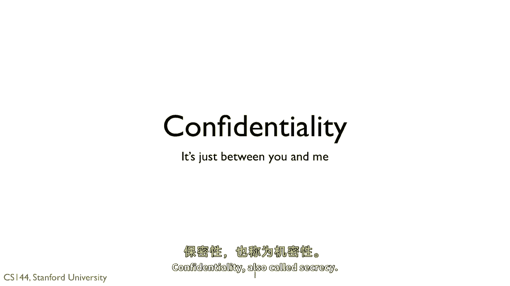
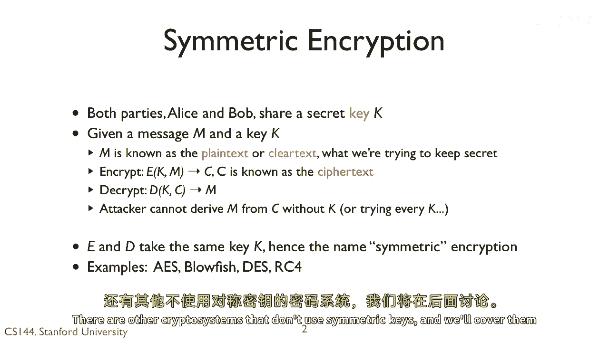

# 【计算机网络 CS144】斯坦福—中英字幕 - P119：p118 8-6a Confidentiality - 加加zero - BV1qotgeXE8D

 Let's look at the first of three properties the cryptography can provide。 Confidentiality。

 also called secrecy。

 The basic way you achieve confidentiality is through encryption。

 Because cryptography has a firm mathematical basis and because it's important to be precise。

 given the dangers of using it haphazardly， I'm going to introduce some terms。

 I'm going to start with symmetric encryption。 In symmetric encryption。

 two parties share some secret key K。 So let's suppose we have a message M we want to transmit confidentially and the key K。

 M is called the plain text or clear text。 It's the thing we want to keep secret。 To encrypt。

 we call a function e passing the message M and the key K。 This produces a ciphertext C。

 If our encryption algorithm is secure， then it's intractable。

 for someone to figure out the clear text from the ciphertext unless they have the key。

 So we can transfer the ciphertext C over the network。

 Adversaries can look at it but they can't read the original message M。 To decrypt the ciphertext。

 we call the decrypt function D， also passing the key K。 This returns the original clear text M。

 The goal is that you can only decrypt the message or learn anything about it if you。

 have the right key K。 Of course someone could try every K so you pick a key big enough that exhaustively searching。

 the spaces intractable。 For example， make the key 128 or 256 bits。

 Because E and D take the same key K， we call this symmetric or shared key encryption。

 There are other crypto systems that don't use symmetric keys and we'll cover them later。

 Examples of symmetric encryption algorithms are AES， Blowfish， DS and RC4。

 A one time pad is a perfectly secret but generally impractical encryption algorithm。

 We generate a perfectly random stream of bits as our key K。 The sender and receiver somehow。

 exchange this key securely beforehand。 For example， through a handshake and a USB drive。 To encrypt。

 we exor our message M with the key K。 To decrypt， we exor our ciphertext C， with the key K。

 This algorithm is perfectly secure in that if we have the ciphertext but not the key。

 then any M is equally likely。 Furthermore， this algorithm is really fast。 All we have to do is exor。

 So if you're a super secret spy who wants to send a short message， one time pads are， great。

 But not so in general practice。 The problem with one time pads is that your key K is the same size as the message M。

 To， send a gigabyte of data， you need a gigabyte long key。 This is not practical。

 We'd like to be able to send small keys that encrypt large amounts of data， yet are still。

 intractable to crack。

