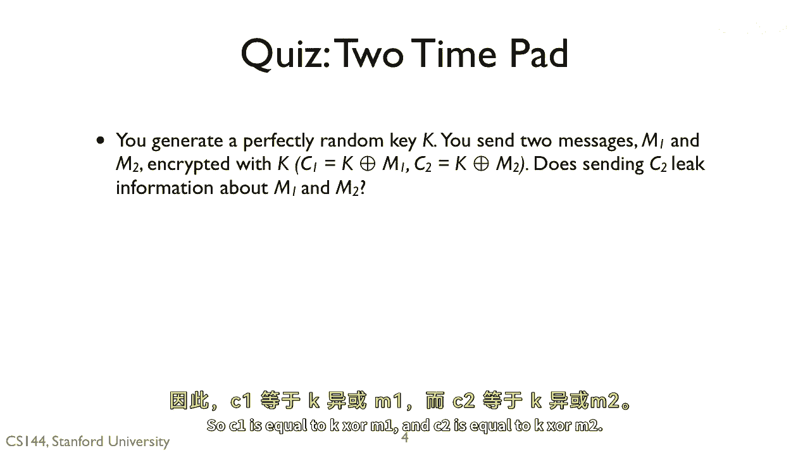

# 【计算机网络 CS144】斯坦福—中英字幕 - P120：p119 8-6b Confidentiality - 加加zero - BV1qotgeXE8D

 So here's our first quiz。 You generate a perfectly random key K。 You send two messages， M1 and M2。

 encrypted with a one-time pad algorithm。 So C1 is equal to K XOR M1。 And C2 is equal to K XOR M2。

 Descending C2 leak information about M1 and M2。

