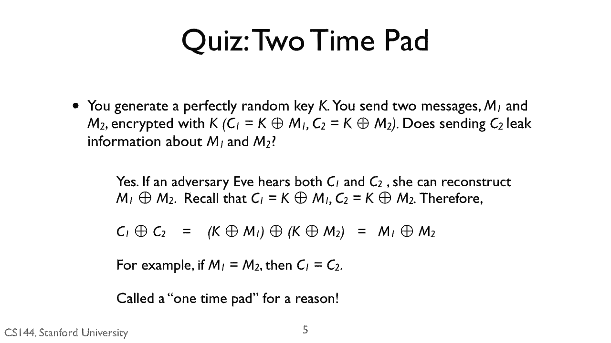
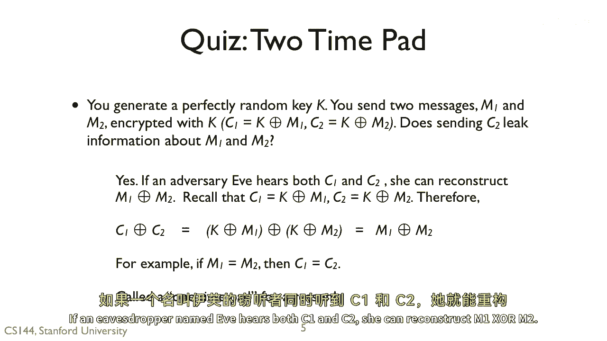
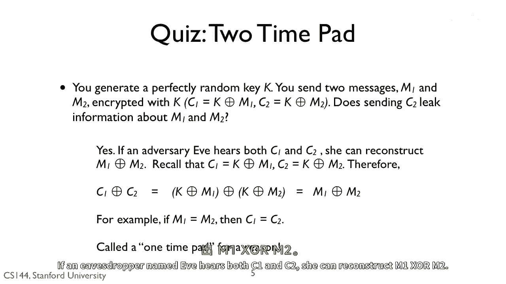
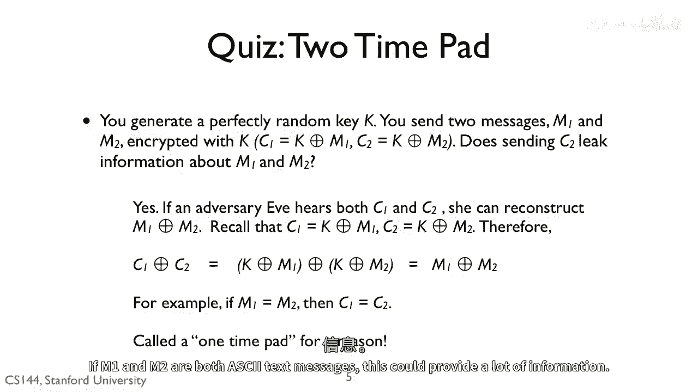
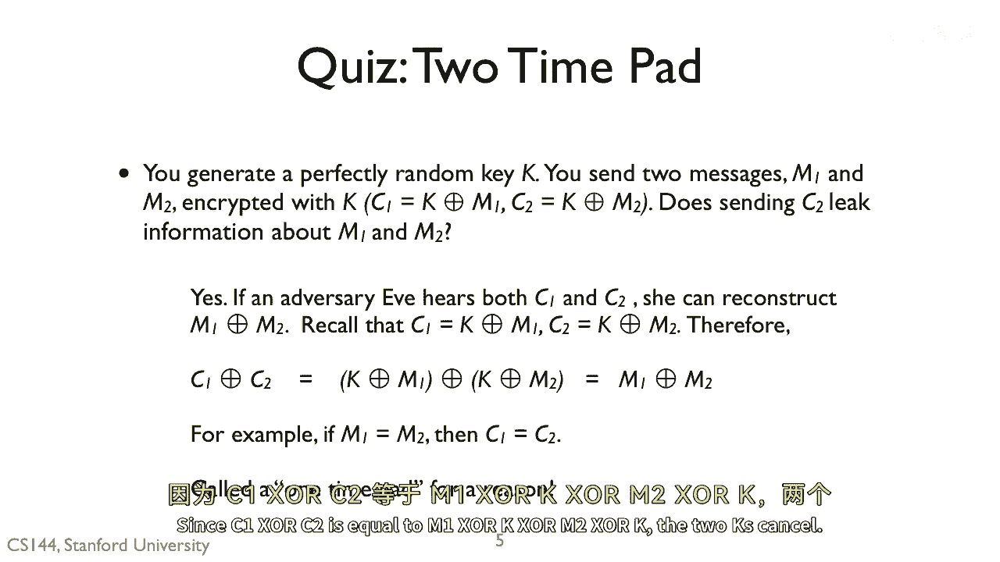
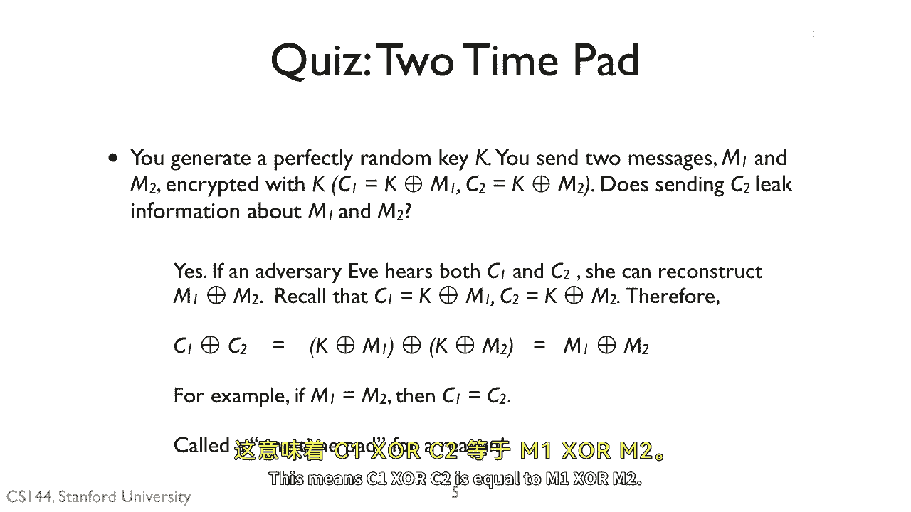
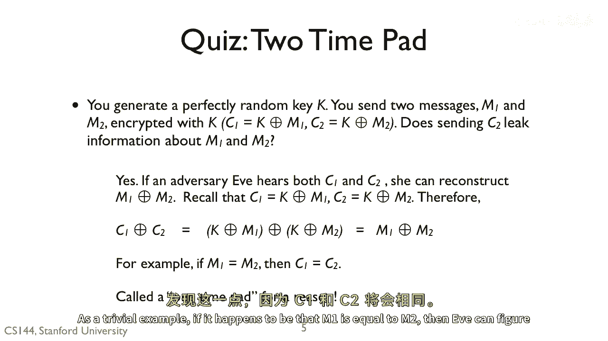
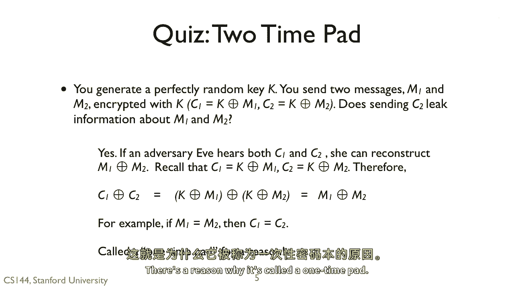

# 【计算机网络 CS144】斯坦福—中英字幕 - P121：p120 8-6c Confidentiality - 加加zero - BV1qotgeXE8D

 The answer is yes。 If an eavesdropper named Eve hears both C1 and C2， she can reconstruct。

 M1 X or M2。 If M1 and M2 are both ASCII text messages， this could provide a lot of information。

 Since C1 X or C2 is equal to M1 X or K X or M2 X or K， the two Ks cancel。 This means。

 C1 X or C2 is equal to M1 X or M2。 As a trivial example， if it happens to be that M1 is equal。

 to M2， then Eve can figure this out， since C1 and C2 will be the set same。 There's a reason。

 why it's called a one-time pad。 Only use it once。

 Thank you for watching。