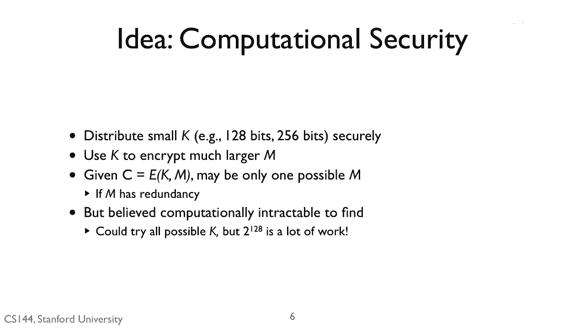
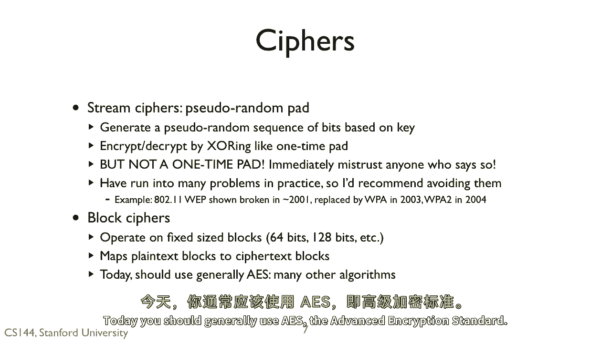
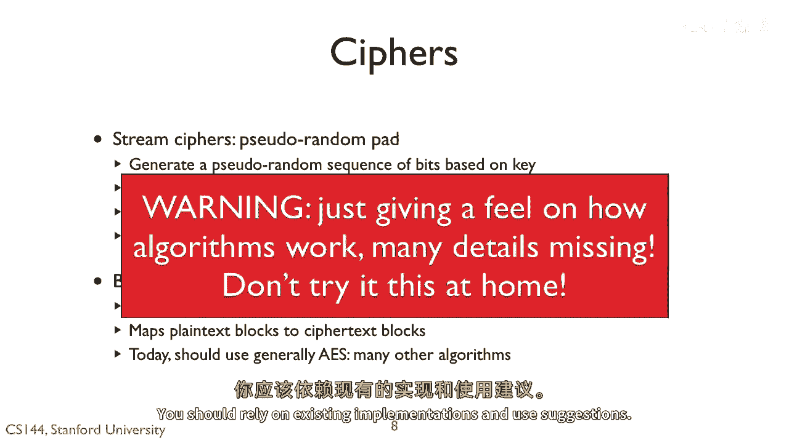
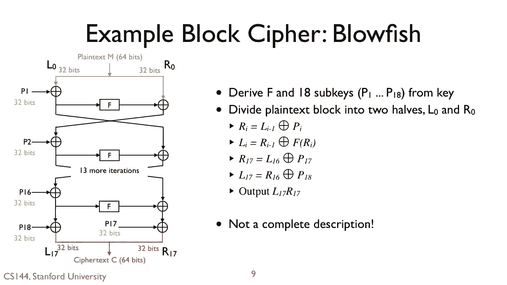

# 【计算机网络 CS144】斯坦福—中英字幕 - P122：p121 8-6d Confidentiality - 加加zero - BV1qotgeXE8D

 So one time paths are generally impractical。 Instead。

 what we want is a crypto system where we can distribute a small key， say 128 or 256 bits。

 We somehow share this key beforehand， for example over the phone。

 or write it down in exchange with a handshake。 We then use this k to encrypt a much larger message M。

 We then call encrypt E， pass in the plain text message M and the clear k to produce the ciphertext C。

 Now， unlock a one-time pad。 It might be there's only one possible M that produces the ciphertext。

 But we believe it's computationally tractable to find this M。 You could try all possible keys。

 but decrypting 220 of the 300 undecillion keys would take a very， very long time。

 Suppose you will take only a single instruction to decrypt the message。

 Let's suppose your processor core is 4 gigahertz， and let's suppose your processor is 4 billion cores。

 We still take 4 billion of these computers， 31 years， to decrypt such a message。

 Now there are two kinds of symmetric ciphers。 Stream and block。

 Stream ciphers generate a pseudo-random pad。 A pseudo-random sequence of bits based on the key。

 We then encrypt decrypt by XORing with a stream like a one-time pad。 But it is not a one-time pad。

 Immediately mistrust anyone who says it is， because they don't know what they're talking about。

 Generally speaking， stream ciphers have run into lots of problems in practice。

 Problems with stream ciphers typically stem from repetition。

 If we reuse the same pseudo-random sequence of bits， for example。

 reuse the same key into different messages， then adversaries can launch attacks like I showed with a two-time pad。

 The initial Wi-Fi encryption protocol web， for example， used to stream ciphers。

 It was shown to be broken about 2001 when Wi-Fi was starting to take off。

 and was replaced by WPA in 2003， in 2004。 Now WPA2 uses something called a block cipher。

 A block cipher operates on fixed size blocks of data， say 64 bits or 128 bits。

 A block cipher maps a plaintext block to a ciphertext block。 There are many block ciphers。

 Today you should generally use AES to advance encryption standard。

 I'm going to walk through the basis of how one block cipher blowfish works， but be careful。

 I'm not explaining the algorithm in its entirety。 I'm just trying to give you a feel for what a block cipher looks like and how it works。

 I've left out a lot of details which if you don't pay attention to， the cipher might not be secure。

 You should rely on existing implementations and use suggestions。

 Here are the basics of the blowfish block cipher。 It uses something called a feistol network。

 A feistol network or a feistol cipher is one where encryption and decryption use the same computational structure。

 Specifically， decrypting blowfish looks just like the inverse of encrypting。

 except that the function F is different。 So to decrypt。

 if you decipher text c at the bottom and reverse all the arrows and the cleartext m comes out of top。

 To use blowfish， you take the original key and derive the function F in 18 subkeys， P1 through P18。

 You take your plaintext block of 64 bits and divide it in two parts。

 the left half L0 and the right half R0。 Both L0 and R0 are 32 bits long。

 You then process L0 and R0 through 16 iterations of the structure shown here on the left。

 You exhort the left hand with a key P， without key P。

 You pass this value through the function F and exhort that with the right hand value。

 The right hand value becomes the left hand value and vice versa。 Then， in the final step。

 you exhort the left hand value with P18 and the right hand value with P17。

 This produces two 32-bit values which can catenate into the cipher text c。

