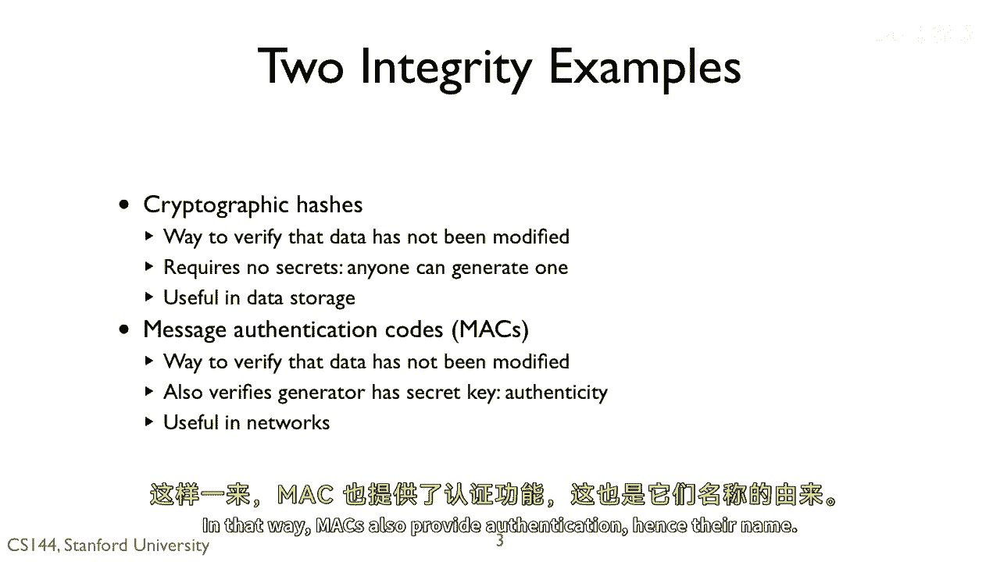
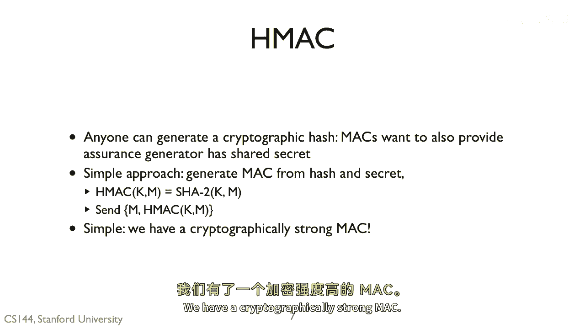
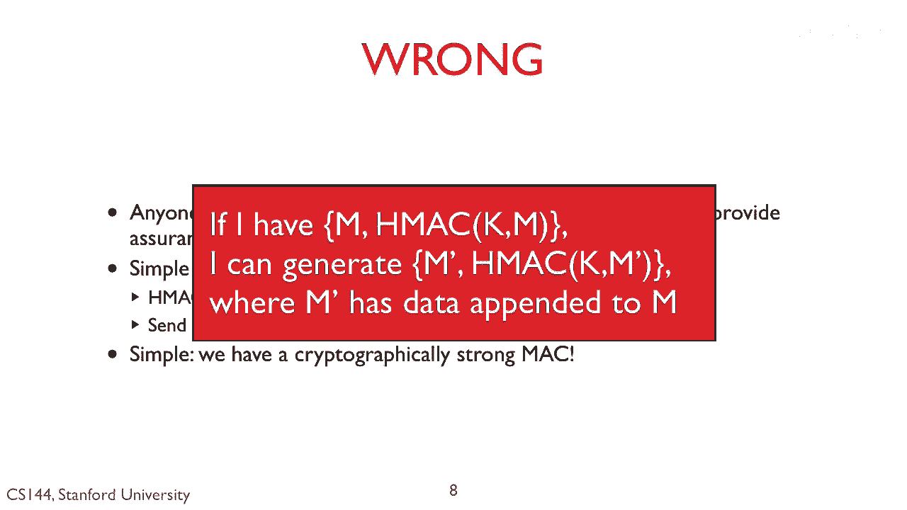
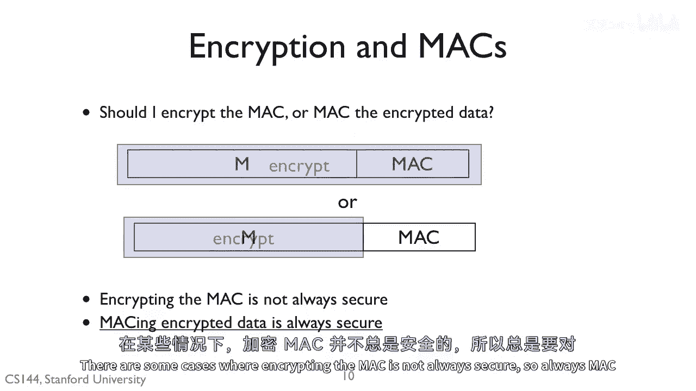

# 【计算机网络 CS144】斯坦福—中英字幕 - P127：p126 8-7 Integrity - 加加zero - BV1qotgeXE8D

 Encryption provides confidentiality， but we also need integrity。 For a system to be secure。

 we need to know that a message is actually generated by someone， else and no one has modified it。

 So for example， suppose we want a secure file system protocol。 Without integrity。

 an adversary could append garbage data to rights or potentially create。

 new right commands with garbage data。 The basic point is that secrecy is not enough。

 Education can prevent someone from reading our messages， but it doesn't protect them。

 from tempering。 The second property of secure systems， besides confidentiality， is integrity。

 Integrity algorithms let you know for sure that a message was generated by someone with， the key。

 So assuming the key is secret， you can be assured it came from a specific program， host， etc。

 This is really useful。 For example， with integrity。

 you can know that a routing vector actually came from the node， that supposedly came from。

 an adversary isn't trying to trick you to routing traffic through， them。

 You can know that the person who is making a bid in an auction actually made that bid。

 And you can know if you receive a message to terminate a connection or a bad message that。

 might cause you to terminate the connection， that the message actually came from the other。

 endpoint and isn't someone trying to shut down the connection on you。 Generally speaking。

 in security， integrity usually comes first。 There are lots of cases where you want integrity。

 but confidentiality isn't that important。 But it's very rare that you want confidentiality without integrity。

 Cryptographic hashes in message authentication codes are two major integrity primitives。

 Cryptographic hashes let you safely determine that data hasn't been modified。

 Anyone can generate a cryptographic hash。 They require no key。

 It's a hash function with some special properties。 Cryptographic hashes are useful for storing data。

 You can be sure no one has tampered with the data， and since no key is needed， anyone。

 can check that the data hasn't been tampered with。 Message authentication codes， or MAX。

 are a second way to verify that data hasn't been， modified。

 They have all of the integrity properties that cryptographic hashes do。

 But they have the additional property that they ensure that the person who generated the。

 MAX has a key。 Only someone else with the same key can check that the MAX is correct。

 Message authentication codes are useful in networks。

 If you send a message to the MAX appended to it， the receiver， if they have the corresponding， key。

 can check that the message they receive is the message you sent that you sent it， and。

 since you had to have had the key to generate the MAX。 In that way。

 MAX also provides authentication， hence their name。

 So let's look at cryptographic hashes first。 A cryptographic hash is a hash function with some special properties。

 Like an ordinary hash function， a cryptographic hash produces a fixed length output from an。

 arbitrary length input。 For example， I can compute a 256 bit hash from a gigabyte of data。

 They generally very fast compute faster than the network。 Cryptographic hashes。

 like normal hash functions， typically work by performing a single scan。

 over the data and performing some mathematical operations based on each byte or word。

 That way you don't have to keep the entire data in once and memory at once， you can just。

 stream through it。 Cryptographic hashes provide the property that they are collision resistant。

 What this means is that if I have some data X and a hash H of X， then it's intractable。

 to generate a message Y such that the hash of Y is equal to the hash of X。 Of course。

 there are many such collisions。 So let's say I have a 256 bit cryptographic hash。

 There are two to the 256 different values this hash could take。

 Let's say I'm hashing a gigabyte of data。 Well， there are two to the 30 bits。

 So two to the two to the 30 different blocks of data， but only two to the 256 different hashes。

 So while such collisions exist， they are very difficult to find such that people spend years。

 trying to do so and don't。 You can't just try two of the different to hundred and two to the hundred twenty different。

 data blocks。 This is a very， very deep idea。 Make sure you understand it。 Given a hash value H。

 it is intractable to generate a piece of data that has that hash， value。

 This might seem very simple， but it is amazingly powerful。 Given a hash value H。

 it is intractable to generate a piece of data that has that hash， value。

 If you need to use a hash function， then use SHA256 or SHA512。

 These are the SHA secure hash algorithm two， SHA2 algorithms， with either 256 or 512 bit， hashes。

 SHA1 is nearly broken today。 There's also SHA3， which the National Institute of Stamps technology selected in October 2012。

 to be an alternative hash to SHA2， which is just as strong but based on different mathematical。

 principles。 That way， if there's something wrong with SHA2， we can fall back on SHA3。

 Now SHA2 was designed by the National Security Agency or NSA in published in 2001。

 Given all the recent press on the NSA trying to build back doors， you might think there's。

 one in SHA2。 Really chances are there isn't。 It's been around for over a decade and it was vetted in a public process。

 Anyone who has anyone in cryptography and security has taken a look and it seems fine。

 Raking SHA2 would be the equivalent of developing Einstein's theory of relativity and physics。

 SHA3 was designed by a group of security researchers and one in competition sponsored by NIST for。

 the new SHA3。 The cryptographic hashes have this nice property that a small hash uniquely describes a very。

 large piece of data。 The basic approach is this。 Take your file and compute its hash。

 store this as H1。 Later， compute the hash in the file again。 Let's call this hash value H2。

 If the new value doesn't match the old one， then something has changed in the file。

 If the two are equal， then you know the file hasn't been tampered with because nobody。

 could generate a new file or change the existing file that has the same hash value。

 So something you sometimes see when you download software is someone publishes the hash of。

 the software alongside the program。 You can then check that what you've downloaded is what they've produced so nobody is inserted。

 in malware into the distribution after it was released。

 One neat way you can use hashes is something called a "merkel hash tree"。

 So by themselves cryptographic hashes just tell you if the data has been modified。

 If I have a huge file， I can tell it's been modified but not where。

 If you build a "merkel hash tree" you can tell which part of the file is been modified。

 You hash small blocks of the file， then create a tree of hashes like shown here。

 If the top of the hash differs， then you know the two files differ。

 You can then walk down the trees in a logarithmic number of steps， figure out which part of the。

 file is different。 So if someone is tampered with their file。

 you can see if it's because someone truncated。

 by accident or if they inserted malicious code。 So cryptographic hashes are very useful and they tell you if nobody has modified the data。

 but they don't require a secret。 Anyone can generate a cryptographic hash。

 Anyone can check a cryptographic hash。 Message authentication codes though want to provide authenticity as well。

 You want to be sure that the program that generated the Mac has a secret。

 So building methods authentication codes is easy once we have cryptographic hashes。

 All we need to do is incorporate the secret with the hash。

 We can define a message authentication code， algorithm HMac which takes a key K and a message， M。

 All it does is prepend the key to the message and compute a hash over that data。

 You can then send just the message and the Mac to check the message authentication code。

 the receiver prepends the key and computes the Mac。

 They know only someone with the key could have produced the Mac。 So it's simple。

 We have a cryptographically strong Mac。

 Wrong。 Recall that hash functions work by iterating over the data。 So for most hash functions。

 this means you incorporate the new data into the existing hash， value。 Put another way。

 hash value is the intermediate state of the computation。

 This means that if I see a message M that has a certain Mac， I can append and can append。

 some data to M making M prime and compute the Mac for M prime。 So as it always seems with security。

 the simple approach doesn't work and has vulnerabilities。 We need to do something smarter。 Luckily。

 that smarter approach is not much more complex。

 Here's the right way to compute a message authentication code。

 Take your key K and XOR with an interpad， let's say 0X36 repeated 64 times。

 Take a hash of this inter key K prepended to the message。

 Then compute an outer key by XOR and K with a different outer pad， say 0X5C repeated 64， times。

 Hash this outer key and the result of the inner hash。 So why doesn't the previous attack work？ Well。

 suppose your attacker appends some information to M。 They don't know K。 The Mac， however。

 is made up of the hash of M， not M itself。 So appending to M will result in a completely different hash value。

 The intermediate state of the computation leaked in the previous approach is hidden through。

 this inner hash。 So this is how Macs are generally computed today。

 You take a cryptographic hash of a transformation of the key in the message and a cryptographic。

 hash of a different transformation of the key and that hash。

 So one final problem。 Let's say you have both confidentiality and integrity。

 Should you encrypt the Mac or Mac the encrypted data？ The answer is the latter。

 Mac the encrypted data。 There are some cases where encrypting the Mac is not always secure。

 So always Mac encrypted data。 (breathing heavily)。

