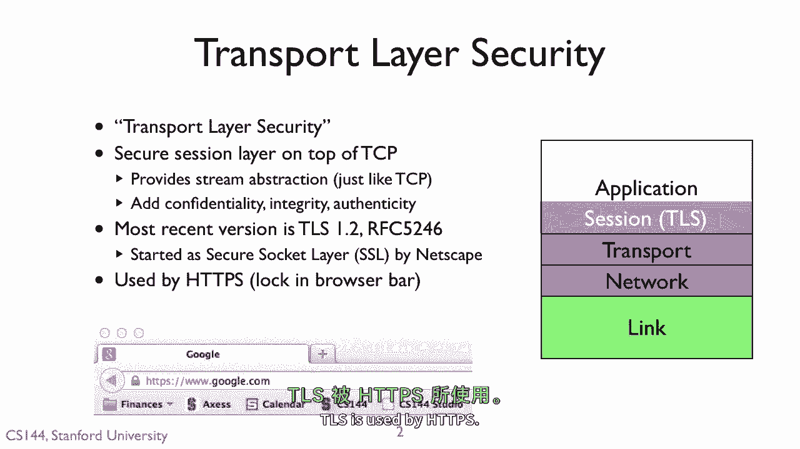
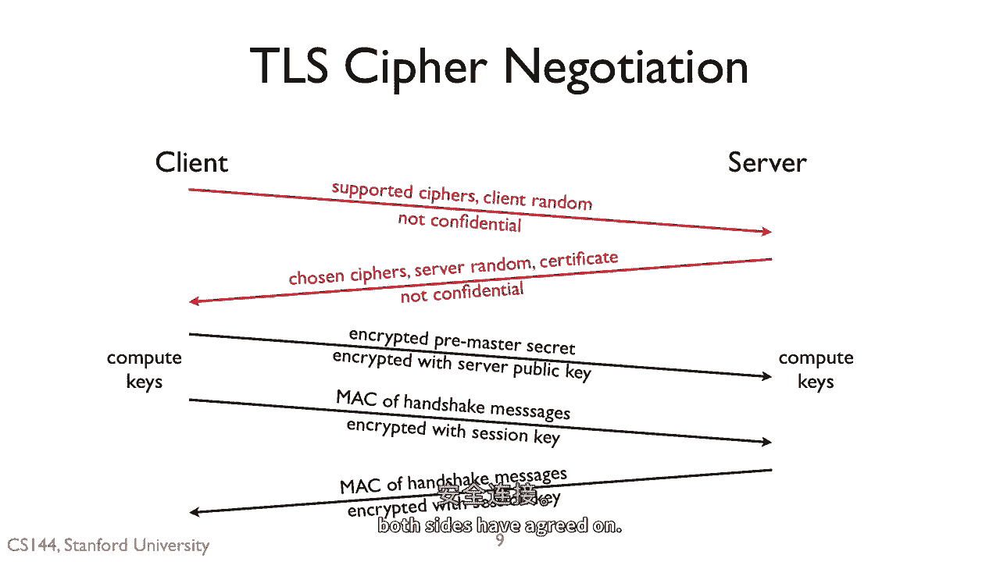
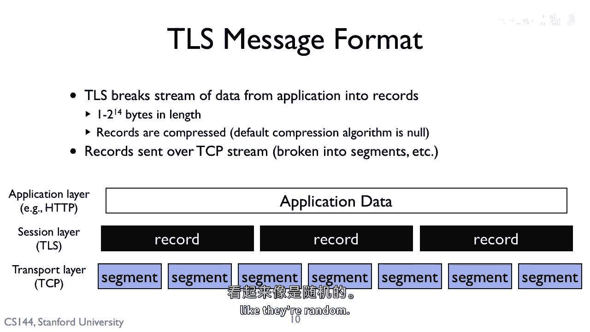
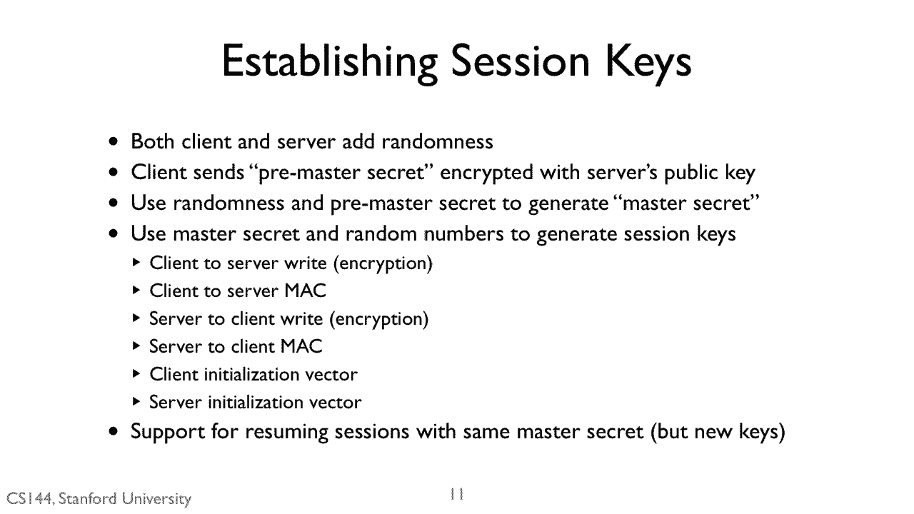

# 【计算机网络 CS144】斯坦福—中英字幕 - P130：p129 8-10a TLS - 加加zero - BV1qotgeXE8D

 In this video， I'm going to explain some details about Transport Layer Security or TLS。

 It's what you use when you use HTTPS， secure HTTP。 TLS is specified in RFC 5246。

 Transport Layer Security is exactly that。 It provides security at the transport layer。

 so between applications。 It's a session layer on top of TCP。

 It provides a stream abstraction just like TCP。 So to most applications it looks just like TCP。

 a bidirectional reliable byte stream。 But TLS adds confidentiality， integrity。

 and authenticity to the stream。 So using TLS properly。

 you can protect your communication from eavesdropping， tampering， and spoofing attacks。

 The most recent version of TLS is version 1。2， specified in RFC 5246。

 TLS started as the secure socket layer SSL by Netscape， back when the web was just starting。

 The version order is a cell 2。0， a cell 3。0， TLS 1。0， TLS 1。1， and now TLS 1。2。

 TLS is used by HTTPS。

 So what's Cyphers and Keys does TLS use？ It has a wide range that are available。

 As part of setting up a TLS session， the client and server negotiate four separate Cyphers。

 The first is the Cypher used to authenticate the server。

 You can also optionally authenticate a client。 The second is the Cypher used to exchange symmetric keys。

 The third is the Cypher used for symmetric confidentiality， and the fourth is the Cypher。

 used for symmetric integrity。 These are negotiated in the five-step session initiation protocol。

 This all happens after we open a TCP connection。 So these messages are sent over TCP。

 So we have an open TCP connection。 In the first step， which is sent as clear text。

 the client sends a list of Cyphers it supports， and a random number it is generated。

 The server responds with what Cyphers to use， its own random number， and a certificate containing。

 its public key。 This is also sent as clear text。 In the third step。

 the client sends something called the pre-master secret to the server。

 encrypted with the server's public key。 Using this pre-master secret and the two random numbers exchanged in the clear text。

 the client， and server compute the keys for the session。

 I'll explain the details of how this works in a moment。 But for now。

 realize that at this point the client and server have generated symmetric。

 keys that their Cyphers need。 Next， the client sends a finished message。

 encrypted and mapped with the symmetric keys， generated with the server random， client random。

 and pre-master secret。 This message includes a Mac of the handshake messages to ensure that both sides saw the。

 same messages。 The Mac is also computed with symmetric key generated from the server random。

 client random， and pre-master secret。 Finally， the server sends a finished message。

 This is secured similarly to the client finish message， and also contains a Mac of the handshake。

 messages。 Macking the handshake messages allows TLS to protect against an adversary trying to force。

 the two parties to choose a different cipher。 Since the first two steps are not secured。

 they have neither confidentiality nor integrity， then an adversary could perform a man in the middle attack to try and change the offer。

 and selected ciphers。 Macking the handshake messages lets them detect this。 So now， at this point。

 we have a secure connection protected through symmetric ciphers that both， sides have agreed on。

 So what does that look like？ Well， to provide integrity。

 TLS needs to break application data up into chunks that they。

 can provide message authentication codes for。 So TLS takes the applications to your data and breaks it up into records。

 There are also records that don't contain data， such as records that generate new keys。

 But let's focus on data records。 TLS takes the application stream and breaks it into data records。

 which date their length， and have a Mac。 These records are encrypted with the chosen ciphers and keys and then sent over TCP。

 This appears as a stream of data at TCP， which then breaks it into segments。

 Records can be much larger than TCP segments， so a single record might be broken into many。

 segments， and record and segment boundaries might not line up。

 TLS includes compression as one of its features。 If， for example。

 you configure TLS providing integrity but not confidentiality， then you。

 then you'd be sending plaintext。 And those texts are generally very compressible， almost 10 to 1。

 So you configure TLS to compress the data。 Mind if all compression is off。

 If there's confidentiality， then compression will help since the bits should seem like their。

 random。

 So let's look at how TLS establishes its session keys。 Remember。

 both the server and the client provide random numbers。 That way。

 if even one of them has a bad random number generator， you'll still have randomness。

 The client also sends a pre-master secret encrypted with the server's public key。

 The client and server both combine these three pieces of information to create something。

 called a master secret from which they generate their session keys。

 Once they compute the master secret， the client and server throw away the pre-master， secret。

 They generate six keys whose lengths are determined by the ciphers used。

 They generate a key used to encrypt data from the client or the server， a key to Mac data。

 from the client or the server， a key to encrypt data from the server or the client， a key to。

 Mac data from the server or the client， a client initialization vector or four vectors。

 for ciphers that need it and a server initialization vector for ciphers that need it。

 Having this master secret， the client and server can regenerate new keys by choosing new。

 random numbers。 You see， you can resume a session with the same master secret， but with new keys。

 Here's a picture of the whole process。 The client and server take this client random， server random。

 and the pre-master secret and， pass them as input to something called the pseudo-random function or PRF。

 which basically， generates bits that look random。 This produces 48 bytes worth of random bits。

 the master secret。 TLS takes the master secret and the two random values。

 and passes them as input to a pseudo-random， function to generate as many bits as you need for all of the keys。

 So for example， if the Mac keys are two 500-12 bits and the right keys are turned to 56 bits。

 and the initialization vectors are 128 bits， then you call the pseudo-random function enough。

 times to generate 1，792 bits， which become the keys。

 (high pitch noise)。