# 【计算机网络 CS144】斯坦福—中英字幕 - P133：p132 8-10d TLS - 加加zero - BV1qotgeXE8D

 So let's switch gears a little bit and actually let's take a look at layering and how it's。

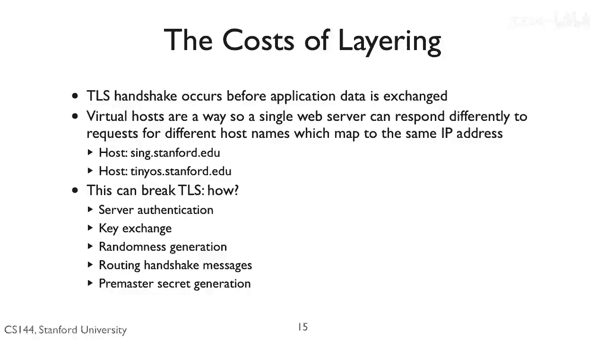

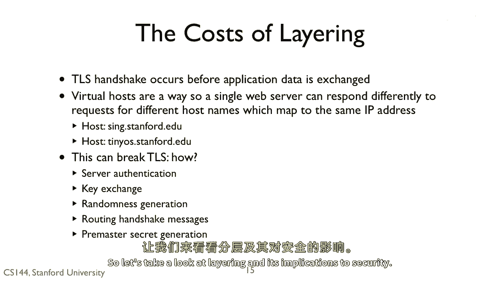

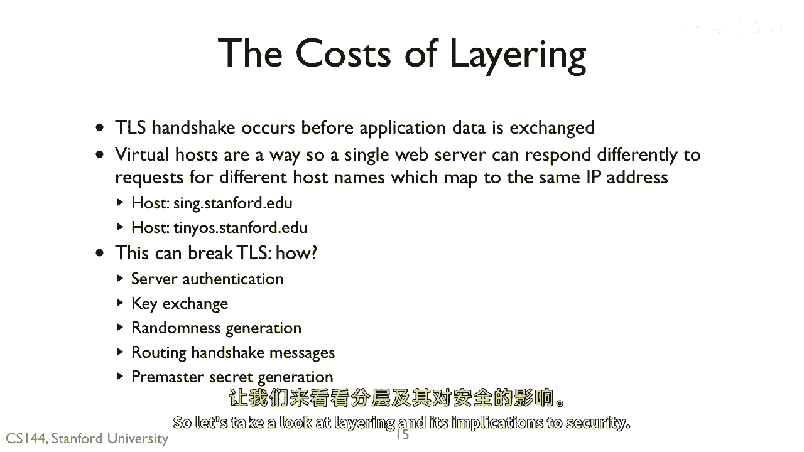

 implications of security。 So you've seen layering many times。

 It's a general important principle in the design of computer networks。

 You've seen its benefits， separation of concerns， independent evolution， ease of adaptivity。

 of adaptability to future technologies。 But it sometimes does get in the way。

 So TLS is used today for secure web transactions over HTTPS。

 But it's often the case that a web server actually runs multiple websites through something。

 called virtual hosts。 The domain names of all the websites map the same IP address of the server。

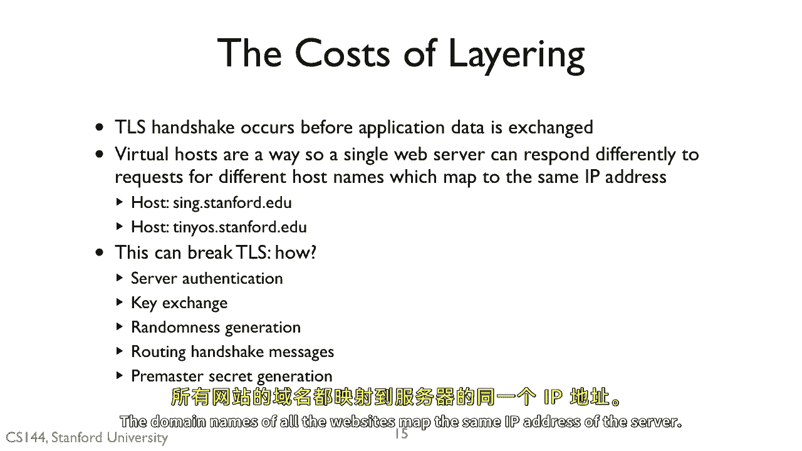

 Clients connect to all of them with report 80。

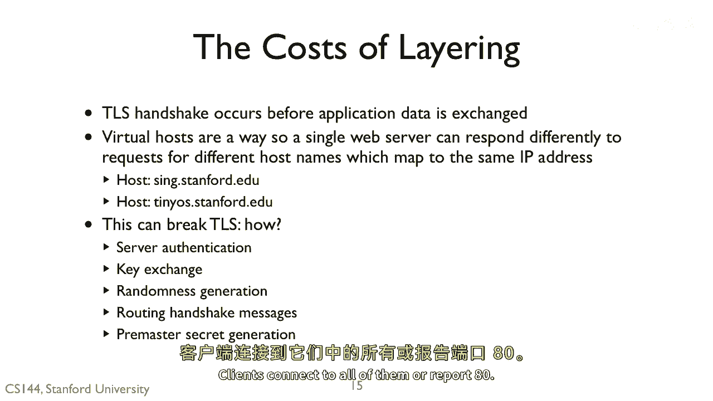

 It's not until the HTTP request comes in that the web server process knows which site the。

 request is for。 The host header field of the HTTP request tells it。

 For example， if you go to sing。stanford。edu and tiny。

 U。S。stanford。edu， the same server。 I can configure a patch as they look up different web pages。

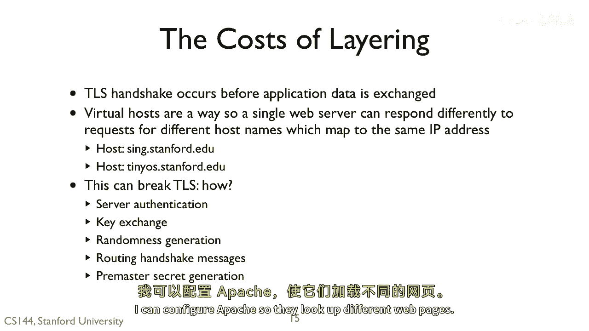

 A patch would look inside the request， see the host header， and choose which web pages。

 to serve based on that。 This can break TLS such that it can't fully work properly。 Why？

 Is it because it breaks server authentication？ Does it break the key exchange？

 Does it break randomness generation？ Does it break routing the handshake messages？

 Or does it break pre-master secret generation？

 The answer is that it breaks server authentication。

 The TLS handshake and secure session setup occur before there is any application data。

 As a part of this exchange， the server needs to provide a certificate that binds a public。

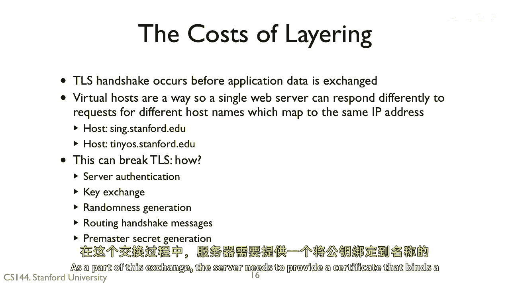

 key to a name。

 But it doesn't know what name to use。 For example。

 my server can't tell whether a connection is coming in for tiny。us。stanford。edu。

 or sing。stanford。edu。 So it doesn't know whether to provide a certificate for tiny。us or sing。

 In my case， I have a certificate that says both。 But if I wanted to add a new host named to the server。

 say a website named www。networkingclass。com。

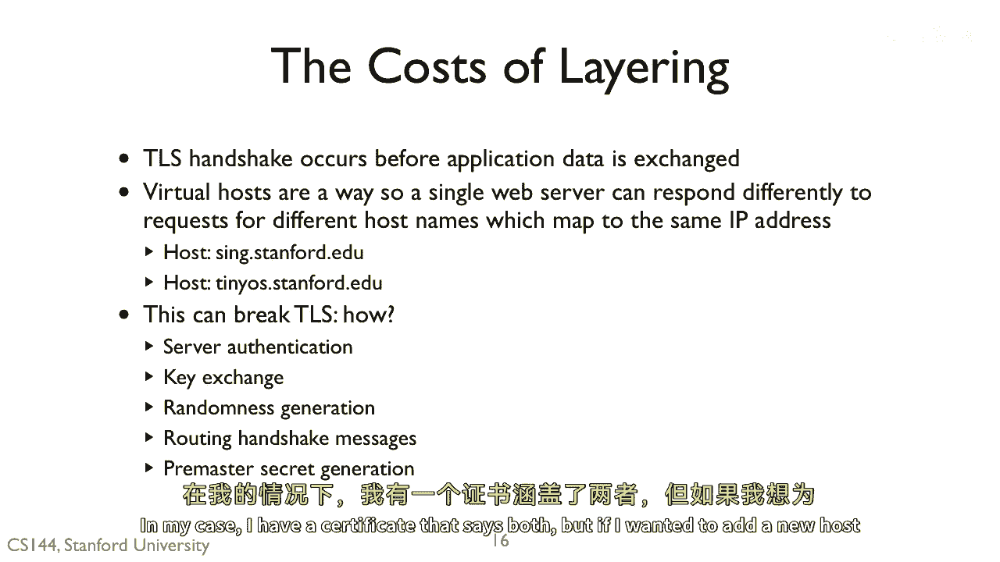

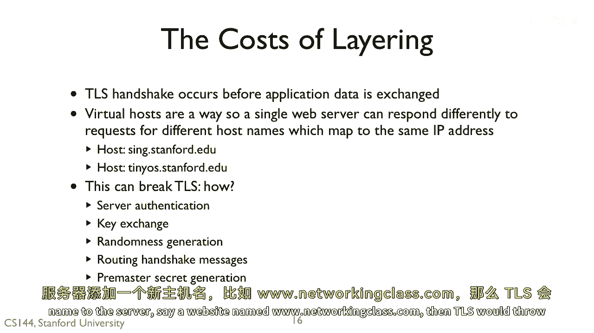

 then TLS would throw an error。 The problem here is that the session layer， layer 5。

 needs to know the host named that。

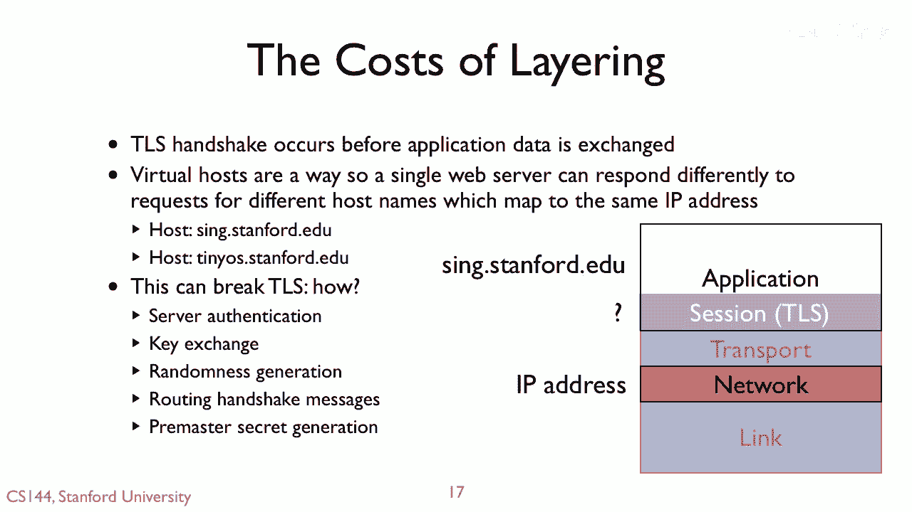

 the client is trying to contact。 But that name is only available in the application layer， layer 7。

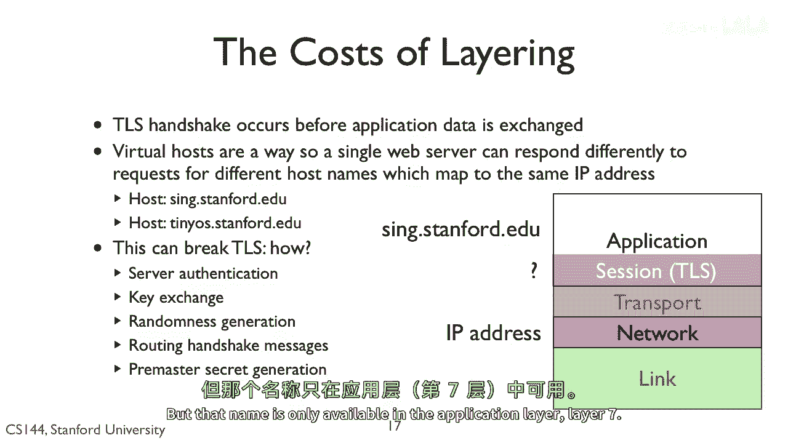

 The client is translated the name to an IP address， so layer 3 name。 So here's an example of layers。

 How layer， the encapsulation functionality can cause a conflict and actually get in a。

 way。