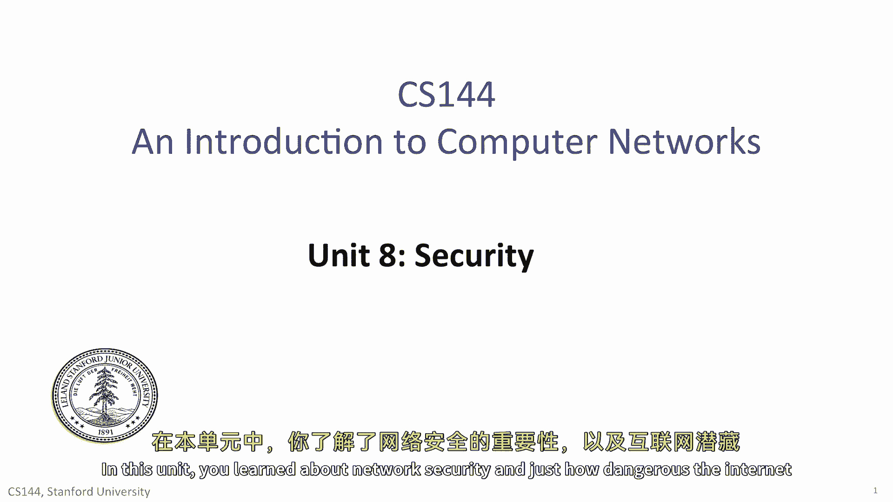
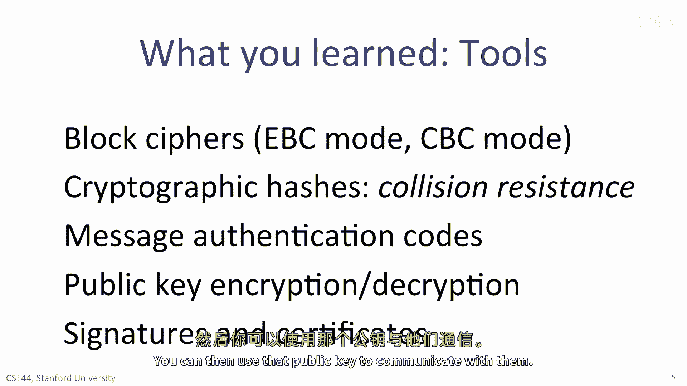
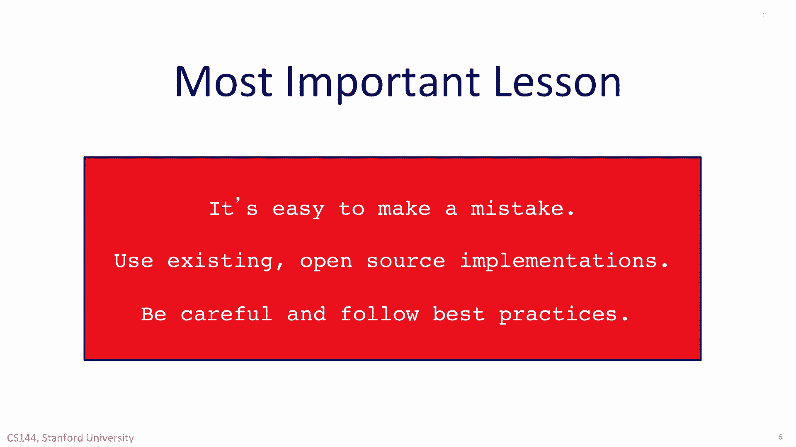

# 【计算机网络 CS144】斯坦福—中英字幕 - P134：p133 8-11 Security - 加加zero - BV1qotgeXE8D

 In this unit， you learned about network security and just how dangerous the internet can be。

 You learned that when thinking about security， this is the model you should assume。

 The network is not your friend。 It's controlled by the adversary。

 Specifically， an adversary can eavesdrop on anything you transmit。

 An adversary can tamper with and rewrite your messages。

 An adversary can suppress messages you send so they don't arrive。

 An adversary can spoof someone or else are you。 An adversary can act as a man in the middle。

 and intercept your traffic before passing it on。 An adversary can redirect or hijack communication at layer 2 through ethernet mechanisms。

 at layer 3 through ICMP or other protocols， and at layer 4 by injecting new segments into a TCP stream。

 Many mechanisms designed with the best of intention turn out to be powerful weapons in the hands of an adversary。

 both for accessing your data and for denying access to network systems。 But there's hope。

 You learned that three basic security principles can empower you to build secure systems。

 even in the face of such attacks。 The first confidentiality lets you communicate secretly。

 even if someone else can read your messages。 Using confidentiality。

 you can communicate with another party over an untrusted network。

 and be confident that no one else can read your traffic。 Or at the very least。

 it's computationally intractable for someone to read your traffic。

 The second principle is integrity。 Integrity lets you be sure that no one has tampered with your data along the way。

 You learned about cryptographic mechanisms that let you very inexpensively verify that a piece of data hasn't been changed。

 The third principle is authenticity。 With authenticity。

 you can be sure that the other party has a secret。 This can be a secret you've shared beforehand。

 or a secret that they can prove they have。 You of course can't be sure who the other party is。

 but you can at least be sure that they have a secret， that only someone else you trust has。

 Practically speaking， you also learned a whole bunch of security tools that can achieve these principles。

 You learned about symmetric cryptography， where two parties share a secret。

 You learned about block ciphers， which transform fixed blocks of data。

 You learned about the dangers of electronic codebook mode and how cipherblock chaining a mode solves them。

 You also learned about cryptographic hashes。 They have the wonderful property that they are easy to compute。

 but it would be intractable for an attacker to generate an input。

 which would compute to a specific hash value。 So if someone tells you the hash value of your software。

 you can check it's correct。 It's nearly impossible for someone to create a new piece of software that has the same hash value。

 This is called collision resistance。 You learned how you can combine cryptographic hashes with a shared secret to generate a message authentication code or Mac。

 With a Mac， you can be sure that no one else has tampered with the message and that its sender has the secret。

 Simple ways of generating a Mac are fraught with peril， so you should be very careful。

 But how do we learn these secrets？ You learned about a different kind of cryptographic system than symmetric cryptography。

 called public key cryptography。 With public key cryptography， there are two keys。

 one public and one private。 Information encrypted with a public key can only be decrypted with a private key。

 So you can share your public key freely and everyone else can send you encrypted data that only you can read。

 There are also ways to generate method message authentication codes using public key encryption。

 called signatures， which only a private key can create， but which the public key can verify。

 Finally， certificates are a way of establishing a chain of trust to learn public keys。 For example。

 if you trust Apple， an Apple consignist document telling you someone else's public key。

 You can then use that public key to communicate with them。

 You've learned some of the basics of network security and cryptography。 There are a lot of details。

 as I tried to give you a sense of how these very important mechanisms work。

 But if you take away one lesson from this unit， however。

 it shouldn't be exactly how a block cipher works。 It should be that insecurity is very easy to make a mistake。

 So don't try to implement these mechanisms yourself。

 It's too easy to miss a detail that turns out to be a vulnerability。 Use existing。

 open source implementations of crypto systems。 Use well tested and well understood approaches that people have examined for a very long time。

 Finally， be careful and follow best practices。

 And remember， the NSA is listening。