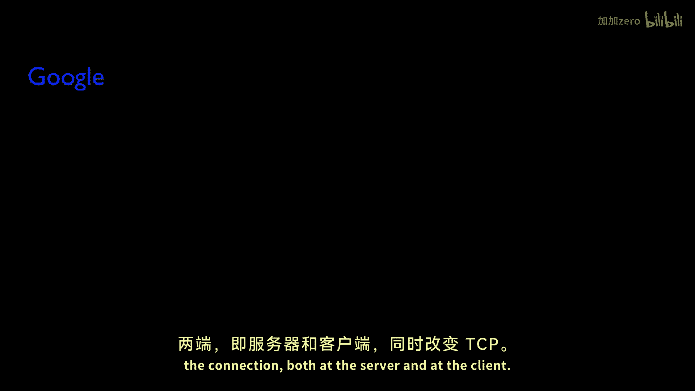
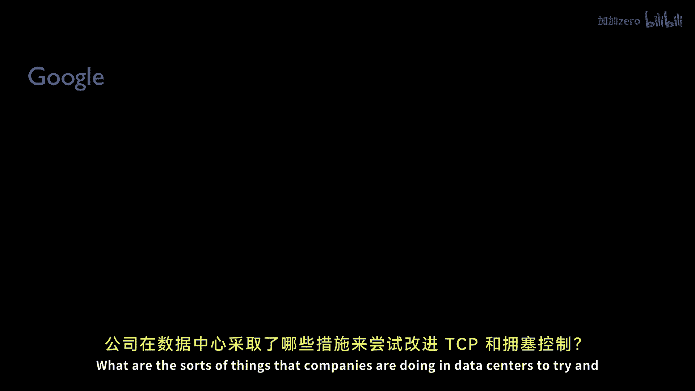

# 【计算机网络 CS144】斯坦福—中英字幕 - P138：p137 9-4 Nandita Interview - 加加zero - BV1qotgeXE8D

 Today， I'm going to be talking to Dr。 Nandita Dukapati。 Nandita did her PhD here at Stanford。

 graduating a number of years ago， and she worked on TCP， congestion control algorithms。

 and alternatives to TCP。 She popularized in particular the term。

 flow completion time as a metric for TCP。 In addition to some of the other metrics。

 we normally use like fair share， high throughput。 And she proposed specific alternatives to TCP。

 that bring mechanisms into the network， to try and reduce the flow completion time。 Anyway。

 today she works at Google， where she continues to work on a number of different congestion。

 control mechanisms。 And I invited her here today to talk with us。

 about some of the things she's learned along the way。 Nandita， what are the shortcomings of TCP。

 and the congestion control algorithms， that we learn about in class， such as TCP， Reno， New Reno。

 et cetera？ Yeah， so over time， essentially， where as the network bandwidth increased。

 and as various different kinds of applications， came over the internet。

 these networks and applications， challenged TCPs in many new ways。 Let me give you a few examples。

 The first one being TCP， Reno， New Reno， and even the newer congestion control algorithms。

 such as Cubic， are fundamentally loss based algorithms， wherein they pump bits into the network。

 until the queues in the network overflow and a loss is triggered。

 in response to which they modulate the rate。 The problem is that these TCPs required the loss rate。

 to be extremely small， such as one in 80，000 segments。

 to sustain a link rate of 10 gigabits per second， or a 200-minute-second link。

 So that turned out to be one of the big problems a decade back。

 when physicists would transfer in large amounts of data， over trans-oceanic links。 But besides that。

 we have a slew of newer problems， for example， considered the web traffic， which。

 have extremely short transactions， request response， transactions， such as one would find in HTTP。

 or even RPCs， that is remote procedural calls， within a data center。

 These are all request response transactions。 The problem is， consider every TCP connection。

 starts with a one RPT overhead。 This can be significant if the request is just a single packet。

 or if the response is just a 50% overhead。 Or consider the slow start where the algorithm ramps up。

 its congestion window over time。 It starts with a small congestion window and ramps up。

 in every round trip time。 That is to slow for short transfers。

 such as what you find in bed transactions。 Not just that， even the loss mechanisms in TCP。

 are not very optimal for short flow performance。 In fact， measurements on Google Serbers。

 show that lossy HTTP responses take about 10 times longer。

 than those which have experienced no losses over very similar， networks。

 And then there are several other problems， such as the internet these days， switches， and routers。

 are vastly have large amounts of buffering。 Now back in two decades back where throughput。

 was a concern， these congestion control algorithms。

 were designed to fill up these buffers until the buffers， actually overflow。

 But the problem is buffers have gotten larger， introduced。 And as a result。

 these introduced large amounts， of delays， especially for short transactions。

 that just was by and lost an RTT or a couple of RTDs。

 And there are also problems at the other extreme end。 We also have switches and some routers。

 with extremely small amounts of buffering。 And that is also a problem for TCP。

 because extremely small amounts of buffering， causes losses in bursts of our trains or packet arriving。

 lose a packet or two almost accidentally。 TCP thinks treats these burst related losses。

 as congestion losses and drastically reduces its congestion， window。 And as a result。

 the links are not being， able to be filled completely。 So in broad extremes。

 TCP's congestion control actually， does not work very well。

 The more interesting problem that has come up in recent times。

 is the interaction between browsers and TCP。 So the way browsers work today is they。

 open several dozens of connections， in order to be able to download the resources。

 from the web pages。 So for example， if you go to images。google。com， and search for， say。

 cats and kittens， then it makes several connections to images 1。google。com， images 2。google。com。

 and so on。 And so you have a sudden influx of these HTTP responses。

 coming to your cable or DSL link。 It's almost like a flash crowd scenario。

 There isn't much of congestion control。 You can exert on each of these responses。

 because each of these is a very tiny entity。 But together， they actually create some bad problems。

 such as overflowing the buffers， increase， queuing latency， and so on。 In addition to these。

 the newer mobile networks， are also posing some performance challenges。

 for congestion control in TCP。 For example， the link fading and the link up and down。

 which is very common in layer two in cellular networks， tricks TCP to thinking that there。

 is extreme congestion in the network， and therefore it should back off and do an exponential。

 retransmission timeout。 So these are the kind of problems。

 that we actually routinely see when TCP interacts， with modern applications and networks。

 What are some of the mechanisms and improvements， that have been put in place over the years。

 to try and overcome these limitations， and shortcomings of TCP？

 So one can think of these mechanisms as falling， into three broad classes。

 So one can-- there are end-host only mechanisms， such as--。

 so these changes require only server-side or only， client-side changes。

 And then the second category of mechanisms， are those which require only changes。

 to the switches and routers。 For example， the active queue management algorithms。

 such as the most recent ones have been， CODEL， Control Delay， and Pi， which selectively。

 drop packets in order to send a signal to the TCP， senders that there are queues being built up。

 at the routers or switches， and it's trying to slow down。 And then there are these mechanisms。

 such as RCP， Re-control Protocol， or XCP， MaxNet， or DCTCP。

 that actually require changes for both the intermediary network， devices。

 as well as the end systems， wherein the end systems get an explicit either a one-bait。

 notification in case of ECN or a multi-bait notification， in the case of RCP。

 XAP that tells them explicitly how， to modulate their rate。 However， the most successful of the--。

 amongst these categories have been the first one， which， is really the end system changes。

 firmly because they're easier to deploy， get through middle boxes， and so on and so forth。

 And in this category， we've seen a slew of new congestion， control algorithms， such as cubic TCP。

 high speed TCP， fast TCP， which aim to solve the problem of maintaining。

 high throughput in large bandwidth delay product networks。

 So the way they improve over new Reno is that they do not， react as drastically to losses。

 and they ramp up much faster， when there is free available bandwidth。

 Cubic TCP and high speed TCPs are still fundamentally， loss-based TCPs。

 in the sense they cut down the congestion， window in response to losses， whereas fast TCP。

 is a delay-based algorithm that is more agnostic to losses。

 but modulates its congestion window based on the measured， changes in the round-trip time。

 And in addition to these off-laid， there have been a slew of mechanisms。

 to make short transactions over the internet faster。 Naturally。

 to make the web pages download faster。 Among these， a few of these examples are TCP fast open。

 Fast open essentially allows you to send， allows one to send data along with the send packet。

 So one can imagine that if a client is issuing a web request。

 and the request is typically fits within one packet， you don't have to wait in a round-trip time。

 before actually being able to send a request to the server。

 You can now send the request in the send packet itself。

 So that's a significant reduction in the page load time。

 When especially when you do this over and over again。

 you actually begin to notice significant differences， in the latency， in user experience latencies。

 Then there are a few other changes， such as TCP's initial congestion window has been。

 has stood at three segments for a long time。 Recently it was， it's been increased to 10 segments。

 in many of the notable open source operating systems。 There are other changes， for example。

 proportional rate reduction， which actually makes， the fast retransmit algorithm more efficient。

 What the fast retransmit algorithm in TCP， has been found。

 it's either extremely bursty or too timid。 What proportional rate reduction does is it actually。

 smooths out the fast retransmit and the fast recovery。

 to pump in just the amount of data that has been delivered。

 to the receiver and therefore makes the recovery of losses， in short flows much smoother。

 The final area where there has been improvement， is in the retransmission timeout。

 RTOs are painful for short flows。 An RTO based recovery is 10 to 100 times longer。

 than the fast retransmit or fast recovery。 And so recently there's a proposal called the tail loss。

 probe， which actually converts an RTO into a fast retransmit， even for short flows。

 This is significant in reducing the tail latency， of short flows because most of the losses in short transfers。

 happen to be tail losses， about 70% of then our tail losses。 And as a result。

 the only way that they can recover， is an RTO， which often is too long。 In big data centers。

 owned by companies like Google。

 where you work or Facebook， Amazon， Microsoft， and so on。

 there's an opportunity to change TCP， at both ends of the connection， both at the server。

 and at the client。 This might be worthwhile if you're。

 trying to overcome a limitation that is particular， to data centers。

 What are the sorts of things that companies are doing。

 in data centers to try and improve TCP and congestion control？

 So a lot of the problems in data centers， are in many ways similar to the internet。

 And yet there are some significant differences。 The similarities are the problems。

 that I've spoken to you about。 The key performance metrics are the same。

 We still care immensely about latencies， especially about tail latencies。

 Either massive over buffering， or also known as a buffer， bloat。

 or massive under buffering is still a problem。 But the major differences are that we can change now both。

 the ends， the server and the receiver。 So some of the simple changes， for example。

 over the internet， you have to keep the RTO， the retransmission， timeouts extremely conservative。

 because you're， trying to encompass a large category of networks。

 such as mobile networks and even the regular wired networks。

 So the initial RTOs are in their order of seconds。 It's one second right now。

 Whereas in data center networks， you know--， and there is no way that you don't need a retransmission。

 time out in the order of seconds， because you， know the RTD of the data center of within the cluster。

 or within a data center is in the order of a few microseconds。 So we've been able to--。

 so making these timers much more precise and much more tight。

 has been very crucial to actually reduce the tail， latencies of the remote procedure calls。

 In addition to it， I think the recent work done， in Microsoft Research and actually in collaboration。

 with Stanford on DC-TCP has been significant， because with just a single bit of information from the switches。

 the end hosts are able to make much better decisions on how， to modulate the rates。

 So I would say a better integration of timers， making the timers much tighter， as well as getting--。

 being able to deploy mechanisms that， require some participation from the switches are ways。

 in which data centers， significant， are different from that of the internet。 Thanks， Nadita。

 So for my last question， all of the improvements， you've described so far are modifications and variations。

 on the basic AIMD-based congestion control， that was first proposed many years ago。

 They all use the same basic congestion control mechanism。

 and modify the sliding window in different ways。 So if you look forward 15， 20 years to the future。

 do you think we'll still be using the same slow start plus。

 AIMD-based congestion control that we do today？ Or do you think we'll have replaced it。

 with one or more new schemes that work in very different ways？ That's a great question， actually。

 And I was secretly hoping that you would ask me that question。

 That I sincerely hope that we don't actually， continue to be using just AIMD-based protocols。

 or just slow start AIMD and continue in that route。 The reason being we are already finding--。

 we're already finding not as such limitations， but ways and means in which we can do better。 So far。

 we've been doing very point-based solutions， to each of these problems。

 We have different mechanisms for web transactions， short web flows， for example。

 They don't even rarely go through the AIMD phase。 They all finish in the slow start phase。

 So we have a different--， we try to optimize the web transactions differently。

 We try to do something different for mobile networks。

 We try to do something different for video flows， just because the video application patterns are very。

 different from just long FTP flows， or the short web transactions。

 We treat the data center networks slightly differently。

 just because of the extremely short latencies。 Similarly， we treat the mobile networks differently。

 We try to do different TCPs for extremely over-buffered networks。

 or extremely under-buffered networks。 So really， my hope is that we stop doing these point solutions。

 to these point problems。 And instead， step back and look at。

 can be actually design congestion control that just works。

 for all networks and for all application patterns。

 instead of going about and treating every problem as if this， is a special case problem。

 Because that's exactly what we're doing today。 And in that direction。

 I think the recent work from MIT， the Remy program that generates congestion control。

 algorithms adaptively based on machine learning algorithms， I think that's an interesting direction。

 And I would really like to see some of these automatically， generated congestion control algorithms。

 how to play out in practice。 It remains to be seen whether they can actually。

 solve the problems of these very different variety of networks， that I've spoken about。

 And in general， I think in the other direction， I think the router-assisted congestion control。

 haven't seen significant deployment just because they're。

 harder to actually deploy it and do experiments on a large scale。

 But with the recent advances such as in OpenFlow， as well as in SDN。

 I think we will see more of the network， participation even in congestion control。

 So I'm very hopeful about these two directions going forward。

 Thank you very much for talking to us today， Nandita。 Thank you very much。 It was my pleasure。

