# 【计算机网络 CS144】斯坦福—中英字幕 - P19：p18 1-10c Longest prefix match (LPM) - 加加zero - BV1qotgeXE8D

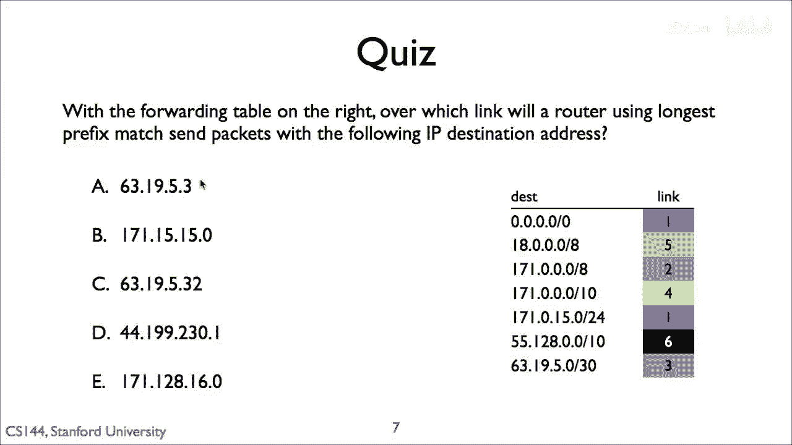

六十三一九五三的答案是链接三，六十三一九五三匹配两个前缀。

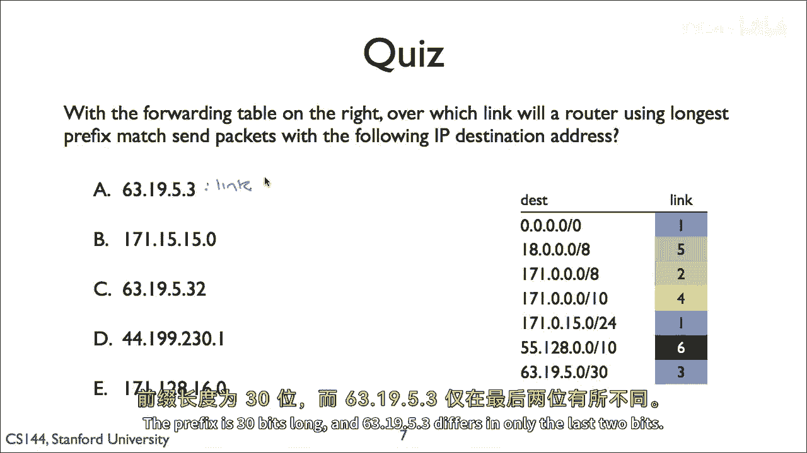

默认路由和前缀六十三一九五零。

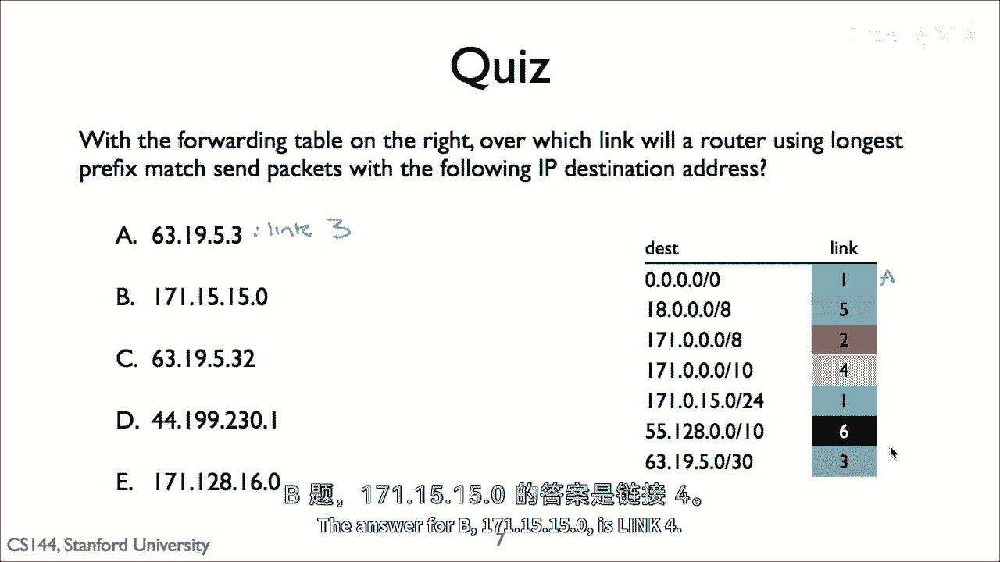

前缀长度为三十位，和六十三一九出。

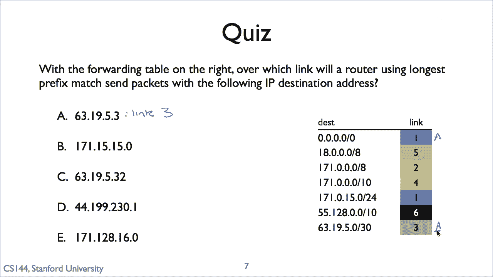

五到三只在最后两位有所不同，Flash三十的前缀比斜杠零长。

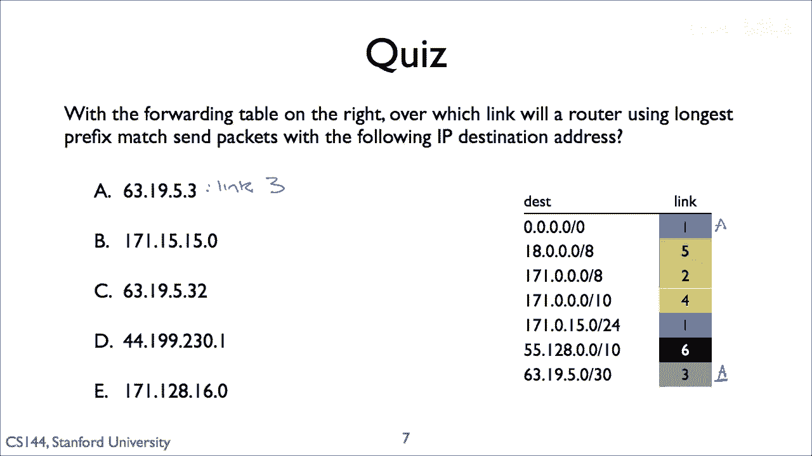

所以路由器会选择链接三，b一七一五五零零的答案是链接四，b匹配三个条目。

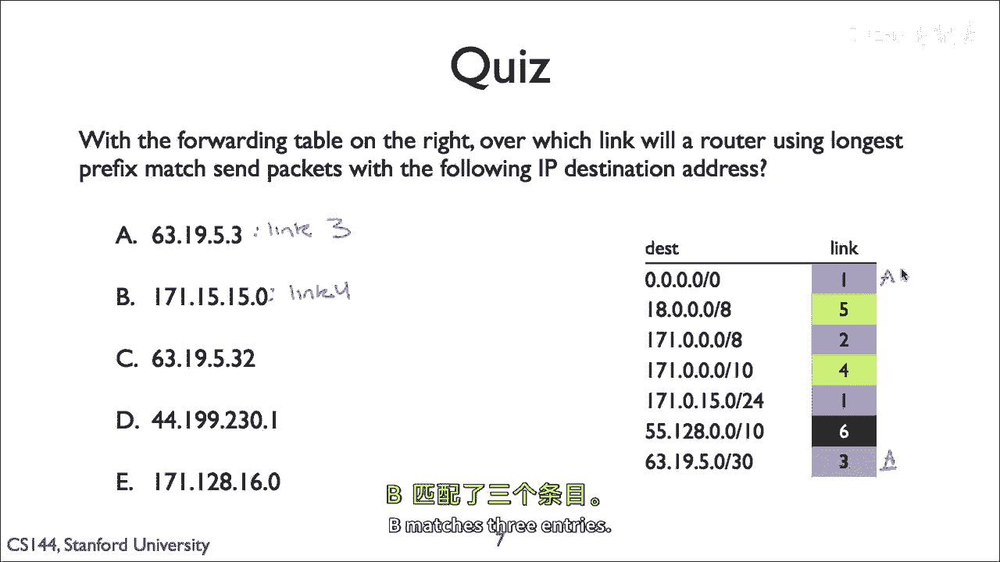

它匹配默认路由一，设置一七一零零槽零八和一。

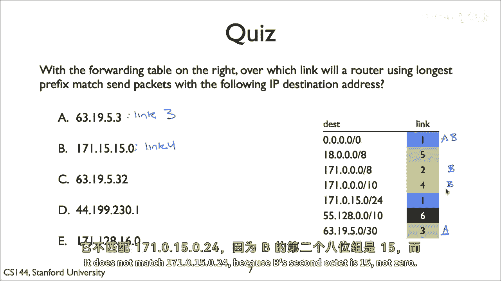

七十一点零点零点零十点。

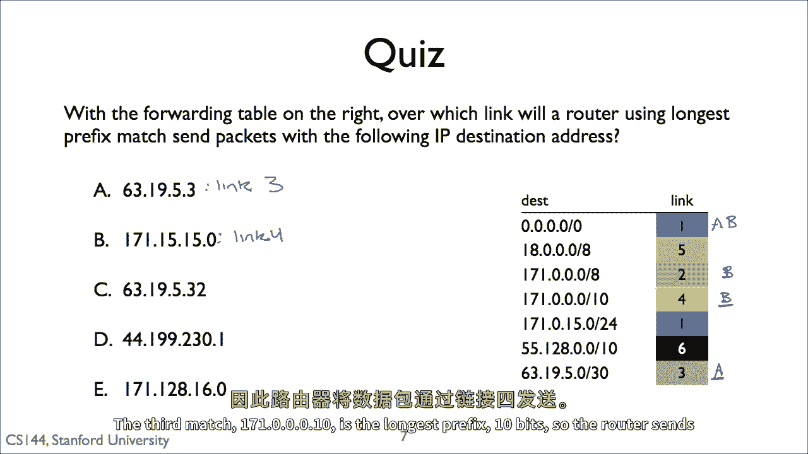

它不匹配一七一点零点一五零二四。

因为b的第二个八位是十五不是零，第三个匹配一七一零，零到零是十是最长的前缀十位。

所以路由器将包发送到链接以获取c六十三的答案。

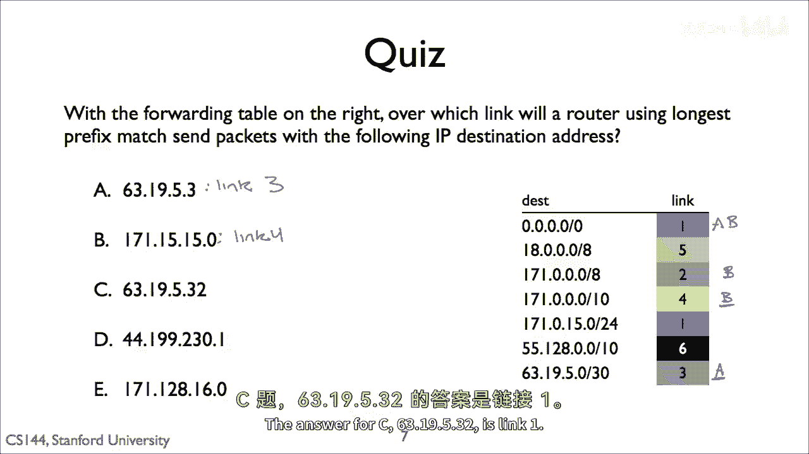

一九五三二是链接一，最长的前缀匹配默认路由。

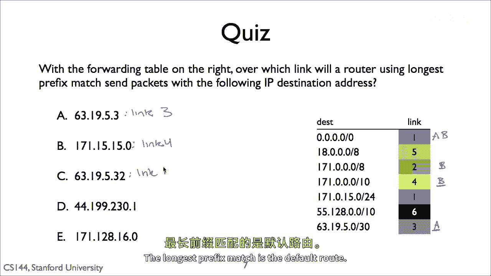

它不匹配六十三一九五零，因为它在六位有所不同。

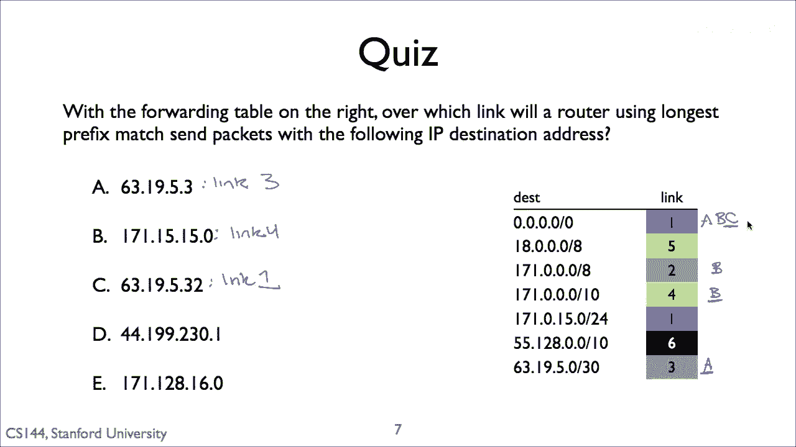

d四十四一的答案是，九十九二三十一是链接一。

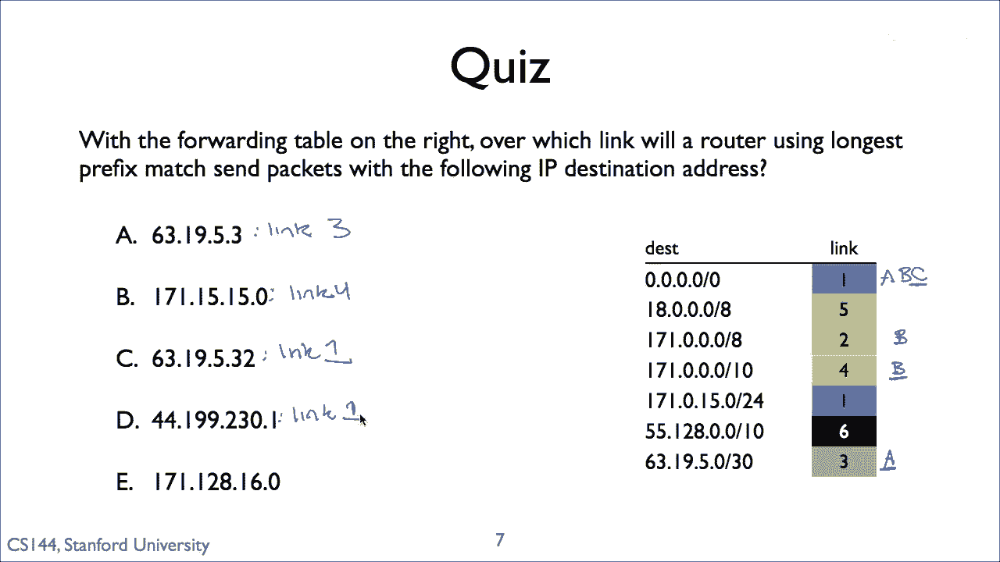

最长的前缀匹配是默认路由，e一七一一的答案是。

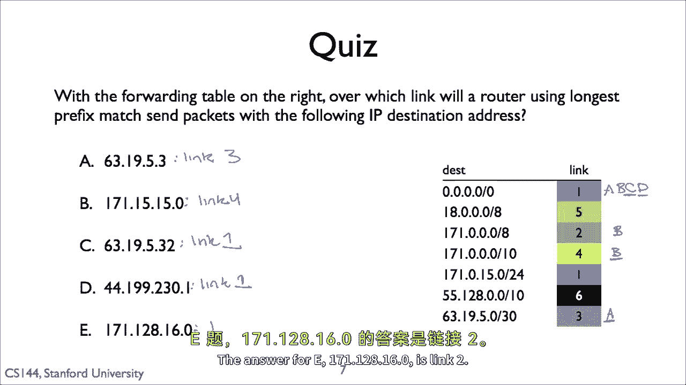

二八一六零是链接到这个地址匹配两个前缀默认路由。

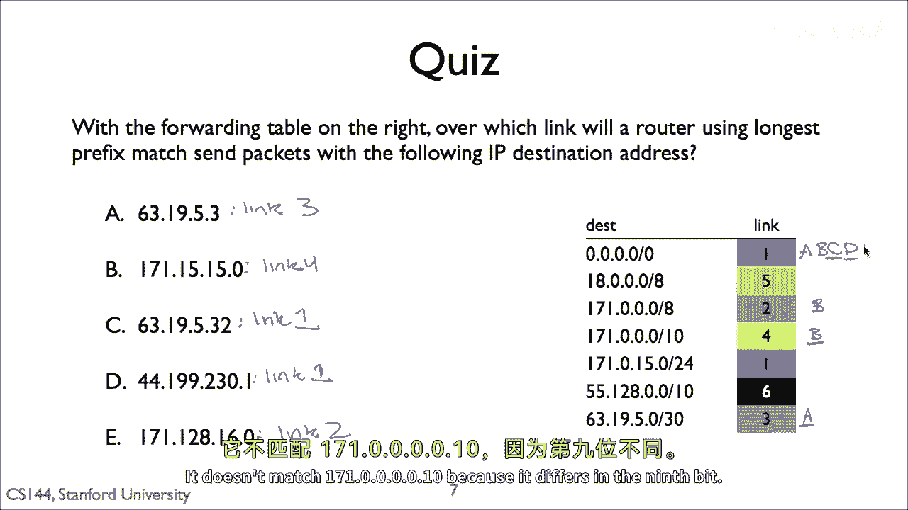

和一七一零零零八，它不匹配一七一点零点零点零十点，因为它在九位有所不同。

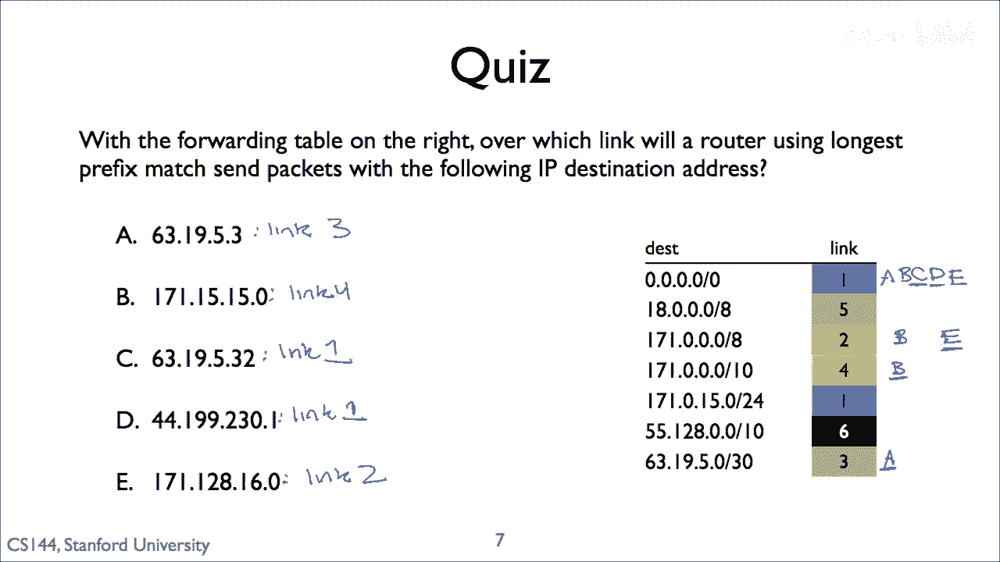

一七一零零零八是最长的前缀。

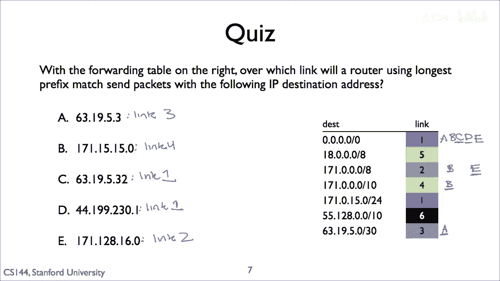