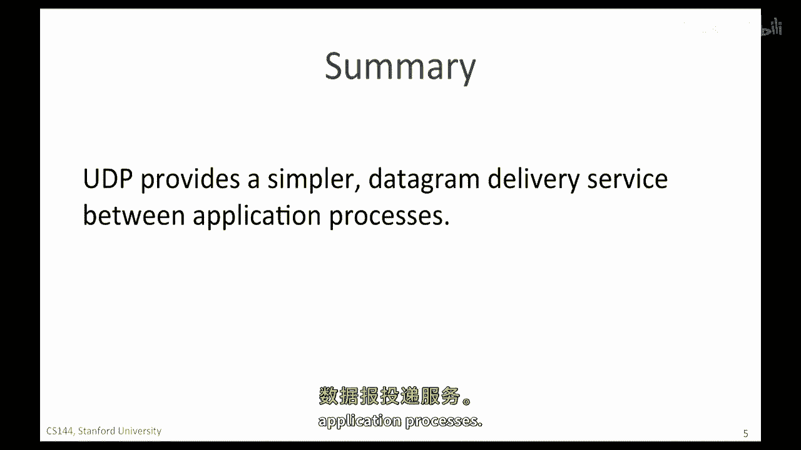

# 【计算机网络 CS144】斯坦福—中英字幕 - P24：p23 2-2 UDP service model - 加加zero - BV1qotgeXE8D

在这个视频中，你将学习到第二传输层，UDP或用户数据报协议，UDP，由不需要TCP提供的保证交付服务的应用程序使用，要么是因为应用程序以其私有的方式处理重传，或者是简单地不需要可靠的交付。

UDP比TCP简单得多，这就是为什么这个视频这么短，UDP只做一件事，那就是将应用程序数据创建为UDP数据报，然后交给网络层，udp数据包仅仅标识出数据应该发送到的应用程序。

在另一端，这就差不多了，正如我们所期待，udp数据包被封装在ip数据包的数据字段中，udp提供了一个非常简单的服务，从udp头的小数量字段中应该可以看出来，与有超过十个头部字段的tcp不同。

udp只有四个，源端口指示数据来自哪个应用，如果远端回复，它将发送一个包含此端口号作为目的地的datagram，以便它可以找到返回到正确应用的正确路径，目的地端口指示数据应该交付给哪个应用。

在另一端主机，udp中的端口号在功能上与tcp相同，它们将传入的包定向到正确的应用程序进程，十六位长度字段指定整个udp datagram头的长度，加上字节数，值必须至少为8字节。

因为这是UDP头的长度，当使用iPv4时，UDP校验和是可选的，iPv4，四，如果发送者不包括校验和，字段被填充为所有零，如果使用UDP校验和，那么它是对UDP头和数据的计算，实际上。

UDP校验和计算还包括IP的一部分，P，V，四个头部，如图所示，计算包括源IP地址和目的地IP地址，以及协议ID，其值为十七，告诉我们IP数据包携带UDP数据。

你可能想知道为什么UDP校验和包括IP头部的一部分，这不违反层之间的清洁分离吗，哦是的，确实如此，违反分层原则的合理性，并且使用下层的信息，是，它允许udp层检测被发送到错误目的地的数据包，总的来说。

udp头小因为它为应用程序提供的服务非常简单，它提供了一个简单的消息协议用于从一台主机的应用程序发送数据，这可能或不会被远程主机上的应用程序接收。

UDP端口的工作方式与TCP端口相同，如果主机a上的进程一有要处理的数据，想要发送数据到主机b上的进程一，该进程使用端口177，数据被放入一个新的UDP数据包，目的地端口设置为1。

主机77添加自己的源端口号，这样，任何回复都可以发送到主机a上的进程一，数据包被封装在IP数据包中，发送到主机b，主机b移除UDP数据包，将数据定向给进程一。

我们可以把UDP看作是一种简单的多路复用机制，为了将到达主机b的UDP数据包流分成多个部分，并将它们发送到正确的流程，实际上，有些人称udp为用户分路协议，因此，它本质上就是udp所做的一切。

总结udp服务模型，我们说它具有以下三个属性，如图表中所示，它提供无连接的数据报服务，因为没有建立连接，所以不需要，所有的信息都包含在数据报中，它意味着数据包可能会以任何顺序出现，所以。

如果应用程序关心按顺序的交付，那么它就需要自己重新排序数据，udp是一种不可靠的交付服务，它不向我们发送任何确认消息，让我们知道数据是否到达，到另一端，它没有检测缺失数据包的机制。

如果整个数据包在途中丢失，那么，udp不会通知应用程序，并且它不会要求源重新发送数据包，然而，应用可能会选择自己请求数据再次，本质上在udp上构建一个重传机制，NFS的早期版本。

网络文件系统确实这样做了，他们检测到，他们决定他们不想使用tcp使用的滑动窗口，所以他们在应用内部创建了自己的，udp应该听起来非常像ip层提供的服务，这是因为，UDP提供了比IP层简单的封装。

具有将到达的数据定向到另一端正确应用的能力，那么，为什么我们有UDP，UDP被用于不需要可靠交付的应用程序，例如，简单的请求响应应用程序，DNS，互联网上用于将主机名转换为IP地址的域名系统。

使用UDP，因为请求完全包含在一个UDP数据包中，你将 later 学习 DNS 如何工作，但现在，你需要知道的是，如果我们发送包含主机名的DNS请求，DNS服务器将响应IP地址。

我们可以使用它来发送IP数据包到主机，如果请求成功，由于UDP轻量级和快速，在发送查询之前无需设置连接，如果请求失败，它只是超时并被重新发送，这使得DNS简单和快速，大多数时间。

DHCP或动态主机配置协议使用UDP，出于同样的原因，网络时间协议或NTP也使用UDP，因为它也是请求响应协议，一些其他应用程序使用UDP，因为它们有自己的特殊需求进行重传，拥塞控制，和序列交付，例如。

一些实时流媒体音频和视频服务使用UDP，这比以前要常见得多，因为今天的大多数视频和音频HTTP流使用TCP而不是UDP，这是因为它们建立在HTTP之上。

总结。

