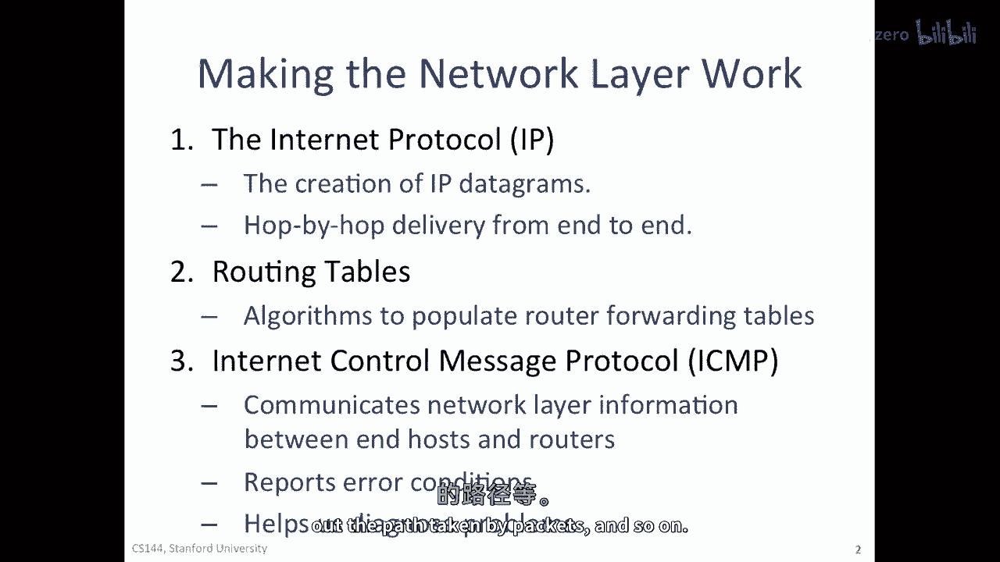
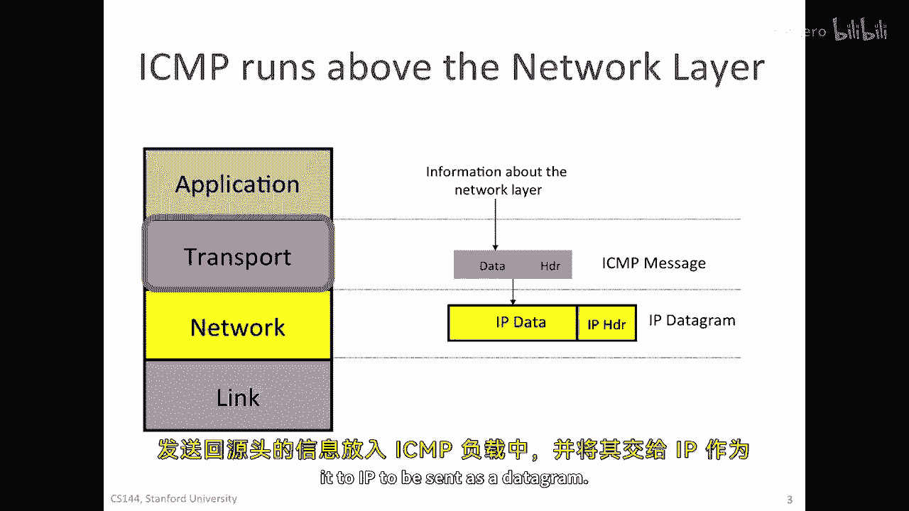
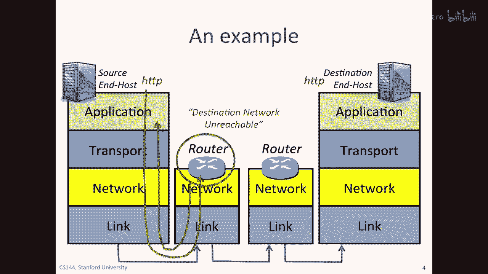
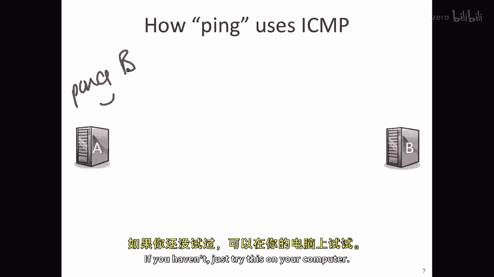
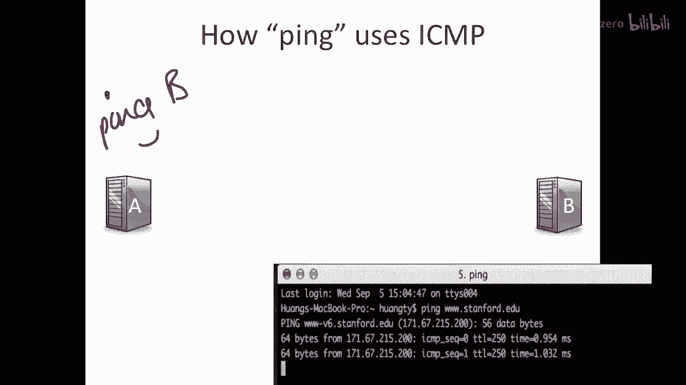
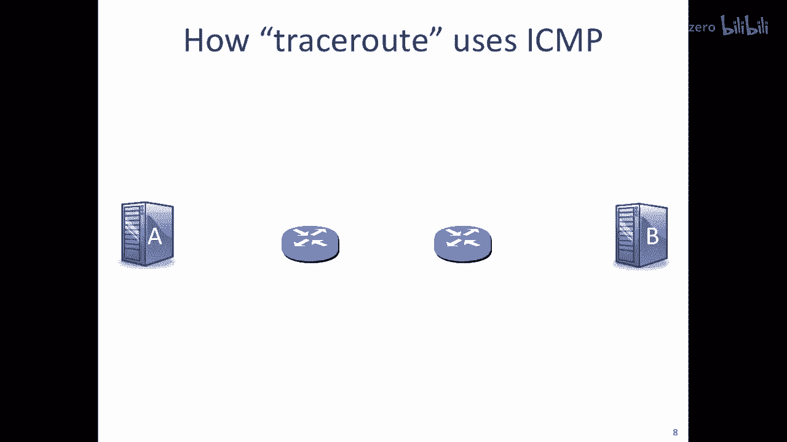
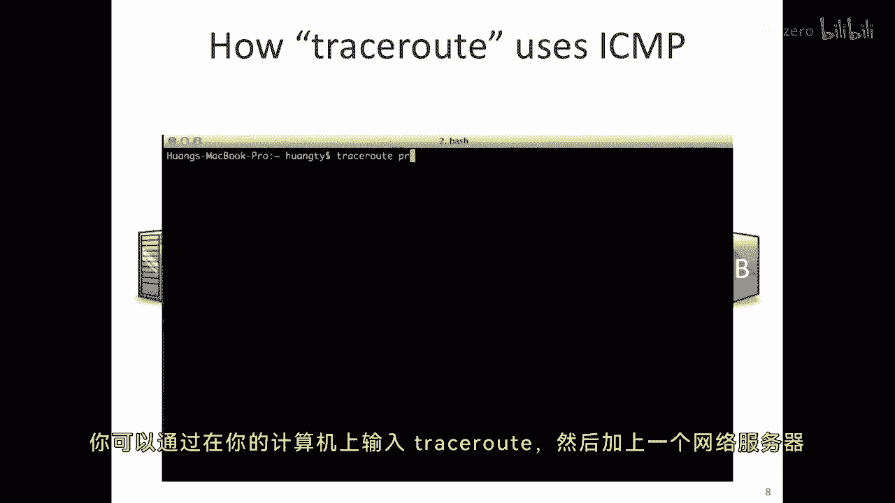
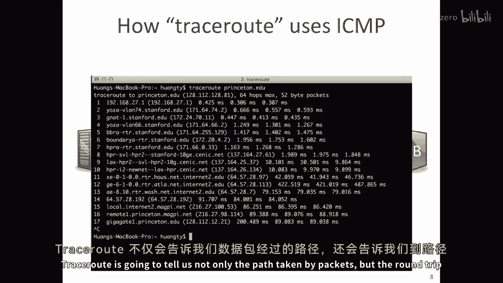
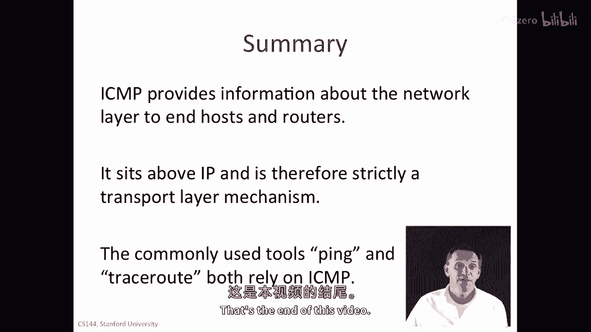

# 【计算机网络 CS144】斯坦福—中英字幕 - P25：p24 2-3 ICMP service model - 加加zero - BV1qotgeXE8D

在这个视频中，我将继续讨论四层互联网模型，并且我将告诉你关于icmp服务模型的内容，它被用于报告错误和诊断网络层的问题，你记得ip不提供关于交付的任何保证，但它确实有帮助。

并且它将证明是一个非常有价值的工具，以便从网络层获取一些线索和信息，告诉我们事情出了什么问题，我们使用三种机制使互联网的网络层工作，我们已经看到的第一种是互联网协议或IP，这创建IP数据包。

然后将它们从端到端传递，路由表的第二种，坐在路由器内部，有算法运行来填充这些转发路由表，以便路由器知道如何将它们一跳一跳地传递到另一端，icmp帮助端主机和路由器之间通信网络层的信息。

我将在下一分钟展示一些这些的例子，通常用于报告错误条件并帮助我们诊断问题，找出数据包的传输路径等。

好的，imf运行在网络层之上，因此，从严格意义上说，它是传输层协议，当终端主机或路由器想要使用icmp报告错误时，它将想要发送的信息放入icmp负载中。

并将其交给ice交给ip以作为datagram发送。

让我们看一个例子，嗯，正如我所说，ICP通常被用作，作为错误报告的方法，实际上，你已经见过它，如果你曾经见过消息'目的地网络不可达'，所以让我们看一个例子，想象一下。

我在这里有一个运行中的Web客户端作为应用程序，所以我有一个，一个HTTP或Web客户端在这里，那就是在这里通过b的HTTP服务器进行访问的，正如我们所见之前，对于HTTP的GET请求。

应用程序字节被放入传输层，通常情况下，TCP下来到达网络层，沿着链路出去，到这里的路由器上来，想象一下这里放入的地址，实际上是这个路由器在转发表中没有信息的网络，现在，这将是一个相当糟糕的情况。

因为那个路由器不知道如何将包转发到目的地，但是如果这种情况发生，那么路由器将会发送一条消息，因此，这将会通过网络返回到a，并在其中包含目的地，网络，这仅仅是在说它没有将那个包发送到b的方法。

所以它会通过发送这个来警告a。

我们稍后将看到它使用的格式，所以，icp服务模型基本上非常，非常简单，它允许它发送一个报告消息，一个包含错误记录的自包含消息，从可靠性的角度来看，它发送一个简单的数据报文，它不尝试重新发送它。

它不维护它发送的消息的状态，它只是发送一个摘要，如果提供问题的指示，实际上，它是如何工作的是，当一条消息到来时，例如，一个ip数据包，这是我的ip数据包，这里是头部，这里是负载。

或我ip数据包的数据部分，这是我的ip数据包，假设这个刚刚到达，在我的前一个例子中，这是从a到第一个路由器到达的，如果第一个路由器想要发送一个icmp消息，它做什么的是，它取一个，它取头部，现在。

这个头部这里有源地址a和目的地地址b，它会将这个填充到，它会将这个放入icmp消息，所以它会取这个头部并将其放入icmp消息，这是我的icmp消息，它还会取ip负载的前八个字节，并将此放入icmp消息。

然后它标记为类型和代码，我们稍后将看到一些这些类型和代码的例子，然后整个都被放入一个新的ip数据包，所以这是新ip数据包的数据，这将被发送回去，所以这是头部，因此，ip源将是路由器。

所以我将只是写r为路由器，在我的例子中，ip目的地将是a，它将将其发送到a以告诉它这是，嗯，错误，这是错误类型，它这样确定错误类型，这是与那个错误相关的数据，它是最初引起问题的IP数据包。

所有这些都被放入返回到a的IP数据包的数据中，这是一个一些的好例子，嗯，嗯，一些特定的ICMP消息类型，有很多消息类型，这只是一个，这只是它们的一个样本，我们看到的最重要的六个是这些。

你不需要记住类型或代码，嗯，你会在这些中找到它们，嗯，嗯，互联网RFC792，你可以在网上查找这些，如果你想，这些是最常用的，我将通过例子来说明，我们已经看到了网络不可达，这是类型三代码零。

还有其他两个目的地不可达的，主机不可达，如果IP数据包到达最后路由器，但最后路由器不知道主机在哪里，端口不可达，意味着 uh，包含在内部的端口，或协议ID在内部的IP数据包，它不知道如何处理它。

它不认识它，在另一端，我们将看到回声，请求和TTL到期是如何使用的，好的，你可能以前使用过ping命令，ping用于测试另一个主机的活力，它也检查我们与该主机的连接性，想象一下我们从 uh。

A向B发送ping消息，所以我们坐在A处，运行命令，Ping B right，你可能做过这个，如果你没有，就在你的电脑上试试，选择B，然后输入Ping B，如果你还没有，就试试看。

选择，嗯，像www dot stanford dot edu这样的计算机名称，然后只是输入ping www dot stanford dot edu。

ping应用直接调用icmp，它发送一个icmp回声请求，所以这将是一个进入网络的消息，所以这是icmp，这是icmp，而且它恰好是一个类型八代码零的消息，如果你之前看过表格，实际上这是一次回声请求。

然后它在IP数据包中被封装，所以这是我的IP数据包，它正在向b发送，当这通过网络时，它将跨越到b，我们希望最终它能到达b，然后b将看到这个，而被者需要完成的任务是发送回声响应，所以它将发送回a。

它将发送icmp，icmp将是a，嗯，我想它是类型零，代码零，这是回声响应，这被放置在IP数据包中，所以所有这些都将被放置在IP数据包中，它将被发送回a，简单而美好，这就是ping的工作方式现在。

让我们看看trace route的工作方式，Trace route是一个应用程序，它告诉我们数据包通过网络的路径，以及它沿途访问的路由器，你可以通过简单地输入traceroute。

然后网络中某个Web服务器或其他服务器的名称到你的计算机中来尝试。

如我所示。

Trace route将告诉我们不仅数据包的路径，而且还到路径上每个路由器的往返延迟，所以trace route使用icmp。

Icp以一种非常聪明的方式使用，嗯，所以trace route的目标是找到从a到b的路由器，所以它正在尝试识别路径上的两个路由器，从a到b，所以它正在尝试识别路径上的两个路由器。

并测量从a到每个这些路由器的数据包往返时间，traceroute，嗯，通过发送嗯，UDP消息，首先，我将描述它做了什么，然后我们将看到为什么它起作用，所以a将发送一个udp消息。

所以它将发送一个udp消息，并且这个udp消息将被发送，嗯，嗯，实际上它包含什么并不重要，但是它会走，嗯，被封装在一个ip数据包中，对于哪个TTL，IP头部中的TTL字段被设置为1。

所以这将从a发送到第一个路由器，正如您记得的，所需的，路由器需要减少TTL，然后丢弃包，如果TTL达到零，所以它将设置TTL等于零，丢弃包，路由器还需要做一件事，那就是发送一个icmp消息。

所以错误报告消息返回给a，它以消息发送回，嗯，我想它是类型十一，嗯，icmp，好的，所以它将发送一个类型十一消息，这是TTL过期，这是嗯，icmp消息，TTL过期，这将告诉a，为了那个包能够到达a。

它将需要像以前那样，它将需要IP头部，嗯，那个被发送的，它将需要IP负载的前八字节，并将它们填充到一个消息中，连同这个icmp，所以让我们这样画，所以这将是进来这里的icmp消息。

这将是原始IP消息的摘要，它将将这个放入IP数据包中，并将它发送回a，当这个到达a时，它将从这个消息中知道，TTL过期了，并从这个数据部分，icmp消息的负载部分，它将知道，啊哈，这来自一条消息。

我原本从一个发送，它将来自路由器，所以这的ip源地址是，嗯，这个图表将是路由器，所以我会把那个放在r作为，所以知道这是这台路由器，它可以查找它的名称，现在它知道第一个跳转路由器是r。

并且通过测量从发送原始IP消息到接收到这个ICMP回复的时间，它现在知道到那个路由器的往返时间，下一步可能相当明显，接下来a将要发送一个UDP消息，并将其放入IP数据包。

并且这个IP数据包的TTL设置为2，好的，所以这是发出的IP数据包，所以它将通过到第一个路由器，所以它将到达第一个路由器，它会将ttl减至一，请通过第二个，它会将其减至零，然后。

这个会发送一个icmp消息，所以数据包将看起来像这样，我现在将绘制包含icmp消息的ip数据包，所以这是ip数据包，这是要去的地址，让我们叫它r2，里面将包含icmp消息，所以这是它携带的icmp消息。

它将说，嗯，输入十一，这是ttl过期的哪个，然后它将有原始的ip头部加上八字节，所以当它被撤回时，它知道这是指向的消息是什么，它可以测量往返时间，现在，它知道基于来自r2的消息，它知道这是什么，嗯。

这个路由器是，所以你可以查找它的名称，现在它知道从该路由器到目的地的往返时间，它会这样做，直到最终消息找到它的路径，要成为它发送的udp消息是，嗯，使用端口号，这是一个奇怪的目的地。

故意选择一个b不知道会知道的端口号，这样b就会发送一条消息说，并且它将是icmp消息，端口不可达，所以当它发送回端口不可达时，a知道消息得到了跟踪路由，成功地到达了b，知道跟踪路由已经完成。

所以总的来说，icmp，它位于ip层之上，因此，从严格意义上说，它是传输层的机制，尽管它实际上是为了服务网络层而存在的，常用的工具，ping和tracerroute都依赖于icmp，我鼓励你尝试两者。

并玩一玩它们，它们给你关于互联网可达性和路径的大量信息。

