# 【计算机网络 CS144】斯坦福—中英字幕 - P28：p27 2-6a Finite state machines 1 - 加加zero - BV1qotgeXE8D

我将解释有限状态机，在指定网络协议和系统时非常常用，我还将解释网络协议中他们通常如何被绘制，我将以展示有限状态机结束，这属于tcp规范，它定义了tcp连接的建立和拆除方式。

所以你将看到如何描述。

像tcp的三次握手这样的东西在有限状态机中，正如名字所暗示的，有限状态机由有限的状态组成，状态是系统的特定配置，我将从一个抽象的例子开始，在这个例子中，我们有三个状态，状态一，状态二和状态三。

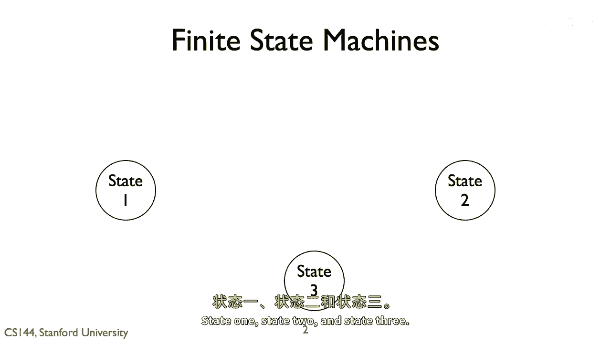

所以系统可以处于这三个状态之一，状态之间的边定义了我们如何从一个状态过渡到另一个状态。

当我们绘制一条边时，我们首先指定导致过渡的事件，在下面，我们可以声明当那个过渡发生时系统将采取的行动，第二部分是可选的，因为不是所有的过渡都有与它们相关的行动，但如果有行动，你应该指定它。

否则你有一个不完整的规范，人们可能不会正确地测试或实现它，如果系统处于一个状态且一个事件到达，对于没有描述的过渡，有限状态机的行为是未知的。

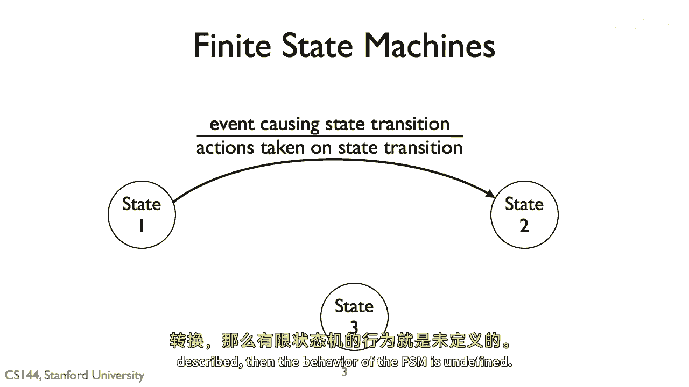

从一个状态可以有多个过渡，所以这里有从状态一的第二个过渡。

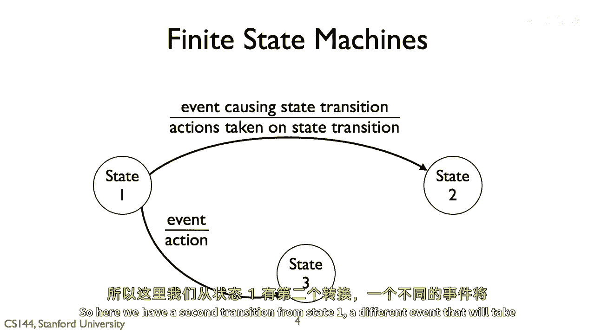

一个不同的事件将系统带到状态三。

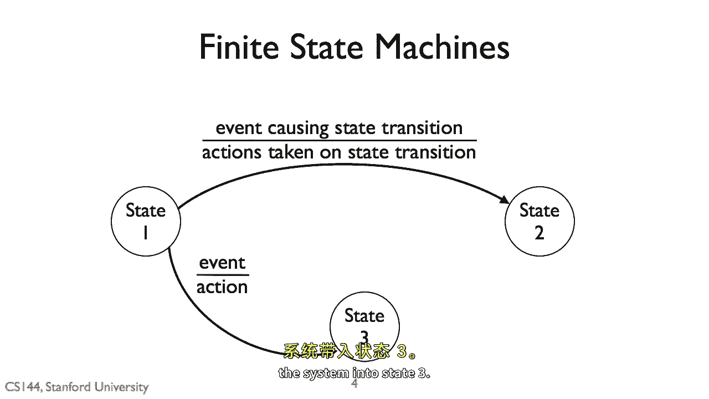

对于任何给定的状态，一个事件的过渡必须是唯一的。

在这个例子中，一个事件可以使状态一过渡到状态二或状态三，但你不能有同一个事件与两个过渡相关联，否则过渡是模糊的，如果事件发生，你将处于状态二还是状态三，系统只能处于一个状态。

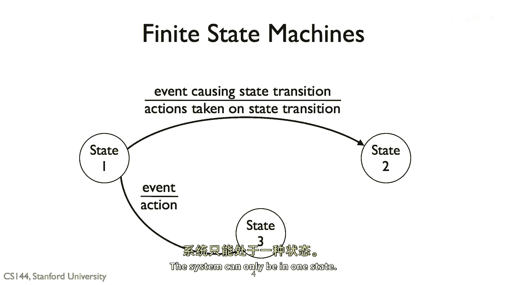

让我们走一遍例子，在实际中，HTTP请求，HTTP请求比这复杂得多，有许多选项，所以对于这个例子，让我们选择一个非常简单的形式，我们可以这样描述我们的系统，在我们的起始状态，我们正在查看一页。

或者处于空闲状态，我们想要加载新的一页。

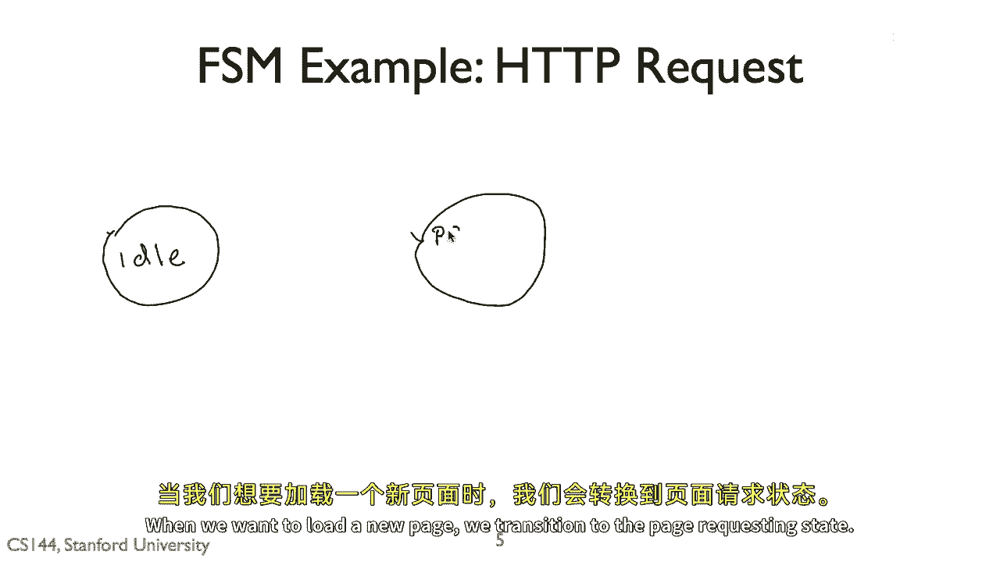

我们过渡到请求状态的页面，所以事件是新加载页面。

并且动作是打开与Web服务器的连接，一旦我们打开了连接，我们现在在请求状态的页面上，我们将过渡回空闲状态，当连接关闭时，当我们在页面上请求所有资源完成后。

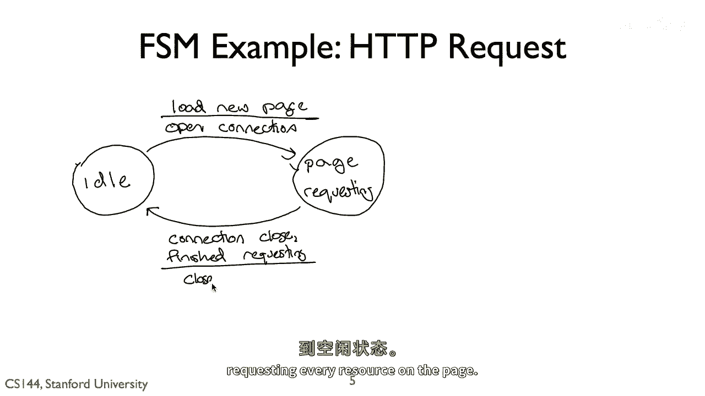

我们需要一个额外的状态，这个状态描述我们在请求页面时的位置。

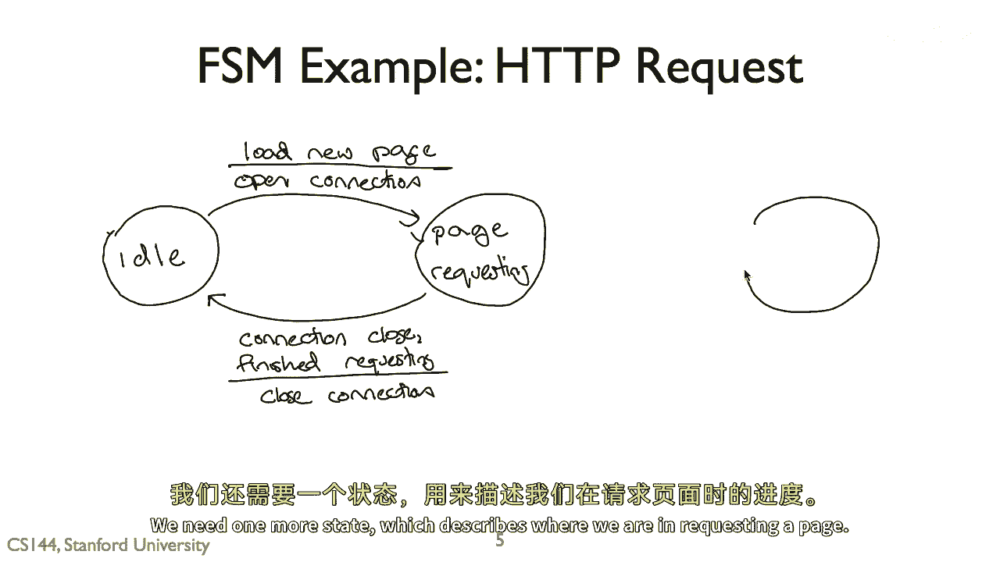

在资源需要请求更多的事件发生时。

我们采取的行动是使用HTTP请求一个资源，获取此将使我们在收到响应的事件中处于请求待处理状态。

我们的系统返回到请求页面状态，因此，我们有一个三个状态的系统：空闲页面、请求页面和请求待处理页面，这是一个很好的简单FSM，但如果你要尝试实现它，它没有明确地说很多，系统页面请求中有四个事件。

更多的请求，接收响应并连接关闭，如果连接关闭事件在我们处于请求等待状态时到达会发生什么，或者在我们处于页面请求状态时收到页面请求，或者在空闲状态时收到响应，如果你想要完全明确和谨慎。

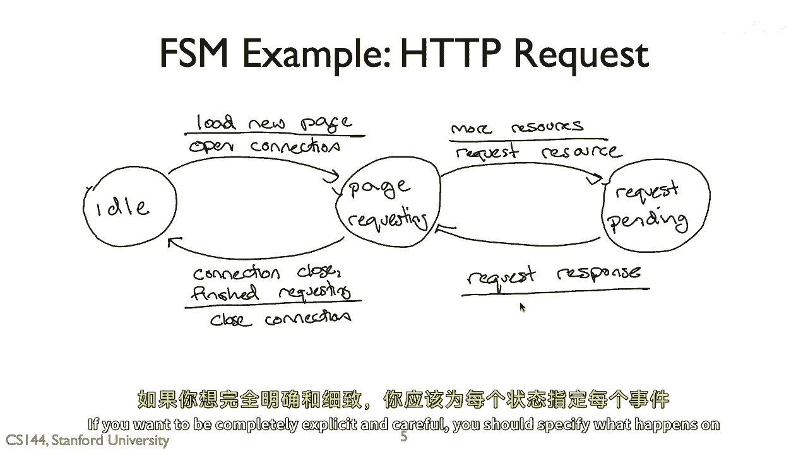

你应该为每个事件指定在每个状态中应发生的事情，但这可能会导致复杂的fms，具有众多的边，所以经常，相反，你会在fsm中写下常见的情况，以便于理解，并添加一些关于其他转换的文本。

或者在某些情况下甚至可以接受一些，互联网工程任务组未定义，例如，itf往往没有完全指定每个fsm，想法是，只指定必要的部分以实现互操作性，你可以让规范灵活以供未来探索，如果人们使用该协议。

他们将能够确定某事物是否重要，如果重要，他们可以后来指定额外的部分。

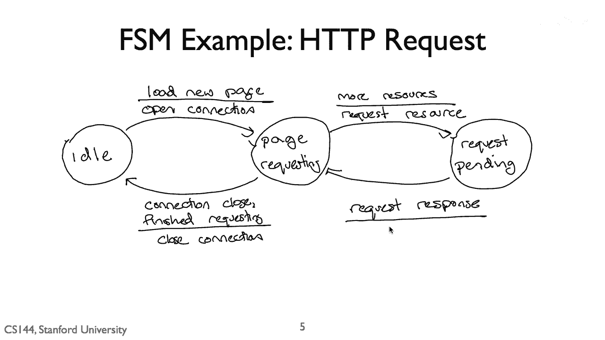

所以让我们通过一个实际的fsm例子来走一遍，这可能是互联网上最著名的fsm。

这个图表描述了tcp的有限状态机，我知道它看起来非常复杂，它共有十二个状态，但我将一步一步地走，你将看到它如何完美地结合在一起，首先，这个图表实际上有四个部分，我们可以分别来看，这些顶部的四个状态。

或者描述你如何打开一个tcp连接，中心状态建立的时候，是tcp在发送和接收数据的时候，这是在连接建立之后，但还没有关闭之前，这六个状态，描述连接如何从这个状态关闭底部，关闭，表示连接已关闭。

节点可以忘记它，请注意，顶部状态也是我们打开连接之前关闭的状态，记住，你用三握手开始TCP连接，同步a，客户端或主动打开者向程序发送一个sin同步消息，正在等待连接请求，当这个节点收到一个sin。

它回应一个sync同步，并承认原始同步，当接收到同步时，主动打开者响应一个确认并采取行动，这里的状态图描述了tcp如何工作，tcp在三次握手的两侧如何行为，被动打开者是一个监听者，是一个服务器。

它监听来自主动打开者客户端的连接请求，所以当程序调用，监听，socket从橙色的关闭状态过渡到黄色的监听状态，当这种情况发生时，协议不采取任何行动，它不发送任何消息。

如果服务器在socket上调用close，当它在监听状态时，它立即过渡到关闭状态，让我们走一遍三次握手，从第一步开始，当客户端尝试建立连接并向服务器发送包时，我们可以看到。

客户端连接的这一首次过渡是这个橙色箭头，从关闭到SYN-SENT状态，这发生在客户端程序调用connect事件时，然后客户端发送一个send消息，一旦第一个sin被发送，客户端处于sin发送状态。

当sin到达服务器时，服务器处于listen状态，这导致这种蓝色过渡，你可以看到事件正在接收send消息，动作是响应发送一个sin动作消息，现在服务器处于sin接收状态，让我们回到客户端，记住。

现在是在接收语法从服务器的罪状态时，它才处于此状态，它过渡到建立状态，其动作是发送确认消息，罪握手的第三消息，现在，客户端可以开始向服务器发送数据，最后，让我们回到服务器，它处于接收语法的罪状态。

当我们从客户端接收动作时，它过渡到建立状态。

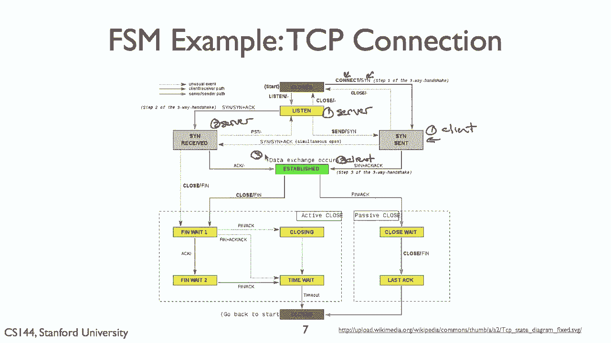