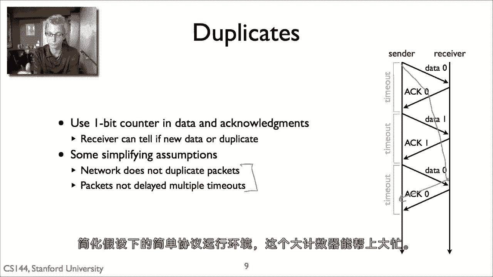

# 【计算机网络 CS144】斯坦福—中英字幕 - P32：p31 2-7 Stop and wait - 加加zero - BV1qotgeXE8D

这个视频是关于流量控制的，可靠的高效通信的基本构建块之一，不仅描述了流量控制的基本原理，还描述了其最简单的实现，被称为停止和等待协议的东西，流量控制试图解决的问题是，当发送者可以发送数据时。

比接收者可以处理的速度更快，所以这里我们有一个情况，发送者a可以每秒发送五百万包，但接收者b只能每秒接收二百万包，这可能是因为b的处理器速度较慢，它的网络卡并不如意，或者是由于某种原因，因此，问题是。

如果a以每秒五百万包的满速率发送数据，那么其中三百万包我们将不得不被丢弃到b，那就是b无法处理它们，因此，只有四十分之一的包能够通过，这对ace来说是很大的浪费，在网络中也是大量的浪费，嗯。

而且这也将完全饱和b，a没有发送数据比接收率快的理由，哪个b可以接收它，因此，流量控制的基本方法是使其，这样发送者不会比接收者发送更多的包，接收者可以按照通常的方式处理它们，是接收者给发送者一些种反馈。

无论是隐含反馈还是显式反馈，无论是减速还是加速，或者是设置队列，所以，今天大多数协议中使用的两种基本方法，本视频中首先提到的停止和等待讨论，非常简单，实现一个非常简单的有限状态机非常容易。

第二个是在后续视频中提到的滑动窗口，稍微复杂一些，但可以提供更好的性能，所以是对有限状态机图的复习，所以当我们绘制一个协议的有限状态机时，我们显示它可以进入的状态在这里，状态一，陈述两个，陈述三个。

然后，状态之间的边有两个信息片段，嗯，可以在动作的上方和下方引起状态转换的事件，使那个状态转换，停止点算法非常简单，它最多在任何时间从发送者到接收者都有一个包在飞行，所以基本算法是发送者发送一个包。

然后等待接收者的确认，当它收到确认时，然后如果它有更多的数据要发送，发送另一个包，如果它等待一段时间，这是一个超时，还没有收到确认，然后它假设包已经被丢失，它已经离开了网络，它在路由器上被丢弃。

它被丢弃给了接收者，发生了什么事情，并在哪里确认被丢弃，然后它重新发送数据，所以有一个超时，到那时它再尝试，这就是基本算法，所以接收者有一个一状态有限状态机，当它收到新数据时，它等待包，嗯，它发送确认。

或者当它收到数据时，它为那个数据发送确认，嗯，数据，如果数据是新的，嗯，它将这个数据传递给应用程序，发送者有限状态机有两个状态在第一个状态，它正在等待应用程序的数据，这是它准备发送的地方。

但应用程序尚未提供要发送的数据，当应用程序调用发送时，协议发送包含该数据的包，或你能装入包的最大量，然后它进入等待动作状态，在这个状态中，有两个转换，第一个是如果它收到确认，如果协议收到确认。

那么它什么也不做，回到等待数据状态，如果有更多的数据要发送，发送新数据，如果没有更多的数据发送，它会等到软件调用发送，第二个转换是当超时时，这是它已经发送数据包的情况，但它没有收到确认，它正在等待。

正在等待，正在等待，直到超时，然后它只是尝试重新发送，所以它想要选择这个超时，说它是保守的，它几乎肯定数据或随后的确认已经被丢失，所以它在任何时间只有一个包在网络中，这就是基本的停止算法。

以下是四个示例执行，嗯，第一个情况是没有损失，一切都完美工作，发送者发送其数据，接收者接收它并发送确认，现在发送者，如果它有更多的数据，可以发送更多，第二个情况数据丢失，现在发送者发送数据。

它在网络中丢失，因此发送者超时并尝试重新发送数据，所以它处于等待动作状态，当它到达，并重新发送，这是第三个情况，数据成功交付，但确认丢失，现在发送者处于等待动作状态，超时，它重新发送数据。

然后这导致接收者发送新的确认，此时，发送者收到确认并继续像第一个情况一样操作，所以第四个情况稍微复杂一些，实际上显示了一个失败，与这个，我之前描述的基本算法，中心发送一些数据，接收者发送确认。

但让我们假设网络中发生了一些事情，突然一个链接变得非常慢，或者在网络中某个地方有一个大队列，并延迟了确认，过了超时时间，所以发送者发送一些数据和确认到达，但发送者重新发送数据，在确认到达之前。

到达的确认非常短，所以现在发送者知道数据已被确认，并发送另一个数据包，但如果实际上这个数据包丢失了，那么第一个重传，第一个重传的第一个数据包到达接收者，接收者确认它，发送者不知道这里是否对这个确认。

这里是对第一个重传的数据确认，还是对新的数据包，因此我们可以有错误，其中，如果它假设这里是对旧数据包的重传，那么这里可能会有一个错误，如果它假设它是对新数据包的重传，以便跟踪那个东西。

用于跟踪的有限状态机，如果它假设是为了新数据，它可能数据可能没有到达，它可能假设数据已经到达但实际上没有，所以，在任何可靠的协议中，流控制中出现的基本问题都是，你如何检测重复的，你如何知道。

当确认来自重传时，或者是包复制的副本与新数据，因此，在停止等待的情况下，我们可以用一位计数器来解决这个问题，因此，想法是在所有数据上都使用这个一位计数器，确认和确认包，所以发送者发送数据零。

然后它接收到动作数据一，动作一，数据零，动作零，对吧，因此，接收者现在可以告诉这是新数据还是重复数据，因此我之前展示的案例，您将能够区分确认，对于包零的重传，并对第一个数据包的传输给予确认，现在。

一个单位位计数器做出了几个简化的假设，这并不是总是有效的，比如什么，如果一个数据包从多个往返时间中被延迟，它可能，例如，这可能意味着这个数据是零，在这里被延迟了全部，然后接收器退出。

但结果是它实际上是一个旧数据的副本，因此，这种特定的一位计数器方法做出了两个简化假设，首先，网络本身不复制数据包，其次，数据包不会因为多个超时时间而被延迟，现在，你可以通过增加序列号空间来解决这些问题。

但是，为了使简化假设适用于简单的协议运行环境。

