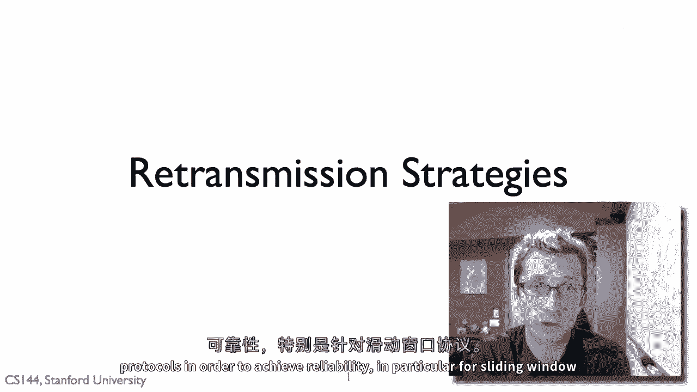
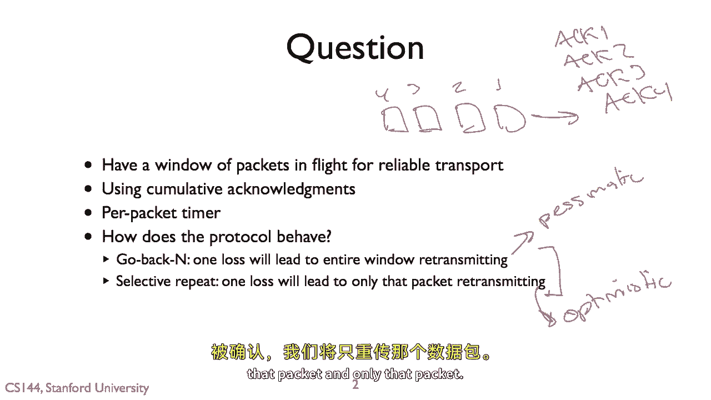
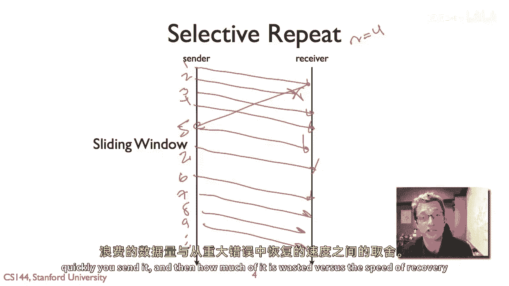
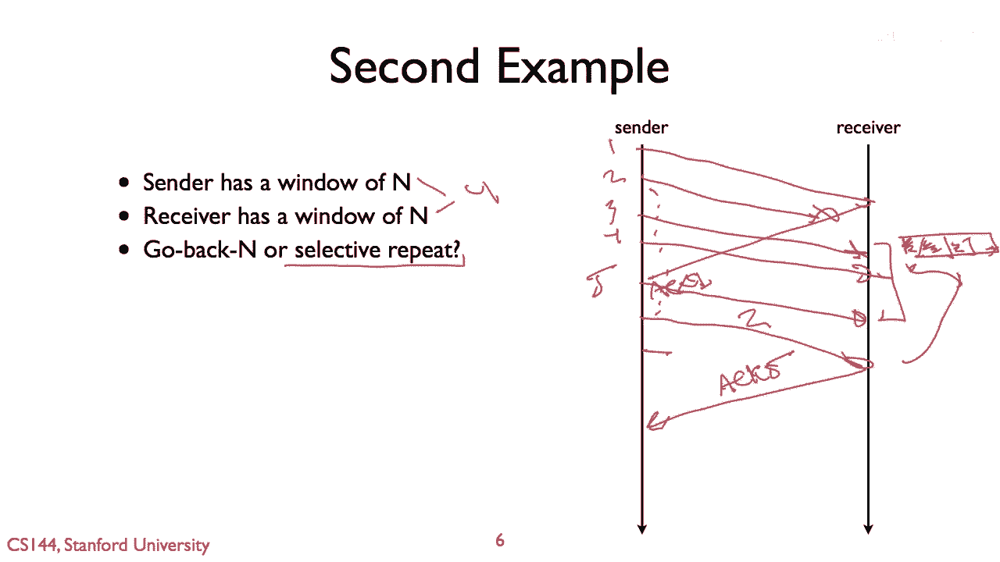

# 【计算机网络 CS144】斯坦福—中英字幕 - P34：p33 2-9 Reliable comm --- Retransmission strategies - 加加zero - BV1qotgeXE8D

所以，在这个视频中，我要谈谈传输协议的重传策略，为了实现可靠性。

特别是对于滑动窗口协议，基本问题是我们与一些滑动窗口可靠的传输所面临的，一个正在飞行的包窗口，比如一个，两个，三个，四个，我们正在使用累积确认，因此我们只能得到一些反馈，例如第一幕，第二幕，第三幕。

第四幕，只是最后一次成功接收的一口，最后一次成功接收的包，我们对这些包保持重传计时器，基于它们被发送的时间，本质上保持一个保守的估计，如果我们在这个时间还没有收到包确认。

那么这就意味着几乎可以肯定包丢失了，所以我们应该重新传输它，所以问题是，给定这些通常用于可靠传输的参数，协议将如何行为，其重传策略将看起来什么样子，所以我们会看到，实际上你最终看到的策略有两个。

你最终设置，来自不同协议的，第一句是，我们回去，所以我们认为回去是一个很悲观的，嗯，方法或国内行为，那就是如果一个数据包丢失，那么我们就要重新传输整个未发送窗口的数据包，回去。

所以如果窗口大小为n我们丢失数据包，那么我们就要回去并重新传输所有的它们，第二句是选择性，重复，哪边，你认为这是乐观的吗，所以我们返回并假设如果一个包丢失，所有的包都在窗口中丢失。

选择性重复假设如果一个包丢失，只有那个包丢失，所以在选择性重复中，如果我们丢失一个包，它没有被确认，我们将重传那个包，只重传那个包。

所以让我们看看返回什么，并且，嗯看起来像是一个词，你看到的行为是什么，所以让我们假设我们有一个窗口大小等于四，因此发送者发送包一，二，三，四，并且包二丢失了，所以这里是四个成功的传输，对包一的响应。

接收器将发送确认和确认，一，但它不会发送确认给，所以会发生的情况是在某个时刻我们将有一个重传计时器，启动，然后在一个反馈端协议中，发送者将要做的事情是，它将重新传输整个未完成的窗口，有一些时间限制。

所以不要忘记，并且窗口将包括五个，因为这个动作的反应是一，它可以发送五个，但是，发送方看到包是二的时候丢失了，将假设整个窗口都丢失了，我们传输整个窗口，这非常保守，非常或非常悲观。

那么现在让我们看看选择性重传协议将做什么，N等于四，我们传输一、二、三、四、一、二、三、四，包二丢失，包一被确认，这使我们在选择性重传协议中可以发送五个包，发送器将重传给。

然后我们将继续执行并传输六、七、八、九点、点、点、点，所以只重传那些，嗯，未被承认，因此，一个出现的问题是，为什么给定的选择性重复不发送更少的包，你为什么 ever 想要回到好，有几个原因。

一个是选择性重复，如果实际上所有的包都被丢失，如果包二，三，四包二，三，四，并且如果有五包丢失，为了完成这些传输，需要使用定时器和往返时间，所以，如果出现损失的爆发，速度可能会大大降低。

选择性重传协议通常恢复速度较慢，与返回不同，它假设所有的包都丢失，它重传所有的包，它无法更快地开始，因此，这里有一种权衡，即在发送数据的数量之间，你发送它的速度有多快，嗯，然后浪费其中的多少，与从。

嗯，重大错误中恢复的速度相比，所以让我们走通过两个示例传输协议和他们的配置，并看看它们如何行为，会发生什么，所以第一个，我们的发送者有一个大小为n的窗口，让我们假设n等于四，就像之前的例子。

并且接收者有一个大小为一的窗口，所以接收窗口的大小为一，所以基于这个，协议的行为将类似于后退，或选择重复，嗯，所以让我们走一遍会发生什么，所以发送者，假设它会发送一个，两，三，四，一、二，三，四。

假设包二丢失，所以到达不好，接收者将确认一，这将允许发送者发送五，但是接收者不会某个时候承认两个，两个的重传定时器将触发并重传给，但是问题是因为接收者只有有一个接收窗口大小，它无法缓冲包三，四和五。

所以当它收到包二，它将采取行动二，发送者没有收到对三的确认，它将不得不重传三，然后接收者可以确认三，在某个时刻，发送者然后可以开始再次使用其完整窗口，但关键的是，由于第一个两个被丢失，三个。

四和五不能缓存，接收者窗口大小仅为一的事实将迫使，迫使发送者重新传输窗口中的每个包，所以我们将看到这种行为是返回，所以让我们看第二个例子，所以在这种情况下，发送者的窗口大小为n。

并接收者的窗口大小为van，让我们假设对于两者，再次只是为了简化起见，这的大小为四，那么在这种情况下，协议将是返回n还是选择性重复，所以让我们走一遍会发生什么，我们又有一次一、二、三、四，二被丢失。

所以我们得到了对二的确认，对一的动作，一导致包五被发送，然后到某个时刻，重传计时器触发，所以我们重传二，现在，接收者已经能够缓存这些包，因为它有一个窗口大小n，所以它可以，然后这就是它的缓冲区。

它已经有了包三，四和五，包二到达，它可以然后确认五，所以可能发送者有点激进，也许它重传了三或四或什么，嗯，但关键是，它不需要为此正常工作，如果他们只是等待那些重传计时器，或它减缓了重传，等。

那么发送者只会重传包二，只有未确认的包，其余已被接收者缓存，所以我们看到这种行为是选择性重复，所以当你实现传输协议时，说如果你在取，如果你在，嗯，当你在做实验室二时，你想考虑的一件事是如何处理重传。

所以其中一个非常重要的事情是你不要在你应该之前重传，我的意思是，你不能说，基于包一或包二开始重传计时器，然后当二被重传时，计时器触发，重传整个窗口，因为很有可能是三，四和五已经正确接收。

或者是可能发生的事情，但是你还是会重新传输它们，你正在非常积极地将更多的数据包放入网络，你正在将网络中的数据包数量超出你窗口大小，三，四和五可能仍然在网络中，但是你正在发送它们的额外副本，因此。

从那种方式，嗯，你需要小心网络中包数的数量，可以小心你的重传策略，所以我们将看到你能看到的，这是一方面，你可以假设试图非常保守并说看，如果一个包丢失，我将假设其他包也丢失，然后我将重传整个窗口。

有一个后退策略会发生，如果你的接收器窗口大小只有1，嗯，或者你可以稍微慢一点，然后说看，一包丢失了，我会等到跑步旅行时间并传输那个，看看，如果我收到对确认的确认，我就，然后可能只是进行选择性的。

