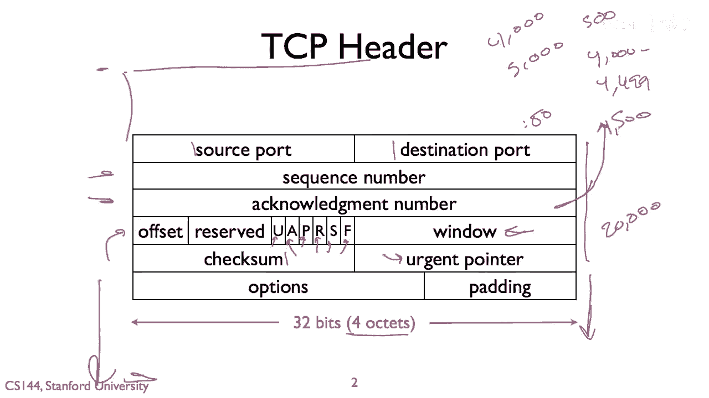

# 【计算机网络 CS144】斯坦福—中英字幕 - P35：p34 2-10 Reliable comm --- TCP header - 加加zero - BV1qotgeXE8D

因此，在这个视频中，我将简要介绍TCP头部，如果您想要更多信息，当然，网上有大量的文档，但这只是TCP头部字段含义的简要总结。

标准的TCP头部长度为20字节，因此，我们可以看到这里有五行，每行四个八位字节，此外，TCP头部后还可以有选项，我现在不会去讨论这些，您在大多数连接中看到的基本TCP头部长度为20字节。

TCP的第一个两个字段是源端口和目的地端口，每个都是16位或两个八位字节，我们谈论连接到Web端口，端口80，这是目的地端口，例如，80，TCP的下两个字段是TCP序列号。

这些表示从包的源到目的地的序列号，这个数字是什么，包含在这个段的数据中，以及来自那个端点的确认号，例如，如果我有，如果我想要确认我已经收到了字节，嗯，五千，嗯，这是，序列号四千，嗯，正如我所说。

我会发送序列号四千，确认号五千。

序列号表示什么，序列号是第一个数据区域的第一个字节。

它跟随段头部，如果我有一个序列号四千。

如果有五百字节的数据，那么这个意味着字节四千到四千，四千四百九十九，确认号确认接收的最后一个字节加1，如果我要发送这个段四千到四千，四千四百九十九，如果另一方接收了它，它将结束确认号四十，五千的四千。

五千，在TCP中，动作不是为最后接收的字节，而是那个加1，下一个需要的字节是什么，当我们谈论TCP动作包时，这些是什么，这些是TCP段，没有数据，他们只是在计数确认号四，这种情况如果交通是单向的。

我正在向一个方向发送大量数据，但没有数据返回，如果流量是双向的，那么这些确认号只会被添加或填充到，或者不加填充。

但被集成到他们正在发送的数据段中，所以序列号和确认号之后，我们有一堆字段，一，让我们从校验和开始。

所以校验和是对TCP伪头部计算的。

这也是TCP头部，嗯，这样计算IP头部的一部分，为了增加IP头部的额外抵抗力。

IP地址，等等，所以校验和覆盖了这个伪头部，TCP头部，然后TCP段的数据。

因此，检查和实际上在某种程度上拉伸到包前面的伪头部，从IP头部填充，然后拉伸到段的末尾，简单的二进制补码检查和，窗口字段是流量控制窗口，它告诉终点，所以流量控制窗口，包中的窗口字段告诉其他终点。

发送者拥有的接收缓冲区空间是多少，所以如果你说看到二十万的窗口，这意味着在那个方向上，不能存在超过二十万的未确认字节，在这个连接中，方向那个方向的未确认字节，所以这些位，你a p r s和f是控制位。

所以让我们从一些相对较少的类型开始，所以有你，这是紧急位，这意味着这个数据特别紧急，所以嗨，让我们，嗯，让我们尽快进入应用，然后有p，这是推位，所以推，它说嘿，请将这个数据推送到接收应用。

所以其他四个位，有动作位，重置位，正弦位和结束位，所以这里的动作位，这个位被设置为一，如果确认号字段有效，所以动作通常被设置为一对于每个分段，除了第一个启动连接的，因为当你启动连接时。

你不知道对方的序列号是什么，所以你不能确认任何东西，所以动作位没有被设置，当我们谈论tp设置时，看那个第一个发送的包没有设置动作位，但是连接中的所有其他包，直到其终止，都设置了动作位。

正弦位和结束位用于根据需要设置和拆除连接，所以正弦位说嘿，这是我的起始序列号。

请同步到这个数字，所以当你首次打开连接时，你会发送一个没有设置a位的包，但设置了正弦位。

然后一个序列号，你在告诉终端点，我希望您同步到这个序列号，这代表我的第一个数据字节，另一方可以回应并说好，我将确认这个序列号并发送我自己的一个，在这种情况下，这两个字段都是有效的，然后你可以回应并说。

好的，我将确认您的序列号，现在，它已经同步了，你们俩都知道，当字节开始时，所以一件事是，你可以想象。

我可以总是将我的序列号设置为零，对于每个连接，在两个方向，但它们最终变成了真的。

做那样的话会出现安全问题，人们可以猜出你的序列号，他们可以开始插入包，通常被认为是一个坏主意，也是因为如果你有很多短暂的连接。

这些具有相似序列号的包可以在网络中存活很长时间，你想要能够过滤它们出来。

所以f是结束位，这是用于拆除连接的，所以当你设置结束位时，你在告诉对方，我没有更多的数据要发送，而且他们经常像你发送尾鳍时那样交换，他们承认尾鳍，他们后来发送，尾鳍没有更多，没有更多数据要发送。

然后你承认那个尾鳍，最后的部分是R重置位，它是，嗯，说我们需要重置这个连接，有问题，嗯，已经发生了，所以，如果紧急部分被设置，那么，这个紧急指针指向，紧急数据最终所在的段落在哪里，嗯，我们有，嗯。

偏移字段，所以，偏移字段是必要的，因为TCP可能具有选项，而且你从这个头部中不一定知道选项在哪里，所以偏移量告诉你的是在段中的哪个偏移量，数据从何处开始，所以，如果你有选项。

然后偏移量告诉你那些选项的大小，而你的TCP栈知道在那里查找，四个选项，嗯，选项被填充为四个字节，对于八位字节的。

所以这就是基本的tp头，我们有源和目的地端口，序列号，对于数据都有，然后对于你收到的数据的确认，偏移字段告诉你数据从哪里开始，紧急和推送位用于紧急数据或您想要推送的应用程序，确认位指示确认号是有效的。

序列号同步的罪位，连接拆除的细位，表示没有更多数据要发送，连接重置的复位位，流量控制的窗口，检查以确保数据中没有错误，紧急指针紧急位。

