# 【计算机网络 CS144】斯坦福—中英字幕 - P39：p38 3-1 The History of Networks The History of the Internet - 加加zero - BV1qotgeXE8D

你肯定听说过很多次，互联网以前所未有的方式改变了社会，在这个视频中，印刷机的发明以来，我将给你简要介绍网络历史的背景，在二十世纪六十年代互联网发明之前。

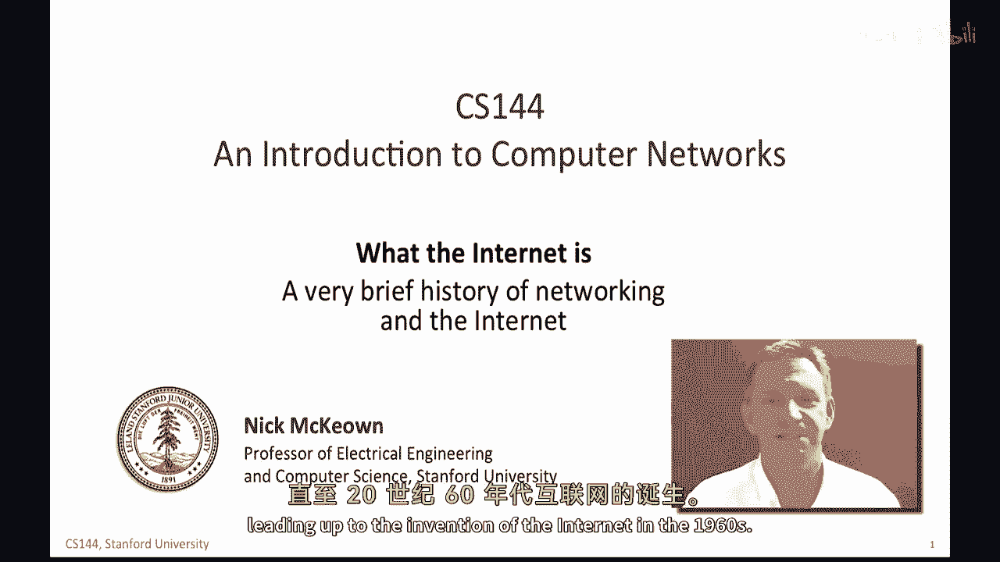

让我们从如何通过长距离发送消息开始简短的历史，虽然今天我们毫不费力地可以给世界的另一边发送电子邮件，三千年前，通过长距离通信非常困难，根本不可能，最早的长距离通信记录大约在公元前一千年。

这些信号塔主要是为了军事进攻和防御目的而设立的，火炬被用来信号敌人的到来，或者是协调攻击，这是英格兰南部的一个火炬信号塔例子，火炬信号塔传递信息迅速，它们在夜晚工作特别出色，当危险最大时。

但它们携带的信息很少，一般来说，它们要么是开着的信号，要么是关闭的信号，危险信使，鸽子，数千年来，人类信使和马传站已经在全球范围内使用，因为它们可以携带更多的信息，但是，信息比火传播得更慢。

沿途的信号灯和信使容易被拦截，消息可以被阅读，被篡改，或完全被阻塞，最早的记录的传递系统是埃及和中国的马，大约两千年前，他们贯穿了整个历史，在十三世纪，他的军队在每个四十公里处都有传站。

有四百匹马等待传站信使，马传方式直到十九世纪都被用于邮件递送，在美国著名的邮递马队中，这些早期的系统在能携带的信息量和递送速度上都有限制，或，例如，马，人类和鸽子，大约两千年前，开始使用光学方法，例如。

旗帜和太阳镜。

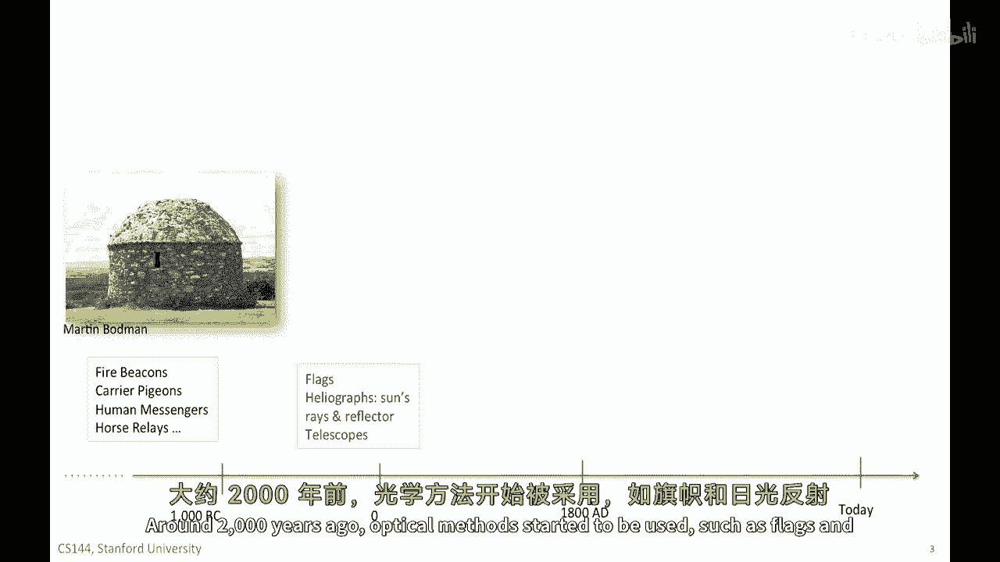

这些编码了数字信息，例如，字母，单词和数字，这些系统以光速传输数据，在有限距离内，以有限的信息，它们基本上是简单的编码，但或许光学通信中最大的进步发生在法国。

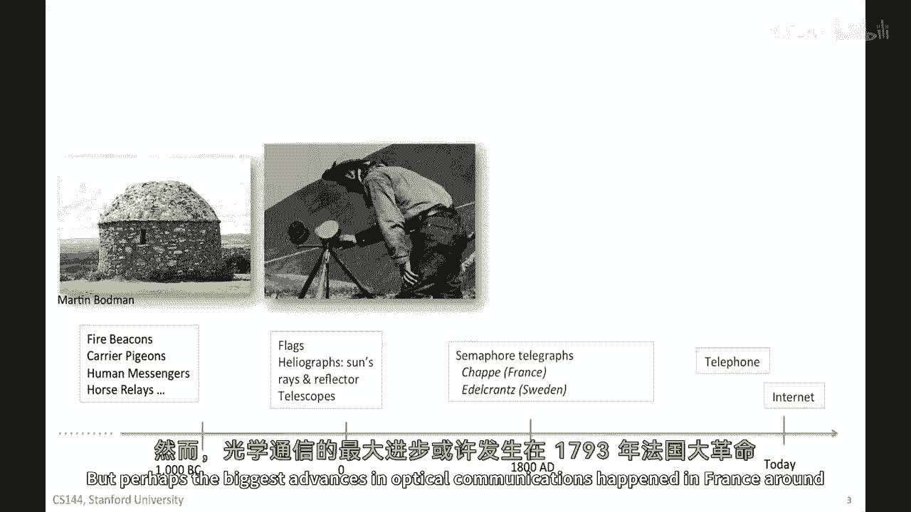

在1793年的法国大革命期间，当克劳德·尚发明并开始建设一个信号灯电报网络时。

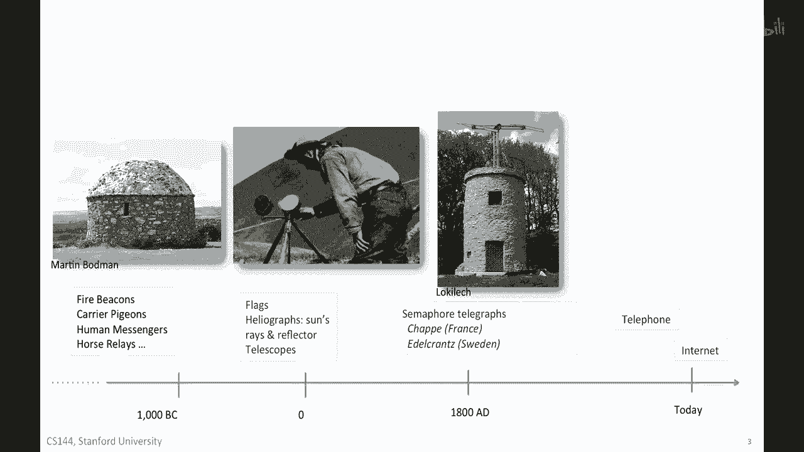

克劳德·夏普建造了带有一个大型水平横梁的塔，称为调节器，有两个较小的手臂，称为指示器，它看起来像一个人用他们的手臂给出不同的信号，手臂的位置指示一个符号，在1793年，法国政府建造了十五座车站。

以覆盖一百九十公里，大约每座车站可以覆盖十三到十五公里，到一八零四年，从巴黎延伸到第戎的三百七十公里网络形成了，该系统用于发送各种消息，包括军事信息和快讯，大多数消息都发往巴黎，以报告各省的信息。

操作员变得相当熟练，最快的消息可以通过每十到二十秒由一座车站发送，并且可以在不到三十分钟内穿越法国，他们可以每天发送大约三千个信号，对应于几百条消息，为了制作这个函数，使网络功能正常工作。

法国的光学电报系统和瑞典，开发了许多在网络中用于的概念，至今，他们需要开发五个概念，特别是第一个是代码，这些是符号，用于指示字符和控制信号，例如，传输的开始，传输结束，重量或冲突，当两个信号同时到达时。

对冲突消息之间的最后代码优先级进行错误取消，塔楼失败，确认，甚至雨或雾，意思是我们甚至看不到你发送的信号，第二个是流量控制，这阻止发送者从压倒接收者，基本上，接收者告诉发送者减速，因为它跟不上。

第三步是同步，以便告诉当一个符号结束时，下一个符号开始，并且下一个符号开始，这有助于定义由几个符号组成的单词，第四个概念是错误纠正和重传，以告诉发送者符号被误解时，这允许发送者尝试再次发送符号。

最后他们还使用了加密，以确保消息无法被拦截，他们对股票市场的新闻特别担心。

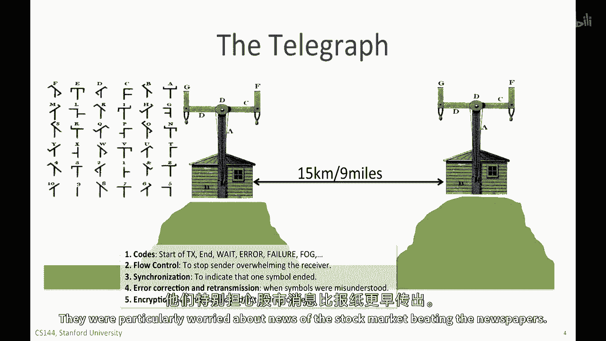

在1830年吃报纸，尖端的光学电报网络非常广泛，覆盖了大部分法国，我们可以将通信网络的发明分为四个主要阶段，直到大约十七世纪，首先，从大约两千年前，人类开始使用系统来发送一组预先定义的消息，例如。

使用火炬，其次，从十六世纪开始，人们开发了系统来传输任意消息，通过编码整个字母表，到十七世纪初，数字代码开始被用于常见的单词和短语，这是压缩的最早形式，因为它需要发送较少的信息过链接，在十七世纪。

为控制信号开发了代码，它们可以通信何时开始和停止发送，何时减速，如何重传，等等，这就是今天我们所说的协议的诞生，到1800年，双方或多方如何通信的协议已经达成一致。

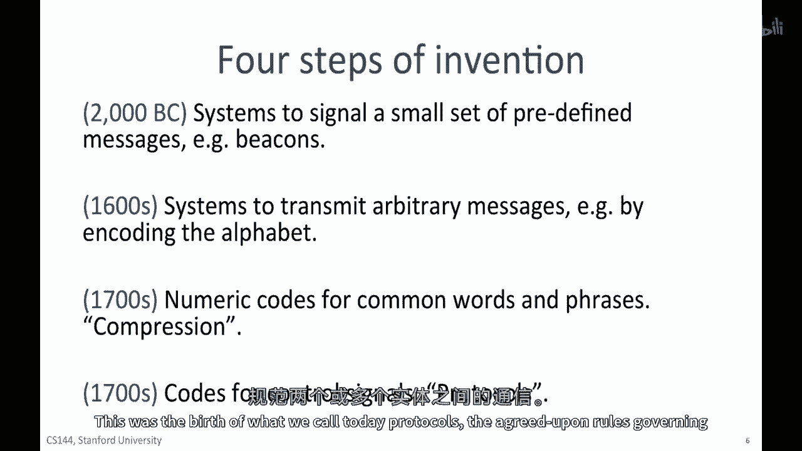

在欧洲，开发了和部署了多种不同的光学电报系统，使用了各种不同的协议信号，例如，这些初始化信号来指示我们即将开始通信，错误控制数组，重传，停止，等待，选择性，重复，这些用于重新传输沿途被损坏的数据。

正如你在关于不同重传策略和流量控制的视频中所看到的那样。

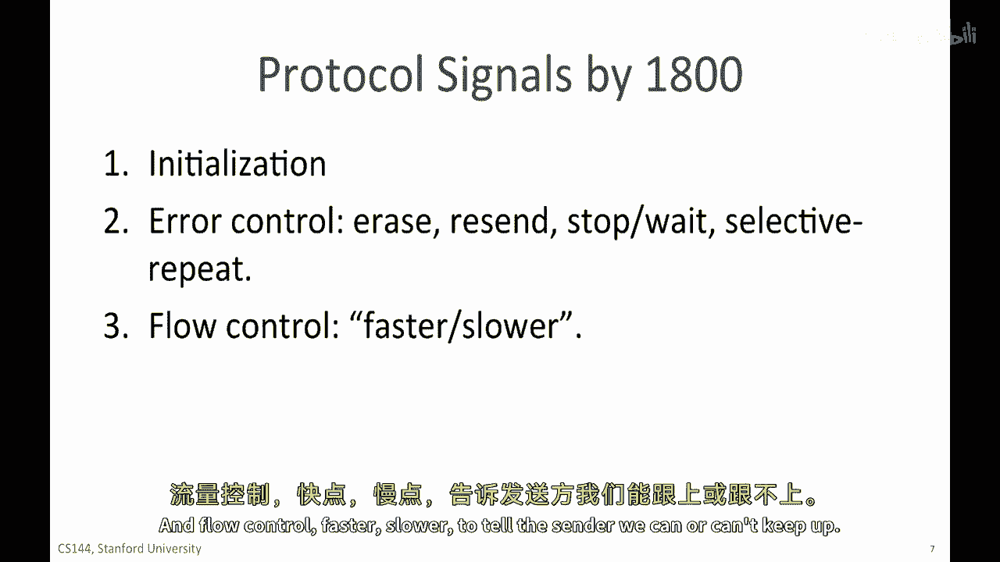

告诉发送者的速度较慢，我们明确是否能跟上，在通信方面取得了巨大的进步，在十九世纪末，电话被发明时，一段时间，有许多尝试增加电力电报网络的容量，这个网络现在连接了美国的许多城市。

这里展示的亚历山大·格拉汉姆·贝尔，这个苏格兰出生的发明家在1876年传输了第一个语音通话，在他与同事托马斯·沃森那极其著名的电话中，尽管这项专利遭到了多次挑战。

其中最具代表性的挑战者就是另一位发明家艾丽西亚·格雷，这项专利成功地经受住了法律挑战，我们通常将这项发明归功于，十年内，超过一百五十万人拥有电话，到一九一五年。

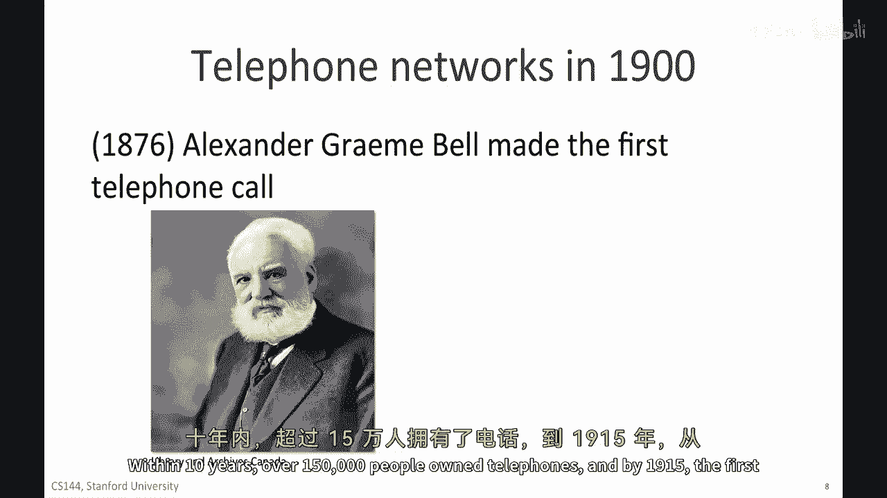

从纽约到旧金山的第一次跨大陆电话被接通。

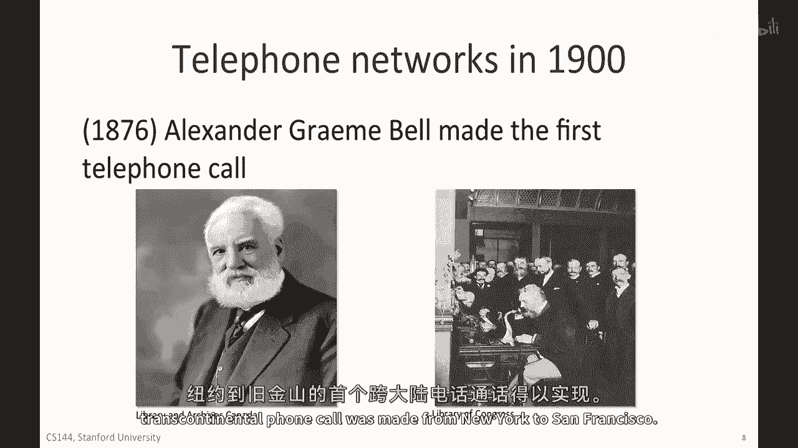

最终导致互联网的一系列事件和发明的进程从那时开始认真起来，大约在1960年，1962年，Jcr，麻省理工学院的Licklider开始写备忘录并谈论他的概念，一个星际网络，在这个网络中。

全球各地的人都相互连接，可以从任何地方访问任何站点的程序和数据，他谈论了，能够与他在全国范围内的星际网络研究者进行通信，这被认为是对社交互动的第一次详细描述，广泛被认为是。

这可能由一个与当今互联网非常相似的大规模通信网络实现，利克利德成为达特茅斯高级研究计划局（darpa）的计算机研究项目首脑，国防高级研究计划局（darpa）成立于一九六二年，在darpa期间。

他说服了伊万·苏瑟兰德，罗伯特·泰勒和麻省理工学院研究者拉里·罗伯茨他的新网络概念的重要性，在他们在darpa接替他后，一九六四年，他们接过了这个重任。

研究者保罗·巴伦撰写了现在被认为是关于大规模通信网络的第一篇学术论文，论文的标题是《关于数据通信网络的一些想法》，列昂纳德·克莱恩洛克的论文是关于队列理论的。

唐纳德·戴维斯在英国国家物理实验室也在研究非常相似的想法，在一九六五年，与托马斯·梅瑞尔一起工作，拉里·罗伯特将麻省理工学院的tx2计算机连接到加利福尼亚的q32计算机，通过低速调制解调电话线。

创建了第一个 ever 建造的广域计算机网络，拉里·罗伯特在一九六六年加入哈珀，来帮助开发第一个arpnet计划，这些计划在一九六七年发布，在一九六九年，第一台设备在加州大学洛杉矶分校安装，斯里。

加州大学圣塔芭芭拉分校和大学犹他，并通过ARPANET发送的第一封消息，这就是互联网的样子，1969年，它被称为ARPANET，并且是一个封闭的私有网络。

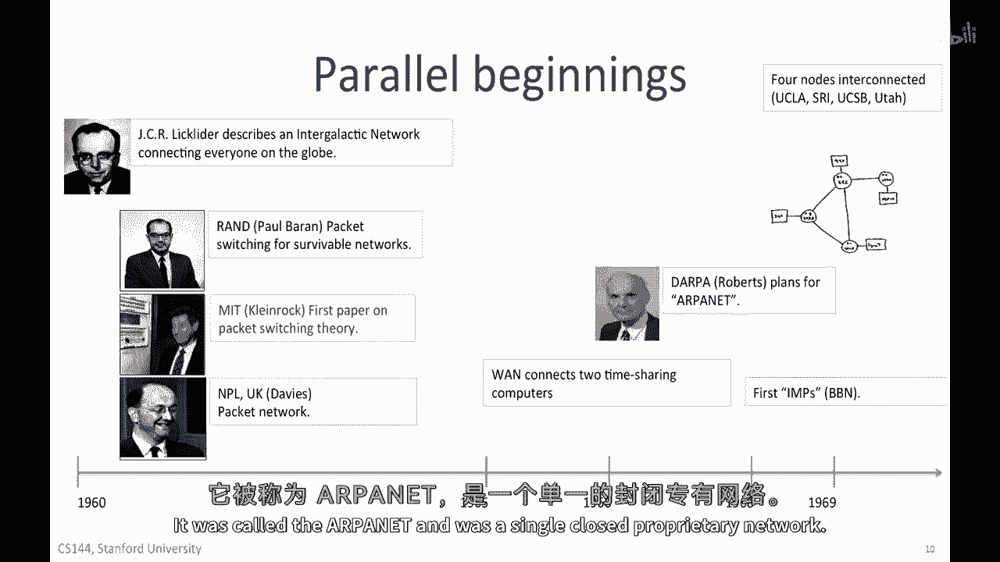

到1970年代初期，在1971年，许多不同的数据分组交换网络开始出现，第一个分组无线电网络在夏威夷群岛之间建立，它被称为阿拉霍网，为阿拉霍协议开发的机制已经影响了自那以后几乎所有的无线网络。

也是在一九七一年，在法国建造了基里巴斯研究网络，它是第一个赋予终端主机负责可靠通信的网络，并对互联网的设计产生了重大影响，在一九七四年，ibm引入了一个完整的数据网络堆栈，叫做na。

它的缩写是系统网络架构，其目标是降低构建大型时间共享计算机，带有许多终端机的成本，而不是使用打孔卡进行批量处理，达特茅斯高级研究计划局赞助了对网状网络的研究，以创建第一个网络网络，以连接全球各地的网络。

互联网所需的协议首先由斯坦福的温特·瑟夫描述，和达特茅斯高级研究计划局的鲍勃·卡恩在1974年著名的论文中描述，以标题'在通信中的包网络协议'，TCP要求可靠按序列的数据交付。

并包括我们今天所称的网络层大部分，在早期阶段，没有拥堵控制的概念，大约在十五年后，它被添加到互联网上，到1970年代末期，tcp和ip被分离，为udp留出了空间，使其也可以作为不可靠的传输服务添加。

最初是为了当时的分组语音，文特·瑟夫在这里的斯坦福大学是助理教授，实际上，他们写的论文是在卡巴纳写的，帕洛阿尔托的埃尔卡米诺路上的一家酒店，他在1976年搬到了darpa，以帮助引导新的互联网项目。

他现在是谷歌的首席互联网福音主义者，鲍勃·汗在论文一起撰写时已经在达特茅斯高级研究计划局，他们在1983年被认为是现代互联网的父亲，TCP，IP在旗日首次在互联网上部署。

这意味着当每个人都升级并使用新的协议时，同时在1986年，NSFNET由美国创建，国家科学基金会以连接大学和全美各地的超级计算机，S，利用运行速度极快的链接，每秒传输6千比特。

其他小型网络开始在各处涌现，连接到互联网，到1980年代末期，大约有一百一百万连接的主机，然后大约在1990年，蒂姆·伯纳斯-李在CERN发明了万维网，在1993年，第一批浏览器出现。

其中最为人所知的是马克·安德森编写的莫萨克浏览器，我还记得我第一次看到网页浏览器是在1993年，当我是研究生的时候，我们立即意识到这将改变一切，但我们没有意识到这个变化对许多人来说会有多么巨大。

这是互联网的黎明，尽管当然我们都知道它比万维网早得多，但在一年内，全世界有超过1000万人在使用网络，在1990年代末期结束之前，雅虎，谷歌，亚马逊，亚马逊，在当时都是家喻户晓的。

如果你对网络和互联网的早期时期感兴趣，这里有三本我非常喜欢的参考书，我强烈推荐你。

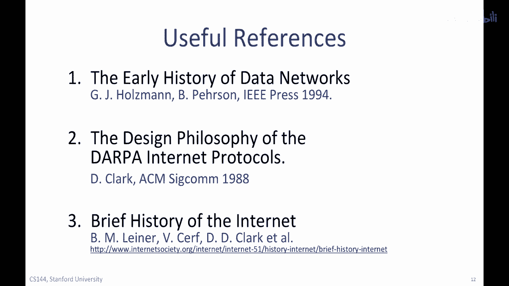