# 【计算机网络 CS144】斯坦福—中英字幕 - P3：p2 1-2 The four layer Internet model - 加加zero - BV1qotgeXE8D

"在最后一个视频中"，你学习了如比特orrent等多种不同的应用程序。

"Skype和网络都通过类似的模型在互联网上进行通信。"，基本上，这是一个双向可靠的字节流。"创建我们应用程序的可靠通信模型需要大量的不同部分协同工作。"，但是，"尽管我们使用各种各样的互联网应用。

发送各种类型的数据，速度也大相径庭。"，"应用程序发送和接收数据的方式竟然有惊人的相似之处。"，例如，"应用程序想要发送和接收数据"，无需担心数据在互联网上传输的路径或路线。

几乎所有的应用程序都想要自信地知道他们的数据是否正确接收，对于丢失或损坏的数据，会自动重新传输，直到正确接收。

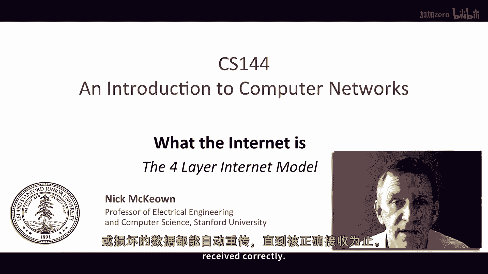

早期的互联网先驱创建了四个，层互联网模型，以描述构成互联网的操作层次，以便应用程序可以重复使用相同的构建块，无需为每个新应用程序从 scratch 创建它们，分层是一个真的很重要且经常使用的网络概念。

我们在这门课程中会看到它很多次，甚至有一个专门关于分层概念的视频，我们来看看四层互联网模型的每一层，记住，所有的四层都是为了最终使应用程序能够运行，主机之间可靠通信，来解释它如何工作，我将从底层开始。

我们将看到每一层都有不同的责任，每一层都在下面的一层上构建服务，一直到顶部，在那里，我们有应用程序之间的双向可靠字节流通信。

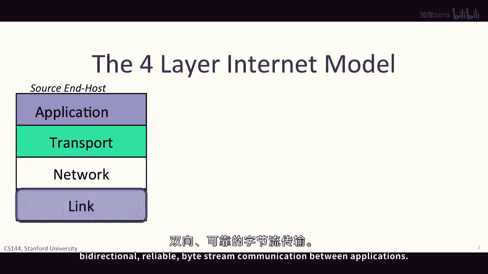

好的，我们从链路层开始，互联网是由，事件主机，链接和路由器，数据通过每个链接逐跳传递，然后数据以包形式传递，一个包是一个自包含的单位，包含我们要传递的数据，以及一个告诉网络的头部，包应被送达的地方。

它来自哪里，等等，链路层的工作是将数据逐个链接传输，你可能听说过以太网和Wi-Fi，这些都是不同链路层的两个例子。

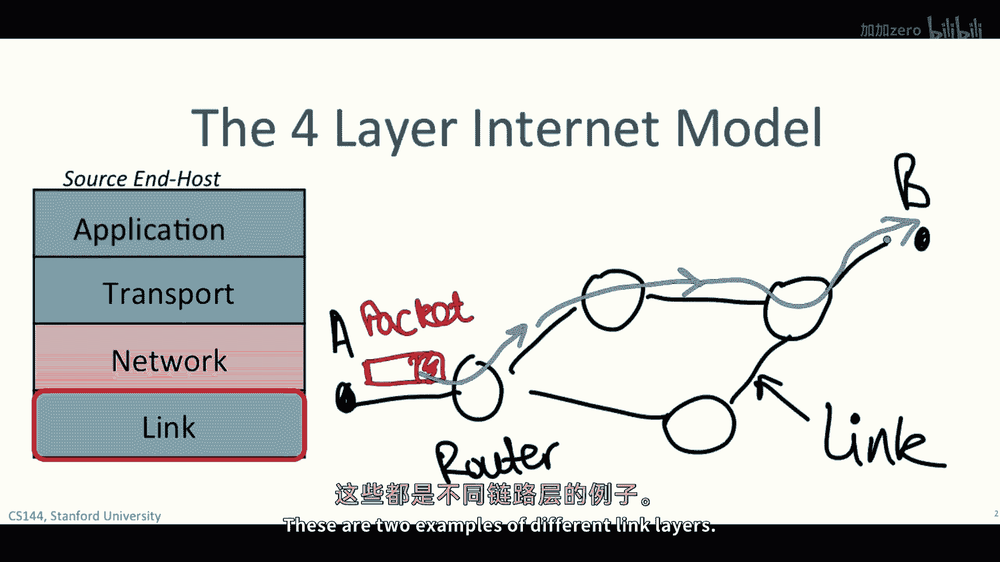

对我们来说，上一层是最重要的一层，网络层，网络层的工作是将数据包从源到目的地在整个互联网上传输，从源到目的地，数据包是网络的重要构建块，"包"是我们给那个数据集起的名字。

"带有一个描述数据内容的标题和一个标题"，"它要去哪里"，"它来自哪里"，正如我们在上一张幻灯片中看到的，"你经常会看到包被画成这样"，"数据包层包被称为数据报"，它们由一些数据和一个头部组成。

其中包含发件人和收件人的地址，"就像我们在信上写上发件人和收件人地址一样"。

"网络将数据包交给链路层"，告诉它发送数据包通过第一个链路，换句话说，链路层为网络层提供服务，本质上，链路层在说如果你给我一个数据包要发送，我会为你通过链路传输它，链路的另一端是一个路由器。

路由器的链路层接受数据包从链路，并将它交给路由器内部的网络层，路由器的网络层检查数据包的目的地址，并负责逐跳路由数据包，直到其最终目的地，它通过将其发送回链路层再次携带到下一个链路来完成此操作。

然后传递给下一个路由器的网络层。

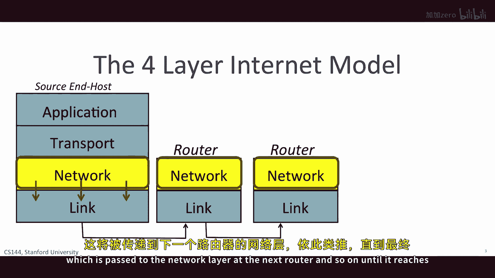

就这样，一直传递到目的地的网络层，最终，请注意，网络层不需要关心，链路层如何将数据包发送过每个链路，实际上，不同的链路层工作方式非常不同，以太网和Wi-Fi显然非常不同。

我们将在后续的学习中更详细地了解它们，网络层和链路层之间的这种关注点分离允许每个层专注于其工作，无需担心其他层的工作方式，这也意味着单个网络层有一个与许多不同链路层通信的共同方式。

只需将它们的数据包交给发送，这种关注点分离是由每个层的模块化实现的，以及到下层的共同、明确定义的api。

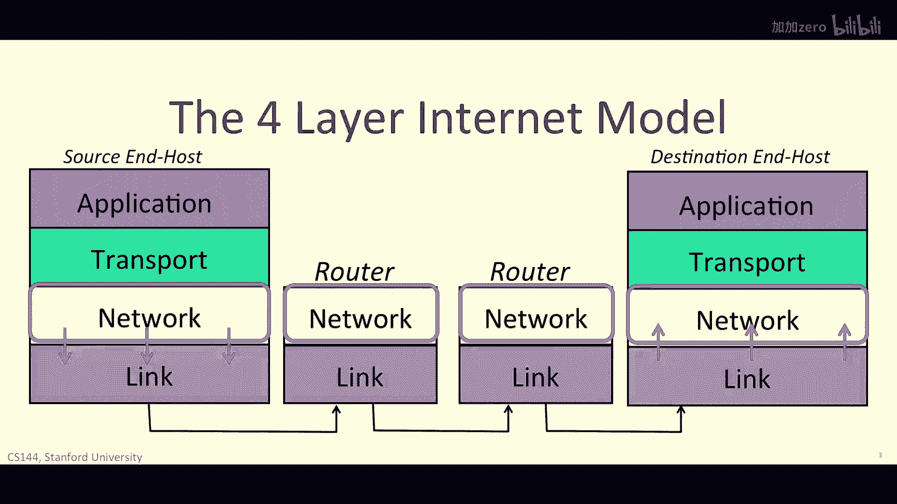

在互联网中，网络层是特殊的，当我们将包发送到互联网时，我们必须使用互联网协议，这是互联网协议或IP，它把互联网连接在一起，我们将在后续的视频中学习IP的更多细节，但现在了解一些IP的基本事实是很好的。

首先，IP尽最大努力将我们的数据包送达另一端，但它不作任何承诺，其次，IP数据包可能会丢失，它们可能会按顺序送达，并且可能会被损坏，没有保证，这可能会让你感到惊讶，你可能在问互联网如何工作。

当数据包不能保证被送达时，如果应用需要保证其数据在必要时会被重新传输，并且会被正确地送达给应用，没有任何损坏，那么它就需要在ip之上运行另一个协议，那就是传输层的工作。

最常见的传输层是tcp，或者你可能听说过的tcp ip，这是当应用同时使用tcp和ip时，tcp的任务是确保由应用发送的数据，在互联网的一端被正确地送达，并以正确的顺序传递给应用，在互联网的另一端。

如果网络层丢失了一些数据包，tcp会多次传输它们，如果需要，如果网络层将它们以错误的顺序送达，也许因为两个包以不同的路径到达目的地，tcp会将数据重新排列成正确的顺序，在后续的视频中。

你将学习很多关于tcp和它如何工作的知识，你需要记住的主要事情是，tcp为应用提供了一种服务，那保证在网络层服务之上的数据以正确的顺序送达，网络层正在提供一种不可靠的数据包送达服务，正如你可以想象的。

如Web客户端或电子邮件客户端等应用发现tcp非常有用，通过使用tcp确保数据的正确送达，它们不必担心在应用中实现所有机制，他们可以利用其他开发者多年来的努力正确地实现tcp。

然后重新使用它来正确地送达数据，重用是分层的一大优势，但不是所有应用都需要数据以正确的顺序送达，例如，如果视频会议应用正在发送一个包中的视频片段，等待包多次重新传输可能没有意义，只是为了继续前进。

一些应用不需要tcp服务，例如，如果应用不需要可靠的送达，它可以使用更简单的udp或用户数据报协议，udp是另一种传输层，它打包应用数据，并将其交给网络层以送达另一端，udp不提供任何送达保证。

换句话说，应用至少有两种不同的传输层服务可以选择，tcp和udp，确实存在，实际上，还有许多其他可能的选择，但是最常用的传输层服务就是tcp和udp，最后，我们到达了四层模型顶部的应用层，有，当然。

互联网上有数以千计的应用程序，虽然每个应用程序都不同，它可以通过使用定义良好的api重用传输层，从应用层到TCP或UDP服务下方的服务，正如我们在上一视频中看到的。

应用程序通常希望在两个端点之间建立一个双向可靠的字节流，他们可以发送任何字节流他们想要，并且应用程序有自己的协议，来定义在两个端点之间流动的数据的语法和语义。

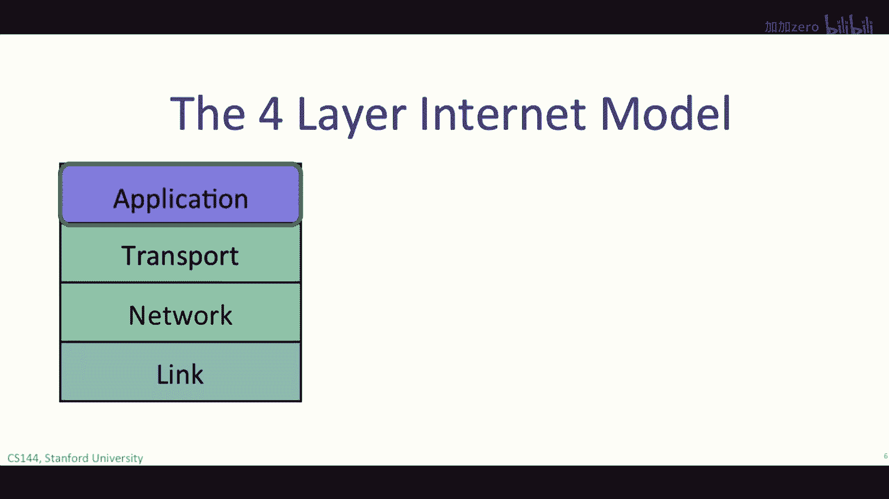

例如，正如我们在上一视频中看到的，当Web客户端从Web服务器请求页面时，Web客户端发送GET请求，这是HTTP协议中的一个命令，或HTTP规定，GET命令应以ASCII字符串发送。

连同要请求的页面URL，直到应用层为止，GET请求直接发送到其对等端，在另一边，Web服务器应用程序，应用程序不需要知道数据是如何到达那里的，或Web客户端需要多少次重传数据。

应用层将GET请求交给TCP层，它提供确保可靠交付的服务，它这样做使用网络层的服务，网络层又使用链接层的服务，我们说每个层都与其对等层通信，就好像每个层只与同一层通信一样，在链接或互联网的另一边。

不考虑下层如何将数据送到那里。

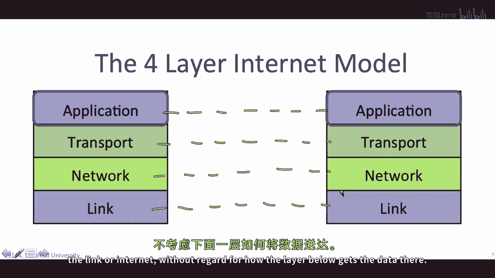

总的来说，然后，网络工程师发现将构成互联网的所有功能组织成层是很方便的，在最上面是应用，如BitTorrent或Skype，或世界 wide web，它与目的地的对等层通信，当应用程序有数据要发送时。

将数据交给传输层，它的任务是将数据可靠或不可靠地送达另一端，传输层将数据发送到另一端，将其交给网络层，网络层的任务是将数据分解为包，每个包都有正确的目的地地址，最后，包被交给链接层。

它有责任将包从一个跳点到下一个跳点传递，在途中，数据从一个路由器跳到另一个路由器，一步一步地从一个路由器到目的地，网络层将数据逐个传送给下一个路由器，直到它到达目的地。

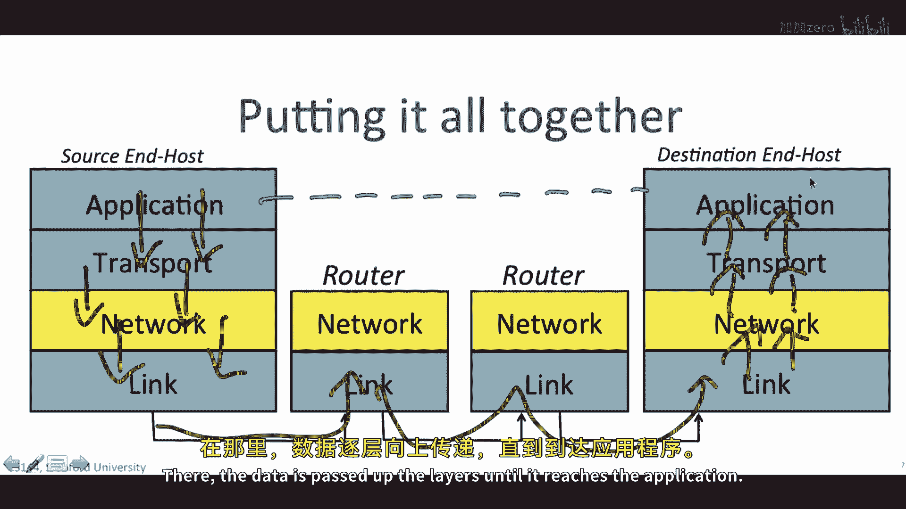

数据被传递到层直到到达应用。

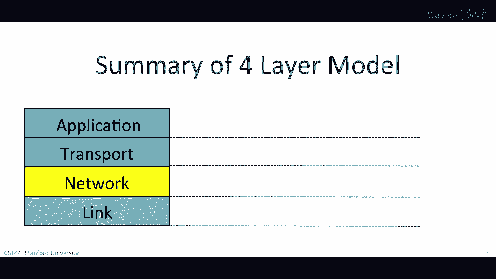

所以总的来说，应用双向，应用程序之间的可靠字节流通常但不是总是，并且它们使用特定于应用的语义，我们将在后来学习，例如HTTP或BitTorrent，传输层通常保证数据的正确顺序。

数据的端到端交付和控制拥塞，尽管一些应用不需要这个，因此它们可以使用不同的传输层，相反，网络层将数据包从源端到目的地传递，它提供了一种尽力而为的交付服务，没有保证，我们必须使用互联网协议。

链路层在单个链路上传输数据，在源主机和路由器之间，或者在两个路由器之间。

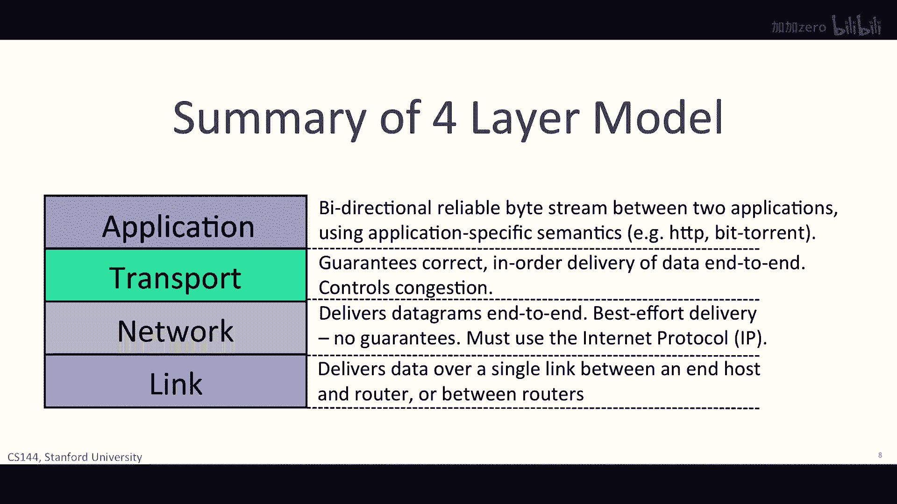

我想让你知道两件额外的事情，第一件是，ip经常被称为互联网的薄雾，这是因为如果我们想要使用互联网，我们必须使用互联网协议，我们别无选择，但是，我们对链路层有很多选择，ip在许多上运行，许多不同链路层。

例如，以太网，wi fi，dsl，3g，蜂窝和如此等等，在IP层之上，我们可以选择许多不同的传输层，我们已经听说过，TCP和UDP，还有RTP用于实时数据，还有许多其他，当然。

在上面坐着成千上万种不同的应用程序。

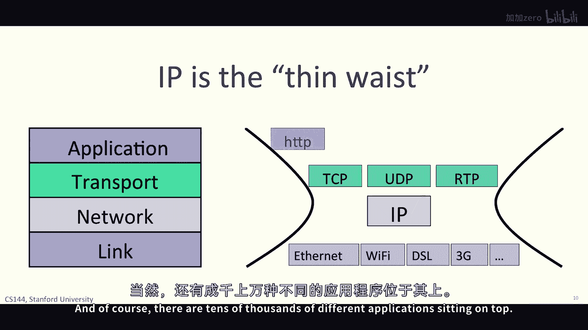

我想让你知道的第二件事是，在1980年代，国际标准化组织或ISO创建了一个七层模型来代表任何类型的网络，它被称为七层开放系统，互联连接或OSI模型，我们在这门课程中不需要花费任何时间来研究它。

因为它已经被所有目的都等同于四层互联网模型所取代，但如果你对此感兴趣，你会发现任何网络教材，维基百科对七层描述了大量的细节，七层模型定义了后来在四层互联网模型中被合并的层，例如，我们称之为链接。

今天的链接层被分离为定义帧格式的链接层，和定义如电缆上的电压水平等物理层的层，或者连接器的物理尺寸，在两种模型中，网络层基本上相同，传输和应用层在oi模型中各由两层表示，这些都是常用的互联网协议示例。

例如，HTTP，它大部分数据在协议中都以ASCII格式传输，以及它们如何映射到今天的osi编号方案，你需要知道的七层osi模型的唯一真实遗产，是编号系统，你经常会听到网络工程师提到网络层作为层三。

尽管它在互联网模型中是从底部的第二层，同样，人们会提到以太网作为链路，嗯，层二。

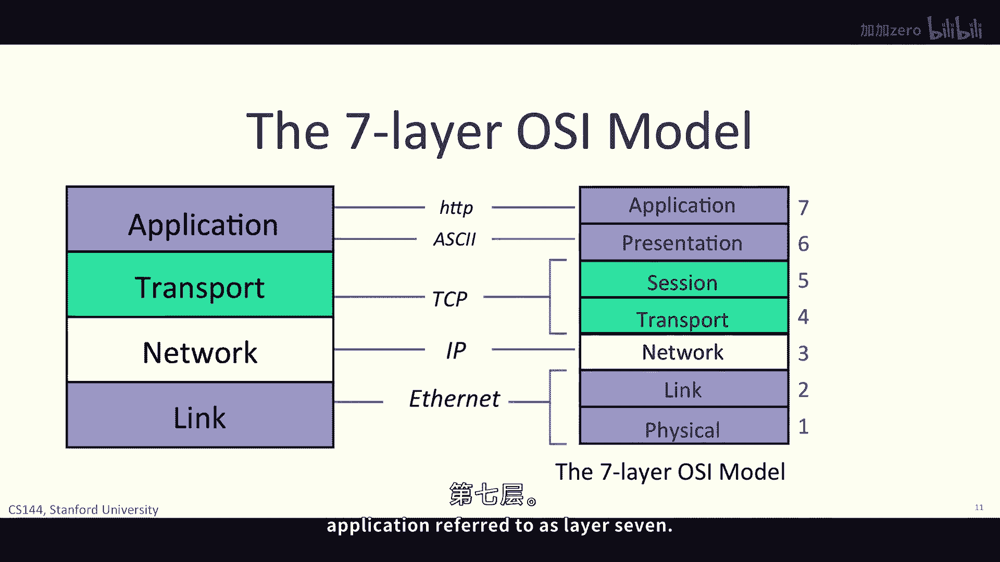