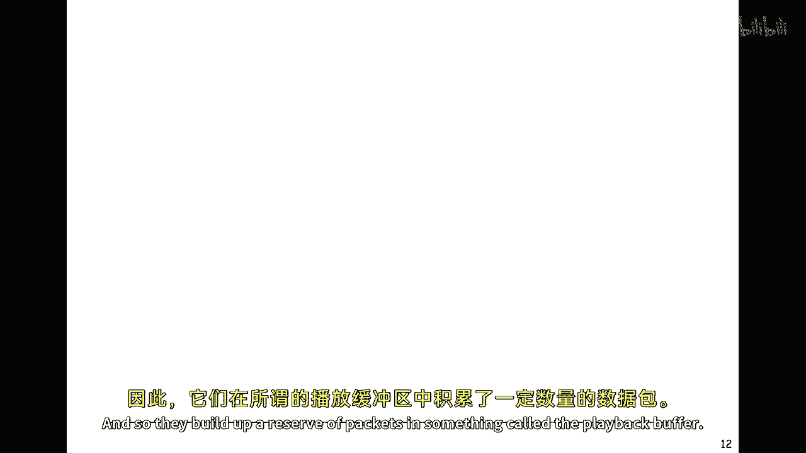

# 【计算机网络 CS144】斯坦福—中英字幕 - P42：p41 3-4 Packet Switching - Principles Playback buffers - 加加zero - BV1qotgeXE8D

到现在你已知道如何计算网络中包从源到目的地的延迟，你也知道排队延迟使端到端的延迟变得不稳定，我们使用的大多数应用，并不特别关心这种端到端延迟的变异性，例如，当我们下载网页或发送电子邮件时。

我们想要尽快完成，但我们并不特别介意，如果单个包需要十到十二毫秒才能到达另一端。

但是有些应用确实很在意，它们必须关心排队延迟，特别是我们称为实时应用的，如流媒体视频和语音，所以让我们来看看一个例子，嗯，在接下来的几分钟里，我将解释排队延迟如何使这些应用困难。

它作为排队延迟的一个好例子，并解释我们如何在实践中减轻这个问题，主要是因为应用不知道，确切地包何时会出现，它们不能确定，它们将能够在时间交付用户所需的语音或视频样本，因此。

它们会在被称为播放缓冲区的地方积累包。

所以我们将看看播放缓冲区，你实际上都已经见过播放缓冲区了，这是，嗯，这是来自YouTube客户端底部的一个小截图，并在这里，剩余的部分，这显示了，我们已经看过的视频，嗯，这里是播放点。

这个点表示我们到达的地方，这里是灰色线部分，显示已经缓冲的视频，或尚未播放给用户的包，这是部分我们感兴趣的，这里是播放缓冲区，所以客户端故意试图构建这个播放缓冲区，以尝试领先一步，以防止一些包被延迟。

或它们不能按时到达，嗯，以防止临时中断，所以当设计播放缓冲区时，我们必须考虑我们希望缓冲区领先多远，如果我们将缓冲区构建到这里并构建更多的包，如果我们将缓冲区构建到这里并构建更多的包，然后。

我们吸收了更多的数据，并且我们可以在队列延迟中写入更多的变异性，如果我们在这里使它非常短，如果出现大的更改或队列延迟的大幅变化，或者队列延迟的突然增加，我们可能会耗尽包因为它们可能不会按时出现，所以。

设计这个回放缓冲区对于使这个应用程序工作至关重要，所以我们希望在缓冲区中积累多少，当我们开始播放回放时，向用户显示的视频是关键，所以，让我们来，让我们更详细地看看这个，这是我们正在播放的点。

这是我们已经缓冲的数量。

这是盘装缓冲区的内容，如果我们看得更详细一点，所以我们将以此为例，这个设置在这里，所以，想象我们在右侧的笔记本电脑上看YouTube视频，在这里，并且它从服务器流媒体视频，左侧的YouTube服务器。

在这里，所以，我们将假设，视频以每秒一兆比特的速度流媒体，现在，这只是一个虚构的数字，它可以以许多不同的速度流媒体出来，这只是为了让我们更容易思考，并且它将通过路径中的多个路由器。

在这里的数字一、二和三，但它可能比这多很多，在我们的包通过多个路由器的路径中，通常有十到十五个是很常见的，从YouTube到我们的客户，我们主要关心的是，嗯，这个，我们即将关注的是这里的队列延迟，嗯。

嗯，这里的队列延迟，所以，我们有三个地方可以体验队列延迟，并且这个可变的队列延迟意味着我们的包将以稍微不可预测的时间出现，所以，让我们看看这个可能看起来像什么。

这个图表显示了服务器随着时间的累积发送字节的数量，作为时间的函数，因为它以每秒一兆比特的速度发送，这意味着线条是直的，这意味着随着时间的推移，包的数量是恒定的，所以它意味着线条是直的。

累计发送作为函数时间的位或字节数，是一条直线，因此，一秒后它将看到百万位，十秒后它将发送十亿位，由于网络中的变量队列延迟，笔记本电脑的累计到达看起来有点不同，它们可能看起来像这样。

所以你看到这条弯曲的线我在这里，这什么意思，它意味着如果我们取这里的第一个字节，因为它们都是第一个到达的，按照到达顺序排序，我们可以在这里水平画一条线，看看特定字节何时到达，所以这个在这里到达后延迟。

所以x轴将告诉你特定字节一起花费的时间，嗯，那个特定字节一起花费的时间，注意，我正在说位和字节，在这里我们的单位并不重要，嗯，所以如果我们在这里取任何一点，让我们说这个特定的，这个特定的字节。

然后我们水平画一条线，我画直线不太好，但这应该是水平的，在这里是特定字节到达笔记本电脑的时间，所以你可以看到延迟由水平距离测量，就是这里水平的距离，你可以看到它是个变量数。

取决于每个单独数据包遇到的队列延迟，我们还可以看到，嗯，嗯，给定的时间，给定的时间，缓冲区的大小，路径上的缓冲量，基本上从服务器到客户端有多少字节，这将由这里的垂直距离显示，因为它说在某个特定的时间。

这是已经发送的数量，这是已经接收的数量，所以我们可以从图中获取很多信息，我们将看到更多这种时间的图表的例子，稍后，横轴是延迟，垂直轴告诉我们网络中当前缓冲的字节数，好的，让我们回到，嗯，回到我们的例子。

所以延迟的最大组成部分是传播和打包，延迟，那是固定的部分，嗯，所以我们实际上对于此形状的了解相当多，嗯，对于这个线段，嗯，所以实际的形状可能看起来非常不同，我刚刚创造了这个形状，但是。

我们首先知道一些事情，从开始到结束的总延迟，不能少于那里的机械化和传播延迟，它们是一个下限，所以这里在两者之间的水平距离有一个下限，哦，它也有一个上限，所以路由器中的缓冲区，这里的包缓冲区。

它们的大小是有限的，所以任何包都可以经历的最大延迟是，嗯，通过其中一个缓冲区时可以经历的，如果我们将这些的最大值相加，再加上打包延迟和传播延迟，它将代表一个上限，所以我们有一个下限和一个上限。

但是上限并不是非常有用，因为它可以非常非常大，在实际应用中，这些路由器可能具有半秒的缓冲，所以如果我们通过多个跳转，这将意味着下限和上限之间的巨大差异，所以这对我们来说几乎没有用。

我们还知道右侧的累积到达量，是非递增的，换句话说，这个值总是增加的，因为它是字节的总和数，显然我们不能出现负字节的数量，最后我们还知道一件事，因为我们知道速度有多快，或者那个最后链接的速率有一个上限。

它可能是一百兆比特每秒的链接，也可能是千兆比特每秒的链接，它告诉我们这里的瞬时到达率，这条线的梯度不能超过速度，那个链接的数据率，好的，所以有了所有这些限制。

让我们来看看客户需要采取哪些步骤才能使这一切工作，所以这条红色线显示了视频向用户的播放率，所以这，嗯，这告诉我们在这里的时间，它正在播放，服务器发送的第一个字节，当然，这是接收器接收的第一个字节。

所以如果我们在这里取一条水平线，它将告诉我们一个特定字节被发送的时间，接收，然后播放回，这意味着这里的水平距离告诉我们这样在嗯，例如，在，嗯，这里的水平距离告诉我们一个特定的咬合已经被缓冲了多久。

所以任何时间我们都可以告诉它坐在回放缓冲区中的时间有多长，在它被播放回接收器之前，我们还知道回放缓冲区中有多少字节，它是这里的垂直距离在任何一个时间，它告诉我们播放缓冲区的占用情况，所以我们可以看到。

开始时播放缓冲区非常小，它积累，它积累，它积累，在这里达到了一个非常大的值，然后随着我们落后，它变小，随着我们落后，落后，落后，这里几乎空了，我们非常幸运，因为有些咬痕可能后来才出现，我们只是避免了。

嗯，缓冲区运行不足，然后，在某个时候，我们积累了一些，等等，随着我们向上走，好的，所以我们以恒定的每秒百万比特速度回放，这就是用户听到的内容，所以这是一个好的例子，我们选择了正确的值。

我们等了足够长的时间，我们积累了足够的缓冲，最终一切都顺利解决了，所以如果我们看看里面的里面，客户端，嗯，它大致看起来像这样，所以播放缓冲区是客户端内存中持有的一个缓冲区，客户端正在选择播放点，那就是。

那就是这个，这是它达到的点，那就是我们在YouTube客户端上看到的那个点，在字节从播放缓冲区中取出后，它们被放入视频解码器中，将它们转换回视频。

然后屏幕上播放，好的，让我们来看看事情不太顺利的情况，好的，所以同样的例子再次出现，服务器左边发送的字节，右侧的笔记本电脑接收的字节，但在这个案例中，我们等待播放第一个字节的时间还不够长。

你可以在这里看到，我们从第一个字节接收到的时间开始等待的时间稍微短一些，直到我们播放出那个第一个字节，当然，一旦我们开始播放字节，我们承诺，我们必须以每秒百万比特的速度播放它们。

否则我们不能继续在屏幕上放视频，所以对于这个特定的情况来说，一开始一切都看起来很好，缓冲区有一个良好的占用率，良好的占用率，良好的占用率，它变得越来越小，越来越小，越来越小，直到最终到这个点。

我们遇到了问题，缓冲区变空，这意味着我们没有任何可以解码并显示在屏幕上的咬合，所以这里所有的区域都是我们处于赤字的时间，这不好，客户端做得好的是什么，我们都见过这种情况，他必须使缓冲区更大。

它这样做是通过重缓冲，通过冻结屏幕，等待一些咬合积累，这样它就可以继续，好的，所以如果你一直在观看这个视频，嗯，这个特定的视频，在慢速链接上观看，或者你是很远的地方，你有，嗯，你的数据包通过许多路由器。

你可能经历缓冲事件，观看这个视频，你可以通过以更低的速率流媒体来解决这个问题，或者简单地提前下载视频。

所以总的来说，在一个带有缓冲区的播放中，当我们有端到端的分组交换时，延迟是变量的，我们使用播放缓冲区来吸收变化，我们可以只是使播放缓冲区非常大，但是然后视频将在开始时延迟。

那是我们等待第一个字节到达的时间，直到我们将其播放到屏幕上，我们可以使缓冲区更大，但如果我们要使那个缓冲区更大，那么我们就必须延迟视频的起始点，这在我们看视频的时候会有些麻烦，因此。

应用程序试图估计延迟，它们试图从服务器到笔记本电脑估计延迟，设置播放值，然后调整缓冲区大小，如果延迟改变。

好的，那么现在让我们回到对端到端延迟的原始表达式，所以现在我们看到，它由这三个部分组成，帕卡德化延迟，传播延迟，然后是可变的队列延迟，并且队列向路径添加了可变和不可预测的延迟，并且对从端到端的包。

好的，所以总的来说，端到端延迟由三个部分组成，第一个是固定的传播延迟，这是比特在链路上传播所需的时间，分组延迟，这是将分组放入链路所需的时间，然后是队列延迟，它是可变的，它是由包在缓冲区中的时间决定的。

在路径上的路由器中，如我们所见，一些应用使用播放缓冲区来吸收这个可变的队列延迟，以帮助应用以固定的速率将视频流回给我们，所以这就是分组交换的结束，我在分组交换三中将再次见到你。

我将在这里告诉你一个简单的确定性模型，它可以帮助我们理解。

