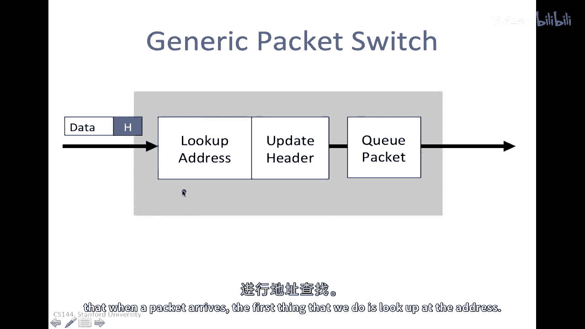
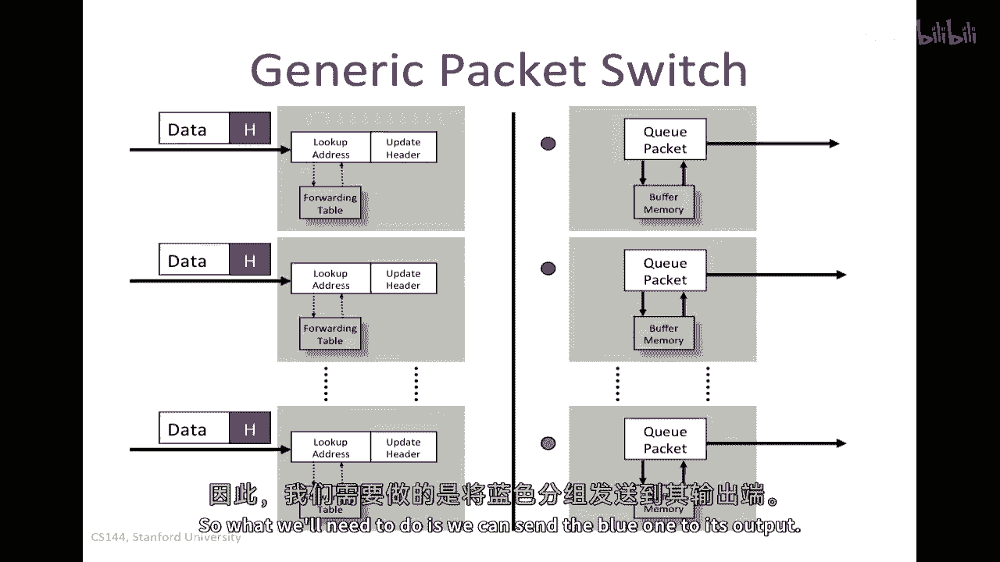
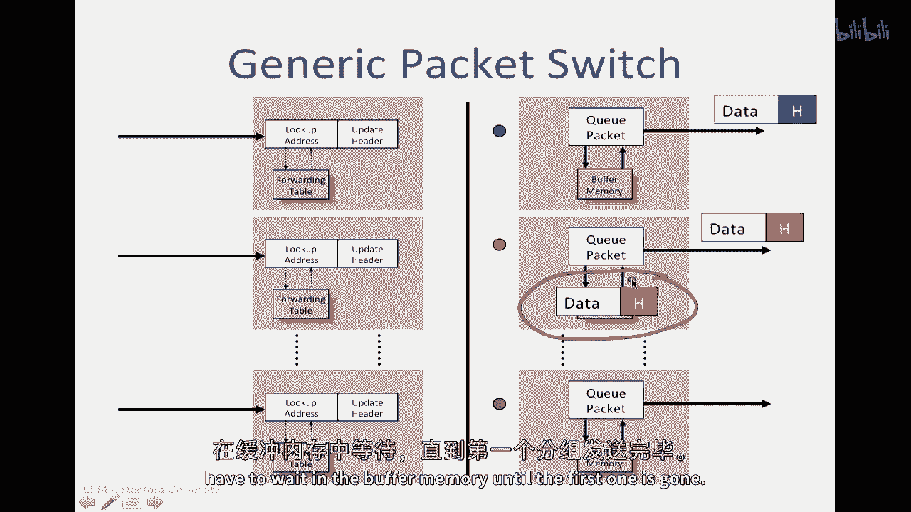
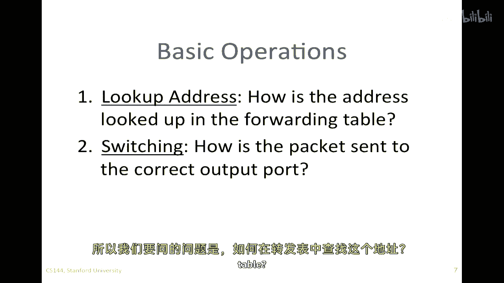
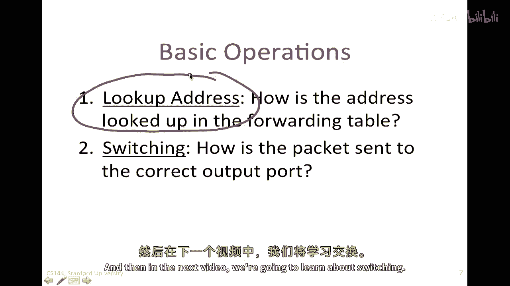
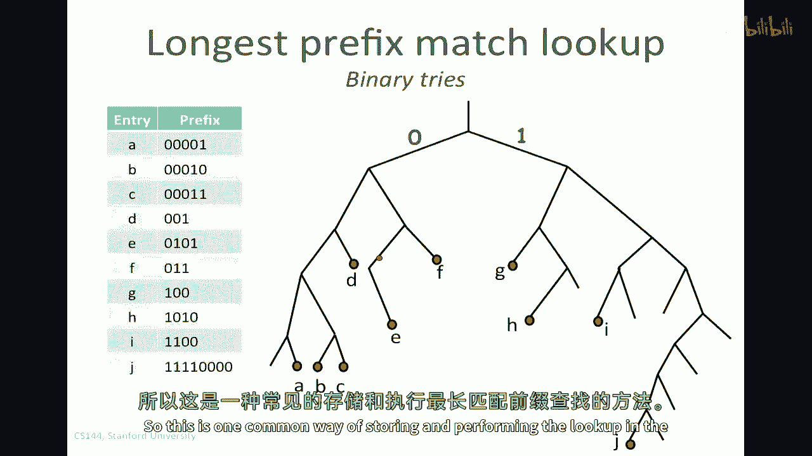
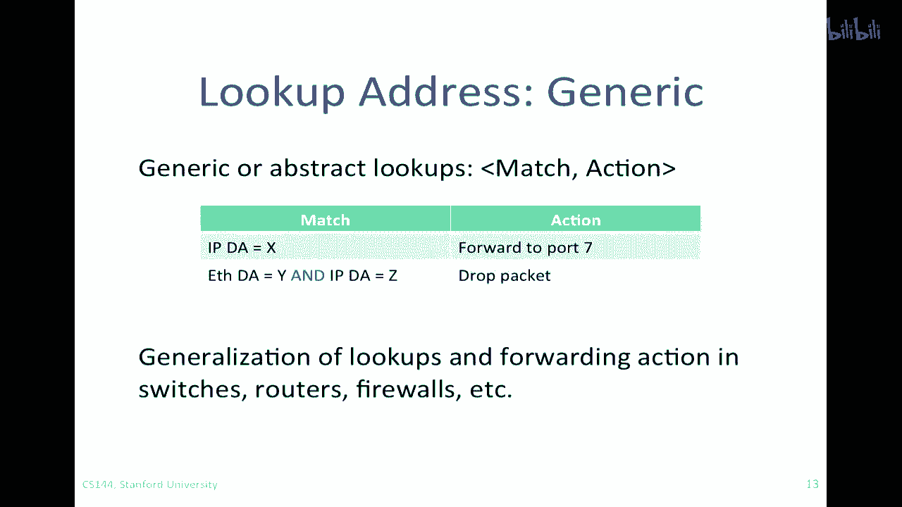
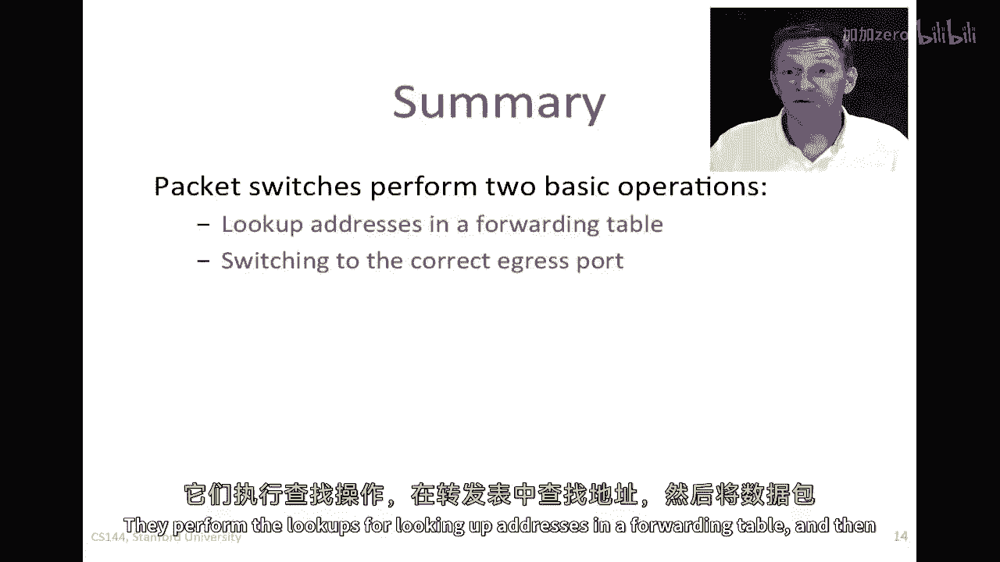
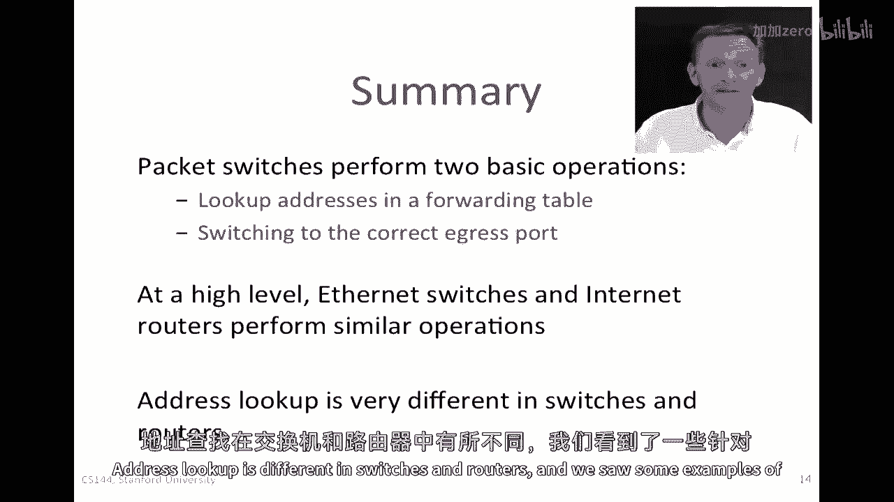

# 【计算机网络 CS144】斯坦福—中英字幕 - P46：p45 3-7 Packet Switching - Practice Switching and Forwarding (1) - 加加zero - BV1qotgeXE8D

在本视频中，我们将继续我们的包交换主题，我将告诉你包交换是如何工作的，这包括以太网交换机，互联网路由器等。

在本视频中，我们将学习，嗯，包交换器看起来什么样子，包交换器做什么，无论是以太网交换机还是互联网路由器，以及地址查找是如何工作的。

那么让我们从一张通用的包交换机的图片开始，包交换机的三个主要阶段是当包到达时，我们做的第一件事是查看地址。

这意味着查看目的地地址以确定它要去哪里，我们通过查找转发表来做到这一点，我们将目的地地址发送到转发表，这将告诉我们出口链接或端口它将去，这帮助我们决定下一步将把它发送到哪里。

我们可能需要做的下一件事是更新头部，例如，如果它是互联网路由器，我们需要减少ttl并更新校验和，接下来我们需要做的就是触发数据包，这是因为嗯，可能会有一些拥堵，可能会有许多包同时试图到达这个出站链接。

所以我们使用缓冲内存来持有等待轮到的包，以便在出口线上出发，当然这个输入。

一个输出包，这并不是很感兴趣，一般来说，包交换机将有多个输入和多个输出，这里有一个具有三个输入和三个输出的，数据包将到达，我已经对这些进行了颜色编码，红色的数据包将通过这里的红色输出。

蓝色的一个将通过这里的蓝色输出，就像以前，数据包将被处理，地址将被查找，我们将更新头部，如果我们需要，那么我们就会将其传输到那个背面的平面上，这应该代表一个共享总线，所有这些包都将通过这个总线通过。

然后它们将找到输出队列，在这种情况下，我们有两个红色包将争夺同一个输出，所以我们需要要做的是。

我们可以将蓝色的一个发送到其输出，我们可以将一个红色的发送到其输出，但由于我们只能一次发送一个包，另一个红色信封需要等待在缓冲内存中，直到。

直到第一个走了，一旦走了，这个可以继续前行，所以这是大多数包交换器的通用结构，更具体地说。

嗯，嗯，一种非常常见的包，那就是以太网交换机，嗯，以太网交换机必须执行的四个基本操作是，所以以太网交换机是包交换器的一个例子，只是处理以太网的一个非常特定的一个，以太网帧。

所以它首先做的就是它检查每个到达的帧的头部，如果以太网目的地地址，如果目的地地址，这些是以太网的四个八位地址，如果它找到了这个地址在转发表中，它将将帧转发到正确的输出端口，或者可能是多个端口。

如果是广播包，如果它找到以太网目的地地址不在表中，在以太网交换机中，它将广播帧到所有端口，嗯，除了帧到达的端口之外所有端口，换句话说，它不知道应该发送到哪里，所以它会向所有人广播，希望它能够到达目的地。

它最初如何填充表，它这样做通过学习它在线上看到的地址，更具体地说，当包到达时，表中的条目被学习，通过检查到达包的以太网源地址，所以当包首先通过时，目的地地址不在表中，它将广播给所有人，希望另一边会回应。

发送一个包回来，我们会看到它的源地址，因此我们将在未来学习，我们必须通过特定的端口发送包来达到特定的地址，所以这些是以太网交换机的四个基本操作。

让我们与互联网路由器进行对比，另一种类型的包交换器，它处理，嗯 互联网，IP目的地地址而不是，所以七个基本操作，因为涉及到IP地址，封装在以太网帧中的报文，首先，它将检查看。

是否到达帧的以太网目的地址属于路由器，换句话说，是否专门针对这个路由器，如果是，它接受它，如果不是，它丢弃它，因为它显然不是为我们注定的，接下来它做的事情是检查IP版本号是否为四，如果是IP。

V四路由器并检查，嗯，下一个数据包的长度，它将减少TTL并更新IP头部校验和，因为校验和包括TTL，它检查TTL是否等于零，"如果它发生"，"它丢弃了包"，"如果不"，然后它可以继续将其转发给下一个。

"它将抬头看向"，嗯，"转发表"，"如果IP目的地地址在转发表中"，"它将将其转发到正确的出口"，"港口或港口"，如果它是多播，并且这是到达下一个跳点的正确端口，因为ip是跳点跳点传输的，路由。

现在决定它从哪个端口出发，它将ip数据包封装回以太网帧中，并且它必须找出使用正确的以太网目的地地址，对于下一个跳点路由器，我们将学习这个过程，后来被称为arp，因此，它将封装IP数据包到以太网帧中。

可以创建新的以太网帧，然后将其发送到线缆上。

所以，包交换机的基本操作是查找地址，所以我们要问一个问题，这个地址如何在转发表中查找。

我现在要展示一些例子，第二个操作是交换，一旦确定需要出口的端口，它就需要前往它，现在需要发送它到正确的输出端，它必须将数据包送到正确的输出端口，这样它就可以离开正确的出站链接，我将从查找地址开始。

然后在下一个视频中我们将。

我们将学习关于切换，所以对于以太网交换机来说，查找地址，地址查找非常直接，它将有一个转发表，我在这里以非常简化的形式绘制了它，嗯，这是它将要执行的匹配，这是，这是它试图匹配以太网目的地地址的方式。

然后这是它将要执行的动作，如果找到匹配，如果进入的以太网帧的目的地址匹配这里，那么它将将其转发到端口七，如果匹配这里，那么它将将其转发到端口三，我只在这里绘制了四个八位地址作为十六进制数字，好的。

所以以太网转发表有许多行，一行对应一个地址，对应每个地址，它将告诉它需要转发到哪个端口，如果错过，然后它广播，因为这是以太网交换机的工作方式，当它们不知道发送地址时，现在要做查找，它进行查找的方式是。

通常它将这些地址存储在一个哈希表中，因为这些是四个八位地址，但没有像2的4的8个条目那样，可能有一百万个，甚至可能有一百万个条目，没有像2的4的8次方那样，所以它是一个非常稀疏的表。

所以通常它们将地址存储在一个哈希表中，它可能是一个双向哈希，以增加在第一次尝试中找到命中的可能性，然后它将通过在哈希表中查找匹配来找到匹配，换句话说，它正在寻找那个四个八位地址的精确匹配。

这就是地址查找在以太网交换机中的方式。

现在，让我们看看它们在IP路由器和互联网中如何做，嗯，IP路由器，所以IP地址稍微复杂一些，IP地址我们不只是查找精确匹配，我们查找被称为最长前缀匹配的东西，我们将学习为什么，那是后来的事情。

当我们学习IP地址时，但足以知道，目前我们正在执行最长前缀匹配而不是精确匹配，所以正如以前，我们有一些，嗯，这里有一些IP前缀的匹配，我会稍后告诉你这些是什么，然后这就是我们将执行的动作，例如。

如果我们，嗯，如果我们在这个IP目的地地址上有匹配，这个在这里，这是一个特定的IP目的地地址，一七四三五七九九，这将是一个三二位地址，我们将将其转发到这个IP地址。

所以这实际上是下一个路由器接口的IP地址，我们将在决定后，它将解决这个问题，它将将这个IP地址转换为等效的，以太网目的地地址的那个接口，以便它知道如何封装包，但是，对于内部转发表来说。

它保持它作为IP地址，所以如果我们在这里看到匹配，那么我们将执行这个动作，所以。

让我们在这里看看最长前缀匹配是什么，我有，嗯，IP版本四地址数字线，换句话说，所有可能的二进制到三十二位不同地址，我们可以在IP目的地地址中拥有，我在这里有一些线段，这些线段是前缀。

它们总是以以下形式表示，这条线段对应于所有以六十五开始的地址，这个解释是所有以六十五为第一个八位地址的，所以如果一个，如果一个包，一个到达的目的地地址有六十五作为第一个八位地址。

那么它将匹配在这条线段上，这条线段代表所有以六十五开始的IP地址，在他们的第一个八位位置，同样，这条线段对应于所有以六十五开始的IP地址，他们的第一个十六位是一二八九，所以这里有二的十六次方的地址。

所有的地址都以第一个十六位开始，一二八九，所以我们将前缀表示为一二八点九点零点零一六，对应于那些第一个十六位，最后一个例子，这个在上面，是一条非常短的线段，是所有共享第一个二四位的地址。

这意味着有二的八次方个他们，或者二百五十六个不同的地址，所有这些地址都以一二八九开头，点一七六，好的，所以当一个数据包到达具有特定目的地地址时，这里有一个例子，这个显然将在这条线段上匹配，就在这里。

所以这是线段上的地址，这里是它匹配的地方，所以我们知道我们在表中匹配的前缀，这是一个是吗，所以表格中将包含这个条目在这里，这个地址将在表格中的此条目中匹配，同样。

这个地址一、二、八、九、十六、十四将要在这个线段这里匹配，注意它匹配在这个一个上，但这个一个是一个更长的匹配前缀，这个一个上的比特匹配更多，比他们匹配在这个一个上的多，这是一个更长的前缀。

它是两个一比特前缀，而一个只是十六比特前缀，所以因为它在两边都匹配，而且这是最长的一个，这个地址在这里的地址将匹配在这里的表前缀，所以在路由查找中我们做的是找到最长匹配的前缀，也俗称最特定的路线。

在所有匹配目的地地址的前缀中。

让我们看看如何可能在表中实现这个，并且一种常见的实现方法是使用被称为二进制三三的东西，我e 并且有这个有很多变体，但这里是最常见的一个，假设我们有一个前缀表，看起来像这样，这个前缀表有点奇怪，因为，嗯。

所有的前缀都非常短，我只是这么做，以便它们在这个表中可以被清楚地表示，所以我们有，嗯，一、二，三，四，五，六，七，八，九，表格中有十个不同的条目，并且我将在这里填充它们，试试这里。

因为接收地址的匹配长度可能会有所不同，我们需要一种数据结构来存储长度可变的条目，所以这种数据结构如何存储这些条目是，让我们假设，0000，0010，这是0，这是0，这是0，这是0，然后这就是一个。

换句话说，我们取零分支，取一分支，所以我们将这个条目编码或存储在这个特定叶子节点，对应于该条目，同样在另一个极端，让我们看看j，它是一，一一一一零零零零，对应于这个条目这里。

这就是我们会在叶子中找到j的地方，一旦我们有了这个存储条目的数据结构，当一个数据包带有特定的目的地地址时，我们可以简单地进行位对位比较，遍历这棵树，它会告诉我们哪个条目是最长的匹配前缀。

如果我们到达一个叶子节点并发现那里什么都没有，我们会回到与该地址共享位共同部分的最近的匹配项，你可能想尝试使用这些表中的其他条目来实验，所以这是一种常见的存储和执行查找的方法，用于。

对于最长匹配前缀，还有另一个条目，"另一种被广泛使用的机制也是"，那就是使用一种被称为三元内容的特殊类型的记忆设备。

"可地址内存"，或者一个TCAM和嗯，"茶馆"，"这就是那张桌子又回来了"。

"我们有的，就是我们以前有的"，"我们首先将其存储在表中的一种稍微不同的形式中"，所以，入口a将被存储为四个零和一个一，"现在我们已经把所有事情都归类为8位"，好像它们是八位，八位前缀。

而且这里这个掩码值在告诉我们值上方的哪些位实际上重要，所以只要有零或一，我们就放一个一来说这些都是有效的，我们只要有一个x，我们就放一个零，所以这两个位，这两个表示形式这里。

我们可以把它们看作是一个三元值，或者存储此条目的两个二进制值，它们告诉我们哪些位有，哪些值和哪些不重要，所以进行查找的过程有点像暴力破解，我们同时在表中并行比较输入地址与每个掩码的条目，所以这些是这些。

这些专用内存消耗了大量的电力，因为它们同时在做所有这些事情，但它们可以非常非常快，因此，它们被广泛用于路由器中做最长前缀匹配。

"我想指出的最后一件事是"，嗯，"这些天来，人们对某种事物的兴趣似乎在逐渐增加。"，我们可以称之为通用查找的东西，你知道，我之前已经注意到了这一点，这些桌子正在支撑，嗯，"一个比赛场地和一个行动领域"。

因此，我们可以将这个概括或者抽象出来，并且可以说，基本上任何分组交换机都在进行查找，这是匹配，然后是一个动作，而且匹配可能基于任何字段，比如IP地址或以太网目的地地址，如果我们想要。

我们可能会有动作如转发、丢弃或封装，或者做其他事情，所以我们可以概括分组交换机的规格，而且现在，分组交换机，一种能够处理各种不同二层转发类型的设计，同时处理三层，或者它们可以是，嗯，它们可以是用于像嗯。

交换机，路由器，防火墙，这样的各种设备，所以总的来说，包交换机执行两个基本操作。

它们执行查找操作，以在转发表中查找地址。

然后，它们将包切换到正确的输出端口，在高级层面上，以太网交换机和互联网路由器执行非常相似的操作，它们基本上以相似的方式处理这些包。

在交换机和路由器中，地址查找有所不同。

我们为以太网地址和IP地址都看到了一些例子。

