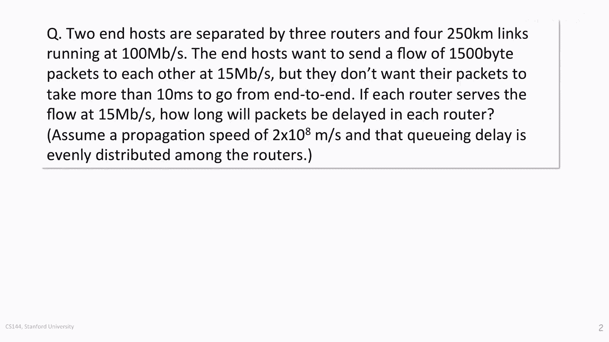

# 【计算机网络 CS144】斯坦福—中英字幕 - P50：p49 3-10a Delay Guarantees Example - 加加zero - BV1qotgeXE8D

让我们来看看一个关于延迟保证的工作示例。

两个端主机由三个路由器分隔，并运行四条长度为二百五十公里，速度为每秒一百兆比特的链路。

端主机想要向彼此发送每条长度为一千五百字节的流量。

每秒十五兆比特。

但他们不希望他们的包超过十毫秒，从一端到另一端，如果每个路由器都以每秒十五兆比特的服务流量处理流量，包在路由器中的停留时间将多长，我们可以假设传播速度为每秒两亿米。

并且队列延迟在路由器中均匀分配，从问题中，我们知道每个路由器的队列延迟将占三分之一。

所以首先我们需要找出队列延迟。

队列延迟将是总延迟，减去固定延迟，这是包化延迟和传播延迟的总和。

所以让我们首先计算包化延迟，这是通过每个链路传输一千五百字节所需的时间。

沿着每个链路的路径。

包化延迟是一千五百字节乘以每个字节的八位。

除以每秒一百兆比特或十的八次方，这给我们一个总包化延迟为点四，八毫秒。

现在让我们计算传播延迟，这是一比特穿越所有链路的时间。

每个链路的时间是二百五十公里乘以一千米每公里。

除以传播速度，总时间在所有四个链路中将是五毫秒，因此，总固定延迟是五点四八毫秒。

这意味着队列延迟是十减去五点四八等于四点五。

两毫秒，我们被告诉这是均匀分配在三个路由器中的。

因此，每个路由器的队列延迟不能超过一点五零。

七毫秒，因此，延迟为每条外层线路一点五零五零七毫秒。

我们可以继续计算每个路由器需要存储的数据量。

以持有一点五零，七毫秒的数据，给定队列以每秒十五兆比特的服务。

这相当于一点五零，七毫秒乘以每秒十五兆比特。

等于二十，两千，六百五位。

在实际应用中，我们将这个值至少向上圆整到至少两个包。

