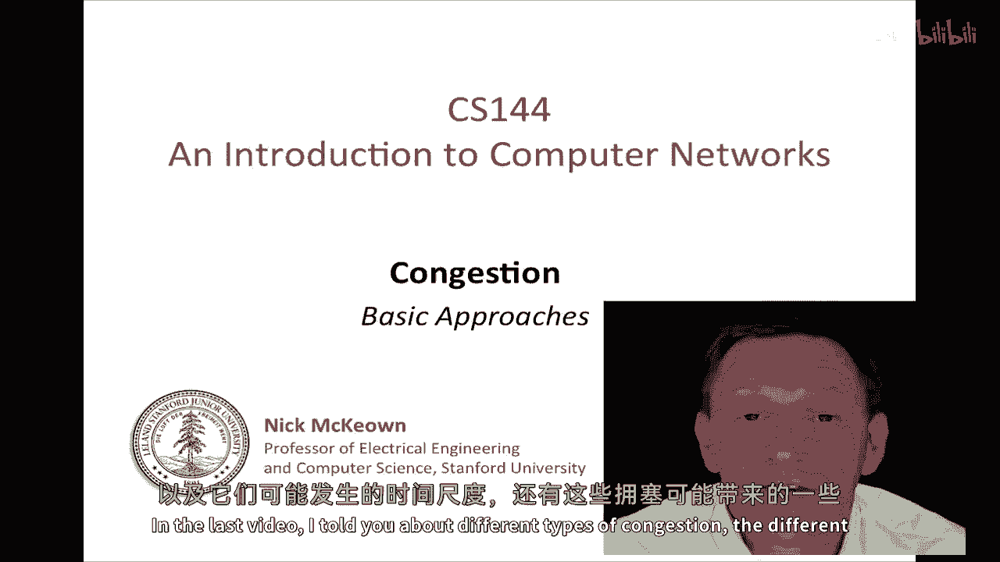
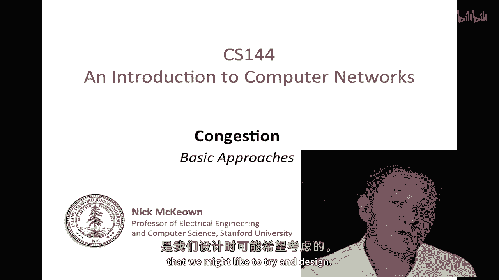
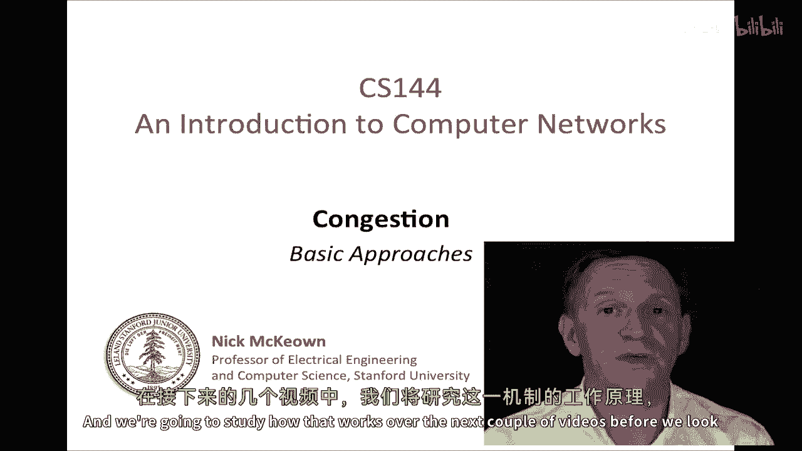
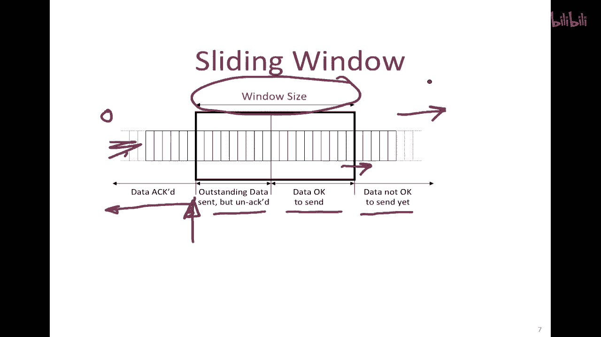
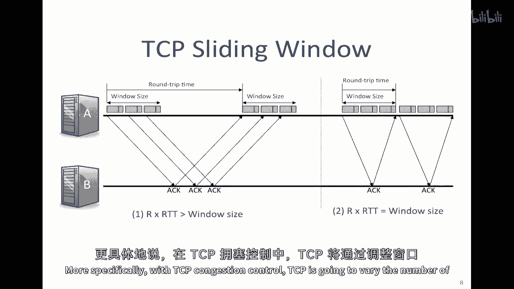
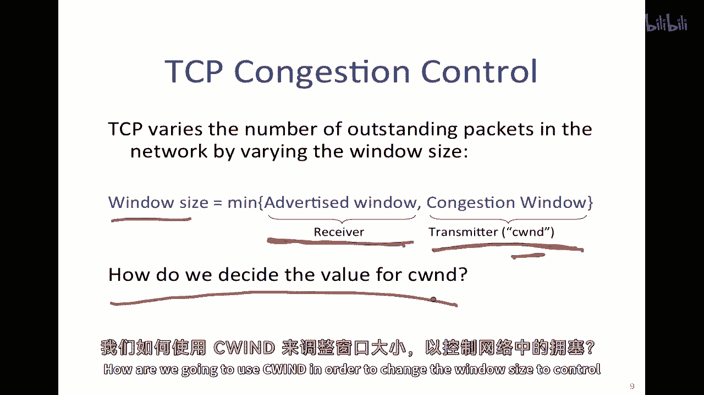
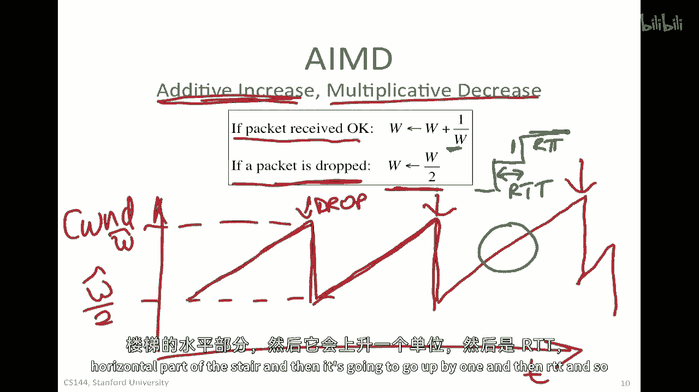

# 【计算机网络 CS144】斯坦福—中英字幕 - P54：p53 4-2 Congestion Control - Basics 2 - 加加zero - BV1qotgeXE8D

在最后一个视频中，我告诉了你们关于不同类型的拥堵的信息，它可能在哪些时间尺度上出现。

以及可能出现的一些后果，然后我们稍微讨论了一下拥堵控制算法的一些特性。

我们可能想要设计和实现的，所以我们说，我们希望有高的吞吐量，我们希望它们公平，在竞争瓶颈链路的流量之间，我们希望拥堵控制的控制权被分散，以便它可以扩展，在这个视频中，我们将开始研究控制拥堵的基本方法。

我们将考虑拥堵控制是否应该在网络中进行，在路由器中的特定支持，还是在终点主机中完成。

然后，我将告诉你们一些TCP是如何做到的，我们将从基本的机制开始，被称为D或增加的加法，减法的乘法，我们将在接下来的几个视频中研究这是如何工作的，然后，我们将更详细地研究TCP拥堵控制在实际中如何工作。

所以我将从考虑将拥堵控制放在哪里开始，但你可能已经好奇为什么，因为我们不能简单地使用公平队列通知，我们已经看到了一种方法，可以给每个人一个公平的链接份额，通过简单地将输出缓冲区分解为每个流队列。

如图所示，所以，如果我在网络中有多个流，然后每个流都将被放置在自己的队列中，然后，我们使用公平队列调度器来分配那个出口率，假设r是所有争夺它的流中的所有流，如果他们都想以大于r的速度发送。

那么他们将各自收到r/2，因为那是一个公平调度器的工作，实际上，这将给我们一个不仅公平的行为，实际上，它将给我们在每个链接上流之间的最大公平性，它将给我们好的性能，每当有工作要做时。

它将始终保持输出线忙碌，我们说它是工作保存的，所以它将在每个长度上都提供好的性能，这个基本机制有什么错吗，首先，它不是响应的，它只是简单地将链接分割。

但这里没有任何东西可以告诉源它们应该以什么样的速度发送，或者给他们任何关于他们应该发送多少包的指示，实际上，如果他们这样做，如果这些都在试图以最大速度发送，如果来自所有方向的包都在来，试图，嗯。

尝试使用这些链接，然后数据包将被简单地丢弃在地上，当缓冲区溢出时，我们将浪费大量的上行带宽，通过最终在下游被丢弃的链接发送数据包，因此，我们需要一种方式向源发送信号说，给他们一些发送速度的指示。

或他们在网络中可以拥有的未发送数据包的数量。

所以在基于网络的拥塞控制中，有来自路由器的明确反馈，指示网络中的拥塞，所以，例如，如果我有一个源a和一个目的地b，然后，有一些路由器在中间，有一些链接像这样，所以想象一下。

网络中有一些流量来自不同的方向，通过这条路由器，在这里引起一些拥堵，我们可以做的事情是，如果出现拥堵，是尝试向a发送一些信号，一个信号说网络中有拥堵，你需要减少你未完成的数据包数量。

或者减少你发送它们的速度，嗯，所以问题来了，我们应该发送什么，我们如何将其返回到一个，我们可以，例如，假设我正在丢弃一个包，或者这可能是缓冲区占用率的指示，或者它可以标记我们已经打破了某个阈值。

因此我们正在变得越来越拥堵，这些任何一种都可能是拥堵的例子，另一个可能是出站链接剩余一定容量，随着容量的消耗，我们发送一个信号回来，说明那部分容量可用多少，或者它可以是我所提到的所有信号的功能。

所以我下一个问题是我们如何获取那个信号，以及我们使用多少位来表示它，所以如果我们正在返回整个队列占用率，那么如果我们正在发送整个队列占用率，我们真的很想能够说，并发送一个大整数值来指示当前的占用情况。

这将需要很多位，而且可能会很复杂，所以实际上，一般来说，人们寻找使用一到两个位来向源发送信号的方案，然后下一个问题是如何将它们返回给源，创建一整个包只是为了将其发送回源是没有意义的。

如果我们可以搭车在已经通过的包上，所以使用包是非常常见的，例如，如果存在，如果存在TCP包，正在通过，或者是一种双向通信方式，可以附载在单向传输的包上，使得它们能够在确认消息中发送回来。

最终能够返回到源，有一种特定的技术叫做ecn，或者是显式拥塞通知，在其中，路由器指示他们是否有一些程度的拥塞，例如，越过阈值，然后他们在向目的地发送的数据包中标记位。

这将将这些位复制回在相反方向上发送的确认中，最初被设计成类似这种工作的方案被称为借记，那就是，嗯，是，这个方案在二十多年前就被提出，作为一种单位位机制，用于向源发送减速信号，这种方案的一个这么好处是。

它很容易理解，我们可以看到信号将直接控制源的行为，它应该对变化反应很快，因为我们可以检测到网络中的交通拥堵开始，并能告诉源，它是分布式的，在意义上，信号来自网络中的所有路由器，它只影响源，因此。

源可以作出决定，做出决定，决定如何处理那个信号，它可以被设计成最公平的，所以可以，嗯，它可以被设计成公平的，例如，测量每个流经路由器的速率，并返回每个流的最大公平分配，还有其他更简单的方法，例如。

使用我之前描述的公平队列，所以基于网络的方法无疑可以工作，另一方面，值得问的问题是我们是否实际上需要网络，来提供任何拥塞通知，换句话说，我们是否可以在没有任何网络支持的情况下支持拥塞控制。

仅仅通过在末尾实现一个机制，主机，它将仅仅观察网络行为，所以，我将回到之前的例子，如果我有端主机a和b，然后在它们之间有路由器，如果我能够观察网络的行为，这样的就足以决定我以什么速度发送。

或网络中有多少未完成的数据包，那么我们可能这样实现拥塞控制机制，这很好，因为如果不依赖于路由器的行为，它们不会在它们上行为，发送特定的信息回传，我们可以随时间进化和适应它，无需在中间更改网络。

我们将看到tcp，这，tcp实际上确实只在末端进行拥塞控制，通过观察网络行为，由主机实现，它将做的事情是，如果沿途的包被丢弃，它将通过超时或看到返回的所有相同序列的确认来实现这一点。

或它将看到一组相同的确认返回，由于数据缺失，因此b将继续承认早期的数据，我们可以将其解释为数据缺失，因此需要重新传输它，所以如果有丢失的数据，a可以将此解释为拥塞。

然后减慢传输速率或减少未完成的数据包数量，以便减少网络拥塞，所以基本上a将观察，它将 uh，有点像这样，观察网络行为，并看到关于超时和重复确认的情况，以及任何指示掉包的情况，它也可能看到延迟或方差增加。

任何指示它网络拥堵的事情，以便它可以相应地改变其行为，在tcp的情况下，它实际上必须这样做因为ip默认不提供支持，ip在网络中不提供拥堵的指示，所以当TCP最初被构思时，实际上是出于必要性。

使它以这种方式控制拥塞，所以让我为您快速介绍TCP拥塞控制，TCP在终点主机上实现拥塞控制，因为网络不提供支持，它反应于终点主机可观察的事件，特别是在使用包丢失，或者它相信有一些包被丢弃。

它将利用TCP的滑动窗口，我们用于流量控制和重传，"它将利用那个事实的存在"，"并且它将通过某种方式控制交通拥堵来使它过载"，"而且我要解释一下"，"很快，它将这样进行"，"它正在尝试找出有多少包"。

"在任何时间，都可以安全地在网络上表现出色"，"这就是一个重要的概念"，让我再重复一遍，"它正在尝试找出有多少包"，"在任何时间，都可以安全地在网络上表现出色"，我们现在已经熟悉这个了。

在TCP中使用滑动窗口，这只是关于滑动窗口如何工作的一个提醒，记得窗口正在滑动过一流的字节，所以这是我们正在发送的字节流，并且正在向右增加，所以字节零在某处，窗口告诉我们，已经被确认的数据。

所以这是已经完全被确认的早期数据，这是已经发送但尚未确认的出色数据，这是允许发送的数据，换句话说，这可能是我们尚未发送的数据，但由于它处于窗口内，如果我们想要，我们可以发送它，然后。

还有一种数据目前还不允许发送，因为它在窗口前面，窗口还没有滑过这个顶部，但由于我们还在这里等待未确认的认可，好的，所以滑动窗口告诉我们的不仅是哪些字节可以超出，而且还有多少字节是窗口大小。

你记得接收器将发送关于，被称为接收窗口的信息，来告诉我们可以超出的字节数，以便我们不会超出接收器，我们一会儿就会看到，我们在发送端将以不同的方式重用这个机制，但只是为了让她大致了解TCP的情况。

滑动窗口，这是对时间线上正在发生的事情的一个视图，当数据包被发送和接收时，这将给我们一个感觉，看这个是如何工作的，所以a被允许发送至窗口值的数据，并且在收到任何确认之前可以保持这些数据。

所以这就是那个数据窗口，当那些数据包被发送时，当然，每个数据包都会导致一个确认，所以稍后我们将收到确认，然后，我们将发送下一个窗口的数据量，所以，如果往返时间远大于窗口大小，换句话说。

时间远大于填满那个管道所需的数据量，那么，之间就会有这个大延迟，因此，tcp基本上通过发送一个窗口的脉冲来前进，暂停并等待确认，发送一个窗口的脉冲，有一个暂停，然后重复那样，所以，现在是这种情况。

让我们考虑一个不同的情况，那就是当往返时间等于窗口大小时，换句话说，窗口正好能够填满管道，网络允许的未确认包数量，精确地填满管道，在这种情况下，第一个确认将在最后一个包被发送后立即返回，因此。

我们可以发送一个连续的流，因此，没有暂停，因此，我们比这种情况更充分地利用了网络，当我们有这个空闲时间，所以，这可以给我们一个关于我们如何保持网络满的线索，有些人可能会将这个解释为速率。

因为它是窗口大小除以往返时间，我们将，我们将稍后考虑这个问题，所以，这是具体如何工作的基本概念。

与tcp拥塞控制有关，tcp将改变网络中未确认包的数量，通过改变窗口大小，它将设置窗口大小，而不是只是广告的窗口大小，这是它以前使用的，来自接收器的窗口，用于停止压倒接收器。

它还将考虑一个叫做拥塞窗口的东西，这是源端计算的，所以，来自接收器的窗口来自源端或发送端，它将计算拥塞窗口，这通常被缩写为sea wind，C w n d代表拥塞窗口，然后，它将使用较小的值，换句话说。

如果网络拥堵，它将使用c wind，如果网络不拥堵，那么它将被接收窗口主导，由接收器广告的窗口，所以，下一个问题要问的是，我们如何决定sea wind的值，我们将如何利用海风。

我们使用的方案被称为i d，这是一种在网络中的经典技术，用于控制TCP网络或，在任何使用滑动窗口的网络中，都可以使用，Amd代表加性增加和乘性减少，让我们从加性增加开始，窗口大小的演化方式如下。

或者换句话说，sea wind，如果每次发送者正确接收到一个包，它将增加窗口大小，实际上，sea wind增加1过，这意味着每当一个完整窗口的数据都被接受，并被正确接收和确认时。

发送者将增加其窗口大小1，它将增加1过w对于每个包，因为有w个包，然后到窗口结束时，它将增加1，这就是加性增加，在事情顺利时，它们会逐渐增加，如果事情不顺利，包被丢弃，那么它将使用这作为拥堵的信号。

如果这种情况发生，它将减少sea wind的一半，它将减半，这将看起来如果我们绘制窗口作为时间的函数，那么这将是sea wind，作为时间的函数，它将开始增加，每次我们有成功，然后当我们有丢弃。

所以这里是丢弃发生的地方，它将下降到其值的一半，如果这是峰值值，那么这里下方的值将是peak value over 2，然后它将开始增加，增加，增加，直到它又有另一个丢弃，然后它将再次增加，增加，增加。

它可以增加到更高的值，因为现在网络可能允许更多的未确认包下降到不同的值，然后上升，然后可能会有另一个丢弃，所以它并不总是去这个漂亮的，对称锯齿形，这是丢弃发生的地方，并且每次它都在减半，这就是加性增加。

这里是乘性减少，加性增加，乘性减少，这通常被称为TCP锯齿或IMD锯齿，只是因为它的形状，如果我们放大，让我们更详细地看看每一步正在发生的事情，所以让我们更详细地看看正在发生的事情，实际上。

这是通过步骤进行的，记住它是一步一步进行的，这样，每个包时间，它将会增加一个过w，我将简化说，每个RT在这个水平维度上是时间，它将会增加一个，窗口大小将增加一个，因为每次我们确认了一个完整的包。

窗口值数据的数量，它将会增加一个窗口大小，所以它将按照RTT的步骤前进，在横截面的楼梯部分。

然后它将向上增加一个，然后RTT，等等，这导致了通常被称为AMD锯齿的东西，或TCP锯齿，看起来像这样，这是海风演变的结果，记住，那是时间作为函数对拥塞窗口的描述，这就是增加的添加，我们有一个下降。

我们下降到一半的值，我们有一个增加的添加，我们下降，因为发生了一次下降，在这里发生了一次包丢失，然后我们再次通过增加的增加上升，你可以在这里看到可用窗口大小，换句话说。

互联网源可以在网络中保持的数据量正在变化，可能是因为网络条件正在变化，网络中有其他流量，或者甚至链路的容量正在变化，可能是无线链接，例如。

总的来说，我们具有选择，当我们实现拥塞控制算法时，我们可以在网络中实现它，或者在最后，房屋，TCP从终点主机控制拥塞，因为IP默认不提供支持，所以它不会给出任何信号或拥塞的指示，除了包丢失之外。

它仅对在终点主机上可观察的事件做出反应，特别是包丢失，它利用TCP的滑动窗口，并且是，嗯，那用于流量控制，并且它将会超过滑动窗口，通过改变窗口大小来尝试控制拥塞，它试图找出网络中可以安全地保持的包数。

一次，并且它将会根据增加的加法算法来变化窗口大小，乘法减少算法。

