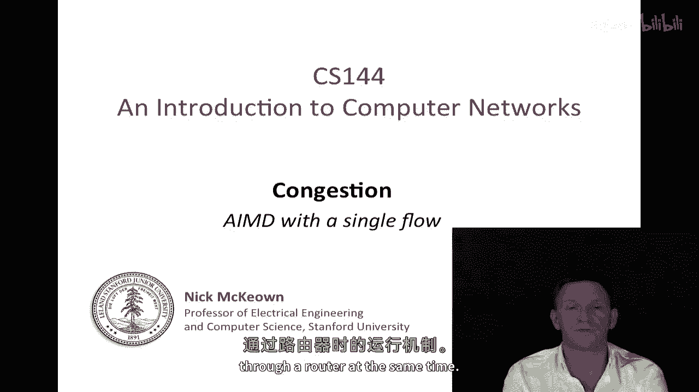
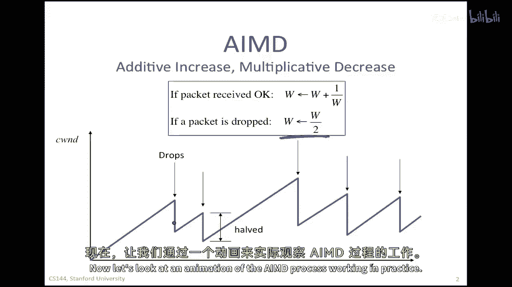
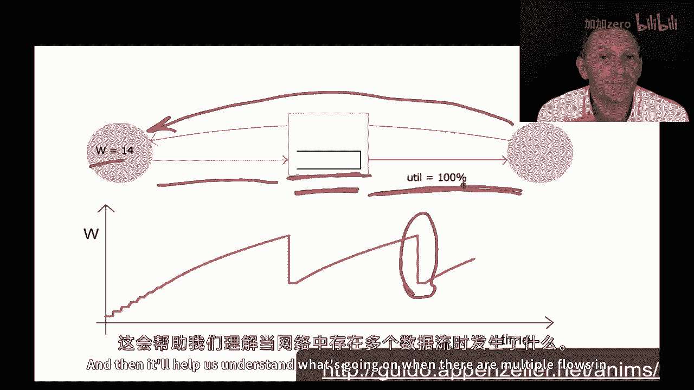
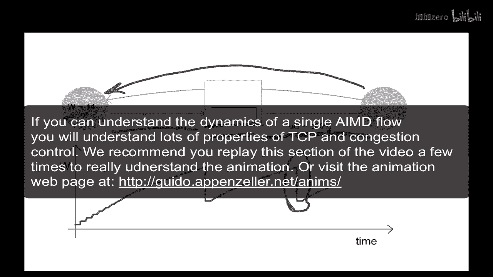
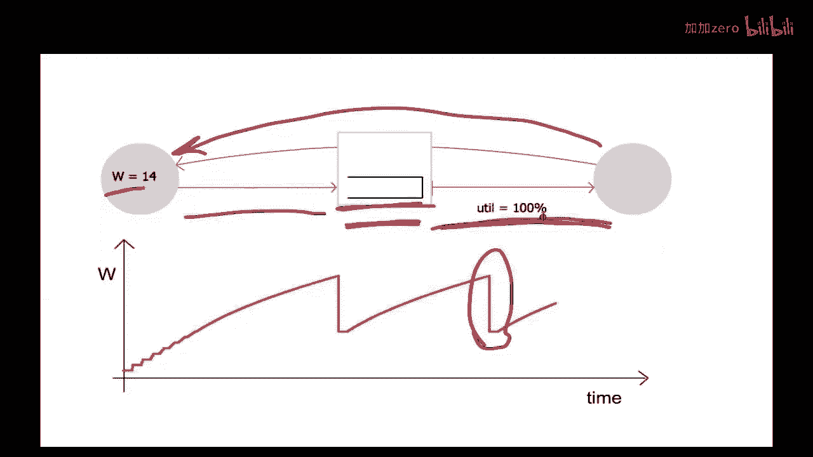
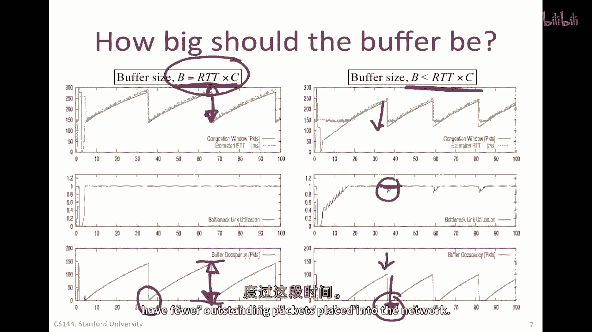

# 【计算机网络 CS144】斯坦福—中英字幕 - P55：p54 4-3 Congestion Control - Dynamics of a single AIMD flow - 加加zero - BV1qotgeXE8D

在最后一个视频中，我告诉过你们如何使用增加的，增加乘法减少的方法来调节TCP滑动窗口的大小，如果我们想要增加待发字节的数量，我们可能会导致更多的拥塞，如果存在拥塞，而我们想要减少它。

那么我们可能会减少待发字节的数量，换句话说，减小窗口大小，因此，使用此窗口大小调节方法，我们可以变化待发字节的数量，注意，这是由终点主机完成的，没有网络任何明确的支持，为了理解IMD如何工作，然后。

后来理解TCP拥塞控制如何工作，我们将从一些细节开始，看IMD如何与单个流量一起工作，如果我们能理解它如何与单个流量一起工作，那么我们就有机会理解它在更复杂的网络中如何工作，通过大量的流量通过路由器。

同时，我们之前看到了AMD的工作方式，每当收到一个包，好的，我们将窗口增加1/w，因此，一旦我们收到了整个窗口的包，窗口大小将增加1，每当包被丢弃，我们将减小窗口大小，乘法地，我们将其减少一半。

这就是我们之前看到的动态，让我们看一个AMD在实际工作中的动画。

我们将仔细看这个动画中的一个，一个IMD流量通过单个瓶颈链接，如果我们看，嗯，让我来解释图表中发生了什么，图中的拥塞窗口大小w随时间变化，所以这是一个海风，拥塞窗口，这与源处的值相同，所以这是源。

这是目的地，这是路由器在中间，路由器有一个缓冲区，它将缓冲等待通过出口链接的包，出口链接是这个，路由器将缓冲，等待通过出口链接的包，这是源和目的地之间的瓶颈链接，左边的链接比右边的链接运行得更快。

这就是为什么偶尔在这个缓冲区会有数据包的堆积，因为它们到达的速度超过了离开的速度，左边的数据包看起来比右边的小，原因是，仅仅代表，左边的链接比右边的链接运行得更快这个事实，换句话说，数据传输率更高。

因此，打包延迟更短，因此，左上角的包看起来稍微短一些，所以包将从源到目的地流动，它们是蓝色的，然后对于每个包，都有一个确认消息返回给源，顶部的红色包就是这些，你可以看到确认消息的到达正在计时。

所以下一个包的传输，所以我们常说这种算法是自动的，我们将看到后来TCP是自动的，包是由返回的确认消息触发的，好的，现在我已经解释了这个，我要重新启动它，这样我们就可以看一些，一些动态，实际上。

我要给你一个指向同一动画的url，这样你可以在你自己的时间里玩这个，重新开始，我们可以看到，嗯，这里窗口大小告诉我们网络中可以存在的包数，而且我喜欢这样想，把它看作是一个代表整个网络的袋子。

我们正在试图找出这个袋子有多大，我们可以将这个袋子装入多少包，在他们溢出并掉在地上之前，我发现这是一种有用的思考方式，所以我们基本上在试图找出这些包可以放在哪里，以及在链路中可以有多少，实际上。

只有一两个或三个不同的地方他们可以放，首先，包可以放在链路上，在这里，这是固定的，这里有一条固定的管道，在那个管道的末端，我们可以装下的一定数量的包，在这里，我们可以装下的一定数量的包。

那些由确认消息代表的包数量也是一定的，从相反的方向来，所以所有这些都是固定的，唯一的可变部分是我们目前在中间缓冲区中拥有的数量，所以它就像一个手风琴，一开始，这里有一个手风琴，那个康定琴关闭了。

我们将包裹放入网络，然后当我们填充链接后，链接填满时，它们唯一的地方可以去是缓冲区，并且缓冲区将吸收每个额外的窗口，我们每次打开窗口时，我们实际上将一个额外的包放入那个包缓冲区。

所以最初当窗口处于最小值时，所有链接都满了，但是缓冲区是空的，如果我们将窗口大小增加1个单位，链接满了，所以它不能放入链接，它唯一的地方可以放置是缓冲区，所以缓冲区会增加1个单位。

如果我们然后再次增加窗口大小1个单位，它会进入缓冲区，再增加1个单位，它会进入缓冲区，最终缓冲区溢出，我们丢弃一个包，然后aa imd规则是我们将未完成的窗口大小减半，最终缓冲区将再次变空。

然后我们开始 again，所以实际上我们通过改变窗口大小只是在调制，瓶颈处的缓冲区占用率，如果我们在这里看模拟，我们可以看到它正在发生，目前窗口大小是9，所以任何瞬间我们都可以看到。

网络中有9个包和确认消息待处理，但由于链接满了，这里出口的链接满了，我们的瓶颈链接满了，一旦我们增加窗口大小，那些包就可以在这里去，所以我们已经填满了它，任何额外的都在缓冲区中。

你偶尔会看到我们已经收到了一个满窗口的值，然后那里我们去，我们将窗口大小增加1个单位，它目前是13，一会儿它将增加到14，每次我们增加窗口大小，缓冲区将多一个包，在这里你可以看到每次我们，嗯。

接收到一个满窗口的值，它将实际上增加1个单位，因此这就是窗口随时间如何演变的，我们几乎快到缓冲区满的时候，我们到达了一个窗口大小为十六的节点，目前，进入网络的包速率正好匹配，它们出网的速率。

我们即将实际将一个额外的包放入网络，你看它被丢弃了，那个丢弃的知识正在网络中传播，它将继续前往出网链接，它将实际上通过缺乏确认返回，但这并不重要，因此，窗口大小将被减半，这就是这里正在发生的事情。

缓冲区将耗尽，因为我们只能在网络中允许一半的未确认包，因此，我们停止发送缓冲区耗尽，因为它以满速耗尽，然后我们再次开始整个过程，首先，我想让你注意到的是，出网链接始终忙碌，始终，百分之百的时间。

尽管这个窗口过程正在关注，它满了然后下降，当我们有丢失，满了然后下降，所以尽管这个窗口正在经历锯齿运动，出口，网络瓶颈链路始终忙碌，换句话说，包发送速率保持恒定，这是imd的一个重要属性。

特别是在单链路情况下，它实际上没有调整速率，它实际上是影响网络中可以悬停的包的数量，这个微妙的区别将在一会儿变得非常重要，当我告诉你关于imd动态的更多，这将帮助我们理解正在发生的事情。

当网络中有多个流量时。

为了增加我们对正在发生的事情的理解，让我们看看那个单流在网络中的动力学，这是从一个在广泛知道的网络模拟器中运行的模拟。

S of a single tcp flow over a bottleneck link，顶部的图表告诉我们拥堵窗口或海风的演变，像我们之前看到的一样，那是红色的一个，绿色的是rtt，往返时间。

这条红色线是瓶颈链路的利用率，换句话说，瓶颈链路的忙碌程度如何，在这里是缓冲区的占用率，我们可以看到它在演变，所以这与我们刚刚看到的模拟非常相似，我们刚刚看到的动画，所以请注意。

拥塞窗口在这个美丽的锯齿状中移动，但是因为每次我们将一个更多的包放入网络，我们增加了缓冲区的占用率，所以每次我们增加w，唯一那个额外的包可以去的地方，是缓冲区，所以它将与sewind完美同步移动。

但是因为我们正在增加缓冲区的占用率，我们正在增加包在网络中经历的延迟，所以因此往返时间RTT也是增加的，并且按照相同的形状精确地跟随，所以海风和RTT实际上跟随相同的形状。

这一事实的结果是对于单个流的发送率，我们可以将其定义为我们在一个窗口中发送的字节数，除以往返时间，因为往返时间随着窗口大小而变化，W除以RTT实际上是一个常数，这实际上是一个常数。

为什么它是常数是因为w和RTT，他们步调一致地移动，他们本质上是一样的，我们在动画中看到，出口链接始终忙碌，所以我们实际上没有调节速度，实际上，当我们的一切都恒定时，我们不想调节速度，我们只有单个流量。

我们想要保持出口链接忙碌，窗口所做的只是探查以看到，袋子有多大，我们可以在没有它溢出的情况下将多少更多字节放入网络，并且它不断探索和改变那个窗口大小，以防条件改变，容量增加，因此。

袋子里有更多的空间来放更多的包，只是为了，嗯，嗯，只是为了稍微强调一下，窗口大小将要移动，嗯，像这样，rt会像这样同步移动，因此，这个速率是一个常数，因此，我们也可以从这里做出另一个观察。

这就是缓冲区应该多大，这样整个系统才能正确行为，我们上次看到，缓冲区的占用率在步调一致地移动，与窗口大小过程有关，这个，嗯，下面这张图基本上与我们的动画相同，我们这里的瓶颈链接，在这里以更快的速度链接。

a和b之间的路由器缓冲区，所以如果我们再次在我们的模拟中看那个，并查看图表的行为，左边的图表与以前看到的相同，在这种情况下，缓冲区占用等于rt t乘以c，换句话说。

它只足够持有可以fit进往返时间的足够包，当缓冲区为空时，如果我们将缓冲区稍微缩小，这就是我们在这里做的事情，所以缓冲区更小，然后发生的是，当掉包后，缓冲区已经远远超过了，这是在这里发生的。

当窗口大小减少，并根据amd规则减半时，缓冲区会下降因为我们在网络中的有待处理的管道更少，因此源将停止发送包，缓冲区将排空，但它在空无一物一段时间后开始排空，所以如果路由器缓冲区为空，它意味着出口链接。

我们的瓶颈链接，实际上，我们的宝贵资源并没有被使用，因此，在那个时间内，利用率会从一百 percent 下降，所以，如果我们想要防止这种情况发生，始终保持一百 percent。

我们需要确保这种情况不会发生，因此，我们需要确保缓冲器永远不会为空，我们需要这种行为，从中我们需要一个缓冲器大小为 rtt times c，现在，为什么它特别是 rtt times c。

稍后你在问题集中会看到，但基本的直觉是，缓冲区的占用率，缓冲区的大小必须从峰值到谷底，在这里必须与峰值到谷底的距离相同，以便能够在窗口大小减半的时间段内生存下来，并且我们放入网络的未完成包较少。

那里的距离最终等于rt t乘以c，我们将在后续的问题集中看到，让我们总结我们为单个流学到的内容，窗口将根据imd（加性增加）扩张和收缩，乘法减少，这将调节TCP滑动窗口的大小。

以便确定网络中可以存在的未发送字节数，本质上我们在探索管道从端到端可以持有的字节数，我们将不断通过改变那个窗口的大小来探索，我们将小心地增加它，看看有多少空间，如果我们发现它过满，我们将再次降低下来。

然后我们将继续尝试探索它，查看是否有更多的可用容量，因此，我们将暂时增加，然后，如果我们发现我们陷入了麻烦，我们将非常快速，以一种非常响应的方式，再次减少，以便能够尽快减少网络中未完成的字节数。

所以锯齿实际上是tcp的稳定运行点，没有任何失控，即使它在振荡，这就是我们在稳定运行条件下想要的行为，实际上，发送率是恒定的，只要网络中有足够的缓冲器，那就是rt乘以c，这些都是关于单个流的所有观察。

在下一个视频中，我们将看到事情有一些不同。

